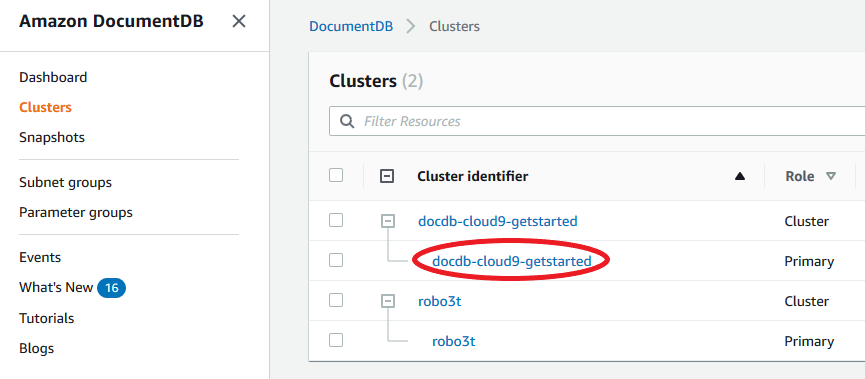

# Describing Amazon DocumentDB

instances

You can use either the Amazon DocumentDB Management Console or the AWS CLI
to see details such as connection endpoints, security groups
VPCs, certificate authority, and parameter groups pertaining to
your Amazon DocumentDB instances.

Using the AWS Management Console
To view the details of your instances using the
AWS Management Console, follow the steps below.

1. Sign in to the AWS Management Console, and open the Amazon DocumentDB console at [https://console.aws.amazon.com/docdb](https://console.aws.amazon.com/docdb "https://console.aws.amazon.com/docdb").
2. In the navigation pane, choose **Clusters** .

###### Tip

If you don't see the navigation pane on the left side of your screen, choose the menu icon
()
in the upper-left corner of the page. 3. In the Clusters navigation box, you’ll see the column **Cluster Identifier**. Your instances are listed under clusters, similar to the screenshot below.

 4. In the list of instances, choose the name of the
instance that you want to see its details. The
information about the instance is organized into
the following groupings:

    * **Summary**—General
     information about the instance, including the
     engine version, class, status, and any
     pending maintenance.
    * **Connectivity & Security**
     —The **Connect** section
     lists the connection endpoints to connect to
     this instance with the mongo shell or with an
     application. The **Security Groups**
     section lists the security groups associated
     with this instance and their VPC ID and
     descriptions.
    * **Configuration**—The
     **Details** section lists
     the configurations and status of the instance,
     including the instance's Amazon Resource Name
     (ARN), endpoint, role, class, and certificate
     authority. It also lists the instance's
     security and network settings, and backup
     information. The **Cluster
     details** section lists the details
     of the cluster that this instance belongs to.
     The **Cluster instances**
     section lists all the instances that belong
     to your cluster with each instance's role and
     cluster parameter group status.


    ###### Note

    You can modify the cluster
     associated with your instance by
     selecting **Modify**
     next to the **Cluster
     details** header. For more
     information, see [Modifying an Amazon DocumentDB cluster](db-cluster-modify.md "db-cluster-modify.md").
    * **Monitoring**—The
     CloudWatch Logs metrics for this instance. For more
     information, see [Monitoring Amazon DocumentDB with CloudWatch](cloud_watch.md "cloud_watch.md").
    * **Events & tags**
     —The **Recent events**
     section lists the recent events for this
     instance. Amazon DocumentDB keeps a record of events
     that relate to your clusters, instances,
     snapshots, security groups, and cluster
     parameter groups. This information includes
     the date, time, and message associated with
     each event. The **Tags**
     section lists the tags attached to this
     cluster. For more information, see [Tagging Amazon DocumentDB resources](tagging.md "tagging.md").

Using the AWS CLI
To view the details of your Amazon DocumentDB instances using the AWS CLI,
use the `describe-db-clusters` command as shown in
the examples below. For more information, see [`DescribeDBInstances`](API_DescribeDBInstances.md "API_DescribeDBInstances.md")
in the _Amazon DocumentDB Resource Management API Reference_.

###### Note

For certain management features such as cluster and instance lifecycle management, Amazon DocumentDB leverages operational technology that is shared with Amazon RDS. The `filterName=engine,Values=docdb` filter parameter returns only Amazon DocumentDB clusters.

1. **List all Amazon DocumentDB instances.**

The following AWS CLI code lists the details for all
Amazon DocumentDB instances in a region.

For Linux, macOS, or Unix:

```
aws docdb describe-db-instances \
    --filter Name=engine,Values=docdb
```

For Windows:

```
aws docdb describe-db-instances \
    --filter Name=engine,Values=docdb
```

2. **List all details for a
   specified Amazon DocumentDB instance**

The following code lists the details for
`sample-cluster-instance`. Including the
`--db-instance-identifier` parameter with
the name of an instance restricts the output to
information on that particular instance.

For Linux, macOS, or Unix:

```
aws docdb describe-db-instances \
    --db-instance-identifier sample-cluster-instance
```

For Windows:

```
aws docdb describe-db-instances \
    --db-instance-identifier sample-cluster-instance
```

Output from this operation looks like the following.

```
{
    "DBInstances": [
        {
            "DbiResourceId": "db-BJKKB54PIDV5QFKGVRX5T3S6GM",
            "DBInstanceArn": "arn:aws:rds:us-east-1:012345678901:db:sample-cluster-instance-00",
            "VpcSecurityGroups": [
                {
                    "VpcSecurityGroupId": "sg-77186e0d",
                    "Status": "active"
                }
            ],
            "DBInstanceClass": "db.r5.large",
            "DBInstanceStatus": "creating",
            "AutoMinorVersionUpgrade": true,
            "PreferredMaintenanceWindow": "fri:09:32-fri:10:02",
            "BackupRetentionPeriod": 1,
            "StorageEncrypted": true,
            "DBClusterIdentifier": "sample-cluster",
            "EngineVersion": "3.6.0",
            "AvailabilityZone": "us-east-1a",
            "Engine": "docdb",
            "PromotionTier": 2,
            "DBInstanceIdentifier": "sample-cluster-instance",
            "PreferredBackupWindow": "00:00-00:30",
            "PubliclyAccessible": false,
            "DBSubnetGroup": {
                "DBSubnetGroupName": "default",
                "Subnets": [
                    {
                        "SubnetIdentifier": "subnet-4e26d263",
                        "SubnetAvailabilityZone": {
                            "Name": "us-east-1a"
                        },
                        "SubnetStatus": "Active"
                    },
                    {
                        "SubnetIdentifier": "subnet-afc329f4",
                        "SubnetAvailabilityZone": {
                            "Name": "us-east-1c"
                        },
                        "SubnetStatus": "Active"
                    },
                    {
                        "SubnetIdentifier": "subnet-b3806e8f",
                        "SubnetAvailabilityZone": {
                            "Name": "us-east-1e"
                        },
                        "SubnetStatus": "Active"
                    },
                    {
                        "SubnetIdentifier": "subnet-53ab3636",
                        "SubnetAvailabilityZone": {
                            "Name": "us-east-1d"
                        },
                        "SubnetStatus": "Active"
                    },
                    {
                        "SubnetIdentifier": "subnet-991cb8d0",
                        "SubnetAvailabilityZone": {
                            "Name": "us-east-1b"
                        },
                        "SubnetStatus": "Active"
                    },
                    {
                        "SubnetIdentifier": "subnet-29ab1025",
                        "SubnetAvailabilityZone": {
                            "Name": "us-east-1f"
                        },
                        "SubnetStatus": "Active"
                    }
                ],
                "VpcId": "vpc-91280df6",
                "DBSubnetGroupDescription": "default",
                "SubnetGroupStatus": "Complete"
            },
            "PendingModifiedValues": {},
            "KmsKeyId": "arn:aws:kms:us-east-1:012345678901:key/0961325d-a50b-44d4-b6a0-a177d5ff730b"
        }
    ]
}

```
