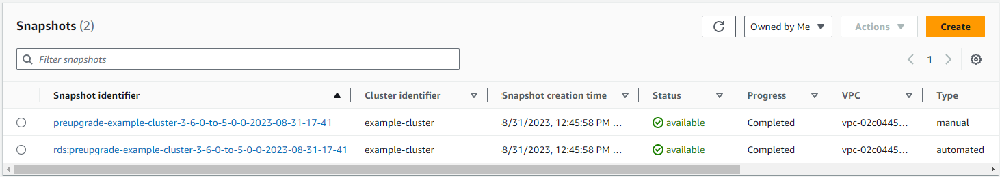
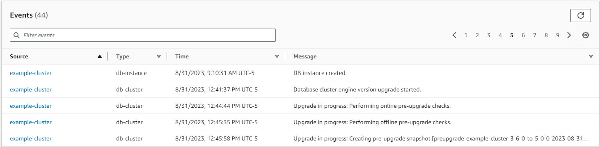
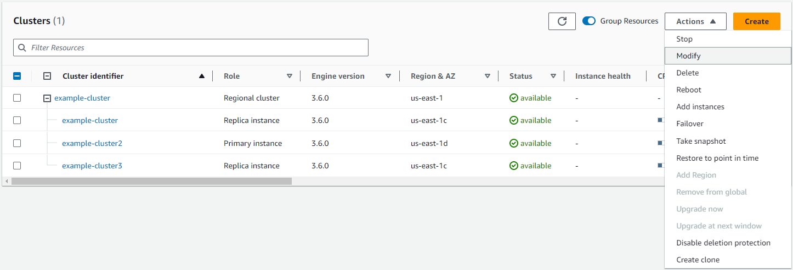
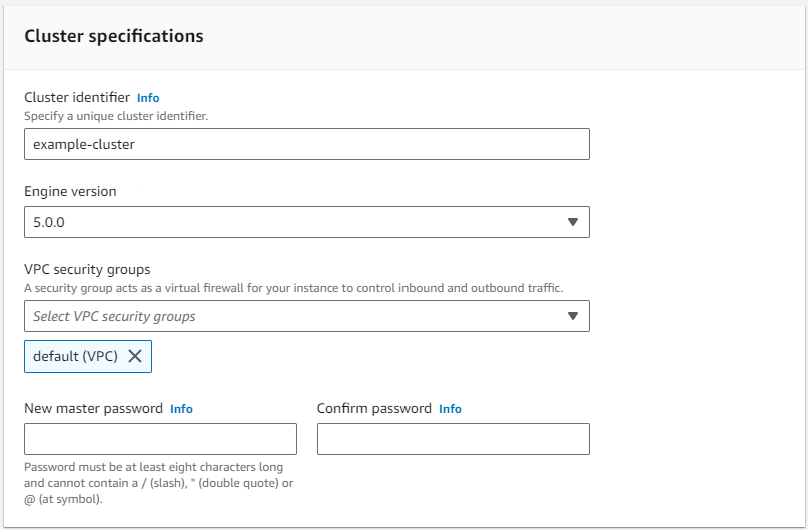
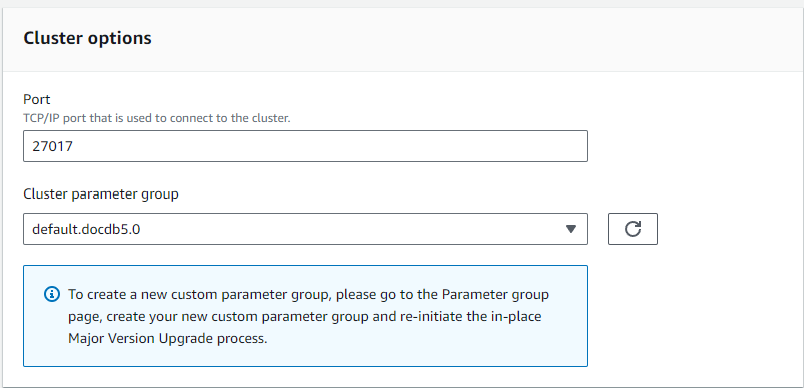
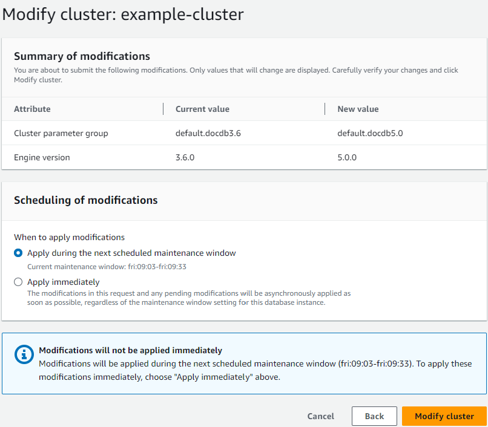
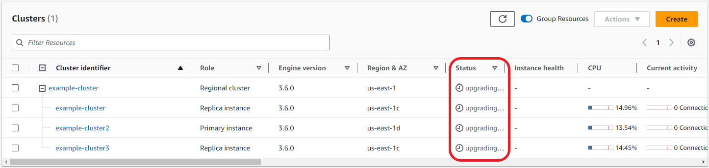

# Amazon DocumentDB in-place major version upgrade

Amazon DocumentDB makes new versions of database engines generally available only after extensive testing.
You can choose how and when to upgrade your Amazon DocumentDB clusters to the new version.

Currently, Amazon DocumentDB supports three major versions: Amazon DocumentDB 3.6, 4.0, and 5.0.
You can perform an in-place major version upgrade (MVU) of your database while keeping the same endpoints, storage, and tags of the clusters and can continue using your applications without any modifications.
This feature is available for free in all regions where Amazon DocumentDB 5.0 is available.

###### Important

Your Amazon DocumentDB clusters will be unavailable during the in-place major version upgrade and your clusters will experience multiple reboots.
Please refrain from connecting, reading, or writing to the cluster after starting the upgrade.
Upgrade downtime can vary from cluster to cluster depending on number of collections, indexes, databases, and instances.
We recommend performing the upgrade during your maintenance window or during low utilization hours.
Once your cluster has been upgraded, you cannot downgrade the cluster to previous version, but you can choose to restore your pre-upgrade snapshot to a new cluster.

###### Topics

- [MVU prerequisites and limitations](#mvu-prerequisites "#mvu-prerequisites")
- [Best practices for in-place major version upgrades](#mvu-best-practices "#mvu-best-practices")
- [Performing an in-place major version upgrade](#perform-an-mvu "#perform-an-mvu")
- [Differences between Amazon DocumentDB 3.6/4.0 to 5.0 upgraded clusters and new Amazon DocumentDB 5.0 clusters](#mvu-36-to-50-differences "#mvu-36-to-50-differences")
- [Troubleshooting an in-place major version upgrade](#mvu-troubleshooting "#mvu-troubleshooting")

## MVU prerequisites and limitations

The following are prerequisites and limitations to in-place major version upgrade that you may need to understand and act on before performing the upgrade:

- **Instance Type** — Amazon DocumentDB 4.0/5.0 does not support r4.\* instances.
  In order to proceed with an in-place major version upgrade, modify r4.\* instances to r5.\* instances.
  See [Modifying an Amazon DocumentDB instance](db-instance-modify.md "db-instance-modify.md") for more information.
  Please refer to [Supported instance classes by region](db-instance-classes.md#db-instance-classes-by-region "db-instance-classes.md#db-instance-classes-by-region") for supported instances based on the Amazon DocumentDB engine version.
- **Instance OS patches** — An in-place major version upgrade needs the latest operating system (OS) patch to proceed.
  Please apply any pending OS maintenance actions on the instances before proceeding with the in-place upgrade.
  For more information, see [Amazon DocumentDB operating system updates](db-instance-maintain.md#os-system-updates "db-instance-maintain.md#os-system-updates").

###### Note

In some situations, if you have pending cluster level engine patches, instance OS patches are not visible.
You may need to apply cluster level engine patches before proceeding with applying instance OS patches and, subsequently, the in-place major version upgrade.
See [Performing a patch update to a cluster's engine version](db-cluster-version-upgrade.md "db-cluster-version-upgrade.md").

- In-place major version upgrade is available in all regions where Amazon DocumentDB 5.0 is available.
- In-place major version upgrade is not supported with Amazon DocumentDB 4.0 as the target version.
- Starting in Amazon DocumentDB 4.0, "." in usernames is not supported.
  If you are upgrading from Amazon DocumentDB 3.6 to 5.0 and have a username containing ".", please re-create your username without ".", before proceeding with in-place MVU.
- In-place major version upgrade is not currently supported on Amazon DocumentDB global clusters and elastic clusters.

###### Note

To upgrade your global clusters, delete your secondary clusters from the global cluster, convert the primary cluster to a regional cluster, perform an in-place major version upgrade on the regional (primary) cluster, then recreate the global cluster by adding secondary clusters using the same name in order to retain the same endpoints as earlier.
Note that you will incur IO charges while your upgraded primary cluster replicates data to your newly added secondary clusters.
For detailed steps on how to remove secondary clusters from global cluster before deleting, see [Removing a cluster from an Amazon DocumentDB global cluster](global-clusters.md#global-clusters.remove "global-clusters.md#global-clusters.remove").

- If you have a large amount of indexes (>3,000) operating in burstable performance instances (e.g. t3.medium or t4g.medium), you must scale up your primary instance to a larger instance (for example, at least r5.large) to perform the in-place major version upgrade.
  You can choose to scale down the instance size once your in-place major version upgrade is complete.
  See the table below for the maximum number of indexes supported on the db.t3 and db.t4g instance types for an in-place major version upgrade:

| Instance      | Maximum indexes supported for in-place MVU |
| ------------- | ------------------------------------------ | -------------------------------------------------------------------------------------------------------------------------------------------------------------------------------------------------------------------------------------------------------------------------------------------------------------------------------------------------------------------------------------------------------------------------------------------------------------------------------------------------------------------------------------------------------------------------------------------------------------------------------------------------------------------------------------------------------------------------------------------------------------------------------------------------------------------------------------------------------------------------------------------------------------------------------------------------------------------------------------------------------------------------------------------------------------------------------------------------------------------------------------------------------------------------------------------------------------------------------------------------------------------------------------------------------------------------------------------------------------------------------------------------------------------------------------------------------------------------------------------------------------------------------------------------------------------------------------------------------------------------------------------------------------------------------------------------------------------------------------------------------------------------------------------------------------------------------------------------------------------------------------------------------------------------------------------------------------------------------------------------------------------------------------------------------------------------------------------------------------------------------------------------------------------------------------------------------------------------------------------------------------------------------------------------------------------------------------------------------------------------------------------------------------------------------------------------------------------------------------------------------------------------------------------------------------------------------------------------------------------------------------------------------------------------------------------------------------------------------------------------------------------------------------------------------------------------------------------------------------------------------------------------------------------------------------------------------------------------------------------------------------------------------------------------------------------------------------------------------------------------------------------------------------------------------------------------------------------------------------------------------------------------------------------------------------------------------------------------------------------------------------------------------------------------------------------------------------------------------------------------------------------------------------------------------------------------------------------------------------------------------------------------------------------------------------------------------------------------------------------------------------------------------------------------------------------------------------------------------------------------------------------------------------------------------------------------------------------------------------------------------------------------------------------------------------------------------------------------------------------------------------------------------------------------------------------------------------------------------------------------------------------------------------------------------------------------------------------------------------------------------------------------------------------------------------------------------------------------------------------------------------------------------------------------------------------------------------------------------------------------------------------------------------------------------------------------------------------------------------------------------------------------------------------------------------------------------------------------------------------------------------------------------------------------------------------------------------------------------------------------------------------------------------------------------------------------------------------------------------------------------------------------------------------------------------------------------------------------------------------------------------------------------------------------------------------------------------------------------------------------------------------------------------------------------------------------------------------------------------------------------------------------------------------------------------------------------------------------------------------------------------------------------------------------------------------------------------------------------------------------------------------------------------------------------------------------------------------------------------------------------------------------------------------------------------------------------------------------------------------------------------------------------------------------------------------------------------------------------------------------------------------------------------------------------------------------------------------------------------------------------------------------------------------------------------------------------------------------------------------------------------------------------------------------------------------------------------------------------------------------------------------------------------------------------------------------------------------------------------------------------------------------------------------------------------------------------------------------------------------------------------------------------------------------------------------------------------------------------------------------------------------------------------------------------------------------------------------------------------------------------------------------------------------------------------------------------------------------------------------------------------------------------------------------------------------------------------------------------------------------------------------------------------------------------------------------------------------------------------------------------------------------------------------------------------------------------------------------------------------------------------------------------------------------------------------------------------------------------------------------------------------------------------------------------------------------------------------------------------------------------------------------------------------------------------------------------------------------------------------------------------------------------------------------------------------------------------------------------------------------------------------------------------------------------------------------------------------------------------------------------------------------------------------------------------------------------------------------------------------------------------------------------------------------------------------------------------------------------------------------------------------------------------------------------------------------------------------------------------------------------------------------------------------------------------------------------------------------------------------------------------------------------------------------------------------------------------------------------------------------------------------------------------------------------------------------------------------------------------------------------------------------------------------------------------------------------------------------------------------------------------------------------------------------------------------------------------------------------------------------------------------------------------------------------------------------------------------------------------------------------------------------------------------------------------------------------------------------------------------------------------------------------------------------------------------------------------------------------------------------------------------------------------------------------------------------------------------------------------------------------------------------------------------------------------------------------------------------------------------------------------------------------------------------------------------------------------------------------------------------------------------------------------------------------------------------------------------------------------------------------------------------------------------------------------------------------------------------------------------------------------------------------------------------------------------------------------------------------------------------------------------------------------------------------------------------------------------------------------------------------------------------------------------------------------------------------------------------------------------------------------------------------------------------------------------------------------------------------------------------------------------------------------------------------------------------------------------------------------------------------------------------------------------------------------------------------------------------------------------------------------------------------------------------------------------------------------------------------------------------------------------------------------------------------------------------------------------------------------------------------------------------------------------------------------------------------------------------------------------------------------------------------------------------------------------------------------------------------------------------------------------------------------------------------------------------------------------------------------------------------------------------------------------------------------------------------------------------------------------------------------------------------------------------------------------------------------------------------------------------------------------------------------------------------------------------------------------------------------------------------------------------------------------------------------------------------------------------------------------------------------------------------------------------------------------------------------------------------------------------------------------------------------------------------------------------------------------------------------------------------------------------------------------------------------------------------------------------------------------------------------------------------------------------------------------------------------------------------------------------------------------------------------------------------------------------------------------------------------------------------------------------------------------------------------------------------------------------------------------------------------------------------------------------------------------------------------------------------------------------------------------------------------------------------------------------------------------------------------------------------------------------------------------------------------------------------------------------------------------------------------------------------------------------------------------------------------------------------------------------------------------------------------------------------------------------------------------------------------------------------------------------------------------------------------------------------------------------------------------------------------------------------------------------------------------------------------------------------------------------------------------------------------------------------------------------------------------------------------------------------------------------------------------------------------------------------------------------------------------------------------------------------------------------------------------------------------------------------------------------------------------------------------------------------------------------------------------------------------------------------------------------------------------------------------------------------------------------------------------------------------------------------------------------------------------------------- |
| db.t4g.medium | 3K                                         |
| db.t3.medium  | 10K                                        | ## Best practices for in-place major version upgrades ###### Topics  • [Test in-place major version upgrades using cloned clusters](#test-in-place-mvu "#test-in-place-mvu")  • [Before an in-place major version upgrade](#before-in-place-mvu "#before-in-place-mvu")  • [During an in-place major version upgrade](#during-in-place-mvu "#during-in-place-mvu")  • [After an in-place major version upgrade](#after-in-place-mvu "#after-in-place-mvu") ### Test in-place major version upgrades using cloned clusters 1. To test in-place major version upgrades, we recommend using fast cloning feature to create a clone of your target cluster. You will not incur any storage costs for testing in-place major version upgrade on a cloned volume, unless you modify any data on the cluster. For more information on volume clone, see [Cloning a volume for an Amazon DocumentDB cluster](db-cluster-cloning.md "db-cluster-cloning.md"). 2. To get a more realistic estimate of the time taken to complete the in-place major version upgrade, match the instance count of the cloned cluster to the targeted cluster. 3. We recommend fully testing the newly upgraded Amazon DocumentDB 5.0 cluster for any functional differences to ensure everything is working as expected. ### Before an in-place major version upgrade 1. Have a version-compatible cluster parameter group ready. Use the Amazon DocumentDB default cluster parameter group for the new engine version or create your own custom cluster parameter group for the new engine version. If you associate an Amazon DocumentDB cluster parameter group as a part of the upgrade request, the in-place major version upgrade will automatically reboot the cluster to apply the new parameter group. 2. Ensure that you’ve satisfied the prerequisites for an in-place major version upgrade as mentioned in the Prerequisites and limitations section. 3. Create a manual snapshot. The upgrade process creates a snapshot of your database cluster during upgrading. It is strongly recommended to create your own manual snapshot before the upgrade process. See [Creating a manual cluster snapshot](backup_restore-create_manual_cluster_snapshot.md "backup_restore-create_manual_cluster_snapshot.md"). ###### Note The auto snapshot created by the upgrade process will not be automatically deleted after the in-place major version upgrade has completed. This snapshot will not incur any charges as long as it is within the retention period. You can choose to delete this snapshot once you have verified a successful upgrade of your cluster. The snapshot is named as `preupgrade-<name>-<version>-<timestamp>`.  4. Check if you already scheduled an in-place major version upgrade of your cluster. If you have modified the cluster and selected to apply it in the next maintenance window, in-place major version upgrade schedule will not be visible on console, but you can view it in the CLI. You can run the [`describe-db-clusters`](https://awscli.amazonaws.com/v2/documentation/api/latest/reference/docdb/describe-db-clusters.html "https://awscli.amazonaws.com/v2/documentation/api/latest/reference/docdb/describe-db-clusters.html") command to check if an in-place major version upgrade is already scheduled: `` aws docdb describe-db-cluster \ --region `us-east-1` \ --db-cluster-identifier `mydocdbcluster` `` In the example above, replace each `user input placeholder` with your cluster's information. The command returns the following output: `"PendingModifiedValues": { "EngineVersion": "5.0.0" },` 5. Perform multiple dry-runs using volume clone in lower environments to test the cluster post in-place major version upgrade on any execution plan and functional differences. We recommend cloning with the same number and size of instances to get a better estimate of in-place major version upgrade run time. For more information, see [Cloning a volume for an Amazon DocumentDB cluster](db-cluster-cloning.md "db-cluster-cloning.md"). 6. If the previous step is successful, proceed with in-place major version upgrade on the production cluster. ### During an in-place major version upgrade You can monitor progress of your in-place major version upgrade by subscribing to cluster maintenance events. When the upgrade completes, you will receive the “Database cluster major version has been upgraded” event. This and other events occurring during the upgrade appear in the ‘Events and Tags’ section of the cluster detail page in the Amazon DocumentDB console. The cluster status then changes from ‘upgrading’ to ‘available’. From CLI, you can run `aws docdb create-event-subscription` to create events and `aws docdb describe-events` to monitor progress. You can also setup event notifications for the above events to Amazon SNS as the target to be notified via email, push messages, and other methods. For more information, see [Subscribing to Amazon DocumentDB events](event-subscriptions.md "event-subscriptions.md"). In-place major version upgrade generates the following events during the upgrade:  • Upgrade in progress: Creating pre-upgrade snapshot [preupgrade-<cluster-name>-<timestamp>]  • Upgrade in progress: Cloning volume.  • Upgrade in progress: Upgrading writer.  • Upgrade in progress: Upgrading readers.  • Database cluster major version has been upgraded. Events are also visible on the console under the **Events** page:  In the AWS CLI, you can run the [`describe-events`](https://awscli.amazonaws.com/v2/documentation/api/latest/reference/docdb/describe-events.html "https://awscli.amazonaws.com/v2/documentation/api/latest/reference/docdb/describe-events.html") command to track progress: ``aws docdb describe-events --source-identifier `mydocdbcluster` --source-type db-cluster`` In the example above, replace each `user input placeholder` with your cluster's information. The command returns the following output: `{ "Events": [ { "SourceIdentifier": "mydocdbcluster", "SourceType": "db-cluster", "Message": "Database cluster engine version upgrade started.", "EventCategories": [ "maintenance" ], "Date": "2023-07-11T23:20:32.444000+00:00", "SourceArn": "arn:aws:rds:us-east-1:xxxx:cluster:mycluster" } ] }` ### After an in-place major version upgrade For Amazon DocumentDB 3.6, add a tag to the cluster to differentiate that the cluster was upgraded to Amazon DocumentDB 5.0 from Amazon DocumentDB 3.6 as opposed to a newly created Amazon DocumentDB 5.0 cluster. Refer to the section on differences between an upgraded Amazon DocumentDB 5.0 cluster and a new Amazon DocumentDB 5.0 cluster. Take a manual snapshot after the in-place MVU finishes in case you need to restore to the post-upgrade state. The automatic snapshot process will resume as soon as in-place major version upgrade completes. The manual snapshot will not incur any charges as long as it is within the retention period. To use the new features associated with Amazon DocumentDB 5.0, for example, client-side field level encryption, we recommend upgrading your driver version to the MongoDB 5.0 API version. For more information, see [What's new in Amazon DocumentDB 5.0](compatibility.md#compatibility-whatsnew-5 "compatibility.md#compatibility-whatsnew-5") for a list of Amazon DocumentDB 5.0 features. ###### Important Immediately after performing in-place major version upgrade (MVU), your Amazon DocumentDB 5.0 cluster will repopulate the index metadata, based on which the database engine optimizes query execution plans. Expected query performance on your Amazon DocumentDB cluster will resume after the index metadata recalculation process is complete. Typically, this process completes in a few minutes but can last up to two hours depending on the number of indexes on your cluster. An immediate reboot, failover, or scale up/down of your writer instance after in-place MVU, may disrupt the index metadata calculation process on your cluster. After the in-place MVU completes, we recommend making such changes once you observe expected query performance on your Amazon DocumentDB 5.0 cluster. Additionally, after the in-place MVU completes, the available change stream data will be limited to the last 3 hours. Please contact AWS support if you see this temporary performance drop persisting for more than two hours after in-place MVU. Fully test the upgraded Amazon DocumentDB 5.0 cluster to ensure everything is working as expected. ## Performing an in-place major version upgrade Using the AWS Management Console To perform an in-place major version upgrade using the AWS Management Console: 1. Sign into the [AWS Management Console](https://console.aws.amazon.com/docdb/home?region=us-east-1 "https://console.aws.amazon.com/docdb/home?region=us-east-1") and open the Amazon DocumentDB console. 2. In the **Clusters** table, select the source cluster, click **Actions**, and then **Modify**.  3. On the **Modify cluster** dialog in the **Cluster specifications** section, choose the targeted database version (**5.0.0**) from the **Engine version** drop down menu.  4. In the **Cluster options** section, choose the appropriate cluster parameter group (**default.docdb5.0**) or a custom created parameter group.  5. Once complete, scroll down and choose **Continue**. 6. In the **Scheduling of modifications** section, choose your preferred scheduling plan: apply immediately or apply in the next maintenance window. Then choose **Modify cluster**.  7. In the clusters table, note the status of your cluster as it is being upgraded:  Using the AWS CLI Use the [`modify-db-cluster`](https://awscli.amazonaws.com/v2/documentation/api/latest/reference/docdb/modify-db-cluster.html "https://awscli.amazonaws.com/v2/documentation/api/latest/reference/docdb/modify-db-cluster.html") command with desired engine version option and `allow-major-version-upgrade` flag set: `` aws docdb modify-db-cluster \ ‐‐db-cluster-identifier `mydocdbcluster` \ ‐‐allow-major-version-upgrade \ ‐‐engine-version 5.0.0 \ ‐‐apply-immediately \ ‐‐cluster-parameter-group `mydocdbparametergroup` \ ‐‐region `us-east-1` `` In the example above, replace each `user input placeholder` with your cluster's information. ## Differences between Amazon DocumentDB 3.6/4.0 to 5.0 upgraded clusters and new Amazon DocumentDB 5.0 clusters  • An in-place major version upgrade retains the original indexes on the upgraded cluster. With Amazon DocumentDB 5.0, we have enhanced the overall efficiency of index maintenance and the garbage collection process, especially for low cardinality indexes. As a general best practice, we recommend recreating your indexes using the reindex command after MVU successfully completes. Recreating indexes is not a requirement and will involve additional I/O. For more information, see [Index maintenance using reIndex](managing-indexes.md#reIndex "managing-indexes.md#reIndex").  • Subdocument comparisons for multiple numeric data types: + If the cluster is migrated from Amazon DocumentDB 3.6, it will inherit the Amazon DocumentDB 3.6 subdocument comparison behavior. The functional difference is limited to numeric types (such as Long, Double, Decimal128) in a subdocument. For example, `{a: {b: {NumberLong(1)}}` does not equal `{a: {b: 1}}` in Amazon DocumentDB 3.6, while they are compared as equal in Amazon DocumentDB 4.0 and after. + This subdocument comparison behavior exists only in Amazon DocumentDB 3.6, and in Amazon DocumentDB 5.0 clusters that were upgraded from version 3.6 using an in-place major version upgrade. This doesn't apply to newly created Amazon DocumentDB 5.0 clusters. ###### Note For a list of functional differences between Amazon DocumentDB 3.6/4.0 and Amazon DocumentDB 5.0, see [Amazon DocumentDB compatibility with MongoDB](compatibility.md "compatibility.md"). ## Troubleshooting an in-place major version upgrade  • In case of a failure, the in-place major version upgrade will attempt a rollback of the upgrade to assume the last operational state of the cluster before the upgrade started. A successful rollback will generate an event: "Database cluster is in a state that cannot be upgraded: DocumentDB cluster is in a state where major version upgrade cannot be completed successfully." At this point, you should reach out to the AWS support team to troubleshoot and re-attempt the version upgrade. You can continue using your workload as before. In any other rare scenarios where the upgrade is taking longer than expected, please reach out to AWS support team for assistance.  • Once your in-place MVU completes successfully, your upgraded cluster may experience a temporary performance degradation and high CPU utilization for a small duration of time, while the index metadata refresh process is running. If you continue to experience performance degradation for more than 2 hours, please contact AWS support. |
