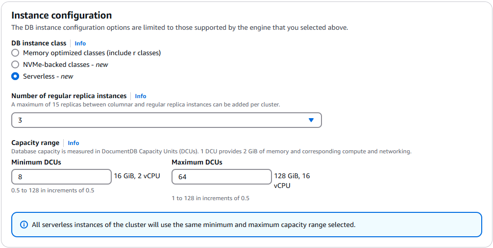

# Creating a cluster that uses Amazon DocumentDB serverless

## Creating an Amazon DocumentDB serverless cluster

With Amazon DocumentDB serverless, your clusters are interchangeable with provisioned clusters.
You can have clusters where some instances use serverless and some instances are provisioned.

Verify that your desired region and engine version support DocumentDB serverless.
See [Requirements and limitations for DocumentDB serverless](docdb-serverless-limitations.md "docdb-serverless-limitations.md").

To create an Amazon DocumentDB cluster where you can add serverless instances, follow the same procedure as in [Creating an Amazon DocumentDB cluster](db-cluster-create.md "db-cluster-create.md").
The only difference is that the `ServerlessV2ScalingConfiguration` argument must also be provided.

The `ServerlessV2ScalingConfiguration` argument specifies the scaling capacity range of your DocumentDB serverless instances.
It consists of the minimum and maximum DocumentDB capacity unit (DCU) values that apply to all the DocumentDB serverless instances in the cluster:

- The `MinCapacity` value specifies the minimum scaling capacity.
- The `MaxCapacity` value specifies the maximum scaling capacity.

For more information on scaling, see [Amazon DocumentDB serverless scaling configuration](docdb-serverless-scaling-config.md "docdb-serverless-scaling-config.md").

Using the AWS Management Console
The following AWS Management Console configuration example shows how to create a DocumentDB serverless cluster.

1. Sign into the [AWS Management Console](https://console.aws.amazon.com/docdb/home?region=us-east-1 "https://console.aws.amazon.com/docdb/home?region=us-east-1") and open the Amazon DocumentDB console.
2. In the navigation pane, choose **Clusters**.

###### Tip

If you don't see the navigation pane on the left side of your screen, choose the menu icon
()
in the upper-left corner of the page.

The **Clusters** table appears. 3. Choose **Create**.

The **Create Amazon DocumentDB cluster** page appears. 4. On the Create Amazon DocumentDB cluster page, in the **Cluster type** section, choose
**Instance-based cluster** (this is the default option). 5. In the **Cluster configuration** section:

    1. For **Cluster identifier**, enter a unique name, such as `myserverlesscluster`.
     Note that the console will change all cluster names into lower-case regardless of how they are entered.
    2. For **Engine version**, choose **5.0.0** (this is the default option).

6. In the **Cluster storage configuration** section, choose **Amazon DocumentDB Standard** (this is the default option).

###### Note

The other option in this category is **Amazon DocumentDB I/O-Optimized**.
To learn more about either option, see [Amazon DocumentDB cluster storage configurations](db-cluster-storage-configs.md "db-cluster-storage-configs.md") 7. In the **Instance configuration** section:

    1. For **DB instance class**, choose **Serverless**.
    2. For **Number of regular replica instances**, choose **3** (this is the default option).
    3. In the **Capacity range** section, leave the default values for **Minimum DCUs** and **Maximum DCUs**.
     For information on setting these parameters, see [Amazon DocumentDB serverless instance limits](docdb-serverless-instance-limits.md "docdb-serverless-instance-limits.md").

 8. In the **Connectivity** section, leave the default setting of **Don't connect to an EC2 compute resource**. 9. In the **Authentication** section, enter a username for the primary user, and then choose **Self managed**.
Enter a password, then confirm it.

If you instead chose **Managed in AWS Secrets Manager**, see [Password management with Amazon DocumentDB and AWS Secrets Manager](docdb-secrets-manager.md "docdb-secrets-manager.md") for more information. 10. Leave all other options as default and choose **Create cluster**.

Using the AWS CLI
In the following example, replace each `user input placeholder` with your own information or configuration parameters.

To create a cluster compatible with DocumentDB serverless instances using the AWS CLI, see [Creating a cluster using the AWS CLI](db-cluster-create.md#db-cluster-create-cli "db-cluster-create.md#db-cluster-create-cli").

Include the following additional parameters in your `create-db-cluster` command:

```
--serverless-v2-scaling-configuration
     MinCapacity=`minimum_capacity`,MaxCapacity=`maximum_capacity`
```

Example:

```
aws docdb create-db-cluster \
      --db-cluster-identifier `sample-cluster` \
      --engine docdb \
      --engine-version 5.0.0 \
      --serverless-v2-scaling-configuration MinCapacity=`0.5`,MaxCapacity=`16` \
      --master-username `user-name` \
      --master-user-password `password`
```

## Adding an Amazon DocumentDB serverless instance

To add an DocumentDB serverless instance, follow the same procedure in [Adding an Amazon DocumentDB instance to a cluster](db-instance-add.md "db-instance-add.md"), making sure to specify db.serverless as the instance class.

### Adding a serverless instance using the AWS Management Console.

To add an DocumentDB serverless instances using the console, see [Adding an Amazon DocumentDB instance to a cluster](db-instance-add.md "db-instance-add.md") and choose the **Using the AWS Management Console** tab.

### Adding a serverless instance using the AWS CLI

To add an DocumentDB serverless instances using the AWS CLI, see [Adding an Amazon DocumentDB instance to a cluster](db-instance-add.md "db-instance-add.md") and choose the **Using the AWS CLI** tab.

Use the following instance class CLI argument:

```
--db-instance-class db.serverless
```

Example:

```
aws docdb create-db-instance \
      --db-cluster-identifier `sample-cluster` \
      --db-instance-identifier `sample-instance` \
      --db-instance-class db.serverless \
      --engine docdb
```
