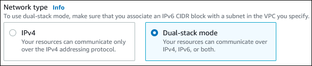

# Create a dual-stack VPC for use with a DocumentDB cluster

A common scenario includes a cluster in a virtual private cloud (VPC) based on the Amazon VPC service.
This VPC shares data with a public Amazon EC2 instance that is running in the same VPC.
In this topic, you create the VPC for this scenario.

###### Topics

- [Step 1: Create a VPC with private and public subnets](#ds-vpc-private-public-subnets "#ds-vpc-private-public-subnets")
- [Step 2: Create a VPC security group for a public Amazon EC2 instance](#ds-vpc-public-security-group "#ds-vpc-public-security-group")
- [Step 3: Create a VPC security group for a private cluster](#ds-vpc-private-security-group "#ds-vpc-private-security-group")
- [Step 4: Create a subnet group](#ds-vpc-subnet-group "#ds-vpc-subnet-group")
- [Step 5: Create an Amazon EC2 instance in dual-stack mode](#ds-vpc-ec2-dual-stack "#ds-vpc-ec2-dual-stack")
- [Step 6: Create a cluster in dual-stack mode](#ds-vpc-cluster-dual-stack "#ds-vpc-cluster-dual-stack")
- [Step 7: Connect to your Amazon EC2 instance and DB cluster](#ds-vpc-connect-ec2 "#ds-vpc-connect-ec2")
- [Delete the VPC](#ds-vpc-delete "#ds-vpc-delete")
  In this procedure, you create the VPC for this scenario that works with a database running in dual-stack mode.
  Dual-stack mode enables connection over the IPv6 addressing protocol.
  For more information about IP addressing, see [Amazon DocumentDB IP addressing](vpc-clusters.md#vpc-docdb-ip-addressing "vpc-clusters.md#vpc-docdb-ip-addressing").

Dual-stack network clusters are supported in most regions.
For more information see [Dual-stack mode Region and version availability](vpc-clusters.md#dual-stack-availability "vpc-clusters.md#dual-stack-availability").
To see the limitations of dual-stack mode, see [Limitations for dual-stack network clusters](vpc-clusters.md#dual-stack-limitations "vpc-clusters.md#dual-stack-limitations").

This topic and the IPv4-only topic create the public and private subnets in the same VPC.
For information about creating the Amazon DocumentDB cluster in one VPC and the Amazon EC2 instance in a different VPC, see [Accessing an Amazon DocumentDB cluster in a VPC](access-cluster-vpc.md "access-cluster-vpc.md").

Your DocumentDB cluster needs to be available only to your Amazon EC2 instance, and not to the public internet.
Thus, you create a VPC with both public and private subnets.
The EC2 instance is hosted in the public subnet, so that it can reach the public internet.
The cluster is hosted in a private subnet.
The EC2 instance can connect to the cluster because it's hosted within the same VPC.
However, the cluster is not available to the public internet, providing greater security.

The procedures in this topic configures an additional public and private subnet in a separate Availability Zone.
These subnets aren't used by the procedure.
An DocumentDB subnet group requires a subnet in at least two Availability Zones.
The additional subnet makes it easy to configure more than one DocumentDB instance.

To create a cluster that uses dual-stack mode, specify **Dual-stack mod**e for the **Network type** setting.
You can also modify a cluster with the same setting.
For more information about creating a cluster, see [Creating an Amazon DocumentDB cluster](db-cluster-create.md "db-cluster-create.md").
For more information about modifying a DB cluster, see [Modifying an Amazon DocumentDB cluster](db-cluster-modify.md "db-cluster-modify.md").

This topic describes configuring a VPC for Amazon DocumentDB clusters.
For more information about Amazon VPC, see the [_Amazon VPC User Guide_](../../../vpc/latest/userguide/what-is-amazon-vpc.md "../../../vpc/latest/userguide/what-is-amazon-vpc.md").

## Step 1: Create a VPC with private and public subnets

Use the following procedure to create a VPC with both public and private subnets.

**To create a VPC and subnets**

1. Open the Amazon VPC console at [https://console.aws.amazon.com/vpc](https://console.aws.amazon.com/vpc "https://console.aws.amazon.com/vpc").
2. In the top-right corner of the AWS Management Console, choose the Region to create your VPC in.
   This example uses the US West (Oregon) Region.
3. In the upper-left corner, choose **VPC dashboard**.
   To begin creating a VPC, choose **Create VPC**.
4. For **Resources to create** under **VPC settings**, choose **VPC and more**.
5. For the **VPC settings**, set these values:
   - **Name tag auto-generation** — `example-dual-stack`
   - **IPv4 CIDR block** — `10.0.0.0/16`
   - **IPv6 CIDR block** — **Amazon-provided IPv6 CIDR block**
   - **Tenancy** — **Default**
   - **Number of Availability Zones (AZs)** — **2**
   - **Customize AZs** — Keep the default values
   - **Number of public subnets** — **2**
   - **Number of private subnets** — **2**
   - **Customize subnets CIDR blocks** — Keep the default values
   - **NAT gateways ($)** — **None**
   - **Egress only internet gateway** — **No**
   - **VPC endpoints** — **None**
   - **DNS options** — Keep the default values

6. Choose **Create VPC**.

## Step 2: Create a VPC security group for a public Amazon EC2 instance

Next, you create a security group for public access.
To connect to public EC2 instances in your VPC, add inbound rules to your VPC security group that allow traffic to connect from the internet.

**To create a VPC security group**

1.  Open the Amazon VPC console at [https://console.aws.amazon.com/vpc](https://console.aws.amazon.com/vpc "https://console.aws.amazon.com/vpc").
2.  Choose **VPC Dashboard**, choose **Security Groups**, and then choose **Create security group**.
3.  On the **Create security group** page, set these values:
    - **Security group name** — `example-dual-stack-securitygroup`
    - **Description** — `Dual-stack security group`
    - **VPC** — Choose the VPC that you created earlier, for example: **vpc-example-dual-stack**.

4.  Add inbound rules to the security group.
    1. Determine the IP address to use to connect to EC2 instances in your VPC using Secure Shell (SSH).
       To determine your public IP address, in a different browser window or tab, you can use the service at [https://checkip.amazonaws.com](https://checkip.amazonaws.com "https://checkip.amazonaws.com").

    An example of an Internet Protocol version 4 (IPv4) address range is `203.0.113.25/32`.
    An example of an Internet Protocol version 6 (IPv6) address range is `2001:db8:1234:1a00::/64`.

    In many cases, you might connect through an internet service provider (ISP) or from behind your firewall without a static IP address.
    If so, find the range of IP addresses used by client computers.

    ###### Warning

    If you use `0.0.0.0/0` for IPv4 or `::0` for IPv6, you make it possible for all IP addresses to access your public instances using SSH.
    This approach is acceptable for a short time in a test environment, but it's unsafe for production environments.
    In production, authorize only a specific IP address or range of addresses to access your instances. 2. In the **Inbound rules** section, choose **Add rule**. 3. Set the following values for your new inbound rule to allow SSH access to your Amazon EC2 instance.
    After you do this, you can connect to your EC2 instance to install applications or other utilities.
    Specify an IP address so you can access your EC2 instance:

        * **Type** — `SSH`
        * **Source** — The IP address or range you created from Step a. An example of an IPv4 address range is `203.0.113.25/3`2.
         An example of an IPv6 address range is `2001:DB8::/32`.

    4. Choose **Add rule**.

5.  Choose **Create security group** to create the security group.

Note the security group ID because you need it later in another procedure.

## Step 3: Create a VPC security group for a private cluster

To keep your cluster private, create a second security group for private access.
To connect to private clusters in your VPC, add inbound rules to your VPC security group.
These allow traffic from your Amazon EC2 instance only.

**To create a VPC security group**

1. Open the Amazon VPC console at [https://console.aws.amazon.com/vpc](https://console.aws.amazon.com/vpc "https://console.aws.amazon.com/vpc").
2. Choose **VPC Dashboard**, choose **Security Groups**, and then choose **Create security group**.
3. On the **Create security group** page, set these values:
   - **Security group name** — `example-dual-stack-cluster-securitygroup`
   - **Description** — `Dual-stack cluster security group`
   - **VPC** — Choose the VPC that you created earlier, for example: **vpc-example-dual-stack**

4. Add inbound rules to the security group.
   1. In the **Inbound rules** section, choose **Add rule**.
   2. Set the following values for your new inbound rule to allow DocumentDB traffic on port 27017 from your Amazon EC2 instance.
      After you do this, you can connect from your EC2 instance to your cluster.
      By doing so, you can send data from your EC2 instance to your database.
      - **Type** — `Custom TCP`
      - **Source** — The identifier of the EC2 security group that you created previously in this topic, for example: **sg-9edd5cfb**.

5. Choose **Create security group** to create the security group.

## Step 4: Create a subnet group

A subnet group is a collection of subnets that you create in a VPC and that you then designate for your clusters.
By using a subnet group, you can specify a particular VPC when creating clusters.
To create a subnet group that is `DUAL` compatible, all subnets must be `DUAL` compatible.
To be `DUAL` compatible, a subnet must have an IPv6 CIDR associated with it.

**To create a subnet group**

1. Identify the private subnets for your database in the VPC.
   1. Open the Amazon VPC console at [https://console.aws.amazon.com/vpc](https://console.aws.amazon.com/vpc "https://console.aws.amazon.com/vpc").
   2. Choose **VPC Dashboard**, and then choose **Subnets**.
   3. Note the subnet IDs of the subnets you created in Step 1 named, for example: **example-dual-stack-subnet-private1-us-west-2a** and **example-dual-stack-subnet-private2-us-west-2b**.
      You need the subnet IDs when you create your subnet group.

2. Sign in to the AWS Management Console, and open the Amazon DocumentDB console at [https://console.aws.amazon.com/docdb](https://console.aws.amazon.com/docdb "https://console.aws.amazon.com/docdb").

Make sure that you connect to the Amazon DocumentDB console, not to the Amazon VPC console. 3. In the navigation pane, choose **Subnet groups**. 4. Choose **Create**. 5. On the **Create subnet group** page, set these values in the **Subnet group details** section:

    * **Name** — `example-dual-stack-cluster-subnet-group`
    * **Description** — `Dual-stack cluster subnet group`

6. In the **Add subnets** section, set these values:
   - **VPC** — Choose the VPC that you created earlier, for example: **vpc-example-dual-stack**
   - **Availability Zones** — Select both Availability Zones created in Step 1. Example: **us-west-2a** and **us-west-2b**
   - **Subnets** — Choose the private subnets you created in Step 1.

7. Choose **Create**.

Your new subnet group appears in the subnet groups list on the DocumentDB console.
You can choose the subnet group to see details in the details pane.
These details include all of the subnets associated with the group.

## Step 5: Create an Amazon EC2 instance in dual-stack mode

To create an Amazon EC2 instance, follow the instructions in [Launch an EC2 instance using the launch instance wizard in the console](../../../AWSEC2/latest/UserGuide/ec2-launch-instance-wizard.md "../../../AWSEC2/latest/UserGuide/ec2-launch-instance-wizard.md") in the _Amazon Elastic Compute Cloud User Guide_.

On the **Configure Instance Details** page, set these values and keep the other values as their defaults:

- **Network** — Choose an existing VPC with both public and private subnets, such as **vpc-example-dual-stack-vpc** (vpc-_identifier_) created in [Step 1: Create a VPC with private and public subnets](#ds-vpc-private-public-subnets "#ds-vpc-private-public-subnets").
- **Subnet** — Choose an existing public subnet, such as **subnet-_identifier_ | example-dual-stack-subnet-public1-us-east-2a | us-east-2a** created in [Step 2: Create a VPC security group for a public Amazon EC2 instance](#ds-vpc-public-security-group "#ds-vpc-public-security-group").
- **Auto-assign Public IP** — Choose **Enable**.
- **Auto-assign IPv6 IP** — Choose **Enable**.
- **Firewall (security groups)** Choose **Select an existing security group**.—
- **Common security groups** — Choose an existing security group, such as the **example-dual-stack-securitygroup** created in [Step 2: Create a VPC security group for a public Amazon EC2 instance](#ds-vpc-public-security-group "#ds-vpc-public-security-group").
  Make sure that the security group that you choose includes inbound rules for Secure Shell (SSH) and HTTP access.

## Step 6: Create a cluster in dual-stack mode

In this step, you create a DB cluster that runs in dual-stack mode. **!!! Note: this section needs editing once the IPv6 updates have been made to the console !!!**

**To create a cluster in dual-stack mode**

1. Sign in to the AWS Management Console, and open the Amazon DocumentDB console at [https://console.aws.amazon.com/docdb](https://console.aws.amazon.com/docdb "https://console.aws.amazon.com/docdb").
2. In the upper-right corner of the console, choose the AWS Region where you want to create the DocumentDB cluster.
   This example uses the US East (Ohio) Region.
3. In the navigation pane, choose **Clusters**.
4. On the **Clusters** list page, choose **Create**.
5. On the **Create Amazon DocumentDB cluster** page, make sure that the **Instance-based cluster** option is chosen.
6. In the **Connectivity** section, under **Network type**, choose **Dual-stack mode**.

 7. At the bottom of the page, switch on **Show advanced settings**. 8. In the **Network settings** section, set these values:

    * **Virtual private cloud (VPC)** — Choose an existing VPC with both public and private subnets, such as **vpc-example-dual-stack** (vpc-*identifier*) created in [Step 1: Create a VPC with private and public subnets](#ds-vpc-private-public-subnets "#ds-vpc-private-public-subnets").

    The VPC must have subnets in different Availability Zones.
    * **Subnet group** — Choose a subnet group for the VPC, such as **example-dual-stack-cluster-subnet-group** created in [Step 4: Create a subnet group](#ds-vpc-subnet-group "#ds-vpc-subnet-group").
    * **Public access** — Choose **No**.
    * **VPC security group (firewall)** — Select **Choose existing**.
    * **Existing VPC security groups** — Choose an existing VPC security group that is configured for private access, such as **example-dual-stack-cluster-securitygroup** created in [Step 3: Create a VPC security group for a private cluster](#ds-vpc-private-security-group "#ds-vpc-private-security-group").

    Remove other security groups, such as the default security group, by choosing the **X** associated with each.
    * **Availability Zone** — Choose the Availability Zone you created in Step 1. Example: **us-west-2a**.

    To avoid cross-AZ traffic, make sure the cluster and the EC2 instance are in the same Availability Zone.

9. For the remaining sections, specify your cluster settings.
   For information about each setting, see [Creating an Amazon DocumentDB cluster](db-cluster-create.md "db-cluster-create.md").

## Step 7: Connect to your Amazon EC2 instance and DB cluster

After you create your Amazon EC2 instance and DocumentDB cluster in dual-stack mode, you can connect to each one using the IPv6 protocol.
To connect to an EC2 instance using the IPv6 protocol, follow the instructions in [Connect your EC2 instance](../../../AWSEC2/latest/UserGuide/connect.md "../../../AWSEC2/latest/UserGuide/connect.md") in the _Amazon Elastic Compute Cloud User Guide_.

To connect to your DocumentDB cluster from the EC2 instance, follow the instructions in [Step 5: Install the MongoDB Shell](connect-ec2-manual.md#manual-connect-ec2.install-mongo-shell "connect-ec2-manual.md#manual-connect-ec2.install-mongo-shell"), in the Connect Amazon EC2 manually topic (and continue with the subsequent Step 6 and Step 7 in the same procedure).

## Delete the VPC

You can delete a VPC and the other resources that are used within it, if they are no longer needed.

###### Note

If you added resources in the VPC that you created in this topic, you might need to delete these before you can delete the VPC.
For example, these resources might include Amazon EC2 instances or DocumentDB clusters.
For more information, see [Delete your VPC](../../../vpc/latest/userguide/delete-vpc.md "../../../vpc/latest/userguide/delete-vpc.md") in the _Amazon VPC User Guide_.

**To delete a VPC and related resources**

1. Delete the subnet group:
   1. Sign in to the AWS Management Console, and open the Amazon DocumentDB console at [https://console.aws.amazon.com/docdb](https://console.aws.amazon.com/docdb "https://console.aws.amazon.com/docdb").
   2. In the navigation pane, choose **Subnet groups**.
   3. Select the subnet group you want to delete, such as **example-dual-stack-cluster-subnet-group**.
   4. Choose **Delete**, and then choose **Delete** in the confirmation window.

2. Note the VPC ID:
   1. Open the Amazon VPC console at [https://console.aws.amazon.com/vpc](https://console.aws.amazon.com/vpc "https://console.aws.amazon.com/vpc").
   2. Choose **VPC Dashboard**, and then choose **Your VPCs**.
   3. In the list, identify the VPC that you created, such as **vpc-example-dual-stack**.
   4. Note the **VPC ID** of the VPC that you created.
      You need the VPC ID in later steps.

3. Delete the security groups:
   1. Open the Amazon VPC console at [https://console.aws.amazon.com/vpc](https://console.aws.amazon.com/vpc "https://console.aws.amazon.com/vpc").
   2. Choose **VPC Dashboard**, and then choose **Security Groups**.
   3. Select the security group for the Amazon DocumentDB cluster, such as **example-dual-stack-securitygroup**.
   4. For **Actions**, choose **Delete security groups**, and then choose **Delete** on the confirmation dialog.
   5. Back on the **Security Groups** page, select the security group for the Amazon EC2 instance, such as **example-securitygroup**.
   6. For **Actions**, choose **Delete security groups**, and then choose **Delete** on the confirmation dialog.

4. Delete the NAT gateway:
   1. Open the Amazon VPC console at [https://console.aws.amazon.com/vpc](https://console.aws.amazon.com/vpc "https://console.aws.amazon.com/vpc").
   2. Choose **VPC Dashboard**, and then choose **Security Groups**.
   3. Select the NAT gateway of the VPC that you created.
      Use the VPC ID to identify the correct NAT gateway.
   4. For **Actions**, choose **Delete NAT gateway**.
   5. On the confirmation dialog, enter `delete`, and then choose **Delete**.

5. Delete the VPC:
   1. Open the Amazon VPC console at [https://console.aws.amazon.com/vpc](https://console.aws.amazon.com/vpc "https://console.aws.amazon.com/vpc").
   2. Choose **VPC Dashboard**, and then choose **Your VPCs**.
   3. Select the VPC you want to delete, such as **vpc-example-dual-stack**.
   4. For **Actions**, choose Delete VPC.

   The confirmation page shows other resources that are associated with the VPC that will also be deleted, including the subnets associated with it. 5. On the confirmation dialog, enter `delete`, and then choose **Delete**.

6. Release the elastic IP address:
   1. Open the EC2 console at [https://console.aws.amazon.com/ec2](https://console.aws.amazon.com/ec2 "https://console.aws.amazon.com/ec2").
   2. Choose **EC2 Dashboard**, and then choose **Elastic IPs**.
   3. Select the Elastic IP address that you want to release.
   4. For **Actions**, choose **Release Elastic IP addresses**.
   5. On the confirmation dialog, choose **Release**.
