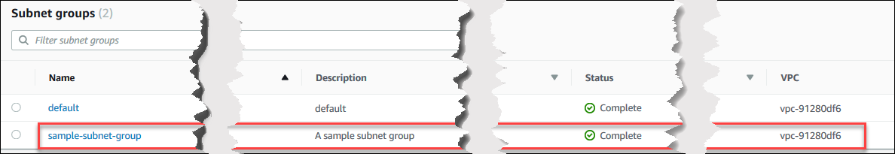

# Creating an Amazon DocumentDB subnet group

When creating an Amazon DocumentDB cluster, you must choose a Amazon VPC and corresponding subnet group within that Amazon VPC to launch your cluster. Subnets determine the availability zone and IP range within the availability zone that you want to use to launch an instance.

A subnet group is a named set of subnets (or AZs) that allows you to specify the availability zones that you want to use to for launching Amazon DocumentDB instances. For example, in a cluster with three instances, it is recommended that each of those instances are provisioned in separate AZs—doing so optimizes for high availability. Thus, if a single AZ fails, it will only affect a single instance.

Currently, Amazon DocumentDB instances can be provisioned in up to three AZs. Even if a subnet group has more than three subnets, you will only be able to use three of those subnets to create an Amazon DocumentDB cluster. Therefore, we recommend that when you create a subnet group that you only choose the three subnets of which you want to deploy your instances.

For example: A cluster is created and Amazon DocumentDB choose AZs {1A, 1B, and 1C}. If you attempt to create an instance in AZ {1D} the API call will fail. However, if you choose to create an instance, without specifying the particular AZ, then Amazon DocumentDB will choose an AZ on your behalf. Amazon DocumentDB uses an algorithm to load balance the instances across AZs to help you achieve high availability. If three instances are provisioned, by default, they will be provisioned across three AZs and will not be provisioned all in a single AZ.

Best Practices

- Unless you have a specific reason, always create a subnet group with three subnets.
  This ensures that clusters with three or more instances will be able to achieve higher availability as instances will be provisioned across three AZs.
- Always spread instances across multiple AZs to achieve high availability.
  Never place all instances for a cluster in a single AZ.
- Because failover events can happen at any time, you should not assume that a primary instance or replica instances will always be in a particular AZ.

## How to create a subnet group

You can use the AWS Management Console or AWS CLI to create an Amazon DocumentDB subnet group:

Using the AWS Management Console
Use the following steps to create an Amazon DocumentDB subnet group.

###### To create an Amazon DocumentDB subnet group

1. Sign in to the AWS Management Console, and open the Amazon DocumentDB console at [https://console.aws.amazon.com/docdb](https://console.aws.amazon.com/docdb "https://console.aws.amazon.com/docdb").
2. In the navigation pane, choose **Subnet groups**, then choose **Create**.

###### Tip

If you don't see the navigation pane on the left side of your screen, choose the menu icon
()
in the upper-left corner of the page. 3. On the **Create subnet group** page:

    1. In the **Subnet group details** section:


    	1. **Name**—Enter a meaningful name for the subnet group.
    	2. **Description**—Enter a description for the subnet group.
    2. In the **Add subnets** section:


    	1. **VPC**—In the list, choose a VPC for this subnet group.
    	2. Do one of the following:


    		* To include all subnets in the chosen VPC, choose **Add all the subnets related to this VPC**.
    		* To specify subnets for this subnet group, do the following for each Availability Zone for which you want to include
    		 subnets. You must include at least two Availability Zones.


    			1. **Availability zone**—In the list, choose an Availability Zone.
    			2. **Subnet**—In the list, choose a subnet from the chosen Availability Zone for
    			 this subnet group.
    			3. Choose **Add subnet**.

4. Choose **Create**. When the subnet group is created, it is listed with your other subnet groups.



Using the AWS CLI
Before you can create a subnet group using the AWS CLI, you must first determine which subnets are available. Run the following AWS CLI operation to
list the Availability Zones and their subnets.

**Parameters:**

- `--db-subnet-group`—Optional. Specifying a particular subnet group lists the Availability Zones and subnets for
  that group. Omitting this parameter lists Availability Zones and subnets for all your subnet groups. Specifying the `default`
  subnet group lists all the VPC's subnets.

###### Example

For Linux, macOS, or Unix:

```
aws docdb describe-db-subnet-groups \
    --db-subnet-group-name `default` \
    --query 'DBSubnetGroups[*].[DBSubnetGroupName,Subnets[*].[SubnetAvailabilityZone.Name,SubnetIdentifier]]'
```

For Windows:

```
aws docdb describe-db-subnet-groups ^
    --db-subnet-group-name `default` ^
    --query 'DBSubnetGroups[*].[DBSubnetGroupName,Subnets[*].[SubnetAvailabilityZone.Name,SubnetIdentifier]]'
```

Output from this operation looks something like the following (JSON format).

```
[
    [
        "default",
        [
            [
                "us-east-1a",
                "subnet-4e26d263"
            ],
            [
                "us-east-1c",
                "subnet-afc329f4"
            ],
            [
                "us-east-1e",
                "subnet-b3806e8f"
            ],
            [
                "us-east-1d",
                "subnet-53ab3636"
            ],
            [
                "us-east-1b",
                "subnet-991cb8d0"
            ],
            [
                "us-east-1f",
                "subnet-29ab1025"
            ]
        ]
    ]
]
```

Using the output from the previous operation, you can create a new subnet group. The new subnet group must include subnets from at least two
Availability Zones.

###### Parameters:

- `--db-subnet-group-name`—Required. The name for this subnet group.
- `--db-subnet-group-description`—Required. The description of this subnet group.
- `--subnet-ids`—Required. A list of subnets to include in this subnet group. Example:
  `subnet-53ab3636`.
- --Tags—Optional. A list of tags (key-value pairs) to attach to this subnet group.
  The following code creates the subnet group `sample-subnet-group` with three subnets, `subnet-4e26d263`,
  `subnet-afc329f4`, and `subnet-b3806e8f`.

For Linux, macOS, or Unix:

```
aws docdb create-db-subnet-group \
    --db-subnet-group-name `sample-subnet-group` \
    --db-subnet-group-description `"A sample subnet group"` \
    --subnet-ids `subnet-4e26d263 subnet-afc329f4 subnet-b3806e8f` \
    --tags Key=tag1,Value=One Key=tag2,Value=2
```

For Windows:

```
aws docdb create-db-subnet-group ^
    --db-subnet-group-name `sample-subnet-group` ^
    --db-subnet-group-description `"A sample subnet group"` ^
    --subnet-ids `subnet-4e26d263 subnet-afc329f4 subnet-b3806e8f` ^
    --tags Key=tag1,Value=One Key=tag2,Value=2
```

Output from this operation looks something like the following (JSON format).

```
{
    "DBSubnetGroup": {
        "DBSubnetGroupDescription": "A sample subnet group",
        "DBSubnetGroupName": "sample-subnet-group",
        "Subnets": [
            {
                "SubnetAvailabilityZone": {
                    "Name": "us-east-1a"
                },
                "SubnetIdentifier": "subnet-4e26d263",
                "SubnetStatus": "Active"
            },
            {
                "SubnetAvailabilityZone": {
                    "Name": "us-east-1c"
                },
                "SubnetIdentifier": "subnet-afc329f4",
                "SubnetStatus": "Active"
            },
            {
                "SubnetAvailabilityZone": {
                    "Name": "us-east-1e"
                },
                "SubnetIdentifier": "subnet-b3806e8f",
                "SubnetStatus": "Active"
            }
        ],
        "VpcId": "vpc-91280df6",
        "DBSubnetGroupArn": "arn:aws:rds:us-east-1:123SAMPLE012:subgrp:sample-subnet-group",
        "SubnetGroupStatus": "Complete"
    }
}
```
