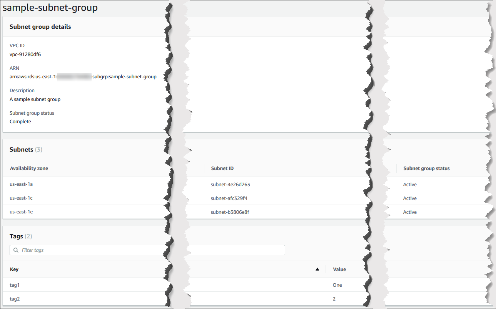

# Describing an Amazon DocumentDB subnet group

You can use the AWS Management Console or the AWS CLI to get the details of an Amazon DocumentDB subnet group.

Using the AWS Management Console
The following procedure shows you how to get the details of an Amazon DocumentDB subnet group.

###### To find the details of a subnet group

1. Sign in to the AWS Management Console, and open the Amazon DocumentDB console at [https://console.aws.amazon.com/docdb](https://console.aws.amazon.com/docdb "https://console.aws.amazon.com/docdb").
2. In the navigation pane, choose **Subnet groups**.

###### Tip

If you don't see the navigation pane on the left side of your screen, choose the menu icon
()
in the upper-left corner of the page. 3. To see the details of a subnet group, choose the name of that subnet group.



Using the AWS CLI
To find the details of an Amazon DocumentDB subnet group, use the `describe-db-subnet-groups` operation with the following parameter.

###### Parameter

- `--db-subnet=group-name`—Optional. If included, details for the named subnet group are listed. If omitted, details for up
  to 100 subnet groups are listed.

The following code lists details for the `sample-subnet-group` subnet group that we created in the [Creating an Amazon DocumentDB subnet group](document-db-subnet-group-create.md "document-db-subnet-group-create.md") section.

For Linux, macOS, or Unix:

```
aws docdb describe-db-subnet-groups \
    --db-subnet-group-name `sample-subnet-group`
```

For Windows:

```
aws docdb describe-db-subnet-groups ^
    --db-subnet-group-name `sample-subnet-group`
```

Output from this operation looks something like the following (JSON format).

```
{
    "DBSubnetGroup": {
        "DBSubnetGroupArn": "arn:aws:rds:us-east-1:123SAMPLE012:subgrp:sample-subnet-group",
        "VpcId": "vpc-91280df6",
        "SubnetGroupStatus": "Complete",
        "DBSubnetGroupName": "sample-subnet-group",
        "Subnets": [
            {
                "SubnetAvailabilityZone": {
                    "Name": "us-east-1a"
                },
                "SubnetStatus": "Active",
                "SubnetIdentifier": "subnet-4e26d263"
            },
            {
                "SubnetAvailabilityZone": {
                    "Name": "us-east-1c"
                },
                "SubnetStatus": "Active",
                "SubnetIdentifier": "subnet-afc329f4"
            },
            {
                "SubnetAvailabilityZone": {
                    "Name": "us-east-1e"
                },
                "SubnetStatus": "Active",
                "SubnetIdentifier": "subnet-b3806e8f"
            }
        ],
        "DBSubnetGroupDescription": "A sample subnet group"
    }
}
```
