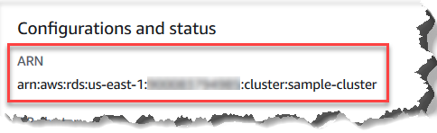

# Understanding Amazon DocumentDB Amazon Resource Names (ARNs)

Resources that you create in AWS are each uniquely identified with an Amazon Resource Name (ARN). For certain Amazon DocumentDB (with MongoDB compatibility) operations, you must
uniquely identify an Amazon DocumentDB resource by specifying its ARN. For example, when you add a tag to a resource, you must provide the resource's ARN.

###### Topics

- [Constructing an ARN](#documentdb-arns-constructing "#documentdb-arns-constructing")
- [Finding an ARN](#documentdb-arns-find "#documentdb-arns-find")

## Constructing an ARN for an Amazon DocumentDB resource

You can construct an ARN for an Amazon DocumentDB resource using the following syntax. Amazon DocumentDB
shares the format of Amazon Relational Database Service (Amazon RDS) ARNs. Amazon DocumentDB ARNs
contain `rds` and not `docdb`.

`arn:aws:rds:`region`:`account_number`:`resource_type`:`resource_id``

| Region Name               | Region           | Availability Zones (compute) |
| ------------------------- | ---------------- | ---------------------------- |
| US East (Ohio)            | `us-east-2`      | 3                            |
| US East (N. Virginia)     | `us-east-1`      | 6                            |
| US West (Oregon)          | `us-west-2`      | 4                            |
| Africa (Cape Town)        | `af-south-1`     | 3                            |
| South America (São Paulo) | `sa-east-1`      | 3                            |
| Asia Pacific (Hong Kong)  | `ap-east-1`      | 3                            |
| Asia Pacific (Hyderabad)  | `ap-south-2`     | 3                            |
| Asia Pacific (Malaysia)   | `ap-southeast-5` | 3                            |
| Asia Pacific (Mumbai)     | `ap-south-1`     | 3                            |
| Asia Pacific (Osaka)      | `ap-northeast-3` | 3                            |
| Asia Pacific (Seoul)      | `ap-northeast-2` | 4                            |
| Asia Pacific (Singapore)  | `ap-southeast-1` | 3                            |
| Asia Pacific (Sydney)     | `ap-southeast-2` | 3                            |
| Asia Pacific (Jakarta)    | `ap-southeast-3` | 3                            |
| Asia Pacific (Thailand)   | `ap-southeast-7` | 3                            |
| Asia Pacific (Tokyo)      | `ap-northeast-1` | 3                            |
| Canada (Central)          | `ca-central-1`   | 3                            |
| China (Beijing) Region    | `cn-north-1`     | 3                            |
| China (Ningxia)           | `cn-northwest-1` | 3                            |
| Europe (Frankfurt)        | `eu-central-1`   | 3                            |
| Europe (Ireland)          | `eu-west-1`      | 3                            |
| Europe (London)           | `eu-west-2`      | 3                            |
| Europe (Milan)            | `eu-south-1`     | 3                            |
| Europe (Paris)            | `eu-west-3`      | 3                            |
| Europe (Spain)            | `eu-south-2`     | 3                            |
| Europe (Stockholm)        | `eu-north-1`     | 3                            |
| Mexico (Central)          | `mx-central-1`   | 3                            |
| Middle East (UAE)         | `me-central-1`   | 3                            |
| Israel (Tel Aviv)         | `il-central-1`   | 3                            |
| AWS GovCloud (US-West)    | `us-gov-west-1`  | 3                            |
| AWS GovCloud (US-East)    | `us-gov-east-1`  | 3                            |

###### Note

The Amazon DocumentDB architecture separates storage and compute. For the storage layer, Amazon DocumentDB replicates six copies of your data across three AWS Availability Zones (AZs). The AZs listed in the table above are the number of AZs that you can use in a given region to provision compute instances. As an example, if you are launching an Amazon DocumentDB cluster in ap-northeast-1, your storage will be replicated six ways across three AZs but your compute
instances will only be available in two AZs.

The following table shows the format that you should use when constructing an ARN for a particular Amazon DocumentDB resource. Amazon DocumentDB shares the format of
Amazon RDS ARNs. Amazon DocumentDB ARNs contain `rds` and not `docdb`.

| Resource Type                          | ARN Format / Example                                                                                                                                                     |
| -------------------------------------- | ------------------------------------------------------------------------------------------------------------------------------------------------------------------------ |
| Instance (`db`)                        | `arn:aws:rds:`region`:`account_number`:db:`resource_id``<br>```<br>arn:aws:rds:us-east-1:`1234567890`:db:`sample-db-instance`<br>```                                     |
| Cluster (`cluster`)                    | `arn:aws:rds:`region`:`account_number`:cluster:`resource_id``<br>```<br>arn:aws:rds:us-east-1:`1234567890`:cluster:`sample-db-cluster`<br>```                            |
| Cluster parameter group (`cluster-pg`) | `arn:aws:rds:`region`:`account_number`:cluster-pg:`resource_id``<br>```<br>arn:aws:rds:us-east-1:`1234567890`:cluster-pg:`sample-db-cluster-parameter-group`<br>```      |
| Security group (`secgrp`)              | `arn:aws:rds:`region`:`account_number`:secgrp:`resource_id``<br>```<br>arn:aws:rds:us-east-1:`1234567890`:secgrp:`sample-public-secgrp`<br>```                           |
| Cluster snapshot (`cluster-snapshot`)  | `arn:aws:rds:`region`:`account_number`:cluster-snapshot:`resource_id``<br>```<br>arn:aws:rds:us-east-1:`1234567890`:cluster-snapshot:`sample-db-cluster-snapshot`<br>``` |
| Subnet group (`subgrp`)                | `arn:aws:rds:`region`:`account_number`:subgrp:`resource_id``<br>```<br>arn:aws:rds:us-east-1:`1234567890`:subgrp:`sample-subnet-10`<br>```                               |

## Finding an Amazon DocumentDB resource ARN

You can find the ARN of an Amazon DocumentDB resource using the AWS Management Console or the AWS CLI.

Using the AWS Management Console
To find an ARN using the console, navigate to the resource that you want an ARN for, and view the details for that resource.

For example, you can get the ARN for a cluster by selecting the
**Configuration** tab on the cluster details page. The ARN can be
found in the **Configurations and status** section, as shown in the following screenshot.



Using the AWS CLI
To get an ARN using the AWS CLI for a particular Amazon DocumentDB resource, use the `describe` operation for that resource. The following table
shows each AWS CLI operation and the ARN property that is used with the operation to get an ARN.

| AWS CLI Command                        | ARN Property                 |
| -------------------------------------- | ---------------------------- |
| `describe-db-instances`                | `DBInstanceArn`              |
| `describe-db-clusters`                 | `DBClusterArn`               |
| `describe-db-parameter-groups`         | `DBParameterGroupArn`        |
| `describe-db-cluster-parameter-groups` | `DBClusterParameterGroupArn` |
| `describe-db-security-groups`          | `DBSecurityGroupArn`         |
| `describe-db-snapshots`                | `DBSnapshotArn`              |
| `describe-db-cluster-snapshots`        | `DBClusterSnapshotArn`       |
| `describe-db-subnet-groups`            | `DBSubnetGroupArn`           |

###### Example - Finding the ARN for a cluster

The following AWS CLI operation finds the ARN for the cluster `sample-cluster`.

For Linux, macOS, or Unix:

```
aws docdb describe-db-clusters \
    --db-cluster-identifier sample-cluster \
    --query 'DBClusters[*].DBClusterArn'
```

For Windows:

```
aws docdb describe-db-clusters ^
    --db-cluster-identifier sample-cluster \
    --query 'DBClusters[*].DBClusterArn'
```

Output from this operation looks something like the following (JSON format).

```
[
    "arn:aws:rds:us-east-1:123456789012:cluster:sample-cluster"
]
```

###### Example - Finding ARNs for multiple parameter groups

For Linux, macOS, or Unix:

```
aws docdb describe-db-cluster-parameter-groups \
   --query 'DBClusterParameterGroups[*].DBClusterParameterGroupArn'
```

For Windows:

```
aws docdb describe-db-cluster-parameter-groups ^
   --query 'DBClusterParameterGroups[*].DBClusterParameterGroupArn'
```

Output from this operation looks something like the following (JSON format).

```
[
    "arn:aws:rds:us-east-1:123456789012:cluster-pg:custom3-6-param-grp",
    "arn:aws:rds:us-east-1:123456789012:cluster-pg:default.aurora5.6",
    "arn:aws:rds:us-east-1:123456789012:cluster-pg:default.docdb3.6"
]
```
