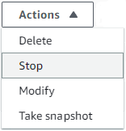
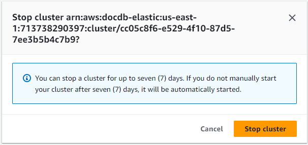
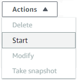
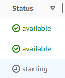

# Stopping and starting an

Amazon DocumentDB elastic cluster

Stopping and starting Amazon DocumentDB elastic clusters can help you manage costs
for development and test environments. Instead of creating and
deleting elastic clusters each time you use Amazon DocumentDB, you can
temporarily stop your cluster when it isn't needed.
You can then start it again when you resume your testing.

###### Topics

- [Overview of
  stopping and starting an elastic cluster](#elastic-cluster-stop-start-overview "#elastic-cluster-stop-start-overview")
- [Operations you can
  perform on a stopped elastic cluster](#elastic-cluster-stopped-operations "#elastic-cluster-stopped-operations")

## Overview of

stopping and starting an elastic cluster

During periods where you don't need an Amazon DocumentDB elastic cluster, you can
stop the cluster. You can then start the
cluster again anytime you need to use it. Starting and stopping
simplifies the setup and teardown processes for elastic clusters that are
used for development, testing, or similar activities that don't
require continuous availability. You can stop and start an elastic cluster
using the AWS Management Console or the AWS CLI with a single action.

While your elastic cluster is stopped, the cluster storage volume remains
unchanged. You are charged only for storage, manual snapshots, and
automated backup storage within your specified retention window.
Amazon DocumentDB automatically
starts your elastic cluster after seven days so that it doesn't fall behind
any required maintenance updates. When your cluster starts after
seven days, you will begin to be charged for the use of the elastic
cluster again. While your cluster is stopped, you can't query your
storage volume because querying requires that the cluster is in
the available state.

When an Amazon DocumentDB elastic cluster is stopped, the cluster cannot be modified in any way.
This includes deleting the cluster.

Using the AWS Management Console
The following procedure shows you how to stop an elastic cluster in the available state, or start a stopped
elastic cluster.

###### To stop or start an Amazon DocumentDB elastic cluster

1. Sign in to the AWS Management Console, and open the Amazon DocumentDB console at [https://console.aws.amazon.com/docdb](https://console.aws.amazon.com/docdb "https://console.aws.amazon.com/docdb").
2. In the navigation pane, choose **Clusters**.

###### Tip

If you don't see the navigation pane on the left side of your screen, choose the menu icon
()
in the upper-left corner of the page. 3. In the list of clusters, choose the button to the left
of the name of the cluster that you want to stop or start.

 4. Choose **Actions**, and then choose the
action that you want to perform on the cluster.

    * If you want to stop the cluster and the cluster is
     available:


    	1. Choose **Stop**.


    	
    	2. On the confirmation dialog, confirm that
    	 you want to stop the elastic cluster by choosing
    	 **Stop cluster**, or to keep the
    	 cluster running, choose **Cancel**.


    	
    * If you want to start the cluster, and the cluster
     is stopped, choose **Start**.


    

5. Monitor the status of the elastic cluster. If
   you started the cluster, you can resume using the cluster
   when the cluster is _available_.
   For more information, see [Determining a cluster's status](db-cluster-status.md "db-cluster-status.md").



Using the AWS CLI
The following code examples show you how to stop an elastic cluster in the active or available state, or start a stopped
elastic cluster.

To stop an elastic cluster using
the AWS CLI, use the `stop-cluster` operation. To
start a stopped cluster, use the `start-cluster`
operation. Both operations use the `--cluster-arn`
parameter.

###### Parameter:

- `--cluster-arn`—Required.
  The ARN identifier of the elastic cluster that you want to stop or start.

###### Example— To stop an elastic cluster using the AWS CLI

In the following example, replace each `user input placeholder` with your own information.

The following code stops the elastic cluster with an ARN of `arn:aws:docdb-elastic:us-east-1:477568257630:cluster/b9f1d489-6c3e-4764-bb42-da62ceb7bda2`.

###### Note

The elastic cluster must be in the active or available state.

For Linux, macOS, or Unix:

```
aws docdb-elastic stop-cluster \
   --cluster-arn `arn:aws:docdb-elastic:us-east-1:477568257630:cluster/b9f1d489-6c3e-4764-bb42-da62ceb7bda2`
```

For Windows:

```
aws docdb-elastic stop-cluster ^
   --cluster-arn `arn:aws:docdb-elastic:us-east-1:477568257630:cluster/b9f1d489-6c3e-4764-bb42-da62ceb7bda2`
```

###### Example— To start an elastic cluster using the AWS CLI

In the following example, replace each `user input placeholder` with your own information.

The following code starts the elastic cluster with an ARN of `arn:aws:docdb-elastic:us-east-1:477568257630:cluster/b9f1d489-6c3e-4764-bb42-da62ceb7bda2`.

###### Note

The elastic cluster must currently be stopped.

For Linux, macOS, or Unix:

```
aws docdb-elastic start-cluster \
   --cluster-arn `arn:aws:docdb-elastic:us-east-1:477568257630:cluster/b9f1d489-6c3e-4764-bb42-da62ceb7bda2`
```

For Windows:

```
aws docdb-elastic start-cluster ^
   --cluster-arn `arn:aws:docdb-elastic:us-east-1:477568257630:cluster/b9f1d489-6c3e-4764-bb42-da62ceb7bda2`
```

## Operations you can

perform on a stopped elastic cluster

You can't modify the configuration of an Amazon DocumentDB elastic cluster while the cluster is stopped.
You must start the cluster before performing any such administrative actions.

Amazon DocumentDB applies any scheduled maintenance to your stopped elastic cluster
only after it's started again. After seven days, Amazon DocumentDB automatically
starts a stopped elastic cluster so that it doesn't fall too far behind in
its maintenance status. When the elastic cluster restarts, you will begin
to be charged for the shards in the cluster again.

While an elastic cluster is stopped, Amazon DocumentDB does not perform any automated
backups nor does it extend the backup retention period.
