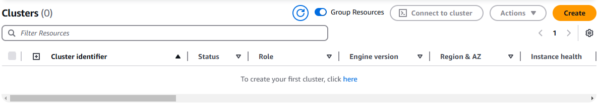
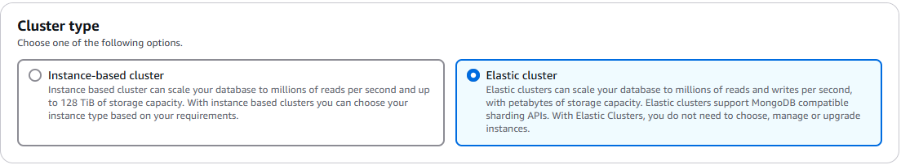
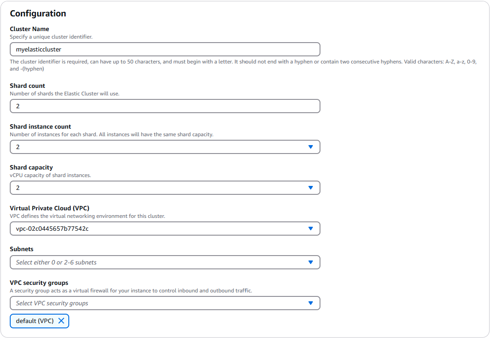
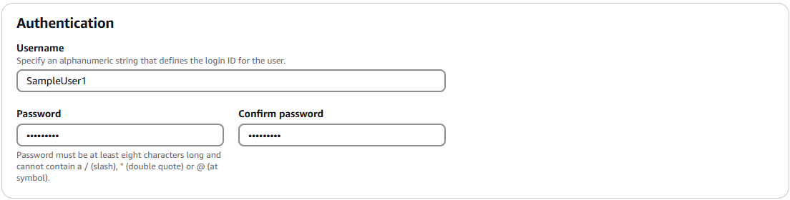
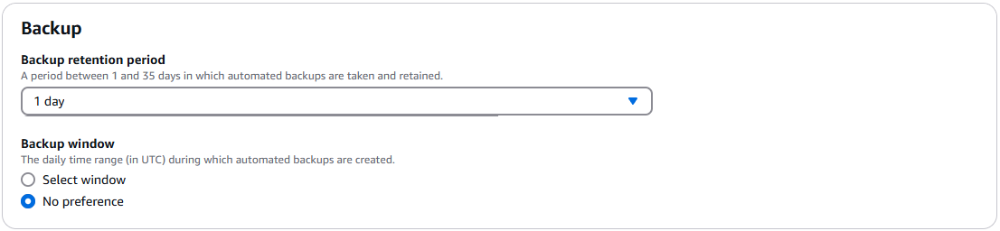
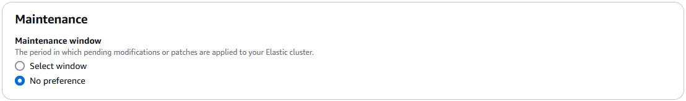
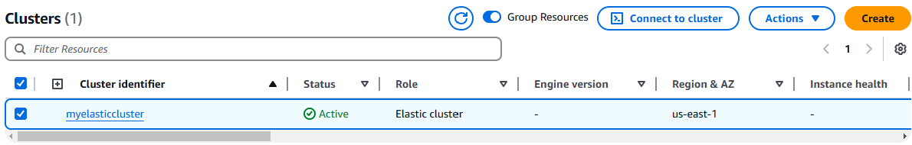
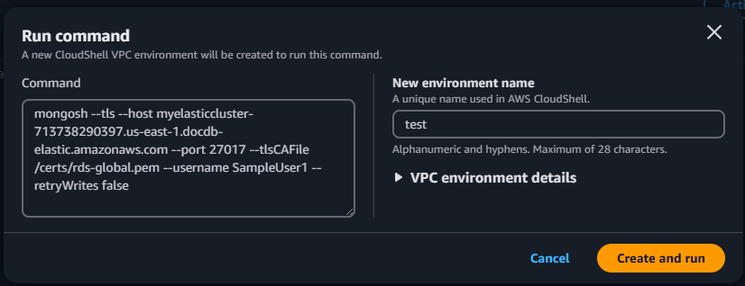
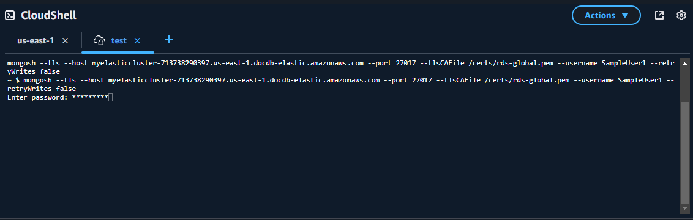

# Get started with Amazon DocumentDB elastic clusters

This getting started section walks you through on how you can create and query your first elastic cluster.

There are many ways to connect and get started with Amazon DocumentDB. The following procedure is the quickest, simplest, and easiest way for users to get started
using our powerful document database. This guide uses [AWS CloudShell](../../../cloudshell/latest/userguide/welcome.md "../../../cloudshell/latest/userguide/welcome.md") to connect and query your Amazon DocumentDB cluster directly from the
AWS Management Console. New customers who are eligible for the AWS Free Tier can use Amazon DocumentDB and CloudShell
for free. If your AWS CloudShell environment or Amazon DocumentDB elastic cluster makes use of resources beyond the
free tier, you are charged the normal AWS rates for those resources. This guide will get
you started with Amazon DocumentDB in less than 5 minutes.

###### Topics

- [Prerequisites](#elastic-clusters-prerequisites "#elastic-clusters-prerequisites")
- [Step 1: Create an elastic cluster](#elastic-get-started-clusters "#elastic-get-started-clusters")
- [Step 2: Connect to your elastic cluster](#ec-gs-connect "#ec-gs-connect")
- [Step 3: Shard your collection, insert and query data](#elastic-get-started-shard "#elastic-get-started-shard")
- [Step 4: Explore](#ec-gs-congrats "#ec-gs-congrats")

## Prerequisites

Before you create your first Amazon DocumentDB cluster, you must do the following:

**Create an Amazon Web Services (AWS) account**

Before you can begin using Amazon DocumentDB, you must have an Amazon Web Services (AWS)
account. The AWS account is free. You pay only for the services and
resources that you use.

If you do not have an AWS account, complete the following steps to create one.

###### To sign up for an AWS account

1. Open [https://portal.aws.amazon.com/billing/signup](https://portal.aws.amazon.com/billing/signup "https://portal.aws.amazon.com/billing/signup").
2. Follow the online instructions.

Part of the sign-up procedure involves receiving a phone call or text message and entering
a verification code on the phone keypad.

When you sign up for an AWS account, an _AWS account root user_ is created. The root user has access to all AWS services
and resources in the account. As a security best practice, assign administrative access to a user, and use only the root user to perform [tasks that require root user access](../../../IAM/latest/UserGuide/id_root-user.md#root-user-tasks "../../../IAM/latest/UserGuide/id_root-user.md#root-user-tasks").

**Set up the needed AWS Identity and Access Management (IAM) permissions.**

Access to manage Amazon DocumentDB resources such as clusters, instances, and
cluster parameter groups requires credentials that AWS can use to
authenticate your requests. For more information, see [Identity and Access Management for Amazon DocumentDB](security-iam.md "security-iam.md").

1. In the search bar of the AWS Management Console, type in IAM and select
   **IAM** in the drop down menu.
2. Once you're in the IAM console, select
   **Users** from the navigation pane.
3. Select your username.
4. Click **Add permissions**.
5. Select **Attach policies
   directly**.
6. Type `AmazonDocDBElasticFullAccess` in the search bar and
   select it once it appears in the search results.
7. Click **Next**.
8. Click **Add permissions**.

###### Note

Your AWS account includes a default VPC in each region.
If you choose to use an Amazon VPC, complete the steps in the [Create a Amazon VPC](../../../vpc/latest/userguide/create-vpc.md "../../../vpc/latest/userguide/create-vpc.md") topic in the _Amazon VPC User Guide_.

## Step 1: Create an elastic cluster

In this section we explain how to create a brand new elastic cluster, using either the AWS Management Console or AWS CLI with the following instructions.

Using the AWS Management Console
To create an elastic cluster configuration using the AWS Management Console:

1. Sign in to the AWS Management Console, and open the Amazon DocumentDB console at [https://console.aws.amazon.com/docdb](https://console.aws.amazon.com/docdb "https://console.aws.amazon.com/docdb").
2. On the **Amazon DocumentDB Management Console**, under **Clusters**, choose **Create**.

 3. On the **Create Amazon DocumentDB cluster** page, in the **Cluster type** section, choose **Elastic cluster**.

 4. In the **Configuration** section, configure the following:

    1. In the **Cluster name** field, enter a unique cluster identifier (following the naming requirements below the field).
    2. In the **Shard count** field, enter the number of shards you want in your cluster.
     The maximum number of shards per cluster is 32.


    ###### Note

    Two nodes will be deployed for each shard. Both nodes will have the same shard capacity.
    3. In the **Shard instance count** field, choose the number of replica instances you want associated with each shard.
     The maximum number of shard instances is 16, in increments of 1. All replica instances have the same shard capacity as defined in the following field.
     For testing purposes, the default value of 2 should suffice.


    ###### Note

    The number of replica instances applies to all shards in the elastic cluster.
     A shard instance count value of 1 means there is one writer instance, and any additional instances are replicas that can be used for reads and to improve availability.
     For testing purposes, the default value of 2 should suffice.
    4. In the **Shard capacity** field, choose the number of virtual CPUs (vCPUs) you want associated with each shard instance.
     The maximum number of vCPUs per shard instance is 64. Allowed values are 2, 4, 8, 16, 32, 64.
     For testing purposes, the default value of 2 should suffice.
    5. In the **Virtual Private Cloud (VPC)** field, choose a VPC from the dropdown list.
    6. For **Subnets** and **VPC security groups**, you can use the defaults or select three subnets of your choice and up to three **VPC security groups** (minimum one).

 5. In the **Authentication** section, enter a string that identifies the login name of the primary user in the **Username** field.

In the **Password** field, enter a unique password that complies with the instructions, then confirm it.

 6. In the **Encryption** section, keep the default setting (**Default Key**).

Optionally, you can enter a AWS KMS key ARN you created. For more information, see [Data encryption at rest for Amazon DocumentDB elastic clusters](elastic-encryption.md "elastic-encryption.md").

###### Important

Encryption must be enabled for elastic clusters. 7. In the **Backup** section, edit the fields according to your backup requirements.
For test purposes, you can retain the default settings.



    1. **Backup retention period**—In the list, choose the number of days to keep automatic backups of this
     cluster before deleting them.
    2. **Backup window**—Set the daily time and duration during which Amazon DocumentDB is to make backups of this
     cluster.


    	1. Choose **Select window** if you want to configure the time and duration when backups are created.


    	**Start time**—In the first list, choose the start time hour (UTC) for starting your automatic
    	 backups. In the second list, choose the minute of the hour that you want automatic backups to begin.


    	**Duration**—In the list, choose the number of hours to be allocated to creating automatic
    	 backups.
    	2. Choose **No preference** if you want Amazon DocumentDB to choose the time and duration when backups are created.

8. In the **Maintenance** section, choose the day, time, and duration when modifications or patches are applied to your cluster.
   For test purposes, you can retain the default settings.

 9. Choose **Create cluster**.

The elastic cluster is now provisioning. This can take up to a few minutes to finish.
You can connect to your cluster when the elastic cluster status shows as **Available** in the **Clusters** list.

Using the AWS CLI
To create an elastic cluster using the AWS CLI, use the `create-cluster` operation with the following parameters:

- **--cluster-name**—Required. The current name of the elastic scale cluster as entered during creation or last modified.
- **--shard-capacity**—Required. The number of vCPUs assigned to each shard. Maximum is 64.
  Allowed values are 2, 4, 8, 16, 32, 64.
- **--shard-count**—Required. The number of shards assigned to the cluster.
  Maximum is 32.
- **--shard-instance-count**—Optional. The number of replica instances applying to all shards in this cluster.
  Maximum is 16.
- **--admin-user-name**—Required. The username associated with the admin user.
- **--admin-user-password**—Required. The password associated with the admin user.
- **--auth-type**—Required. The authentication type used to determine where to fetch the password used for accessing the elastic cluster.
  Valid types are `PLAIN_TEXT` or `SECRET_ARN`.
- **--vpc-security-group-ids**—Optional. Configure a list of EC2 VPC security groups to associate with this cluster.
- **--preferred-maintenance-window**—Optional. Configure the weekly time range during which system maintenance can occur, in Universal Coordinated Time (UTC).

The format is: `ddd:hh24:mi-ddd:hh24:mi`. Valid days (ddd): Mon, Tue, Wed, Thu, Fri, Sat, Sun

The default is a 30-minute window selected at random from an 8-hour block of time for each Amazon Web Services Region, occurring on a random day of the week.

Minimum 30-minute window.

- **--kms-key-id**—Optional. Configure the KMS key identifier for an encrypted cluster.

The KMS key identifier is the Amazon Resource Name (ARN) for the AWS KMS encryption key.
If you are creating a cluster using the same Amazon Web Services account that owns the KMS encryption key that is used to encrypt the new cluster, you can use the KMS key alias instead of the ARN for the KMS encryption key.

If an encryption key is not specified in KmsKeyId and if the `StorageEncrypted` parameter is true, Amazon DocumentDB uses your default encryption key.

- **--preferred-backup-window**—Optional. The daily preferred time range during which automated backups are created.
  The default is a 30-minute window selected at random from an 8-hour block of time for each AWS Region.
- **--backup-retention-period**—Optional. The number of days for which automated backups are retained.
  The default value is 1.
- **--storage-encrypted**—Optional. Configues whether the cluster is encrypted or not encrypted.

`--no-storage-encrypted` specifies that the cluster is not encrypted.

- **--subnet-ids**—Optional. Configure network subnet Ids.

In the following example, replace each `user input placeholder` with your own information.

###### Note

The following examples include creation of a specific KMS key. To use the default KMS key, do not include the `--kms-key-id` parameter.

For Linux, macOS, or Unix:

```
aws docdb-elastic create-cluster \
     --cluster-name `sample-cluster-123` \
     --shard-capacity `8` \
     --shard-count `4` \
     --shard-instance-count `3` \
     --auth-type `PLAIN_TEXT` \
     --admin-user-name `testadmin` \
     --admin-user-password `testPassword` \
     --vpc-security-group-ids `ec-65f40350` \
     --kms-key-id `arn:aws:docdb-elastic:us-east-1:477568257630:cluster/b9f1d489-6c3e-4764-bb42-da62ceb7bda2` \
     --subnet-ids `subnet-9253c6a3, subnet-9f1b5af9` \
     --preferred-backup-window `18:00-18:30` \
     --backup-retention-period `7`
```

For Windows:

```
aws docdb-elastic create-cluster ^
     --cluster-name `sample-cluster-123` ^
     --shard-capacity `8` ^
     --shard-count `4` ^
     --shard-instance-count `3` ^
     --auth-type `PLAIN_TEXT` ^
     --admin-user-name `testadmin` ^
     --admin-user-password `testPassword` ^
     --vpc-security-group-ids `ec-65f40350` ^
     --kms-key-id `arn:aws:docdb-elastic:us-east-1:477568257630:cluster/b9f1d489-6c3e-4764-bb42-da62ceb7bda2` ^
     --subnet-ids `subnet-9253c6a3, subnet-9f1b5af9` \
     --preferred-backup-window `18:00-18:30` \
     --backup-retention-period `7`
```

## Step 2: Connect to your elastic cluster

Connect to your Amazon DocumentDB elastic cluster using AWS CloudShell.

1. On the Amazon DocumentDB management console, under **Clusters**, locate the elastic cluster
   you created. Choose your cluster by clicking the check box next to it.

 2. Click **Connect to cluster** (which is next to the **Actions** dropdown menu.
This button is enabled only after you have clicked the checkbox next to your cluster, and the status of the cluster shows as **Available**.
The CloudShell **Run command** screen appears. 3. In the **New environment name** field, enter a unique name, such as "test" and click **Create and run**.
VPC environment details are automatically configured for your Amazon DocumentDB database.

 4. When prompted, enter the password you created in Step 1: Create an Amazon DocumentDB elastic cluster (sub-step 5).



After you enter your password and your prompt becomes `direct: mongos] <env-name>>`, you are successfully connected to your Amazon DocumentDB cluster

###### Note

For information about troubleshooting, see [Troubleshooting Amazon DocumentDB](troubleshooting.md "troubleshooting.md").

## Step 3: Shard your collection, insert and query data

Elastic clusters add support for sharding in Amazon DocumentDB.
Now that you are connected to your cluster, you can shard the cluster, insert data and run a few queries.

1. To shard a collection, enter the following:

```
sh.shardCollection("db.Employee1" , { "Employeeid" : "hashed" })
```

2. To insert a single document, enter the following:

```
db.Employee1.insertOne({"Employeeid":1, "Name":"Joe", "LastName": "Bruin", "level": 1 })
```

The following output is displayed:

```
WriteResult({ "nInserted" : 1 })
```

3. To read the document that you wrote, enter the `findOne()` command (it returns a single document):

```
db.Employee1.findOne()
```

The following output is displayed:

```
{
"_id" : ObjectId("61f344e0594fe1a1685a8151"),
"EmployeeID" : 1,
"Name" : "Joe",
"LastName" : "Bruin",
"level" : 1
}
```

4. To perform a few more queries, consider a gaming profile use case.
   First, insert a few entries into a collection titled "Employee". Enter the following:

```
db.profiles.insertMany([ { "_id": 1, "name": "Matt", "status": "active", "level": 12, "score": 202 },
     { "_id": 2, "name": "Frank", "status": "inactive", "level": 2, "score": 9 },
     { "_id": 3, "name": "Karen", "status": "active", "level": 7, "score": 87 },
     { "_id": 4, "name": "Katie", "status": "active", "level": 3, "score": 27 }
])
```

The following output is displayed:

```
{ acknowledged: true,
     insertedIds: {
        '0': ObjectId('679d02cd6b5a0581be78bcbd'),
        '1': ObjectId('679d02cd6b5a0581be78bcbe'),
        '2': ObjectId('679d02cd6b5a0581be78bcbf'),
        '3': ObjectId('679d02cd6b5a0581be78bcc0')
    }
}
```

5. To return all the documents in the profiles collection, enter the `find`() command:

```
db.Employee.find()
```

The data you entered in step 4 is displayed. 6. To query a single document, include a filter (for example: "Katie"). Enter the following:

```
db.Employee.find({name: "Katie"})
```

The following output is displayed:

```
[

   {

     _id: ObjectId('679d02cd6b5a0581be78bcc0'),

     Employeeid: 4,

     name: 'Katie',

     lastname: 'Schaper',

     level: 3

   }

]
```

7. To find a profile and modify it, enter the `findAndModify` command. In this example, the employee "Matt" is given a higher level of "14":

```
db.Employee.findAndModify({
    query: { "Employeeid" : 1, "name" : "Matt"},
    update: { "Employeeid" : 1, "name" : "Matt", "lastname" : "Winkle", "level" : 14 }
})
```

The following output is displayed (note that the level has not changed yet):

```
{

   _id: ObjectId('679d02cd6b5a0581be78bcbd'),

   Employeeid: 1,

   name: 'Matt',

   lastname: 'Winkle',

   level: 12

}
```

8. To verify the level increase, enter the following query:

```
db.Employee.find({name: "Matt"})
```

The following output is displayed:

```
[
   {

   _id: ObjectId('679d02cd6b5a0581be78bcbd'),

   Employeeid: 1,

   name: 'Matt',

   lastname: 'Winkle',

   level: 14

   }
]
```

## Step 4: Explore

Congratulations! You have successfully completed the Get started procedure for
Amazon DocumentDB elastic clusters.

What’s next? Learn how to fully leverage this database with some of its popular
features:

- [Amazon DocumentDB elastic cluster best practices](elastic-best-practices.md "elastic-best-practices.md")
- [Managing Amazon DocumentDB elastic clusters](elastic-managing.md "elastic-managing.md")

###### Note

The elastic cluster you created from this get started procedure will continue to accrue
costs unless you delete it. For directions, see [Deleting an elastic cluster](elastic-managing.md#elastic-delete "elastic-managing.md#elastic-delete").
