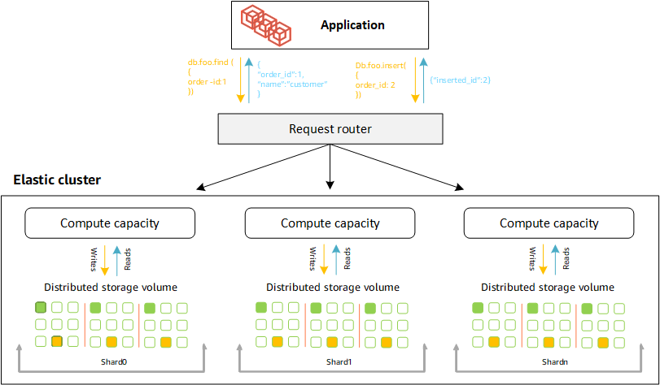
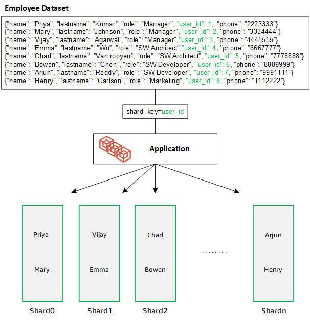
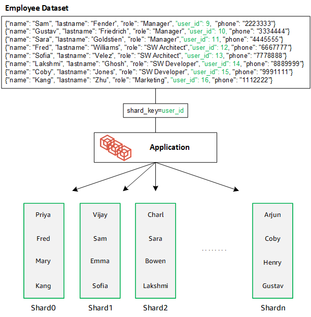
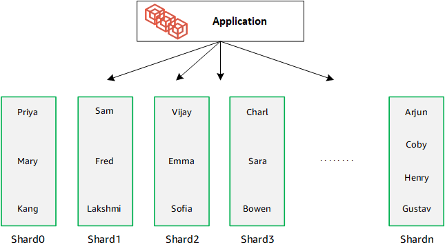

# Amazon DocumentDB elastic clusters: how it works

The topics in this section provide information about the mechanisms and functions that power Amazon DocumentDB elastic clusters.

###### Topics

- [Amazon DocumentDB elastic cluster sharding](#elastic-how-it-works.sharding "#elastic-how-it-works.sharding")
- [Elastic cluster migration](#elastic-how-it-works-migration "#elastic-how-it-works-migration")
- [Elastic cluster scaling](#elastic-how-it-works-scaling "#elastic-how-it-works-scaling")
- [Elastic cluster reliability](#elastic-reliability "#elastic-reliability")
- [Elastic cluster storage and availability](#how-it-works-storage "#how-it-works-storage")
- [Functional differences between Amazon DocumentDB 4.0 and elastic clusters](#elastic-functional-differences "#elastic-functional-differences")

## Amazon DocumentDB elastic cluster sharding

Amazon DocumentDB elastic clusters use hash-based sharding to partition data across a distributed
storage system.
Sharding, also known as partitioning, splits large data sets into small data sets across multiple nodes enabling you to scale out your database beyond vertical scaling limits.
Elastic clusters use the separation, or “decoupling,” of compute and storage in Amazon DocumentDB, enabling you to scale independently of each other.
Rather than re-partitioning collections by moving small chunks of data between compute nodes, elastic clusters copy data efficiently within the distributed storage system.



### Shard definitions

Definitions of shard nomenclature:

- **Shard** — A shard provides compute for
  an elastic cluster. It will have a single writer instance and 0–15 read
  replicas. By default, a shard will have two instances: a writer and a single read replica.
  You can configure a maximum of 32 shards and each shard instance can have a maximum of 64 vCPUs.
- **Shard key** — A shard key is a required field in your JSON documents in sharded collections that elastic clusters use to distribute read and write traffic to the matching shard.
- **Sharded collection** — A sharded collection is a collection whose data is distributed across an elastic cluster in data partitions.
- **Partition** — A partition is a logical portion of sharded data.
  When you create a sharded collection, the data is organized into partitions within each shard automatically based on the shard key.
  Each shard has multiple partitions.

### Distributing data across configured shards

Create a shard key that has many unique values.
A good shard key will evenly partition your data across the underlying shards, giving your workload the best throughput and performance.
The following example is employee name data that uses a shard key named "user_id":



DocumentDB uses hash sharding to partition your data across underlying shards.
Additonal data is inserted and distributed the same way:



When you scale out your database by adding additional shards, Amazon DocumentDB automatically redistributes the data:



## Elastic cluster migration

Amazon DocumentDB supports migrating MongoDB sharded data to elastic clusters.
Offline, online, and hybrid migration methods are supported.
For more information, see [Migrating to Amazon DocumentDB](docdb-migration.md "docdb-migration.md").

## Elastic cluster scaling

Amazon DocumentDB elastic clusters provide the ability to increase the number of shards (scale out) in your elastic cluster, and the number of vCPUs applied to each shard (scale up).
You can also reduce the number of shards and compute capacity (vCPUs) as needed.

For scaling best practices, see [Scaling elastic clusters](elastic-best-practices.md#scaling "elastic-best-practices.md#scaling").

###### Note

Cluster-level scaling is also available. For more information, see [Scaling Amazon DocumentDB
clusters](db-cluster-manage-performance.md "db-cluster-manage-performance.md").

## Elastic cluster reliability

Amazon DocumentDB is designed to be reliable, durable, and fault-tolerant.
To improve availability, elastic clusters deploy two nodes per shard placed across different Availability Zones.
Amazon DocumentDB includes several automatic features that make it a reliable database solution. For more information, see [Amazon DocumentDB reliability](how-it-works.md#how-it-works.reliability "how-it-works.md#how-it-works.reliability").

## Elastic cluster storage and availability

Amazon DocumentDB data is stored in a cluster volume, which is a single, virtual volume that uses solid state drives (SSDs).
A cluster volume consists of six copies of your data, which are replicated automatically across multiple Availability Zones in a single AWS Region.
This replication helps ensure that your data is highly durable, with less possibility of data loss.
It also helps ensure that your cluster is more available during a failover because copies of your data already exist in other Availability Zones.
For more details on storage, high availability, and replication see [Amazon DocumentDB: how it works](how-it-works.md "how-it-works.md").

## Functional differences between Amazon DocumentDB 4.0 and elastic clusters

The following functional differences exist between Amazon DocumentDB 4.0 and elastic clusters.

- Results from `top` and `collStats` are partitioned by shards.
  For sharded collections, data is distributed among multiple partitions and `collStats` reports aggregated `collScans` from the partitions.
- Collection statistics from `top` and `collStats` for sharded collections are reset when the cluster shard count is changed.
- The backup built-in role now supports `serverStatus`. Action - Developers and applications with backup role can collect statistics about the state of the Amazon DocumentDB cluster.
- The `SecondaryDelaySecs` field replaces `slaveDelay` in `replSetGetConfig` output.
- The `hello` command replaces `isMaster` - `hello` returns a document that describes the role of the elastic cluster.
- The `$elemMatch` operator in elastic clusters only matches documents in the first nesting level of an array.
  In Amazon DocumentDB 4.0, the operator traverses all levels before returning matched documents.
  For example:

```

db.foo.insert(
[
    {a: {b: 5}},
    {a: {b: [5]}},
    {a: {b: [3, 7]}},
    {a: [{b: 5}]},
    {a: [{b: 3}, {b: 7}]},
    {a: [{b: [5]}]},
    {a: [{b: [3, 7]}]},
    {a: [[{b: 5}]]},
    {a: [[{b: 3}, {b: 7}]]},
    {a: [[{b: [5]}]]},
    {a: [[{b: [3, 7]}]]}
]);
// Elastic clusters
> db.foo.find({a: {$elemMatch: {b: {$elemMatch: {$lt: 6, $gt: 4}}}}}, {_id: 0})
{ "a" : [ { "b" : [ 5 ] } ] }

// Docdb 4.0: traverse more than one level deep
> db.foo.find({a: {$elemMatch: {b: {$elemMatch: {$lt: 6, $gt: 4}}}}}, {_id: 0})
{ "a" : [ { "b" : [ 5 ] } ] }
{ "a" : [ [ { "b" : [ 5 ] } ] ] }

```

- The "$" projection in Amazon DocumentDB 4.0 returns all documents with all fields. 
 With elastic clusters, the `find` command with a "$" projection returns documents that match the query parameter containing only the field that matched the "$" projection.
- In elastic clusters, the `find` commands with `$regex` and `$options` query parameters return an error:
  "Cannot set options in both $regex and $options."

- With elastic clusters, `$indexOfCP` now returns "-1" when:

      + the substring is not found in the `string expression`, or
      + `start` is a number greater than `end`, or
      + `start` is a number greater than the byte length of the string.

  In Amazon DocumentDB 4.0, `$indexOfCP` returns "0" when the `start` position is a number greater than `end` or the byte length of the string.

- With elastic clusters, projection operations in `_id fields`,
  e.g., `{"_id.nestedField" : 1}`, return documents that only include the projected field.
  Meanwhile, in Amazon DocumentDB 4.0, nested field projection commands do not filter out any document.
