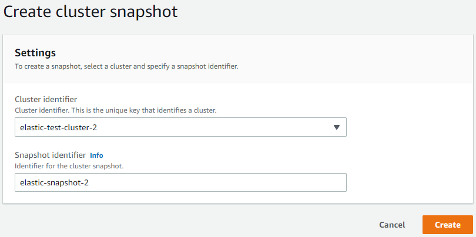
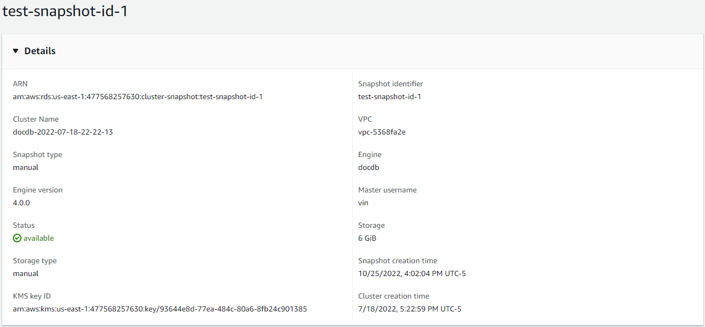
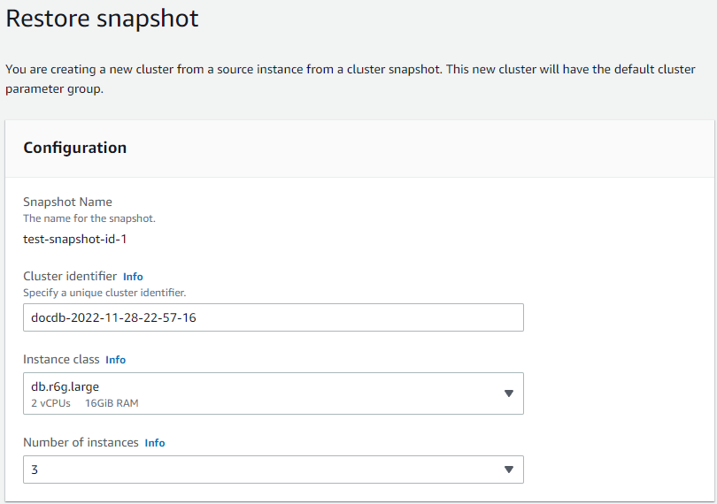
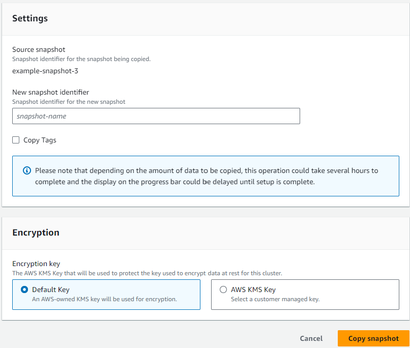
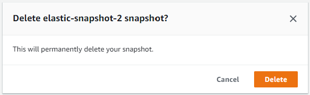
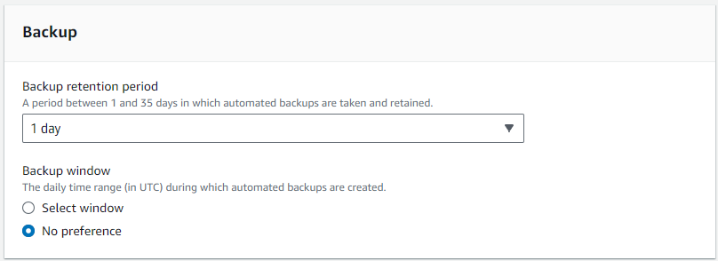

# Managing elastic cluster snapshots

Manual snapshots can be taken after an elastic cluster has been created. Automated backups are created the moment the elastic cluster snapshot is created.

###### Note

Your elastic cluster must be in the `Available` state for a manual snapshot to be taken.

This section explains how you can create, view, restore from, and delete elastic cluster snapshots.

The following topics show how to perform various tasks when working with Amazon DocumentDB elastic cluster snapshots.

###### Topics

- [Creating a manual elastic cluster snapshot](#elastic-create-snapshot "#elastic-create-snapshot")
- [Viewing an elastic cluster snapshot](#elastic-view-snapshot "#elastic-view-snapshot")
- [Restoring an elastic cluster from a snapshot](#elastic-restore-snapshot "#elastic-restore-snapshot")
- [Copying an elastic cluster snapshot](#elastic-copy-snapshot "#elastic-copy-snapshot")
- [Deleting an elastic cluster snapshot](#elastic-delete-snapshot "#elastic-delete-snapshot")
- [Managing an elastic cluster snapshot automatic backup](#elastic-auto-snapshot "#elastic-auto-snapshot")

## Creating a manual elastic cluster snapshot

In this section we explain how to create a manual elastic cluster snapshot, using either the AWS Management Console or AWS CLI with the following instructions.

Using the AWS Management Console
To create a manual elastic cluster snapshot using the AWS Management Console:

1. Sign into the [AWS Management Console](https://console.aws.amazon.com/docdb/home?region=us-east-1 "https://console.aws.amazon.com/docdb/home?region=us-east-1") and open the Amazon DocumentDB console.
2. In the navigation pane, choose **Snapshots**.

###### Tip

If you don't see the navigation pane on the left side of your screen, choose the menu icon in the upper-left corner of the navigation pane. 3. On the **Snapshots** page, choose **Create**. 4. On the **Create cluster snapshot** page, in the **Cluster identifier** field, choose your elastic cluster from the drop down list.

In the **Snapshot identifier** field, enter a unique identifier for your elastic cluster.

Choose **Create**.



###### Note

Alternatively, you can access the **Create cluster snapshot** dialog by going to the **Clusters** page, checking the box next to your cluster, then choosing **Actions**, then **Take snapshot**.

Your elastic cluster snapshot is now provisioning. This can take up to a few minutes to finish.
You can view and restore from your snapshot when the status shows as `Available` in the **Snapshots** list.

Using the AWS CLI
To create a manual elastic cluster snapshot using the AWS CLI, use the `create-cluster-snapshot` operation with the following parameters:

- `--snapshot-name`—Required. The name of the cluster snapshot you want to create.
- `--cluster-arn`—Required. The ARN identifier of the cluster of which you want to create a snapshot.

In the following example, replace each `user input placeholder` with your own information.

For Linux, macOS, or Unix:

```
aws docdb-elastic create-cluster-snapshot \
    --snapshot-name `sample-snapshot-1` \
    --cluster-arn `arn:aws:docdb:us-west-2:123456789012:sharded-cluster:sample-cluster`
```

For Windows:

```
aws docdb-elastic create-cluster-snapshot ^
    --snapshot-name `sample-snapshot-1` ^
    --cluster-arn `arn:aws:docdb:us-west-2:123456789012:sharded-cluster:sample-cluster`
```

## Viewing an elastic cluster snapshot

In this section we explain how to view elastic cluster snapshot information, using either the AWS Management Console or AWS CLI with the following instructions.

Using the AWS Management Console
To view information about a specific elastic cluster snapshot using the AWS Management Console:

1. Sign into the [AWS Management Console](https://console.aws.amazon.com/docdb/home?region=us-east-1 "https://console.aws.amazon.com/docdb/home?region=us-east-1") and open the Amazon DocumentDB console.
2. In the navigation pane, choose **Snapshots**.

###### Tip

If you don't see the navigation pane on the left side of your screen, choose the menu icon in the upper-left corner of the navigation pane. 3. On the **Snapshots** page, choose your snapshot from the list by clicking on the name in **Snapshot identifier** column. 4. View your snapshot's information in **Details**.



Using the AWS CLI
To view information about a specific elastic cluster snapshot using the AWS CLI, use the `get-cluster-snapshot` operation with the following parameters:

- `--snapshot-arn`—Required. The ARN identifier of the snapshot for which you want information.

In the following example, replace each `user input placeholder` with your own information.

For Linux, macOS, or Unix:

```
aws docdb-elastic get-cluster-snapshot \
    --snapshot-arn `sampleResourceName`
```

For Windows:

```
aws docdb-elastic get-cluster-snapshot ^
    --snapshot-arn `sampleResourceName`
```

To view information about a specific elastic cluster snapshot using the AWS CLI, use the `get-cluster-snapshot` operation with the following parameters:

- `--snapshot-arn`—Required. The ARN identifier of the snapshot for which you want information.

In the following example, replace each `user input placeholder` with your own information.

For Linux, macOS, or Unix:

```
aws docdb-elastic get-cluster-snapshot \
    --snapshot-arn `sampleResourceName`

```

For Windows:

```
aws docdb-elastic get-cluster-snapshot ^
    --snapshot-arn `sampleResourceName`

```

To view information about all elastic cluster snapshots using the AWS CLI, use the `list-cluster-snapshots` operation with the following parameters:

- `--snapshot-type`—Optional. The type of cluster snapshots to be returned.
  You can specify one of the following values:
  - `automated` - Return all cluster snapshots that Amazon DocumentDB has automatically created for your AWS account.
  - `manual` - Return all cluster snapshots that you have manually created for your AWS account.
  - `shared` - Return all manual cluster snapshots that have been shared to your AWS account.
  - `public` - Return all cluster snapshots that have been marked as public.

- `--next-token`—Optional. An optional pagination token provided by a previous request.
  If this parameter is specified, the response includes only records beyond the this token, up to the value specified by `max-results`.
- `--max-results`—Optional. The maximum number of results to include in the response.
  If more results exist than the specified `max-results` value, a pagination token (`next-token`) is included in the response so that the remaining results can be retrieved.
  - Default: 100
  - Minimum 20, maximum 100

In the following example, replace each `user input placeholder` with your own information.

For Linux, macOS, or Unix:

```
aws docdb-elastic list-cluster-snapshots \
    --snapshot-type  `value` \
    --next-token  `value` \
    --max-results `50`
```

For Windows:

```
aws docdb-elastic list-cluster-snapshots ^
    --snapshot-type  `value` ^
    --next-token  `value` ^
    --max-results `50`
```

## Restoring an elastic cluster from a snapshot

In this section we explain how to restore an elastic cluster from a snapshot, using either the AWS Management Console or AWS CLI with the following instructions.

Using the AWS Management Console
To restore an elastic cluster from a snapshot using the AWS Management Console:

1. Sign into the [AWS Management Console](https://console.aws.amazon.com/docdb/home?region=us-east-1 "https://console.aws.amazon.com/docdb/home?region=us-east-1") and open the Amazon DocumentDB console.
2. In the navigation pane, choose **Snapshots**.

###### Tip

If you don't see the navigation pane on the left side of your screen, choose the menu icon in the upper-left corner of the navigation pane. 3. Choose the button to the left of the snapshot, that you want to use to restore a cluster, in the **Snapshot identifier** column. 4. Choose **Actions**, then **Restore**.

 5. On the **Restore snapshot** page, enter a name for the new cluster in the **Cluster identifier** field.

###### Note

For any manual snapshot restoration, you must create a new cluster. 6. In the **Virtual Private Cloud (VPC)** field, choose a VPC from the drop-down list. 7. For **Subnets** and **VPC security groups**, you can use the defaults or select three subnets of your choice and upto three VPC security groups (minimum one). 8. If you are satisfied with the cluster configuration, choose **Restore cluster** and wait while your cluster is restored.

Using the AWS CLI
To restore an elastic cluster from a snapshot using the AWS CLI, use the `restore-cluster-from-snapshot` operation with the following parameters:

- `--cluster-name`—Required. The current name of the elastic cluster as entered during creation or last modified.
- `--snapshot-arn`—Required. The ARN identifier of the snapshot being used to restore the cluster.
- `--vpc-security-group-ids`—Optional. One or more Amazon EC2 and Amazon Virtual Private Cloud (VPC) security groups to associate with the cluster.
- `--kms-key-id`—Optional. Configure the KMS key identifier for an encrypted cluster.

The KMS key identifier is the Amazon Resource Name (ARN) for the AWS KMS encryption key.
If you are creating a cluster using the same Amazon Web Services account that owns the KMS encryption key that is used to encrypt the new cluster, you can use the KMS key alias instead of the ARN for the KMS encryption key.

If an encryption key is not specified in KmsKeyId and if the `StorageEncrypted` parameter is true, Amazon DocumentDB uses your default encryption key.

- `--subnet-ids`—Optional. Network subnet Ids.

In the following example, replace each `user input placeholder` with your own information..

For Linux, macOS, or Unix:

```
aws docdb-elastic restore-cluster-from-snapshot \
     --cluster-name `elastic-sample-cluster` \
     --snapshot-arn `sampleResourceName` \
     --vpc-security-group-ids value `ec-65f40350` \
     --kms-key-id `arn:aws:docdb-elastic:us-east-1:477568257630:cluster/b9f1d489-6c3e-4764-bb42-da62ceb7bda2` \
     --subnet-ids `subnet-9253c6a3, subnet-9f1b5af9`
```

For Windows:

```
aws docdb-elastic restore-cluster-from-snapshot ^
     --cluster-name `elastic-sample-cluster` ^
     --snapshot-arn `sampleResourceName` ^
     --vpc-security-group-ids value `ec-65f40350` ^
     --kms-key-id `arn:aws:docdb-elastic:us-east-1:477568257630:cluster/b9f1d489-6c3e-4764-bb42-da62ceb7bda2` ^
     --subnet-ids `subnet-9253c6a3, subnet-9f1b5af9`
```

## Copying an elastic cluster snapshot

In Amazon DocumentDB, you can copy manual and automatic elastic cluster snapshots within the same region and within the same account.
In this section we explain how to copy an elastic cluster snapshot, using either the AWS Management Console or AWS CLI.

Using the AWS Management Console
To copy an elastic cluster snapshot using the AWS Management Console:

1. Sign into the [AWS Management Console](https://console.aws.amazon.com/docdb/home?region=us-east-1 "https://console.aws.amazon.com/docdb/home?region=us-east-1") and open the Amazon DocumentDB console.
2. In the navigation pane, choose **Snapshots**.

###### Tip

If you don't see the navigation pane on the left side of your screen, choose the menu icon in the upper-left corner of the navigation pane. 3. Choose the button to the left of the snapshot, that you want to copy, in the **Snapshot identifier** column. 4. Choose **Actions**, then **Copy**.

 5. For **New snapshot identifier**, enter the new snapshot's name. 6. For **Copy Tags**, check the box if you want to copy all tags from the source elastic cluster snapshot to the target elastic cluster snapshot. 7. For **Encryption**, choose either a default AWS KMS key or a KMS key of your choosing.
The second option allows you to select an existing KMS key that you already created or allows you to create a new one. 8. Choose **Copy snapshot** when complete.

Using the AWS CLI
To copy an elastic cluster snapshot using the AWS CLI, use the `copy-cluster-snapshot` operation with the following parameters:

- `‐‐source-db-cluster-snapshot-identifier`—Required. The identifier of the existing elastic cluster snapshot being copied.
  The elastic cluster snapshot must exist and be in the available state.

This parameter is not case sensitive.

- `‐‐target-db-cluster-snapshot-identifier`—Required. The identifier of the new elastic cluster snapshot to create from the existing cluster snapshot.
  This parameter is not case sensitive.

Target snapshot name constraints:

    + Cannot be the name of an existing snapshot.
    + Length is [1—63] letters, numbers, or hyphens.
    + First character must be a letter.
    + Cannot end with a hyphen or contain two consecutive hyphens.

In the following example, replace each `user input placeholder` with your own information.

For Linux, macOS, or Unix:

```
aws docdb-elastic copy-cluster-snapshot \
     ‐‐source-cluster-snapshot-arn `<sample ARN>` \
     ‐‐target-cluster-snapshot-name `my-target-copied-snapshot`
```

For Windows:

```
aws docdb-elastic copy-cluster-snapshot ^
     ‐‐source-cluster-snapshot-arn `<sample ARN>` ^
     ‐‐target-cluster-snapshot-name `my-target-copied-snapshot`
```

## Deleting an elastic cluster snapshot

In this section we explain how to delete an elastic cluster snapshot, using either the AWS Management Console or AWS CLI.

Using the AWS Management Console
To restore an elastic cluster from a snapshot using the AWS Management Console:

1. Sign into the [AWS Management Console](https://console.aws.amazon.com/docdb/home?region=us-east-1 "https://console.aws.amazon.com/docdb/home?region=us-east-1") and open the Amazon DocumentDB console.
2. In the navigation pane, choose **Snapshots**.

###### Tip

If you don't see the navigation pane on the left side of your screen, choose the menu icon in the upper-left corner of the navigation pane. 3. Choose the button to the left of the snapshot, that you want to use to restore a cluster, in the **Snapshot identifier** column. 4. Choose **Actions**, then **Delete**.

 5. On the **Delete "snapshot-name" snapshot** dialog, choose **Delete**.

Using the AWS CLI
To delete an elastic cluster snapshot using the AWS CLI, use the `delete-cluster-snapshot` operation with the following parameters:

- `--snapshot-arn`—Required. The ARN identifier of the snapshot being used to restore the cluster.

In the following example, replace each `user input placeholder` with your own information..

For Linux, macOS, or Unix:

```
aws docdb-elastic delete-cluster-snapshot \
     --snapshot-arn `sampleResourceName`
```

For Windows:

```
aws docdb-elastic delete-cluster-snapshot ^
     --snapshot-arn `sampleResourceName`
```

## Managing an elastic cluster snapshot automatic backup

Amazon DocumentDB takes daily snapshots of your elastic clusters.
You can specify the preferred backup window and the backup retention period in a new or existing elastic cluster snapshot configuration.
In this section we explain how to set automatic backup parameters in an elastic cluster snapshot, using either the AWS Management Console or AWS CLI.

Using the AWS Management Console
To set an automatic backup for a new elastic cluster snapshot using the AWS Management Console:

1. Sign into the [AWS Management Console](https://console.aws.amazon.com/docdb/home?region=us-east-1 "https://console.aws.amazon.com/docdb/home?region=us-east-1") and open the Amazon DocumentDB console.
2. In the navigation pane, choose **Clusters**.

###### Tip

If you don't see the navigation pane on the left side of your screen, choose the menu icon in the upper-left corner of the navigation pane. 3. Choose the button to the left of the cluster, that you want to change the backup settings for, in the **Cluster identifier** column. 4. Choose **Actions**, then **Modify**. 5. In the **Backup** section, edit the fields according to your backup requirements.



    1. **Backup retention period**—In the list, choose the number of days to keep automatic backups of this
     cluster before deleting them.
    2. **Backup window**—Set the daily time and duration during which Amazon DocumentDB is to make backups of this
     cluster.


    	1. Choose **Select window** if you want to configure the time and duration when backups are created.


    	**Start time**—In the first list, choose the start time hour (UTC) for starting your automatic
    	 backups. In the second list, choose the minute of the hour that you want automatic backups to begin.


    	**Duration**—In the list, choose the number of hours to be allocated to creating automatic
    	 backups.
    	2. Choose **No preference** if you want Amazon DocumentDB to choose the time and duration when backups are created.

6. Choose **Modify cluster** when complete.

Using the AWS CLI
To set an automatic backup for a new elastic cluster snapshot using the AWS CLI, use the `create-cluster-snapshot` operation with the following parameters:

- `--preferred-backup-window`—Optional. The daily preferred time range during which automated backups are created.
  The default is a 30-minute window selected at random from an 8-hour block of time for each AWS Region.

Constraints:

    + Must be in the format `hh24:mi-hh24:mi`.
    + Must be in Universal Coordinated Time (UTC).
    + Must not conflict with the preferred maintenance window.
    + Must be at least 30 minutes.

- `--backup-retention-period`—Optional. The number of days for which automated backups are retained.
  The default value is 1.

Constraints:

    + Must specify a minimum value of 1.
    + Range is from 1 to 35.

###### Note

Automated backups are only be taken when the cluster is in an ‘active’ state.

###### Note

You can also modify the `preferred-backup-window` and `backup-retention-period` parameters of an existing elastic cluster using the `aws docdb-elastic update-cluster` command.

In the following example, replace each `user input placeholder` with your own information.

The following `create-cluster` example creates the Amazon DocumentDB elastic cluster `sample-cluster` with the retention period for automatic backups of `7` days, and a preferred backup window of `18:00-18:30 UTC`.

For Linux, macOS, or Unix:

```
aws docdb-elastic create-cluster \
     --cluster-name `sample-cluster` \
     --shard-capacity `2` \
     --shard-count `2` \
     --admin-user-name `SampleAdmin` \
     --auth-type PLAIN_TEXT \
     --admin-user-password `SamplePass123!` \
     --preferred-backup-window `18:00-18:30` \
     --backup-retention-period `7`
```

For Windows:

```
aws docdb-elastic create-cluster ^
     --cluster-name `sample-cluster` ^
     --shard-capacity `2` ^
     --shard-count `2` ^
     --admin-user-name `SampleAdmin` ^
     --auth-type PLAIN_TEXT ^
     --admin-user-password `SamplePass123!` ^
     --preferred-backup-window `18:00-18:30` ^
     --backup-retention-period `7`
```
