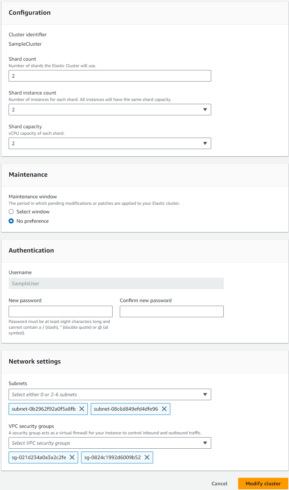
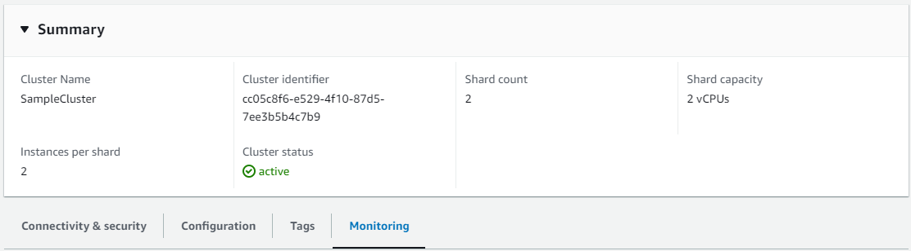
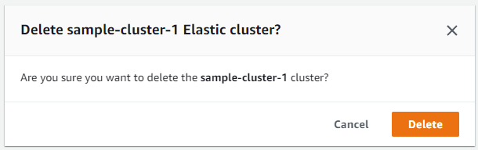

# Managing Amazon DocumentDB elastic clusters

To manage an Amazon DocumentDB elastic cluster, you must have an IAM policy with the appropriate Amazon DocumentDB control plane permissions.
These permissions allow you to create, modify, and delete clusters. The Amazon DocumentDBFullAccess policy provides all the required permissions for administering an Amazon DocumentDB elastic cluster.

The following topics show how to perform various tasks when working with Amazon DocumentDB elastic clusters.

###### Topics

- [Modifying elastic cluster configurations](#elastic-modify "#elastic-modify")
- [Monitoring an elastic cluster](#elastic-monitor "#elastic-monitor")
- [Deleting an elastic cluster](#elastic-delete "#elastic-delete")
- [Managing elastic cluster snapshots](elastic-manage-snapshots.md "elastic-manage-snapshots.md")
- [Stopping and starting an
  Amazon DocumentDB elastic cluster](elastic-cluster-stop-start.md "elastic-cluster-stop-start.md")
- [Maintaining Amazon DocumentDB elastic clusters](elastic-cluster-maintenance.md "elastic-cluster-maintenance.md")

## Modifying elastic cluster configurations

In this section we explain how to modify elastic cluster, using either the AWS Management Console or AWS CLI with the following instructions.

A primary use of modifying the cluster is to scale shards by increasing or decreasing the shard count and/or shard compute capacity.

Using the AWS Management Console
To modify an elastic cluster configuration using the AWS Management Console:

1. Sign into the [AWS Management Console](https://console.aws.amazon.com/docdb/home?region=us-east-1 "https://console.aws.amazon.com/docdb/home?region=us-east-1") and open the Amazon DocumentDB console.
2. In the navigation pane, choose **Clusters**.

###### Tip

If you don't see the navigation pane on the left side of your screen, choose the menu icon in the upper-left corner of the navigation pane. 3. Choose the name of the cluster you want to modify in the **Cluster identifier** column. 4. Choose **Modify**. 5. Edit the fields you want changed and then select **Modify cluster**.



###### Note

Alternatively, you can access the **Modify cluster** dialog by going to the **Clusters** page, checking the box next to your cluster, choosing **Actions**, then **Modify**.

Using the AWS CLI
To modify an elastic cluster configuration using the AWS CLI, use the `update-cluster` operation with the following parameters:

- `--cluster-arn`—Required. The ARN identifier of the cluster that you want to modify.
- `--shard-capacity`—Optional. The number of vCPUs assigned to each shard. Maximum is 64.
  Allowed values are 2, 4, 8, 16, 32, 64.
- `--shard-count`—Optional. The number of shards assigned to the cluster.
  Maximum is 32.
- `--shard-instance`-count—Optional. The number of replica instances applying to all shards in this cluster.
  Maximum is 16.
- `--auth-type`—Optional. The authentication type used to determine where to fetch the password used for accessing the elastic cluster.
  Valid types are `PLAIN_TEXT` or `SECRET_ARN`.
- `--admin-user-password`—Optional. The password associated with the admin user.
- `--vpc-security-group-ids`—Optional. Configure a list of Amazon EC2 and Amazon Virtual Private Cloud (VPC) security groups to associate with this cluster.
- `--preferred-maintenance-window`—Optional. Configure the weekly time range during which system maintenance can occur, in Universal Coordinated Time (UTC)

The format is: `ddd:hh24:mi-ddd:hh24:mi`. Valid days (ddd): Mon, Tue, Wed, Thu, Fri, Sat, Sun

The default is a 30-minute window selected at random from an 8-hour block of time for each Amazon Web Services Region, occurring on a random day of the week.

Minimum 30-minute window.

- `--subnet-ids`—Optional. Configure network subnet Ids.

In the following example, replace each `user input placeholder` with your own information.

For Linux, macOS, or Unix:

```
aws docdb-elastic update-cluster \
    --cluster-arn `arn:aws:docdb-elastic:us-east-1:477568257630:cluster/b9f1d489-6c3e-4764-bb42-da62ceb7bda2` \
    --shard-capacity `8` \
    --shard-count `4` \
    --shard-instance-count `3` \
    --admin-user-password `testPassword` \
    --vpc-security-group-ids `ec-65f40350` \
    --subnet-ids `subnet-9253c6a3, subnet-9f1b5af9`
```

For Windows:

```
aws docdb-elastic update-cluster ^
    --cluster-arn `arn:aws:docdb-elastic:us-east-1:477568257630:cluster/b9f1d489-6c3e-4764-bb42-da62ceb7bda2` ^
    --shard-capacity `8` ^
    --shard-count `4` ^
    --shard-instance-count `3` ^
    --admin-user-password `testPassword` ^
    --vpc-security-group-ids `ec-65f40350` ^
    --subnet-ids `subnet-9253c6a3, subnet-9f1b5af9`
```

To monitor the status of the elastic cluster after your modification, see Monitoring an elastic cluster.

## Monitoring an elastic cluster

In this section, we explain how to monitor your elastic cluster, using either the AWS Management Console or AWS CLI with the following instructions.

Using the AWS Management Console
To monitor an elastic cluster configuration using the AWS Management Console:

1. Sign into the [AWS Management Console](https://console.aws.amazon.com/docdb/home?region=us-east-1 "https://console.aws.amazon.com/docdb/home?region=us-east-1") and open the Amazon DocumentDB console.
2. In the navigation pane, choose **Clusters**.

###### Tip

If you don't see the navigation pane on the left side of your screen, choose the menu icon in the upper-left corner of the navigation pane. 3. Choose the name of the cluster you want to monitor in the **Cluster identifier** column. 4. Choose the **Monitoring** tab.



A number of charts from Amazon CloudWatch are displayed for the following monitoring categories:

- Resource Utilization
- Throughput
- Operations
- System

You can also access Amazon CloudWatch through the AWS Management Console to set up your own monitoring environment for your elastic clusters.

Using the AWS CLI
To monitor a specific elastic cluster configuration using the AWS CLI, use the `get-cluster` operation with the following parameters:

- `--cluster-arn`—Required. The ARN identifier of the cluster for which you want information.

In the following example, replace each `user input placeholder` with your own information.

For Linux, macOS, or Unix:

```
aws docdb-elastic get-cluster \
    --cluster-arn `arn:aws:docdb-elastic:us-west-2:123456789012:cluster:/68ffcdf8-e3af-40a3-91e4-24736f2dacc9`

```

For Windows:

```
aws docdb-elastic get-cluster ^
    --cluster-arn `arn:aws:docdb:-elastic:us-west-2:123456789012:cluster:/68ffcdf8-e3af-40a3-91e4-24736f2dacc9`
```

The output from this operation looks something like the following:

```
"cluster": {
        ...
        "clusterArn": "arn:aws:docdb-elastic:us-west-2:123456789012:cluster:/68ffcdf8-e3af-40a3-91e4-24736f2dacc9",
        "clusterEndpoint": "stretch-11-477568257630.us-east-1.docdb-elastic.amazonaws.com",
        "readerEndpoint": "stretch-11-477568257630-ro.us-east-1.docdb-elastic.amazonaws.com",
        "clusterName": "stretch-11",
        "shardCapacity": 2,
        "shardCount": 3,
        "shardInstanceCount: 5,
        "status": "ACTIVE",
        ...
 }
```

For more information, see `DescribeClusterSnapshot` in the Amazon DocumentDB Resource Management API Reference.

To view the details of all elastic clusters using the AWS CLI, use the `list-clusters` operation with the following parameters:

- `--next-token`—Optional. If the number of items output (`--max-results`) is fewer than the total number of items returned by the underlying API calls, the output includes a `NextToken` that you can pass to a subsequent command to retrieve the next set of items.
- `--max-results`—Optional. The total number of items to return in the command's output.
  If more results exist than the specified `max-results` value, a pagination token (`next-token`) is included in the response so that the remaining results can be retrieved.
  - Default: 100
  - Minimum 20, maximum 100

In the following example, replace each `user input placeholder` with your own information.

For Linux, macOS, or Unix:

```
aws docdb-elastic list-clusters \
    --next-token `eyJNYXJrZXIiOiBudWxsLCAiYm90b190cnVuY2F0ZV9hbW91bnQiOiAxfQ==` \
    --max-results `2`
```

For Windows:

```
aws docdb-elastic list-clusters ^
    --next-token `eyJNYXJrZXIiOiBudWxsLCAiYm90b190cnVuY2F0ZV9hbW91bnQiOiAxfQ==` ^
    --max-results `2`
```

The output from this operation looks something like the following:

```
{
   "Clusters": [
      {
         "ClusterIdentifier":"mycluster-1",
         "ClusterArn":"arn:aws:docdb:us-west-2:123456789012:sharded-cluster:sample-cluster"
         "Status":"available",
         "ClusterEndpoint":"sample-cluster.sharded-cluster-corcjozrlsfc.us-west-2.docdb.amazonaws.com"
       }
       {
         "ClusterIdentifier":"mycluster-2",
         "ClusterArn":"arn:aws:docdb:us-west-2:987654321098:sharded-cluster:sample-cluster"
         "Status":"available",
         "ClusterEndpoint":"sample-cluster2.sharded-cluster-corcjozrlsfc.us-west-2.docdb.amazonaws.com"
       }
   ]
}
```

## Deleting an elastic cluster

In this section we explain how to delete an elastic cluster, using either the AWS Management Console or AWS CLI with the following instructions.

Using the AWS Management Console
To delete an elastic cluster configuration using the AWS Management Console:

1. Sign into the [AWS Management Console](https://console.aws.amazon.com/docdb/home?region=us-east-1 "https://console.aws.amazon.com/docdb/home?region=us-east-1") and open the Amazon DocumentDB console.
2. In the navigation pane, choose **Clusters**.

###### Tip

If you don't see the navigation pane on the left side of your screen, choose the menu icon in the upper-left corner of the navigation pane. 3. In the cluster list table, select the check box to the left of the cluster name you want to delete and then choose **Actions**. From the dropdown menu, choose **Delete**. 4. In the **Delete "cluster-name" elastic cluster?** dialog box, choose **Delete**.



It takes several minutes for the cluster to be deleted.
To monitor the status of the cluster, see [Monitoring an Amazon DocumentDB Cluster's Status](monitoring_docdb-cluster_status.md "monitoring_docdb-cluster_status.md").

Using the AWS CLI
To delete an elastic cluster using the AWS CLI, use the `delete-cluster` operation with the following parameters::

- `--cluster-arn`—Required. The ARN identifier of the cluster that you want to delete.
- `--no-skip-final-backup`—Optional. If you want a final backup, you must include this parameter with a name for the final backup.
  You must include either `--final-backup-identifier` or `--skip-final-backup`.
- `--skip-final-backup`—Optional. Use this parameter only if you don't want to take a final backup before deleting your cluster.
  The default setting is to take a final snapshot.

The following AWS CLI code examples delete a cluster with an ARN of arn:aws:docdb:us-west-2:123456789012:sharded-cluster:sample-cluster with a final backup.

In the following example, replace each `user input placeholder` with your own information..

For Linux, macOS, or Unix:

```
aws docdb-elastic delete-cluster \
    --cluster-arn `arn:aws:docdb:us-west-2:123456789012:sharded-cluster:sample-cluster` \
    --no-skip-final-backup \
    --final-backup-identifier finalArnBU-arn:`aws:docdb:us-west-2:123456789012:sharded-cluster:sample-cluster`
```

For Windows:

```
aws docdb-elastic delete-cluster ^
    --cluster-arn `arn:aws:docdb:us-west-2:123456789012:sharded-cluster:sample-cluster` ^
    --no-skip-final-backup ^
    --final-backup-identifier finalArnBU-arn:`aws:docdb:us-west-2:123456789012:sharded-cluster:sample-cluster`
```

The following AWS CLI code examples delete a cluster with an ARN of arn:aws:docdb:us-west-2:123456789012:sharded-cluster:sample-cluster without taking a final backup.

In the following example, replace each `user input placeholder` with your own information.

For Linux, macOS, or Unix:

```
aws docdb-elastic delete-cluster \
    --cluster-arn `arn:aws:docdb:us-west-2:123456789012:sharded-cluster:sample-cluster` \
    --skip-final-backup \
```

For Windows:

```
aws docdb-elastic delete-cluster ^
    --cluster-arn `arn:aws:docdb:us-west-2:123456789012:sharded-cluster:sample-cluster` ^
    --skip-final-backup ^
```

The output of the `delete-cluster` operation is a display of the cluster you are deleting.

It takes several minutes for the cluster to be deleted.
To monitor the status of the cluster, see [Monitoring an Amazon DocumentDB Cluster's Status](monitoring_docdb-cluster_status.md "monitoring_docdb-cluster_status.md").
