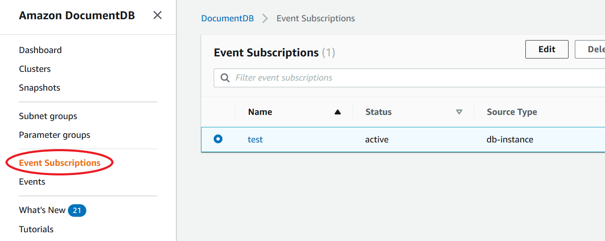
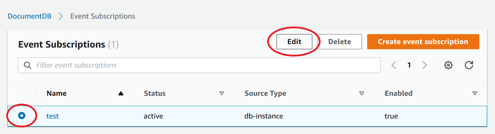
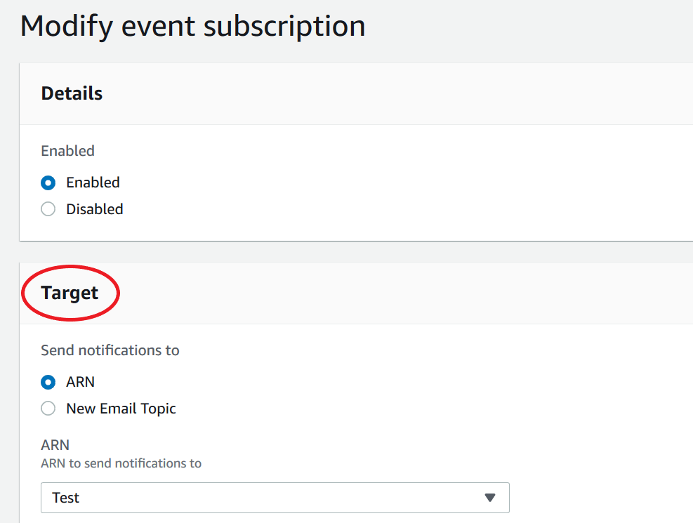
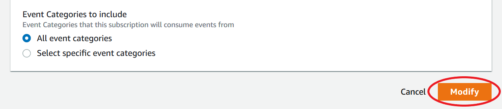
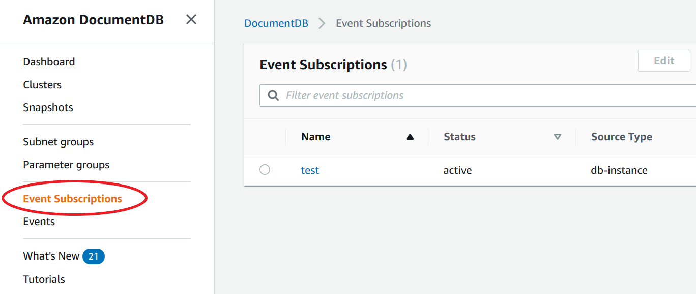
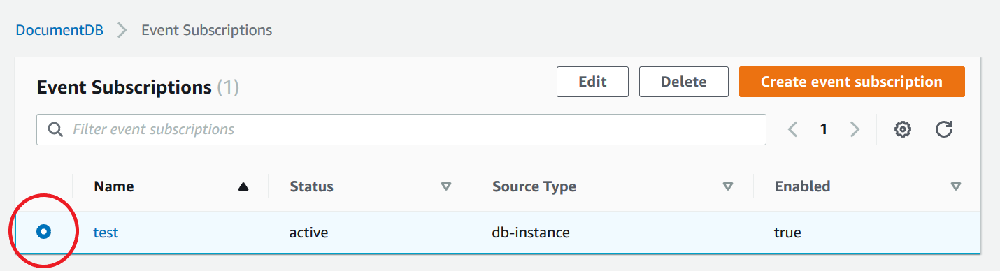
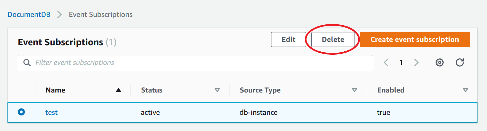
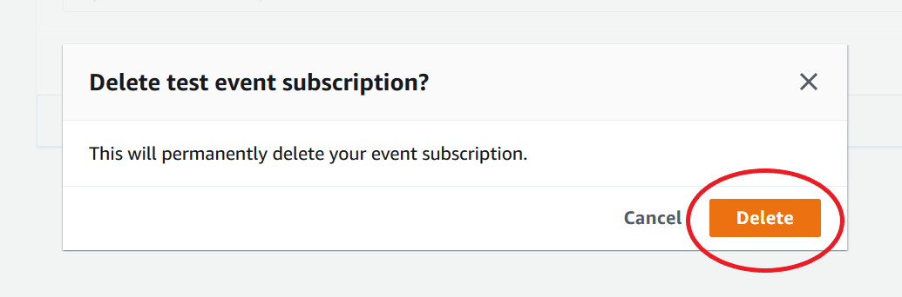

# Managing Amazon DocumentDB event notification subscriptions

If you choose **Event subscriptions** in the navigation pane of the Amazon DocumentDB console, you can view subscription categories and a list of your current subscriptions. You can also modify or delete a specific subscription.

## To modify your current Amazon DocumentDB event notification subscriptions

1. Sign in to the AWS Management Console at [https://console.aws.amazon.com/docdb](https://console.aws.amazon.com/docdb "https://console.aws.amazon.com/docdb").
2. In the navigation pane, choose **Event subscriptions**. The **Event subscriptions** pane shows all your event notification subscriptions.

 3. In the **Event subscriptions** pane, choose the subscription that you want to modify and choose **Edit**.

 4. Make your changes to the subscription in either the **Target** or **Source** section. You can add or remove source identifiers by selecting or deselecting them in the Source section.

 5. Choose **Modify**. The Amazon DocumentDB console indicates that the subscription is being modified.

## Deleting an Amazon DocumentDB event notification subscription

You can delete a subscription when you no longer need it. All subscribers to the topic will no longer receive event notifications specified by the subscription.

1. Sign in to the AWS Management Console at [https://console.aws.amazon.com/docdb](https://console.aws.amazon.com/docdb "https://console.aws.amazon.com/docdb").
2. In the navigation pane, choose **Event subscriptions**.

 3. In the **Event subscriptions** pane, choose the subscription that you want to delete.

 4. Choose **Delete**.

 5. A pop-up window will appear asking you if you want to permanently delete this notification. Choose **Delete**.

