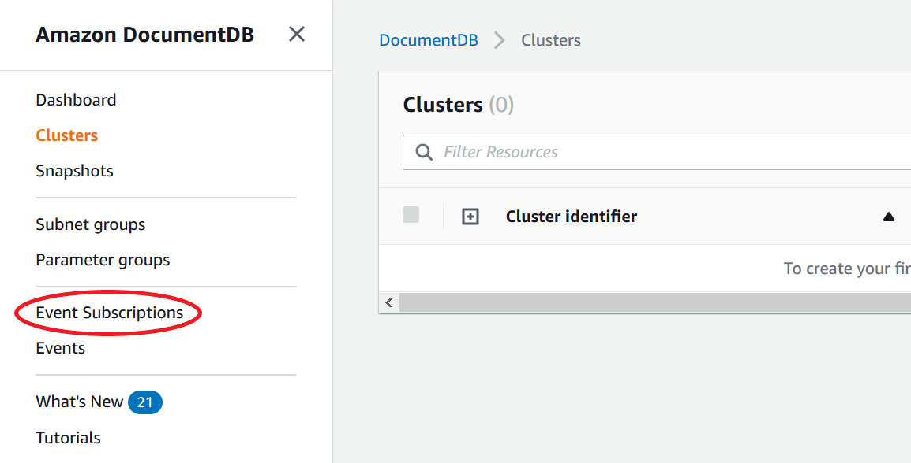
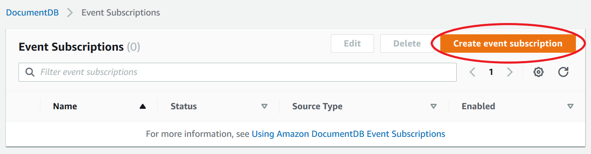
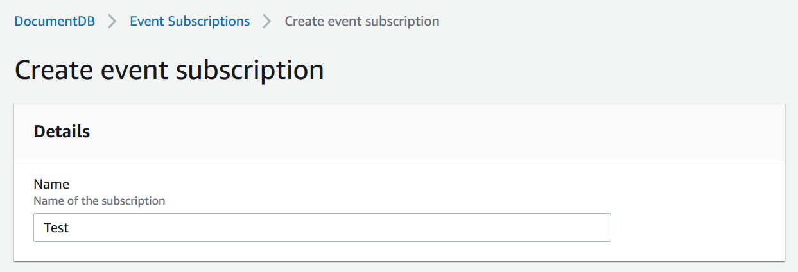
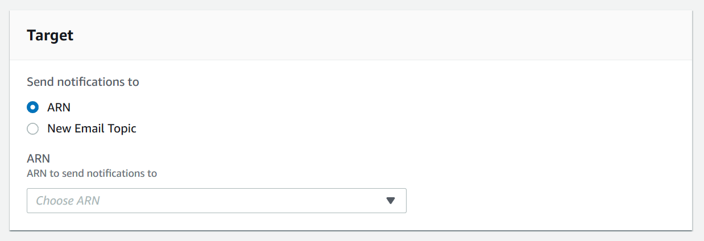
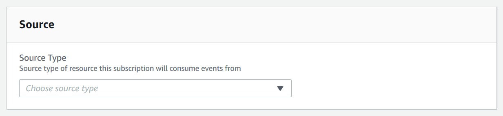
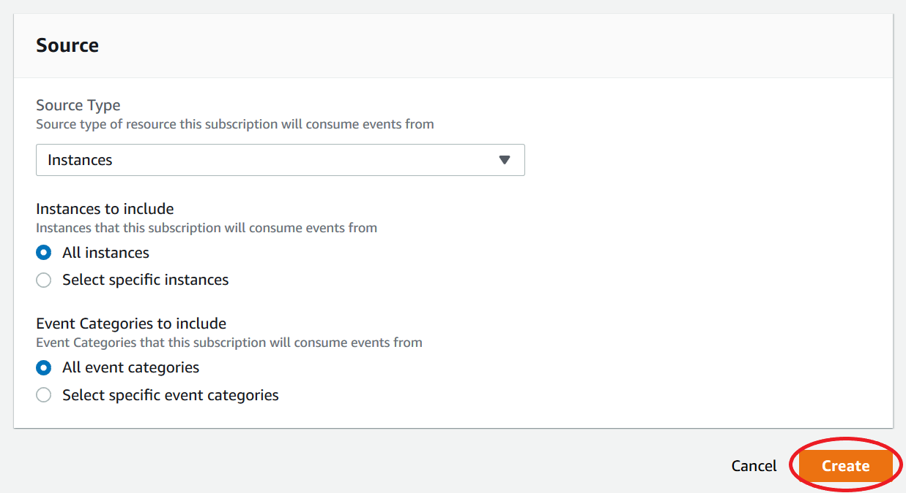

# Subscribing to Amazon DocumentDB events

You can use the Amazon DocumentDB console to subscribe to event subscriptions, as follows:

1. Sign in to the AWS Management Console at [https://console.aws.amazon.com/docdb](https://console.aws.amazon.com/docdb "https://console.aws.amazon.com/docdb").
2. In the navigation pane, choose **Event subscriptions**.

 3. In the **Event subscriptions** pane, choose **Create event subscription**.

 4. In the **Create event subscription** dialog box, do the following:

    * For **Name**, enter a name for the event notification subscription.

    
    * For **Target**, choose where you want to send notifications to. You can choose an existing **ARN** or choose **New Email Topic** to enter the name of a topic and a list of recipients.

    
    * For **Source**, choose a source type. Depending on the source type you selected, choose the event categories and the sources that you want to receive event notifications from.

    
    * Choose **Create**.

    
