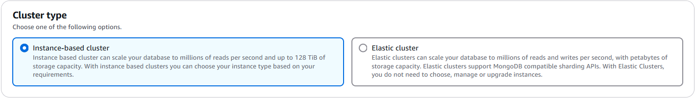
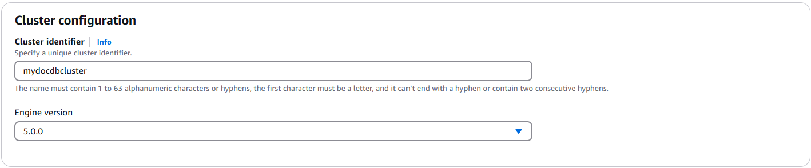
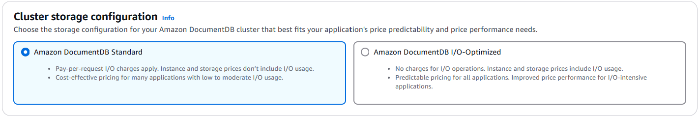
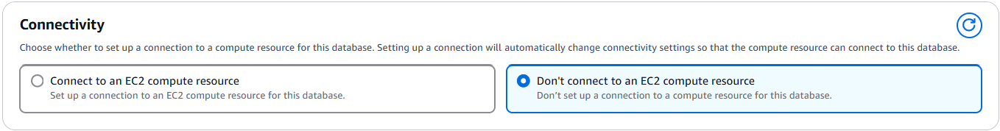
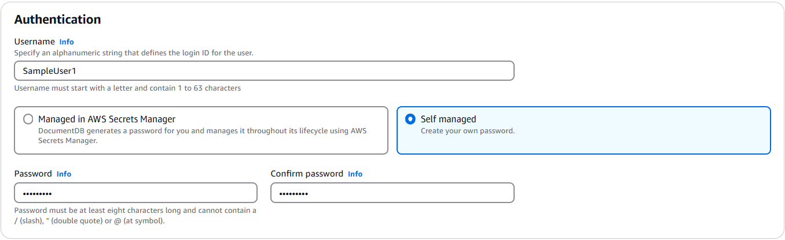
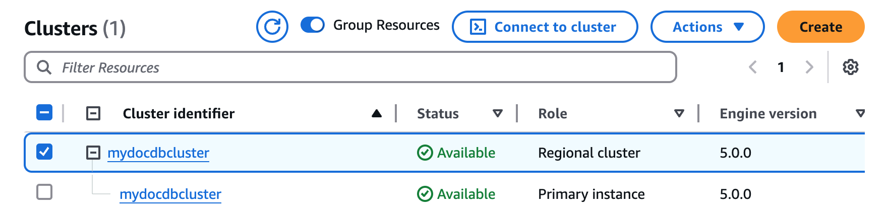

# Get started with Amazon DocumentDB

There are many ways to connect and get started with Amazon DocumentDB. This guide is the quickest, simplest, and easiest way for users to get started
using our powerful document database. This guide uses [AWS CloudShell](../../../cloudshell/latest/userguide/welcome.md "../../../cloudshell/latest/userguide/welcome.md") to connect and query your Amazon DocumentDB cluster directly from the
AWS Management Console. New customers who are eligible for the AWS Free Tier can use Amazon DocumentDB and CloudShell
for free. If your AWS CloudShell environment or Amazon DocumentDB cluster makes use of resources beyond the
free tier, you are charged the normal AWS rates for those resources. This guide will get
you started with Amazon DocumentDB in less than five minutes.

###### Note

The instructions in this guide are specifically for creating and connecting to Amazon DocumentDB instance-based clusters where Amazon DocumentDB and AWS CloudShell are available.

- If you want to create and connect to Amazon DocumentDB elastic clusters, see [Get started with Amazon DocumentDB elastic clusters](elastic-get-started.md "elastic-get-started.md").
- If you are located in AWS China Regions, see [Connect Amazon EC2 automatically](connect-ec2-auto.md "connect-ec2-auto.md").

###### Topics

- [Prerequisites](#quickstart-prerequisites "#quickstart-prerequisites")
- [Step 1: Create a cluster](#get-start-cluster "#get-start-cluster")
- [Step 2: Connect to your cluster](#get-start-connectcluster "#get-start-connectcluster")
- [Step 3: Insert and query data](#get-start-insert-query "#get-start-insert-query")
- [Step 4: Explore](#get-start-congrats "#get-start-congrats")

## Prerequisites

Before you create your first Amazon DocumentDB cluster, you must do the following:

**Create an Amazon Web Services (AWS) account**

Before you can begin using Amazon DocumentDB, you must have an Amazon Web Services (AWS)
account. The AWS account is free. You pay only for the services and
resources that you use.

If you do not have an AWS account, complete the following steps to create one.

###### To sign up for an AWS account

1. Open [https://portal.aws.amazon.com/billing/signup](https://portal.aws.amazon.com/billing/signup "https://portal.aws.amazon.com/billing/signup").
2. Follow the online instructions.

Part of the sign-up procedure involves receiving a phone call or text message and entering
a verification code on the phone keypad.

When you sign up for an AWS account, an _AWS account root user_ is created. The root user has access to all AWS services
and resources in the account. As a security best practice, assign administrative access to a user, and use only the root user to perform [tasks that require root user access](../../../IAM/latest/UserGuide/id_root-user.md#root-user-tasks "../../../IAM/latest/UserGuide/id_root-user.md#root-user-tasks").

**Set up the needed AWS Identity and Access Management (IAM) permissions.**

Access to manage Amazon DocumentDB resources such as clusters, instances, and
cluster parameter groups requires credentials that AWS can use to
authenticate your requests. For more information, see [Identity and Access Management for Amazon DocumentDB](security-iam.md "security-iam.md").

1. In the search bar of the AWS Management Console, type in IAM and select
   **IAM** in the drop down menu that
   appears.
2. Once you're in the IAM console, select
   **Users** from the navigation pane.
3. Select your username.
4. Click **Add permissions**.
5. Select **Attach policies directly**.
6. Type `AmazonDocDBFullAccess` in the search bar and
   select it once it appears in the search results.
7. Click **Next**.
8. Click **Add permissions**.

###### Note

Your AWS account includes a default VPC in each Region.
If you choose to use an Amazon VPC, complete the steps in the [Create an Amazon VPC](../../../vpc/latest/userguide/create-vpc.md "../../../vpc/latest/userguide/create-vpc.md") topic in the _Amazon VPC User Guide_.

## Step 1: Create a cluster

In this step you will create an Amazon DocumentDB cluster.

1. Sign in to the AWS Management Console, and open the Amazon DocumentDB console at [https://console.aws.amazon.com/docdb](https://console.aws.amazon.com/docdb "https://console.aws.amazon.com/docdb").
2. On the Amazon DocumentDB management console, under **Clusters**, choose
   **Create**.

 3. On the Create Amazon DocumentDB cluster page, in the **Cluster type** section, choose
**Instance-based cluster** (this is the default option).



###### Note

The other option in this category is **Elastic cluster**. To learn more about Amazon DocumentDB elastic clusters, see [Using Amazon DocumentDB elastic clusters](docdb-using-elastic-clusters.md "docdb-using-elastic-clusters.md") 4. In the **Cluster configuration** section:

    1. For **Cluster identifier**, enter a unique name, such as `mydocdbcluster`.
     Note that the console will change all cluster names into lower-case regardless of how they are entered.
    2. For **Engine version**, choose **5.0.0**.

 5. In the **Cluster storage configuration** section, choose **Amazon DocumentDB Standard** (this is the default option).



###### Note

The other option in this category is **Amazon DocumentDB I/O-Optimized**. To learn more about either option, see [Amazon DocumentDB cluster storage configurations](db-cluster-storage-configs.md "db-cluster-storage-configs.md") 6. In the **Instance configuration** section:

    1. For **DB instance class**, choose **Memory optimized classes (include r classes)** (this is default).


    The other instance option is **NVMe-backed classes**. To learn more, see [NVMe-backed instances](db-instance-nvme.md "db-instance-nvme.md").
    2. For **Instance class**, choose **db.t3.medium**.
     This is eligible for the AWS free trial.
    3. For **Number of instances**, choose **1** instance.
     Choosing one instance helps minimize costs. If this were a production system, we would recommend that you provision three instances for high availability.

 7. In the **Connectivity** section, leave the default setting of **Don't connect to an EC2 compute resource**.

 8. In the **Authentication** section, enter a username for the primary user, and then choose **Self managed**.
Enter a password, then confirm it.

If you instead chose **Managed in AWS Secrets Manager**, see [Password management with Amazon DocumentDB and AWS Secrets Manager](docdb-secrets-manager.md "docdb-secrets-manager.md") for more information.

 9. Leave all other options as default and choose **Create cluster**.

Amazon DocumentDB is now provisioning your cluster, which can take up to a few minutes to finish.

###### Note

For information about cluster status values, see [Cluster status values](monitoring_docdb-cluster_status.md#monitoring_docdb-status_values "monitoring_docdb-cluster_status.md#monitoring_docdb-status_values") in the Monitoring Amazon DocumentDB chapter.

## Step 2: Connect to your cluster

Connect to your Amazon DocumentDB cluster using AWS CloudShell.

1. On the Amazon DocumentDB management console, under **Clusters**, locate the cluster
   you created. Choose your cluster by clicking the check box next to it.

 2. Click **Connect to cluster** (which is next to the **Actions** dropdown menu).
This button is enabled only after you have clicked the checkbox next to your cluster, and the status of both the regional cluster and primary instance(s) show as **Available**.
The CloudShell **Run command** screen appears. 3. In the **New environment name** field, enter a unique name, such as "test" and click **Create and run**.
VPC environment details are automatically configured for your Amazon DocumentDB database.

 4. When prompted, enter the password you created in Step 1: Create an Amazon DocumentDB cluster (sub-step 7).


After you enter your password and your prompt becomes `rs0 [direct: primary] <env-name>>`, you are successfully connected to your Amazon DocumentDB cluster.

###### Note

For information about troubleshooting, see [Troubleshooting Amazon DocumentDB](troubleshooting.md "troubleshooting.md").

## Step 3: Insert and query data

Now that you are connected to your cluster, you can run a few queries to get familiar
with using a document database.

1. To insert a single document, enter the following:

```
db.collection.insertOne({"hello":"DocumentDB"})
```

You get the following output:

```
{
  acknowledged: true,
  insertedId: ObjectId('673657216bdf6258466b128c')
}
```

2. You can read the document that you wrote with the `findOne()` command (because it only returns a single document). Input the following:

```
db.collection.findOne()
```

You get the following output:

```
{ "_id" : ObjectId("5e401fe56056fda7321fbd67"), "hello" : "DocumentDB" }
```

3. To perform a few more queries, consider a gaming profiles use case. First, insert a few entries into a collection titled `profiles`. Input the following:

```
db.profiles.insertMany([{ _id: 1, name: 'Matt', status: 'active', level: 12, score: 202 },
      { _id: 2, name: 'Frank', status: 'inactive', level: 2, score: 9 },
      { _id: 3, name: 'Karen', status: 'active', level: 7, score: 87 },
      { _id: 4, name: 'Katie', status: 'active', level: 3, score: 27 }
])
```

You get the following output:

```
{ acknowledged: true, insertedIds: { '0': 1, '1': 2, '2': 3, '3': 4 } }
```

4. Use the `find()` command to return all the documents in the profiles collection. Input the following:

```
db.profiles.find()
```

You will get an output that will match the data you typed in Step 3. 5. Use a query for a single document using a filter. Input the following:

```
db.profiles.find({name: "Katie"})
```

You get the following output:

```
{ "_id" : 4, "name" : "Katie", "status": "active", "level": 3, "score":27}
```

6. Now let’s try to find a profile and modify it using the `findAndModify` command. We’ll give the user Matt an extra 10 points with the following code:

```
db.profiles.findAndModify({
        query: { name: "Matt", status: "active"},
        update: { $inc: { score: 10 } }
    })
```

You get the following output (note that his score hasn’t increased yet):

```
{
    [{_id : 1, name : 'Matt', status: 'active', level: 12, score: 202}]
```

7. You can verify that his score has changed with the following query:

`db.profiles.find({name: "Matt"})`

You get the following output:

```
{ "_id" : 1, "name" : "Matt", "status" : "active", "level" : 12, "score" : 212 }
```

## Step 4: Explore

Congratulations! You have successfully completed the Get started guide for
Amazon DocumentDB instance-based clusters.

What’s next? Learn how to fully leverage this database with some of its popular
features:

- [Managing Amazon DocumentDB](managing-documentdb.md "managing-documentdb.md")
- [Scaling](operational_tasks.md "operational_tasks.md")
- [Backing up and restoring](backup_restore.md "backup_restore.md")

###### Note

The cluster you created from this get started exercise will continue to accrue
costs unless you delete it. For directions, see [Deleting an Amazon DocumentDB Cluster](db-cluster-delete.md "db-cluster-delete.md").
