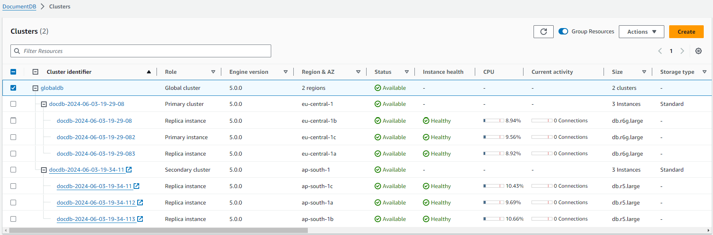
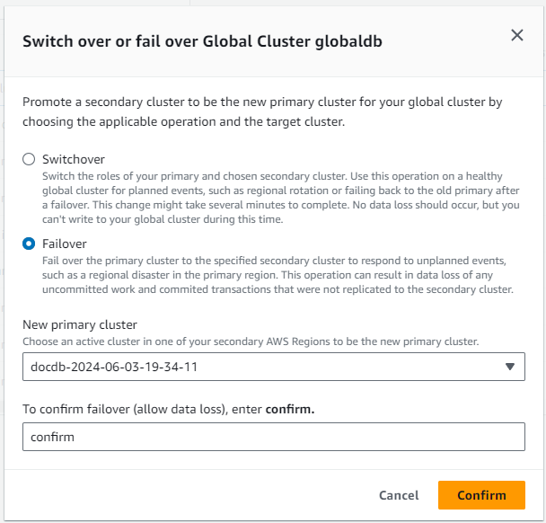
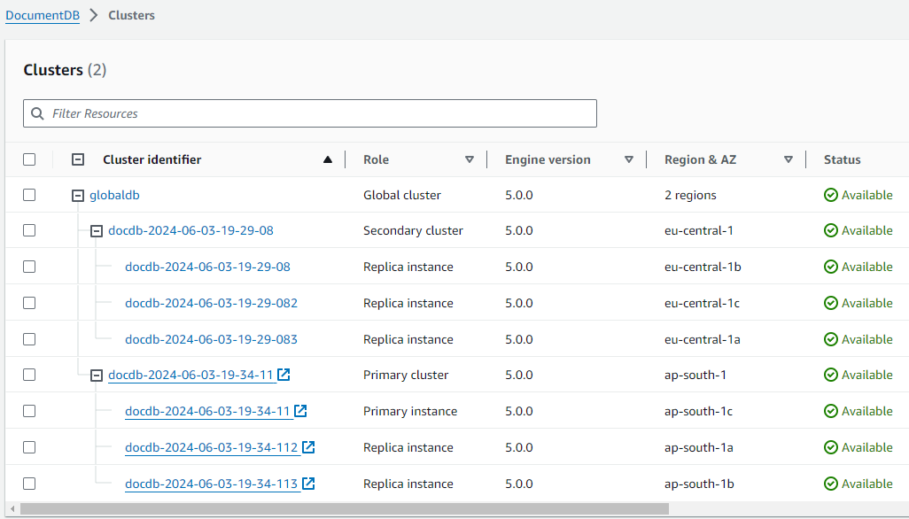
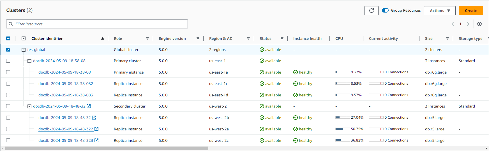
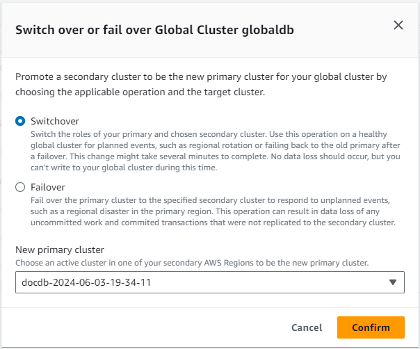

# Disaster recovery and Amazon DocumentDB global clusters

###### Topics

- [Performing a managed failover for an Amazon DocumentDB global cluster](#managed-failover "#managed-failover")
- [Performing a manual failover for an Amazon DocumentDB global cluster](#manual-failover "#manual-failover")
- [Performing a switchover for an Amazon DocumentDB global cluster](#global-cluster-switchover "#global-cluster-switchover")
- [Unblocking a global cluster switchover or failover](#unblocking-gc-so-fo "#unblocking-gc-so-fo")
  By using a global cluster, you can recover from disasters such as region failures
  quickly. Recovery from disaster is typically measured using values for RTO and RPO.

- **Recovery time objective (RTO)** — The time it takes a
  system to return to a working state after a disaster. In other words, RTO measures
  downtime. For a global cluster, RTO in minutes.
- **Recovery point objective (RPO)** — The amount of data
  that can be lost (measured in time). For a global cluster, RPO is typically measured
  in seconds.
- To recover from an unplanned outage, you can perform a cross-region failover to
  one of the secondaries in your global cluster. When your global cluster has multiple
  secondary regions, make sure that you detach all the secondary regions that you wish to promote as primaries.
  Then, you promote one of those secondary regions to be the new primary AWS Region.
  Finally, you create new clusters in each of the other secondary regions and attach those clusters to your global cluster.

## Performing a managed failover for an Amazon DocumentDB global cluster

This approach is intended for business continuity in the event of a true Regional disaster or complete service-level outage.

During a managed failover, your primary cluster is failed over to your choice of secondary Region while your Amazon DocumentDB global cluster's existing replication topology is maintained.
The chosen secondary cluster promotes one of its read-only nodes to full writer status.
This step allows the cluster to assume the role of primary cluster.
Your database is unavailable for a short time while this cluster is assuming its new role.
Data that wasn't replicated from the old primary to the chosen secondary cluster may be missing when this secondary becomes the new primary.
The old primary volume makes a best effort attempt to take a snapshot before synchronizing with the new primary so unreplicated data is preserved on the snapshot.

###### Note

You can only perform a managed cross-Region cluster failover on an Amazon DocumentDB global cluster if the primary and all secondary clusters have the same engine versions.
If your engine versions are incompatible, you can perform the failover manually by following the steps in [Performing a manual failover for an Amazon DocumentDB global cluster](#manual-failover "#manual-failover").

If the region's engine versions do not match, the failover will be blocked.
Please check for any pending upgrades and apply them to ensure all region's engine versions match and the global cluster failover is unblocked.
For more information, see [Unblocking a global cluster switchover or failover](#unblocking-gc-so-fo "#unblocking-gc-so-fo").

To minimize data loss, we recommend that you do the following before using this feature:

- Take applications offline to prevent writes from being sent to the primary cluster of the Amazon DocumentDB global cluster.
- Check lag times for all Amazon DocumentDB secondary clusters.
  Choosing the secondary Region with the least replication lag can minimize data loss with the current failed primary Region.
  Check lag times for all Amazon DocumentDB secondary clusters in the global cluster by viewing the `GlobalClusterReplicationLag` metric in Amazon CloudWatch.
  These metrics show you how far behind (in milliseconds) replication to a secondary cluster is to the primary cluster.

For more information about CloudWatch metrics for Amazon DocumentDB, see [Amazon DocumentDB metrics](cloud_watch.md#cloud_watch-metrics_list "cloud_watch.md#cloud_watch-metrics_list").

During a managed failover, the chosen secondary cluster is promoted to its new role as primary.
However, it doesn't inherit the various configuration options of the primary cluster.
A mismatch in configuration can lead to performance issues, workload incompatibilities, and other anomalous behavior.
To avoid such issues, we recommend that you resolve differences between your Amazon DocumentDB global clusters for the following:

- **Configure an Amazon DocumentDB cluster parameter group for the new primary, if necessary** — You can configure your Amazon DocumentDB cluster parameter groups independently for each cluster in your Amazon DocumentDB global clustere.
  Therefore, when you promote a secondary cluster to take over the primary role, the parameter group from the secondary might be configured differently than for the primary.
  If so, modify the promoted secondary cluster's parameter group to conform to your primary cluster's settings.
  To learn how, see [Modifying Amazon DocumentDB cluster parameter groups](cluster_parameter_groups-modify.md "cluster_parameter_groups-modify.md").
- **Configure monitoring tools and options, such as Amazon CloudWatch events and alarms** — Configure the promoted cluster with the same logging ability, alarms, and so on as needed for the global cluster.
  As with parameter groups, configuration for these features isn't inherited from the primary during the failover process.
  Some CloudWatch metrics, such as replication lag, are only available for secondary Regions.
  Thus, a failover changes how to view those metrics and set alarms on them, and could require changes to any predefined dashboards.
  For more information about Amazon DocumentDB clusters and monitoring, see [Monitoring Amazon DocumentDB](monitoring_docdb.md "monitoring_docdb.md").

Typically, the chosen secondary cluster assumes the primary role within a minute.
As soon as the new primary Region's writer node is available, you can connect your applications to it and resume your workloads.
After Amazon DocumentDB promotes the new primary cluster, it automatically rebuilds all additional secondary Region clusters.

Because Amazon DocumentDB global clusters use asynchronous replication, the replication lag in each secondary Region can vary.
Amazon DocumentDB rebuilds these secondary Regions to have the exact same point-in-time data as the new primary Region cluster.
The duration of the complete rebuilding task can take a few minutes to several hours, depending on the size of the storage volume and the distance between the Regions.
When the secondary Region clusters finish rebuilding from the new primary Region, they become available for read access.
As soon as the new primary writer is promoted and available, the new primary Region's cluster can handle read and write operations for the Amazon DocumentDB global cluster.

To restore the global cluster's original topology, Amazon DocumentDB monitors the availability of the old primary Region.
As soon as that Region is healthy and available again, Amazon DocumentDB automatically adds it back to the global cluster as a secondary Region.
Before creating the new storage volume in the old primary Region, Amazon DocumentDB tries to take a snapshot of the old storage volume at the point of failure.
It does this so that you can use it to recover any of the missing data.
If this operation is successful, Amazon DocumentDB places this snapshot named "rds:docdb-unplanned-global-failover-name-of-old-primary-DB-cluster-timestamp" in the snapshot section of the AWS Management Console.
You can also see this snapshot listed in the information returned by the `DescribeDBClusterSnapshots` API operation.

###### Note

The snapshot of the old storage volume is a system snapshot that's subject to the backup retention period configured on the old primary cluster.
To preserve this snapshot outside of the retention period, you can copy it to save it as a manual snapshot.
To learn more about copying snapshots, including pricing, see [Copying a cluster snapshot](backup_restore-copy_cluster_snapshot.md#backup_restore-copy_a_cluster_snapshot "backup_restore-copy_cluster_snapshot.md#backup_restore-copy_a_cluster_snapshot").

After the original topology is restored, you can fail back your global cluster to the original primary Region by performing a switchover operation when it makes the most sense for your business and workload.
To do so, follow the steps in [Performing a switchover for an Amazon DocumentDB global cluster](#global-cluster-switchover "#global-cluster-switchover").

You can fail over your Amazon DocumentDB global cluster using the AWS Management Console, the AWS CLI, or the Amazon DocumentDB API.

Using the AWS Management Console
**Perform a managed failover on your Amazon DocumentDB global cluster**

1. Sign in to the AWS Management Console, and open the Amazon DocumentDB console at [https://console.aws.amazon.com/docdb](https://console.aws.amazon.com/docdb "https://console.aws.amazon.com/docdb").
2. In the navigation pane, choose **Clusters**.
3. Find and choose the Amazon DocumentDB global cluster you want to fail over.

 4. Choose **Switchover or Failover** from the **Actions** menu. 5. On the dialog box that appears, choose **Failover**, then choose the secondary cluster from the **New primary cluster** field drop down list.

 6. Type "confirm" in the last field. Then choose **Confirm**.

The status of the primary cluster changes to "**Failing-over**".
This condition should take approximately one minute.
During this time, the status of the new primary cluster shows "**Modifying...**".
Once the new primary is promoted, it will show "**Available**" and will be able to serve read and write transactions.
The secondary regions including the old primary will show "**Resyncing...**" while it resynchronizes to the new primary.
Similar to the new primary, it will only be able to serve transaction once the status changes to "**Available**". 7. When complete, the original primary cluster becomes the secondary cluster. The selected secondary cluster becomes the primary cluster.



Using the AWS CLI
**Perform a managed failover on your Amazon DocumentDB global cluster**

Run the [`failover-global-cluster`](https://awscli.amazonaws.com/v2/documentation/api/latest/reference/docdb/failover-global-cluster.html "https://awscli.amazonaws.com/v2/documentation/api/latest/reference/docdb/failover-global-cluster.html") CLI command to fail over your Amazon DocumentDB global cluster.
With the command, pass values for the following options:

- `--region`
- `--global-cluster-identifier`
- `--target-db-cluster-identifier`
- `--allow-data-loss`

In the following examples, replace each `user input placeholder` with your cluster's information.

For Linux, macOS, or Unix:

```
aws docdb failover-global-cluster \
   --region `region_of_selected_secondary` \
   --global-cluster-identifier `global_cluster_id` \
   --target-db-cluster-identifier `arn_of_secondary_to_promote` \
   --allow-data-loss
```

For Windows:

```
aws docdb failover-global-cluster ^
   --region `region_of_selected_secondary` ^
   --global-cluster-identifier `global_cluster_id` ^
   --target-db-cluster-identifier `arn_of_secondary_to_promote` ^
   --allow-data-loss
```

## Performing a manual failover for an Amazon DocumentDB global cluster

If an entire cluster in one AWS Region becomes unavailable, you can promote another
cluster in the global cluster to have read/write capability.

You can manually activate the global cluster failover mechanism if a cluster in a different
AWS Region is a better choice to be the primary cluster. For example, you might
increase the capacity of one of the secondary clusters and then promote it to be the
primary cluster. Or the balance of activity among the AWS Regions might change, so
that switching the primary cluster to a different AWS Region might give lower latency
for write operations.

The following procedure outlines what to do to promote one of the secondary clusters
in an Amazon DocumentDB global cluster.

To promote a secondary cluster:

1. Stop issuing DML statements and other write operations to the primary cluster
   in the AWS Region with the outage.
2. Identify a cluster from a secondary AWS Region to use as a new primary
   cluster. If you have two (or more) secondary AWS Regions in your global cluster,
   choose the secondary cluster that has the least lag time.
3. Detach your chosen secondary cluster from the global cluster.

Removing a secondary cluster from a global cluster immediately stops the
replication from the primary to this secondary and promotes it to standalone
provisioned cluster with full read/write capabilities. Any other secondary
cluster associated with the primary cluster in the region with the outage are
still available and can accept calls from your application. They also consume
resources. Since you are recreating the global cluster, to avoid split-brain and
other issues, remove the other secondary clusters before creating the new global
cluster in the steps that follow.

For detailed steps for detaching, see [Removing a cluster from an Amazon DocumentDB global cluster](global-clusters.md#global-clusters.remove "global-clusters.md#global-clusters.remove"). 4. This cluster becomes the primary cluster of a new global cluster when you start
adding Regions to it, in the next step. 5. Add an AWS Region to the cluster. When you do this, the replication process
from primary to secondary begins. 6. Add more AWS Regions as needed to re-create the topology needed to support
your application. Make sure that application writes are sent to the correct
cluster before, during, and after making changes such as these, to avoid data
inconsistencies among the clusters in the global cluster (split-brain
issues). 7. When the outage is resolved and you're ready to assign your original
AWS Region as the primary cluster again, perform the same steps in
reverse. 8. Remove one of the secondary clusters from the global cluster. This will enable
it to serve read/write traffic. 9. Redirect all the write traffic to the primary cluster in the original
AWS Region. 10. Add an AWS Region to set up one or more secondary clusters in the same
AWS Region as before.

Amazon DocumentDB global clusters can be managed using AWS SDKs, enabling you to create
solutions to automate global cluster failover process for Disaster Recovery and Business
Continuity Planning use cases. One such solution is made available for our customers
under Apache 2.0 licensing and can be accessed from our tools repository [here](https://github.com/awslabs/amazon-documentdb-tools/tree/master/global-clusters-automation "https://github.com/awslabs/amazon-documentdb-tools/tree/master/global-clusters-automation"). This solution leverages Amazon Route 53 for endpoint management and
provides AWS Lambda functions that can be triggered based appropriate events.

## Performing a switchover for an Amazon DocumentDB global cluster

By using switchovers, you can change the Region of your primary cluster on a routine basis.
This approach is intended for controlled scenarios, such as operational maintenance and other planned operational procedures.

There are three common use cases for using switchovers:

- For "regional rotation" requirements imposed on specific industries.
  For example, financial service regulations might want tier-0 systems to switch to a different Region for several months to ensure that disaster recovery procedures are regularly exercised.
- For multi-Region "follow-the-sun" applications.
  For example, a business might want to provide lower latency writes in different Regions based on business hours across different time zones.
- As a zero-data-loss method to fail back to the original primary Region after a failover.

###### Note

Switchovers are designed to be used on a healthy Amazon DocumentDB global cluster.
To recover from an unplanned outage, follow the appropriate procedure in [Performing a manual failover for an Amazon DocumentDB global cluster](#manual-failover "#manual-failover").

To perform a switchover, all secondary regions must be running the exact same engine version as the primary.
If the region's engine versions do not match, the switchover will be blocked.
Please check for any pending upgrades and apply them to ensure all region's engine versions match and the global cluster switchover is unblocked.
For more information, see [Unblocking a global cluster switchover or failover](#unblocking-gc-so-fo "#unblocking-gc-so-fo").

During a switchover, Amazon DocumentDB switches over your primary cluster to your chosen secondary Region while it maintains your global cluster's existing replication topology.
Before it starts the switchover process, Amazon DocumentDB waits for all secondary Region clusters to be fully synchronized with the primary Region cluster.
Then, the DB cluster in the primary Region becomes read-only and the chosen secondary cluster promotes one of its read-only nodes to full writer status.
Promoting this node to a writer allows that secondary cluster to assume the role of primary cluster.
Because all secondary clusters were synchronized with the primary at the beginning of the process, the new primary continues operations for the Amazon DocumentDB global cluster without losing any data.
Your database is unavailable for a short time while the primary and selected secondary clusters are assuming their new roles.

To optimize application availability, we recommend that you do the following before using this feature:

- Perform this operation during nonpeak hours or at another time when writes to the primary cluster are minimal.
- Take applications offline to prevent writes from being sent to the primary cluster of the Amazon DocumentDB global cluster.
- Check lag times for all Amazon DocumentDB secondary clusters in the global cluster by viewing the `GlobalClusterReplicationLag` metric in Amazon CloudWatch.
  This metric shows you how far behind (in milliseconds) replication to a secondary cluster is to the primary cluster.
  This value is directly proportional to the time it takes for Amazon DocumentDB to complete the switchover.
  Therefore, the larger the lag value, the longer the switchover will take.

For more information about CloudWatch metrics for Amazon DocumentDB, see [Amazon DocumentDB metrics](cloud_watch.md#cloud_watch-metrics_list "cloud_watch.md#cloud_watch-metrics_list").

During a switchover, the chosen secondary DB cluster is promoted to its new role as primary.
However, it doesn't inherit the various configuration options of the primary DB cluster.
A mismatch in configuration can lead to performance issues, workload incompatibilities, and other anomalous behavior.
To avoid such issues, we recommend that you resolve differences between your Amazon DocumentDB global clusters for the following:

- **Configure Amazon DocumentDB DB cluster parameter group for the new primary, if necessary** — You can configure your Amazon DocumentDB cluster parameter groups independently for each cluster in your Amazon DocumentDB global cluster.
  That means that when you promote a secondary DB cluster to take over the primary role, the parameter group from the secondary might be configured differently than for the primary.
  If so, modify the promoted secondary DB cluster's parameter group to conform to your primary cluster's settings.
  To learn how, see [Managing Amazon DocumentDB cluster parameter groups](cluster_parameter_groups.md "cluster_parameter_groups.md").
- **Configure monitoring tools and options, such as Amazon CloudWatch Events and alarms** — Configure the promoted cluster with the same logging ability, alarms, and so on as needed for the global cluster.
  As with parameter groups, configuration for these features isn't inherited from the primary during the switchover process.
  Some CloudWatch metrics, such as replication lag, are only available for primary Regions.
  Thus, a switchover changes how to view those metrics and set alarms on them, and could require changes to any predefined dashboards.
  For more information, see [Monitoring Amazon DocumentDB](monitoring_docdb.md "monitoring_docdb.md").

###### Note

Typically, the role switchover can take up to several minutes.

When the switchover process completes, the promoted Amazon DocumentDB cluster can handle write operations for the global cluster.

You can switch over your Amazon DocumentDB global cluster using the AWS Management Console or the AWS CLI:

Using the AWS Management Console
**Perform a switchover on your Amazon DocumentDB global cluster**

1. Sign in to the AWS Management Console, and open the Amazon DocumentDB console at [https://console.aws.amazon.com/docdb](https://console.aws.amazon.com/docdb "https://console.aws.amazon.com/docdb").
2. In the navigation pane, choose **Clusters**.
3. Find and select the Amazon DocumentDB global cluster you want to switch over.

 4. Choose **Switchover or Failover** from the **Actions** menu. 5. On the dialog box that appears, choose **Switchover**, then choose the secondary cluster from the **New primary cluster** field drop down list.

 6. Choose **Confirm**.

The status of the primary cluster changes to "**Switching-over**".
This condition should take approximately three minutes.
During this time, the status of all regional clusters show "**Modifying...**".
Once the regions are synchronized and the new primary is promoted, it will show "**Available**" for all status fields and will be able to serve transactions. 7. When complete, the original primary cluster becomes the secondary cluster. The selected secondary cluster becomes the primary cluster.


Using the AWS CLI
**Perform a switchover on your Amazon DocumentDB global cluster**

Run the [`switchover-global-cluster`](https://awscli.amazonaws.com/v2/documentation/api/latest/reference/docdb/switchover-global-cluster.html "https://awscli.amazonaws.com/v2/documentation/api/latest/reference/docdb/switchover-global-cluster.html") CLI command to switch over your Amazon DocumentDB global cluster.
With the command, pass values for the following options:

- `--region`
- `--global-cluster-identifier`
- `--target-db-cluster-identifier`

In the following examples, replace each `user input placeholder` with your cluster's information.

For Linux, macOS, or Unix:

```
aws docdb switchover-global-cluster \
   --region `region_of_primary` \
   --global-cluster-identifier `global_cluster_id` \
   --target-db-cluster-identifier `arn_of_secondary_to_promote`
```

For Windows:

```
aws docdb switchover-global-cluster ^
   --region `region_of_primary` ^
   --global-cluster-identifier `global_cluster_id` ^
   --target-db-cluster-identifier `arn_of_secondary_to_promote`
```

## Unblocking a global cluster switchover or failover

Global cluster switchovers and failovers are blocked when not all regional clusters in the global cluster are on the same engine version.
If the versions do not match, you may see this error in response when calling a switchover or failover: **`The target DB cluster specified is running an engine version with a different patch level than the source DB cluster`**.
We recommended routinely applying the latest engine versions to ensure you are running the latest updates to keep your global clusters in a healthy state.

To resolve this error, please update all secondary regions first, and then the primary region to the same engine version by applying any pending maintenance action items.
To view pending maintenance action items, and to apply any needed changes to correct the issue, perform the instructions in one of the following tabs:

Using the AWS Management Console
To unblock a global cluster switchover or failover, you must determine if there are any pending maintenance actions for your clusters and apply them.
Follow these steps to view and apply maintenance actions:

1. Sign in to the AWS Management Console, and open the Amazon DocumentDB console at [https://console.aws.amazon.com/docdb](https://console.aws.amazon.com/docdb "https://console.aws.amazon.com/docdb").
2. In the navigation pane, choose **Clusters**.
3. In the **Clusters** table, locate your global cluster in the **Cluster identifier** column.
   Under your global cluster, take note of each secondary cluster and the primary cluster for the given global cluster, and perform the following steps for each.
4. For each secondary cluster:
   1. If an update is available for your cluster, it is indicated as **Available**, **Required**, or **Next Window** in the
      **Maintenance** column.
   2. To take an action, choose the cluster to show it's details, then choose **Maintenance & backups**.
      The **Pending Maintenance** items appear.
   3. Under **Description**, if it indicates that a "New maintenance update is available", select it and then choose **Apply now**.

5. For your primary cluster:
   1. If an update is available for your cluster, it is indicated as **Available**, **Required**, or **Next Window** in the
      **Maintenance** column.
   2. To take an action, choose the cluster to show it's details, then choose **Maintenance & backups**.
      The **Pending Maintenance** items appear.
   3. Under **Description**, if it indicates that a "New maintenance update is available", select it and then choose **Apply now**.

Using the AWS CLI
To unblock a global cluster switchover or failover, you must determine if there are any pending maintenance actions for the cluster and apply them.
Follow these steps to view and apply maintenance actions first on the secondary clusters then on the primary cluster for your global cluster:

1. Run the following on each secondary region's regional cluster first and then for the primary regions regional cluster.
2. Run the [`describe-pending-maintenance-actions`](https://awscli.amazonaws.com/v2/documentation/api/latest/reference/docdb/describe-pending-maintenance-actions.html "https://awscli.amazonaws.com/v2/documentation/api/latest/reference/docdb/describe-pending-maintenance-actions.html") CLI command with the `--resource-identifier` option to determine if any maintenance actions are available for your Amazon DocumentDB regional cluster.

In the following examples, replace each `user input placeholder` with your cluster's information.

For Linux, macOS, or Unix:

```
aws docdb describe-pending-maintenance-action \
   --resource-identifier `arn:aws:rds:us-east-1:001234567890:cluster:docdb-2025-03-27-19-21-15`
```

For Windows:

```
aws docdb describe-pending-maintenance-action ^
   --resource-identifier `arn:aws:rds:us-east-1:001234567890:cluster:docdb-2025-03-27-19-21-15`
```

The result looks similar to this:

```
{
    "PendingMaintenanceActions": [
        {
            "ResourceIdentifier": "arn:aws:rds:us-east-1:001234567890:cluster:docdb-2025-03-27-19-21-15",
            "PendingMaintenanceActionDetails": [
                {
                    "Action": "system-update",
                    "CurrentApplyDate": "2025-04-11T03:01:00Z",
                    "Description": "db-version-upgrade",
                    "ForcedApplyDate": "2025-06-18T03:01:00Z",
                    "AutoAppliedAfterDate": "2025-05-11T03:01:00Z"
                    "OptInStatus": "pending"
                }
            ]
        }
    ]
}
```

3.  If a maintenance action is needed, run the [`apply-pending-maintenance-action`](https://awscli.amazonaws.com/v2/documentation/api/latest/reference/docdb/apply-pending-maintenance-action.html "https://awscli.amazonaws.com/v2/documentation/api/latest/reference/docdb/apply-pending-maintenance-action.html") CLI command with the following options:

        * `--resource-identifier`
        * `--apply-action`
        * `--opt-in-type`
        * `--region`

    In the following examples, replace each `user input placeholder` with your cluster's information.

For Linux, macOS, or Unix:

```
aws docdb apply-pending-maintenance-action \
   --resource-identifier `arn:aws:rds:us-east-1:001234567890:cluster:docdb-2025-03-27-19-21-15` \
   --apply-action `system-update` \
   --opt-in-type `immediate` \
   --region `us-east-1`
```

For Windows:

```
aws docdb apply-pending-maintenance-action ^
   --resource-identifier `arn:aws:rds:us-east-1:001234567890:cluster:docdb-2025-03-27-19-21-15` ^
   --apply-action `system-update` ^
   --opt-in-type immediate ^
   --region `us-east-1`
```

4. Once the maintenance action has completed, run the [`describe-pending-maintenance-actions`](https://awscli.amazonaws.com/v2/documentation/api/latest/reference/docdb/describe-pending-maintenance-actions.html "https://awscli.amazonaws.com/v2/documentation/api/latest/reference/docdb/describe-pending-maintenance-actions.html") command again to ensure that there are no other actions pending for your cluster.

The result you want is:

```
{
    "PendingMaintenanceActions": []
}
```

Using the Amazon DocumentDB API
To unblock a global cluster switchover or failover, you must determine if there are any pending maintenance actions for the cluster and apply them.
Use the following APIs to view and apply maintenance actions:

1. Run the following on each secondary region's regional cluster first and then for the primary regions regional cluster.
2. Call the [`PendingMaintenanceAction`](API_PendingMaintenanceAction.md "API_PendingMaintenanceAction.md") API to determine if any maintenance actions are available for your Amazon DocumentDB global cluster.
3. Apply any changes by calling the [`ApplyPendingMaintenanceAction`](API_ApplyPendingMaintenanceAction.md "API_ApplyPendingMaintenanceAction.md") API.
