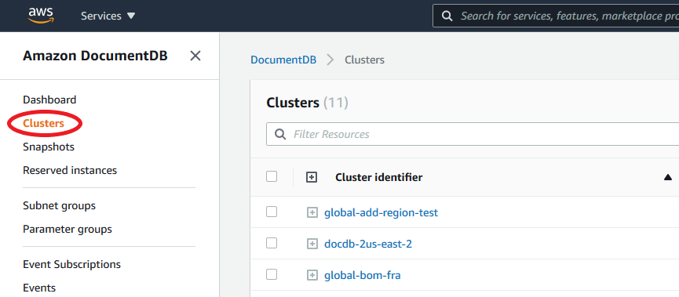
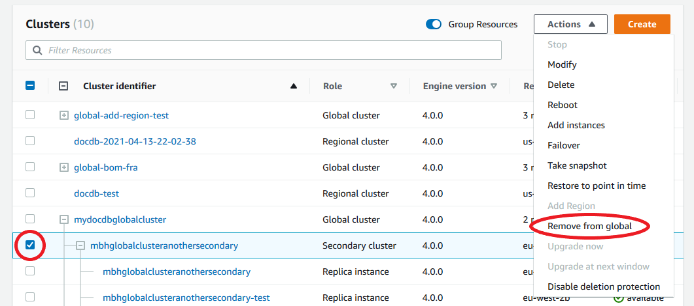
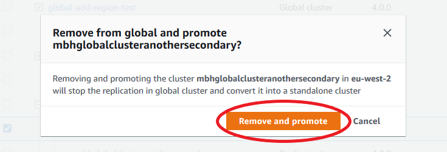
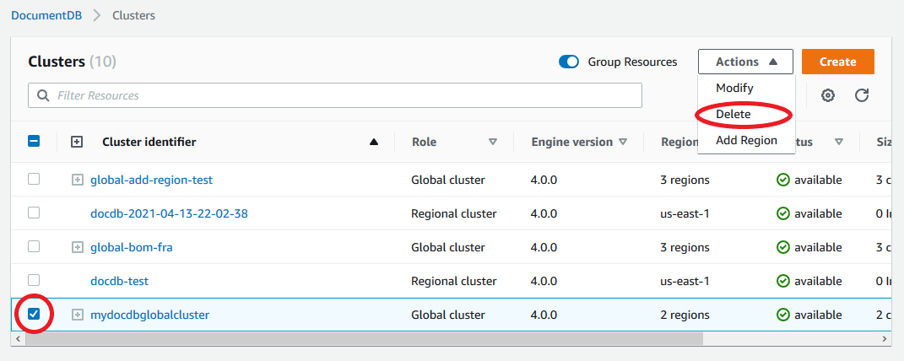

# Managing an Amazon DocumentDB global cluster

You perform most management operations on the individual clusters that make up a global cluster. When you choose **Group related resources** on the **Clusters** page in the console, you see the primary cluster and secondary clusters grouped under the associated global cluster.

The **Configuration** tab for a global cluster shows the AWS Regions where the clusters are running, the version, and the global cluster identifier.

###### Topics

- [Modifying global clusters](#global-clusters.modify "#global-clusters.modify")
- [Modifying parameters](#global-clusters.modify-parameters "#global-clusters.modify-parameters")
- [Removing global clusters](#global-clusters.remove "#global-clusters.remove")
- [Deleting global clusters](#global-clusters.delete "#global-clusters.delete")
- [Headless clusters](#global-clusters.headless "#global-clusters.headless")

## Modifying an Amazon DocumentDB global cluster

The **Clusters** page in the AWS Management Console lists all your global clusters, showing the primary cluster and secondary clusters for each one. The global cluster has its own configuration settings. Specifically, it has regions associated with its primary and secondary clusters.

When you make changes to the global cluster, you have a chance to cancel changes.

When you choose Continue, you confirm the changes.

## Modifying parameters an Amazon DocumentDB global cluster

You can configure the cluster parameter groups independently for each cluster within the global cluster. Most parameters work the same as for other kinds of Amazon DocumentDB clusters. We recommend that you keep settings consistent among all the clusters in a global database. Doing this helps to avoid unexpected behavior changes if you promote a secondary cluster to be the primary.

For example, use the same settings for time zones and character sets to avoid inconsistent behavior if a different cluster takes over as the primary cluster.

## Removing a cluster from an Amazon DocumentDB global cluster

There are several situations when you may want to remove clusters from your global cluster. For example, you might want to remove a cluster from a global cluster if the primary cluster becomes degraded or isolated. It then becomes a standalone provisioned cluster that could be used to create a new global cluster. To learn more, see [Performing a manual failover for an Amazon DocumentDB global cluster](global-clusters-disaster-recovery.md#manual-failover "global-clusters-disaster-recovery.md#manual-failover").

You also might want to remove clusters because you want to delete a global cluster that you no longer need. You can't delete the global cluster until after you detach all associated clusters, leaving the primary for last. For more information, see [Deleting a cluster from an Amazon DocumentDB global cluster](#global-clusters.delete "#global-clusters.delete").

###### Note

When a cluster is detached from the global cluster, it's no longer synchronized with the primary. It becomes a standalone provisioned cluster with full read/write capabilities. Additionally, it is no longer visible in the Amazon DocumentDB console. It is only visible when you select the region in the console that the cluster was located in.

You can remove clusters from your global cluster using the AWS Management Console, the AWS CLI, or the RDS API.

Using the AWS Management Console

1. Sign in to the AWS Management Console and navigate to the Amazon DocumentDB console.
2. Choose **Clusters** on the left side navigation.

 3. Expand the global cluster so you can see all the secondary clusters. Select the secondary clusters you wish to remove. Choose **Actions**, and in the menu that drops down, choose **Remove from Global**.

 4. A prompt will appear, asking you to confirm that you want to detach the secondary from the global cluster. Choose **Remove and promote** to remove the cluster from the global cluster.



Now that cluster is no longer serving as a secondary and no longer synchronized with the primary cluster. It is a standalone cluster with full read/write capability.

After you remove or delete all secondary clusters, then you can remove the primary cluster the same way. You can't detach or remove the primary cluster from the global cluster until after you have removed all secondary clusters.
The global cluster might remain in the Clusters list, with zero regions and AZs. You can delete if you no longer want to use this global cluster.

Using the AWS CLI
To remove a cluster from a global cluster, run the `remove-from-global-cluster` CLI command with the following parameters:

- `--global-cluster-identifier` — The name (identifier) of your global cluster.
- `--db-cluster-identifier` — The name of each cluster to remove from the global cluster.

The following examples first remove a secondary cluster and then the primary cluster from a global cluster.

For Linux, macOS, or Unix:

```
aws docdb --region secondary_region \
  remove-from-global-cluster \
    --db-cluster-identifier secondary_cluster_ARN \
    --global-cluster-identifier global_cluster_id

aws docdb --region primary_region \
  remove-from-global-cluster \
    --db-cluster-identifier primary_cluster_ARN \
    --global-cluster-identifier global_cluster_id
```

Repeat the `remove-from-global-cluster` `--db-cluster-identifier` `secondary_cluster_ARN` command for each secondary region in your global cluster.

For Windows:

```
aws docdb --region secondary_region ^
  remove-from-global-cluster ^
    --db-cluster-identifier secondary_cluster_ARN ^
    --global-cluster-identifier global_cluster_id

aws docdb --region primary_region ^
  remove-from-global-cluster ^
    --db-cluster-identifier primary_cluster_ARN ^
    --global-cluster-identifier global_cluster_id
```

Repeat the `remove-from-global-cluster` `--db-cluster-identifier` `secondary_cluster_ARN` command for each secondary region in your global cluster.

## Deleting a cluster from an Amazon DocumentDB global cluster

To delete a global cluster, do the following:

- Remove all secondary clusters from the global cluster. Each cluster becomes a standalone cluster. See the previous section, [Removing a cluster from an Amazon DocumentDB global cluster](#global-clusters.remove "#global-clusters.remove").
- From each standalone cluster, delete all replicas.
- Remove the primary cluster from the global cluster. This becomes a standalone cluster.
- From the primary cluster, first delete all replicas, then delete the primary instance. Deleting the primary instance from the newly standalone cluster also typically removes both the cluster and the global cluster.

Using the AWS Management Console

1. Sign in to the AWS Management Console and navigate to the Amazon DocumentDB console.
2. Choose **Clusters** and find the global cluster you want to delete.

 3. With your global cluster selected, choose **Delete** from the **Actions** menu.



Confirm that all clusters are removed from the global cluster.
The global cluster should show zero regions and AZs and a size of zero clusters.
If the global cluster contains any clusters, you can't delete it yet.
You’ll first have to follow the instructions in the previous step, **[Removing a cluster from an Amazon DocumentDB global cluster](#global-clusters.remove "#global-clusters.remove")**.

Using the AWS CLI
To delete a global cluster, run the `delete-global-cluster` CLI command with the name of the AWS Region and the global cluster identifier, as shown in the following example.

For Linux, macOS, or Unix:

```
aws docdb --region primary_region delete-global-cluster \
   --global-cluster-identifier global_cluster_id
```

For Windows:

```
aws docdb --region primary_region delete-global-cluster ^
   --global-cluster-identifier global_cluster_id
```

## Creating a headless Amazon DocumentDB cluster in a secondary region

Although an Amazon DocumentDB global cluster requires at least one secondary cluster in a different AWS Region than the primary, you can use a headless configuration for the secondary cluster. A headless secondary Amazon DocumentDB cluster is one without an instance. This type of configuration can lower expenses for a global cluster. In an Amazon DocumentDB cluster, compute and storage are decoupled. Without the instance, you're not charged for compute, only for storage. If it's set up correctly, a headless secondary's storage volume is kept in sync with the primary cluster.

You add the secondary cluster as you normally do when creating an Amazon DocumentDB global cluster. However, after the primary cluster begins replication to the secondary, you delete the read-only instance from the secondary cluster. This secondary cluster is now considered "headless" because it no longer has a Instance. Yet, the storage volume is kept in sync with the primary Amazon DocumentDB cluster.

###### Important

We only recommend headless clusters for customers who can tolerate region-wide failures for 15+ minutes. This is because recovering from a region-wide failure with a headless secondary cluster will require the user to create a new instance after failing over. A new instance can take ~10-15 minutes to become available.

### How to Add a Headless Secondary Cluster to Your Global Cluster

1. Sign in to the AWS Management Console and open the [Amazon DocumentDB console](https://console.aws.amazon.com/rds/ "https://console.aws.amazon.com/rds/").
2. Choose **Clusters** on the left side navigation.
3. Choose the global cluster that needs a secondary cluster. Ensure that the primary cluster is `Available`.
4. For **Actions**, choose **Add region**.
5. On the **Add a region** page, choose the secondary region.

###### Note

You can't choose a region that already has a secondary cluster for the same global cluster. Also, it can't be the same region as the primary cluster. 6. Complete the remaining fields for the secondary cluster in the new region. These are the same configuration options as for any cluster instance. 7. Add a region. After you finish adding the region to your global cluster, you will see it in the list of `Clusters` in the AWS Management Console. 8. Check the status of the secondary cluster and its reader instance before continuing, by using the AWS Management Console or the AWS CLI. Here is a sample command if you use the AWS CLI:

```
$ aws docdb describe-db-clusters --db-cluster-identifier secondary-cluster-id --query '*[].[Status]' --output text
```

It can take several minutes for the status of a newly added secondary cluster to change from creating to available. When the cluster is available, you can delete the reader instance. 9. Select the reader instance in the secondary cluster, and then choose **Delete**. 10. After deleting the reader instance, the secondary cluster remains part of the global cluster. It should have no instance associated with it.

###### Note

You can use this headless secondary Amazon DocumentDB cluster to manually recover your Amazon DocumentDB global cluster from an unplanned outage in the primary region if such an outage occurs.
