# Quick start guide: global clusters

###### Topics

- [Configuration](#global-clusters.config "#global-clusters.config")
- [Creating a global cluster](#global-clusters-create "#global-clusters-create")
- [Adding a Region to a global cluster](#global-clusters.add-region "#global-clusters.add-region")
- [Using a snapshot](#global-clusters.snapshot "#global-clusters.snapshot")

## Configuration

Amazon DocumentDB global cluster spans at least two AWS Regions. The primary Region supports
a cluster that has one primary (writer) instance and up to 15 replica instances, while a
secondary Region runs a read-only cluster made up entirely of up to 16 replica
instances. A global cluster can have up to five secondary Regions. The table lists the maximum clusters, instances, and replicas allowed in a global cluster.

| Description                                                                 | Primary AWS Region | Secondary AWS Region                             |
| --------------------------------------------------------------------------- | ------------------ | ------------------------------------------------ |
| Clusters                                                                    | 1                  | 5 (maximum)                                      |
| Writer instances                                                            | 1                  | 0                                                |
| Read-only instances (Amazon DocumentDB replicas), per cluster               | 15 (max)           | 16 (total)                                       |
| Read-only instances (max allowed, given actual number of secondary Regions) | 15<br>• _s_        | \*s<br>• = total number of secondary AWS Regions |

The clusters have the following specific requirements:

- **Database instance class requirements** — You can only
  use the `db.r5` and `db.r6g` instance classes.
- **AWS Region requirements** — The primary cluster must
  be in one Region, and at least one secondary cluster must be in a different Region
  of the same account. You can create up to five secondary (read-only) clusters, and
  each must be in a different Region. In other words, no two clusters can be in the same Region.
- **Naming requirements** — The names you choose for each
  of your clusters must be unique, across all Regions. You can't use the same name
  for different clusters even though they're in different Regions.

## Creating an Amazon DocumentDB global cluster

Are you ready to build your first global cluster? In this section we will explain how to create a brand new global cluster with new database clusters and instances, using either the AWS Management Console or AWS CLI with the following instructions.

1. In the AWS Management Console, navigate to **Amazon DocumentDB**.
2. When you get to the Amazon DocumentDB console, choose **Clusters**.

 3. Choose **Create**.

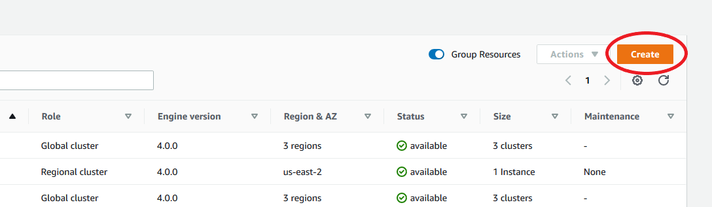 4. Fill out the **Configuration** section of the **Create Amazon DocumentDB Cluster** form accordingly:

    * **Cluster identifier**: You can either enter a unique identifier for this instance or allow Amazon DocumentDB to provide the instance identifier based on the cluster identifier.
    * Engine version: Choose **4.0.0**
    * Instance class: Choose **db.r5.large**
    * Number of instances: Choose **3**.

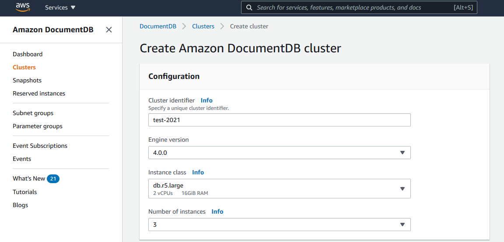 5. In the **Authentication** section, fill in a master username and master password.

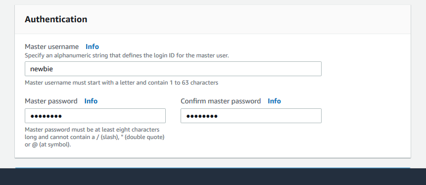 6. Choose **Show advanced settings**.

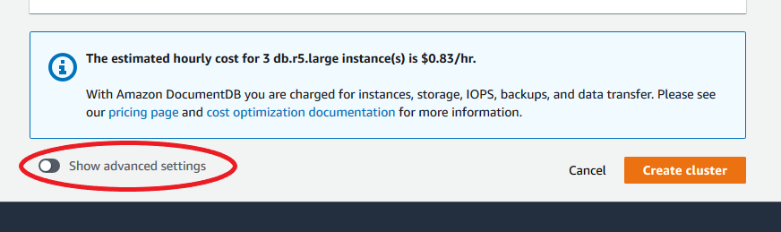 7. In the **Network settings** section:

    * Keep default options for **Virtual Private Cloud (VPC)** and
     **Subnet group**.


    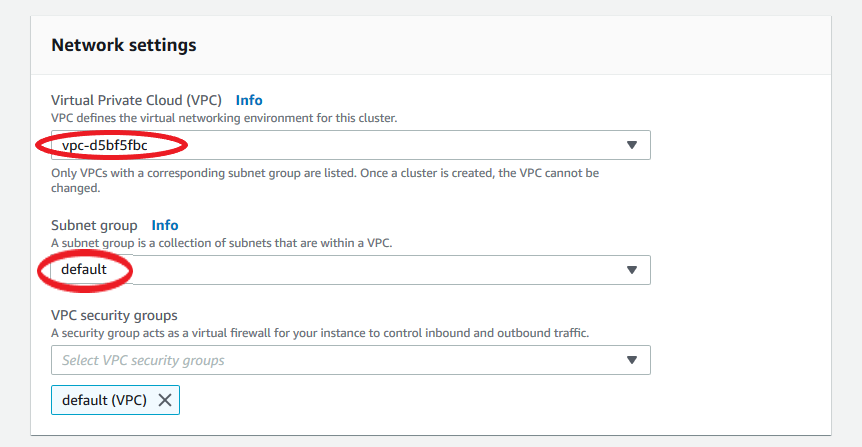
    * For **VPC security groups**, **default (VPC)** should already be added.


    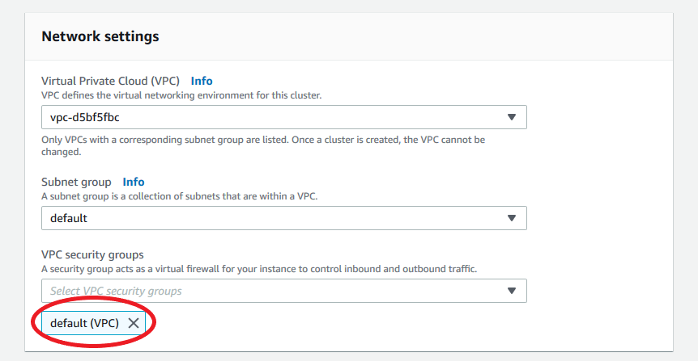
    * Type `DocDB` into the **VPC security groups**
     field and select **DocDB-Inbound (VFC)**.


    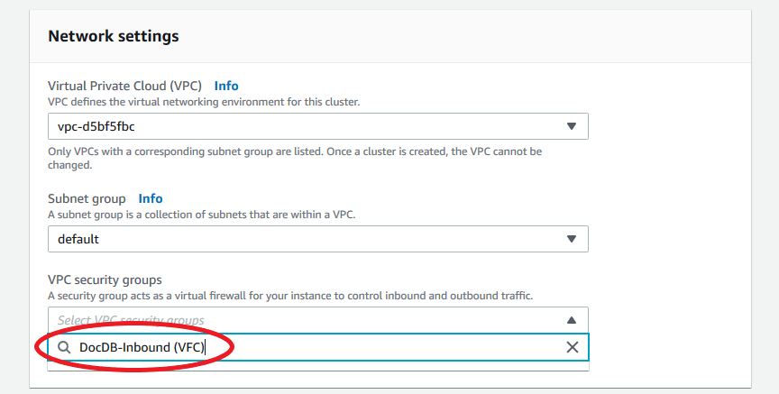

8. For **Cluster options** and **Encryption-at-rest**, leave at default selections.

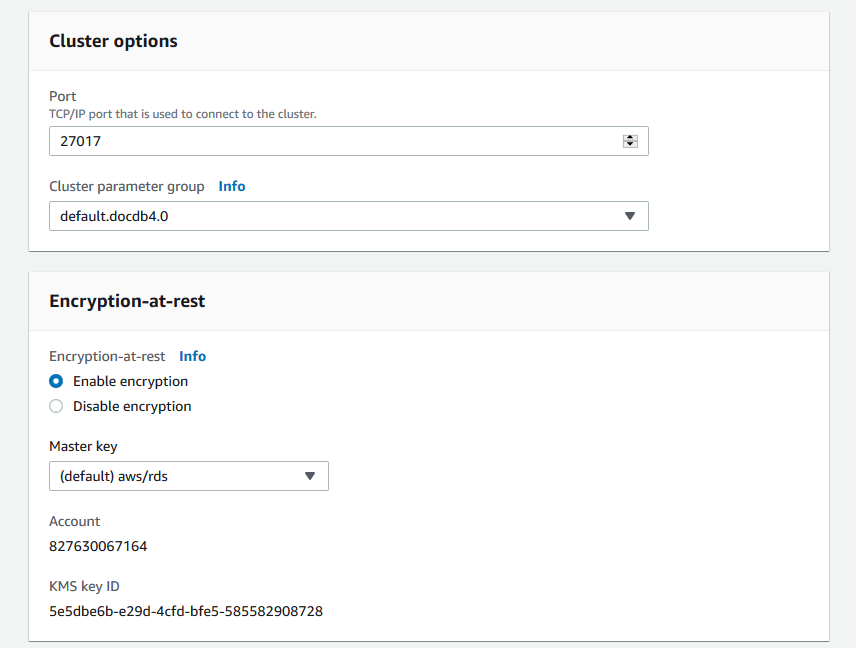 9. For **Backup** and **Log exports**, leave at default selections.

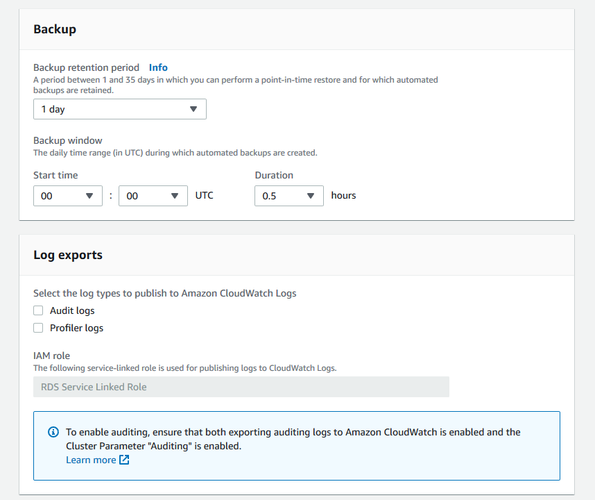 10. For **Maintenance**, **Tags**, and
**Deletion protection**, leave at default selections.

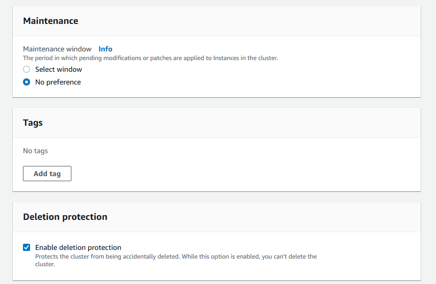 11. Now click the button that says **Create cluster**.

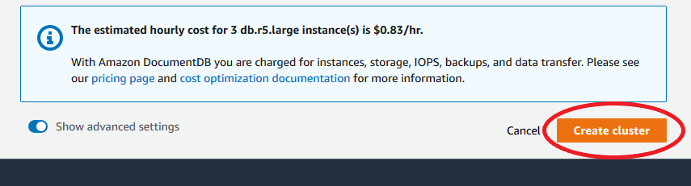

To create an Amazon DocumentDB Regional cluster, call the [create-global-cluster AWS CLI](https://awscli.amazonaws.com/v2/documentation/api/latest/reference/docdb/create-global-cluster.html "https://awscli.amazonaws.com/v2/documentation/api/latest/reference/docdb/create-global-cluster.html"). The following AWS CLI command creates an Amazon DocumentDB cluster named `global-cluster-id`. For more information on deletion protection, see [Deleting an Amazon DocumentDB cluster](db-cluster-delete.md "db-cluster-delete.md").

Also, `--engine-version` is an optional parameter that defaults to the
latest major engine version. The current major engine version is `5.0.0`.
When new major engine versions are released, the default engine version for
`--engine-version` will be updated to reflect the last major engine version.
As a result, for production workloads, and especially those that are dependent on
scripting, automation, or CloudFormation templates, we recommend that you explicitly specify the
`--engine-version` to the intended major version.

If a `db-subnet-group-name` or `vpc-security-group-id` is not
specified, Amazon DocumentDB will use the default subnet group and Amazon VPC security group for the given Region.

In the following example, replace each `user input placeholder` with your own information.

For Linux, macOS, or Unix:

```
aws docdb create-db-cluster \
      --global-cluster-identifier `global-cluster-id` \
      --source-db-cluster-identifier arn:aws:rds:us-east-1:111122223333:`cluster-id`

```

For Windows:

```
aws docdb create-db-cluster ^
      --global-cluster-identifier `global-cluster-id` ^
      --source-db-cluster-identifier arn:aws:rds:us-east-1:111122223333:`cluster-id`

```

Output from this operation looks something like the following (JSON format).

```
{
    "DBCluster": {
        "StorageEncrypted": false,
        "DBClusterMembers": [],
        "Engine": "docdb",
        "DeletionProtection" : "enabled",
        "ClusterCreateTime": "2018-11-26T17:15:19.885Z",
        "DBSubnetGroup": "default",
        "EngineVersion": "4.0.0",
        "MasterUsername": "masteruser",
        "BackupRetentionPeriod": 1,
        "DBClusterArn": "arn:aws:rds:us-east-1:123456789012:cluster:cluster-id",
        "DBClusterIdentifier": "cluster-id",
        "MultiAZ": false,
        "DBClusterParameterGroup": "default.docdb4.0",
        "PreferredBackupWindow": "09:12-09:42",
        "DbClusterResourceId": "cluster-KQSGI4MHU4NTDDRVNLNTU7XVAY",
        "PreferredMaintenanceWindow": "tue:04:17-tue:04:47",
        "Port": 27017,
        "Status": "creating",
        "ReaderEndpoint": "cluster-id.cluster-ro-sfcrlcjcoroz.us-east-1.docdb.amazonaws.com",
        "AssociatedRoles": [],
        "HostedZoneId": "ZNKXTT8WH85VW",
        "VpcSecurityGroups": [
            {
                "VpcSecurityGroupId": "sg-77186e0d",
                "Status": "active"
            }
        ],
        "AvailabilityZones": [
            "us-east-1a",
            "us-east-1c",
            "us-east-1e"
        ],
        "Endpoint": "cluster-id.cluster-sfcrlcjcoroz.us-east-1.docdb.amazonaws.com"
    }
}

```

It takes several minutes to create the cluster. You can use the AWS Management Console or AWS CLI to monitor the status of your cluster. For more information, see [Monitoring an Amazon DocumentDB cluster's status](monitoring_docdb-cluster_status.md "monitoring_docdb-cluster_status.md").

###### Important

When you use the AWS CLI to create an Amazon DocumentDB Regional cluster, no instances are created. Consequently, you must explicitly create a primary instance and any replica instances that you need. You can use either the console or AWS CLI to create the instances. For more information, see [Adding an Amazon DocumentDB instance to a cluster](db-instance-add.md "db-instance-add.md") and [CreateDBCluster](API_CreateDBCluster.md "API_CreateDBCluster.md") in the Amazon DocumentDB API Reference.

Once your Regional cluster is available, you can add a secondary cluster in another
Region with the following instructions: [Adding an AWS Region to an Amazon DocumentDB global cluster](#global-clusters.add-region "#global-clusters.add-region"). When you add a Region, your Regional
cluster becomes your primary cluster, and you have a new secondary cluster in the Region you chose.

## Adding an AWS Region to an Amazon DocumentDB global cluster

A global cluster needs at least one secondary cluster in a different Region than the
primary cluster, and you can add up to five secondary clusters. Note that for each
secondary cluster that you add, you must reduce the number of replicas allowed in the
primary cluster by one. For example, if your global cluster has five secondary Regions,
your primary cluster can have only 10 (rather than 15) replicas. For more information, see [Configuration requirements of an Amazon DocumentDB global cluster](global-clusters.md#global-clusters.config "global-clusters.md#global-clusters.config").

1. Sign in to the AWS Management Console and open the Amazon DocumentDB console.
2. In the navigation pane, choose **Clusters**.

 3. Choose the cluster that you would like to add a secondary cluster to. Ensure that the cluster is `Available`.

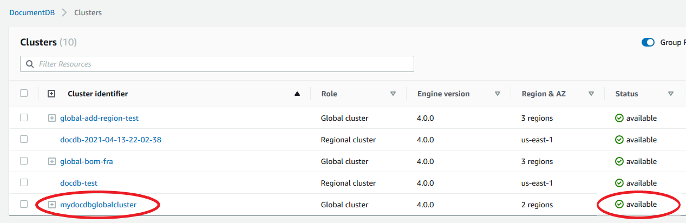 4. Select the dropdown list for **Actions** and then choose
**Add Region**.

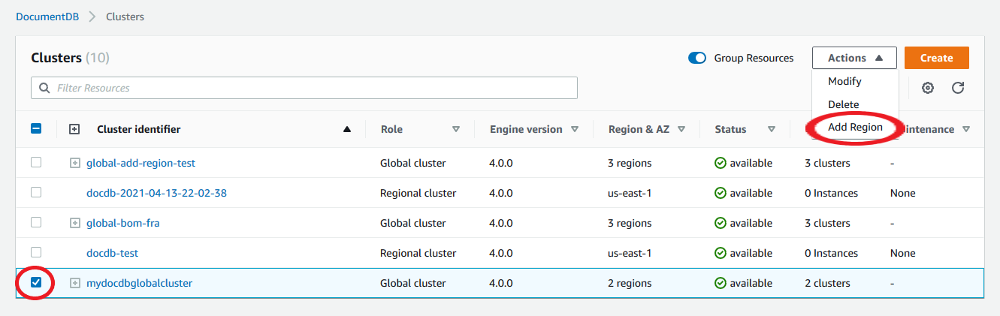 5. On the **Add an AWS Region** page, choose the secondary Region. Note
that you can't choose a Region that already has a secondary cluster for the same
global cluster. Also, it can't be the same Region as the primary cluster. If this
is the first Region you are adding, you will also have to specify a global cluster identifier of your choice.

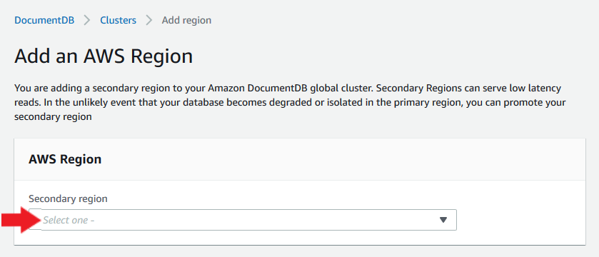 6. Complete the remaining fields for the secondary cluster in the new Region, then
select **Create cluster**. After you finish adding the Region, you can see it in the list of **Clusters** in the AWS Management Console.

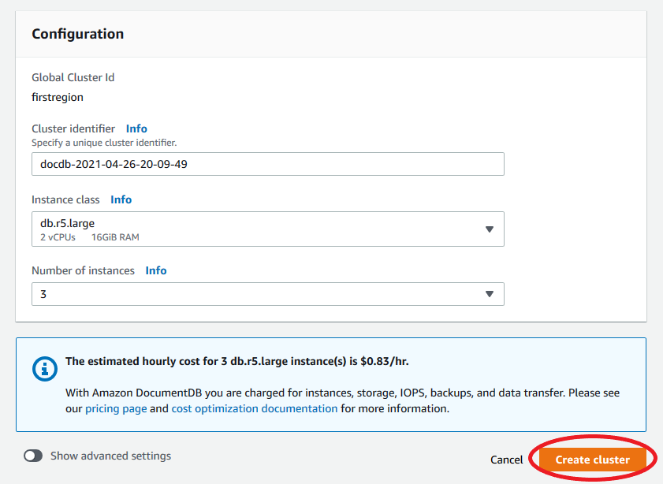

- Use the `create-db-cluster` CLI command with the name `(--global-cluster-identifier)` of your global cluster. For other parameters, do the following:

      + For `--region`, choose a different AWS Region than that of
       your primary Region.
      + Choose specific values for the `--engine` and `--engine-version` parameters.
      + For an encrypted cluster, specify your primary AWS Region as the `--source-region` for encryption.

  The following example creates a new Amazon DocumentDB cluster and attaches it to the global cluster as a read-only secondary cluster. In the last step, the instance is added to the new cluster.

In the following example, replace each `user input placeholder` with your own information.

For Linux, macOS, or Unix:

```
aws docdb --region `secondary-region-id` \
  create-db-cluster \
    --db-cluster-identifier `cluster-id` \
    --global-cluster-identifier `global-cluster-id` \
    --engine-version `version` \
    --engine docdb

aws docdb --region `secondary-region-id` \
  create-db-instance \
    --db-cluster-identifier `cluster-id` \
    --global-cluster-identifier `global-cluster-id` \
    --engine-version `version` \
    --engine docdb

```

For Windows:

```
aws docdb --region `secondary-region-id` ^
  create-db-cluster ^
    --db-cluster-identifier `cluster-id` ^
    --global-cluster-identifier `global-cluster-id` ^
    --engine-version `version` ^
    --engine docdb

aws docdb --region `secondary-region-id` ^
  create-db-instance ^
    --db-cluster-identifier `cluster-id` ^
    --global-cluster-identifier `global-cluster-id` ^
    --engine-version `version` ^
    --engine docdb

```

## Using a snapshot for your Amazon DocumentDB global cluster

You can restore a snapshot of an Amazon DocumentDB cluster to use as the starting point for your
global cluster. To do this, you must restore the snapshot and create a new cluster. This will serve as the primary cluster of your global cluster. You can then add another Region to the restored cluster, thus converting it into a global cluster.
