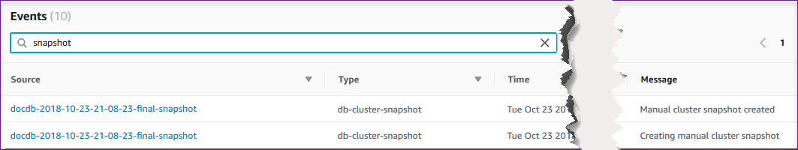

# Managing Amazon DocumentDB events

Amazon DocumentDB (with MongoDB compatibility) keeps a record of events that relate to your clusters, instances, snapshots, security groups, and cluster parameter groups. This
information includes the date and time of the event, the source name and source type of the event, and a message that is associated with the event.

###### Important

For certain management features, Amazon DocumentDB uses operational technology that is shared with
Amazon RDS and Amazon Neptune. Region limits, limits that are governed at the Region level, are
shared between Amazon DocumentDB, Amazon RDS, and Amazon Neptune. For more information, see [Regional quotas](limits.md#limits-regional_quotas "limits.md#limits-regional_quotas").

###### Topics

- [Viewing Amazon DocumentDB event categories](#viewing-event-categories "#viewing-event-categories")
- [Viewing Amazon DocumentDB events](#viewing-events "#viewing-events")

## Viewing Amazon DocumentDB event categories

Each Amazon DocumentDB resource type has specific types of events that can be associated with it. You can use the AWS CLI `describe-event-categories`
operation to view the mapping between event types and Amazon DocumentDB resource types.

###### Parameters

- `--source-type`—Optional. Use the `--source-type` parameter to see the event categories for a
  particular source type. The following are permitted values:
  - `db-cluster`
  - `db-instance`
  - `db-parameter-group`
  - `db-security-group`
  - `db-cluster-snapshot`

- `--filters`—Optional. To view the event categories for just Amazon DocumentDB, use the filter `--filter
Name=engine,Values=docdb`.

###### Example

The following code lists the event categories associated with clusters.

For Linux, macOS, or Unix:

```
aws docdb describe-event-categories \
    --filter Name=engine,Values=docdb \
    --source-type `db-cluster`
```

For Windows:

```
aws docdb describe-event-categories ^
    --filter Name=engine,Values=docdb ^
    --source-type `db-cluster`
```

Output from this operation looks something like the following (JSON format).

```
{
    "EventCategoriesMapList": [
        {
            "EventCategories": [
                "notification",
                "failure",
                "maintenance",
                "failover"
            ],
            "SourceType": "db-cluster"
        }
    ]
}
```

The following code lists the event categories that are associated with each Amazon DocumentDB source type.

```
aws docdb describe-event-categories
```

Output from this operation looks something like the following (JSON format).

```
{
    "EventCategoriesMapList": [
        {
            "SourceType": "db-instance",
            "EventCategories": [
                "notification",
                "failure",
                "creation",
                "maintenance",
                "deletion",
                "recovery",
                "restoration",
                "configuration change",
                "read replica",
                "backtrack",
                "low storage",
                "backup",
                "availability",
                "failover"
            ]
        },
        {
            "SourceType": "db-security-group",
            "EventCategories": [
                "configuration change",
                "failure"
            ]
        },
        {
            "SourceType": "db-parameter-group",
            "EventCategories": [
                "configuration change"
            ]
        },
        {
            "SourceType": "db-cluster",
            "EventCategories": [
                "notification",
                "failure",
                "maintenance",
                "failover"
            ]
        },
        {
            "SourceType": "db-cluster-snapshot",
            "EventCategories": [
                "backup"
            ]
        }
    ]
}
```

## Viewing Amazon DocumentDB events

You can retrieve events for your Amazon DocumentDB resources through the Amazon DocumentDB console, which shows events from the past 24 hours. You can also retrieve
events for your Amazon DocumentDB resources by using the [describe-events](../../../cli/latest/reference/docdb/describe-events.md "../../../cli/latest/reference/docdb/describe-events.md")
AWS CLI command, or the [DescribeEvents](API_DescribeEvents.md "API_DescribeEvents.md") Amazon DocumentDB API
operation. If you use the AWS CLI or the Amazon DocumentDB API to view events, you can retrieve events for up to the past 14 days.

Using the AWS Management Console

###### To view all Amazon DocumentDB instance events for the past 24 hours

1. Sign in to the AWS Management Console, and open the Amazon DocumentDB console at [https://console.aws.amazon.com/docdb](https://console.aws.amazon.com/docdb "https://console.aws.amazon.com/docdb").
2. In the navigation pane, choose **Events**. The available events appear in a list.
3. Use the **Filter** list to filter the events by type. Enter a term in the text box to further filter your results. For
   example, the following screenshot shows filtering all Amazon DocumentDB events for _snapshot_ events.



Using the AWS CLI

###### To view all Amazon DocumentDB instance events for the past 7 days

You can view all Amazon DocumentDB instance events for the past 7 days by running the [describe-events](../../../cli/latest/reference/docdb/describe-events.md "../../../cli/latest/reference/docdb/describe-events.md") AWS CLI operation with the `--duration`
parameter set to `10080` (10,080 minutes).

```
aws docdb describe-events --duration 10080
```

**Filtering for Amazon DocumentDB Events**

To see specific Amazon DocumentDB events, use the `describe-events` operation with the following parameters.

###### Parameters

- `--filter`—Required to limit returned values to Amazon DocumentDB events. Use
  `Name=engine,Values=docdb` to filter all events for Amazon DocumentDB only.
- `--source-identifier`—Optional. The identifier of the event source for which events are
  returned. If omitted, events from all sources are included in the results.
- `--source-type`—Optional, unless `--source-identifier` is provided, then required.
  If `--source-identifier` is provided, `--source-type` must agree with the type of the
  `--source-identifier`. The following are permitted values:
  - `db-cluster`
  - `db-instance`
  - `db-parameter-group`
  - `db-security-group`
  - `db-cluster-snapshot`

The following example lists all your Amazon DocumentDB events.

```
aws docdb describe-events --filters Name=engine,Values=docdb
```

Output from this operation looks something like the following (JSON format).

```
{
    "Events": [
        {
            "SourceArn": "arn:aws:rds:us-east-1:123SAMPLE012:db:sample-cluster-instance3",
            "Message": "instance created",
            "SourceType": "db-instance",
            "Date": "2018-12-11T21:17:40.023Z",
            "SourceIdentifier": "sample-cluster-instance3",
            "EventCategories": [
                "creation"
            ]
        },
        {
            "SourceArn": "arn:aws:rds:us-east-1:123SAMPLE012:db:docdb-2018-12-11-21-08-23",
            "Message": "instance shutdown",
            "SourceType": "db-instance",
            "Date": "2018-12-11T21:25:01.245Z",
            "SourceIdentifier": "docdb-2018-12-11-21-08-23",
            "EventCategories": [
                "availability"
            ]
        },
        {
            "SourceArn": "arn:aws:rds:us-east-1:123SAMPLE012:db:docdb-2018-12-11-21-08-23",
            "Message": "instance restarted",
            "SourceType": "db-instance",
            "Date": "2018-12-11T21:25:11.441Z",
            "SourceIdentifier": "docdb-2018-12-11-21-08-23",
            "EventCategories": [
                "availability"
            ]
        }
    ]
}
```

For more information, see [Auditing Amazon DocumentDB events](event-auditing.md "event-auditing.md").
