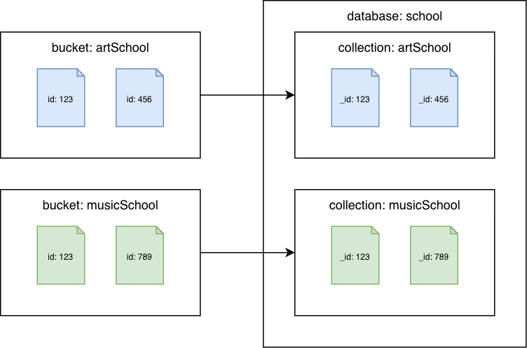
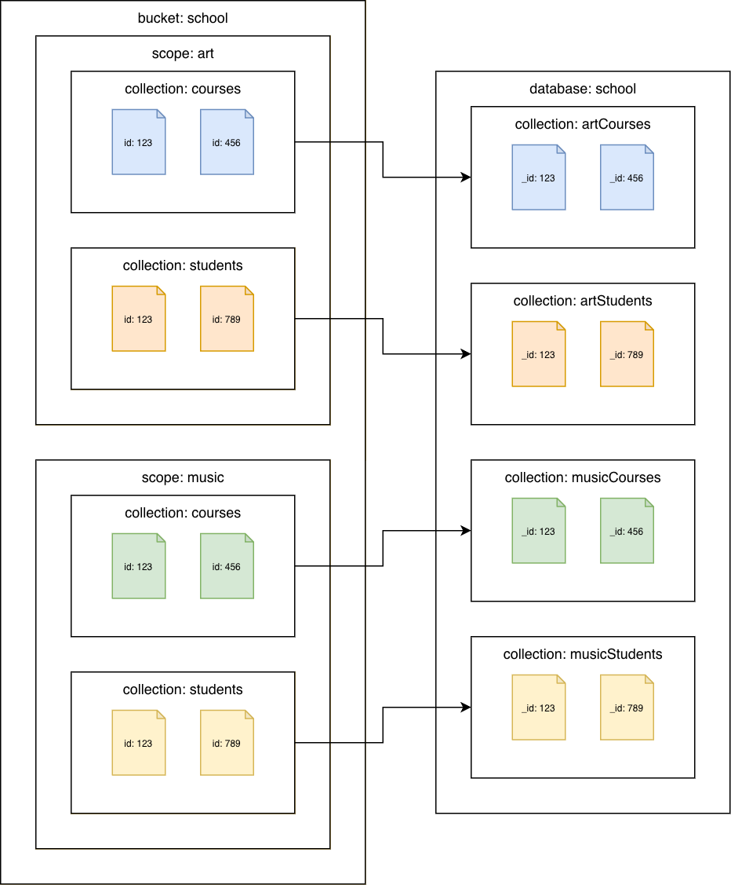

# Migration from Couchbase Server

###### Topics

- [Introduction](#introduction "#introduction")
- [Comparison to Amazon DocumentDB](#comparison-to-amazon-documentdb "#comparison-to-amazon-documentdb")
- [Discovery](#discovery "#discovery")
- [Planning](#planning "#planning")
- [Migration](#migration "#migration")
- [Validation](#validation "#validation")

## Introduction

This guide presents the key points to consider when migrating from Couchbase Server to Amazon DocumentDB. It explains considerations for the discovery, planning, execution, and validation phases of your migration. It also explains how to perform offline and online migrations.

## Comparison to Amazon DocumentDB

|                                               | **Couchbase Server**                                                                                                                                                                                                                                                                                                                                     | **Amazon DocumentDB**                                                                                                                                                                                                                                                                                                                                                                                                                         |
| --------------------------------------------- | -------------------------------------------------------------------------------------------------------------------------------------------------------------------------------------------------------------------------------------------------------------------------------------------------------------------------------------------------------- | --------------------------------------------------------------------------------------------------------------------------------------------------------------------------------------------------------------------------------------------------------------------------------------------------------------------------------------------------------------------------------------------------------------------------------------------- |
| **Data Organization**                         | In versions 7.0 and later, data is organized into buckets, scopes, and collections. In earlier versions, data is organized into buckets.                                                                                                                                                                                                                 | Data is organized into databases and collections.                                                                                                                                                                                                                                                                                                                                                                                             |
| **Compatibility**                             | There are separate APIs for each service (e.g. data, index, search, etc.). Secondary lookups use SQL++ (formerly known an N1QL); a query language based on ANSI-standard SQL so it is familiar to many developers.                                                                                                                                       | Amazon DocumentDB is [compatible with the MongoDB API](compatibility.md "compatibility.md").                                                                                                                                                                                                                                                                                                                                                  |
| **Architecture**                              | Storage is attached to each cluster instance. You cannot scale compute independently of storage.                                                                                                                                                                                                                                                         | Amazon DocumentDB is designed for the cloud and to avoid the limitations of traditional database architectures. The [compute and storage layers are separated](db-clusters-understanding.md "db-clusters-understanding.md") in Amazon DocumentDB and the compute layer can be [scaled independently of storage](how-it-works.md "how-it-works.md").                                                                                           |
| **Add read capacity on demand**               | Clusters can be scaled out by adding instances. Since storage is attached to the instance where the service is running, the time it takes to scale out is dependent on the amount of data that needs to be moved to the new instance, or rebalanced.                                                                                                     | You can achieve read scaling for your Amazon DocumentDB cluster by [creating up to 15 Amazon DocumentDB replicas](db-cluster-manage-performance.md#db-cluster-manage-scaling-reads "db-cluster-manage-performance.md#db-cluster-manage-scaling-reads") in the cluster. There is no impact to the storage layer.                                                                                                                               |
| **Recover quickly from node failure**         | Clusters have automatic failover capabilities but the time to get the cluster back to full strength is dependent on the amount of data that needs to be moved to the new instance.                                                                                                                                                                       | Amazon DocumentDB can [failover the primary](failover.md "failover.md") typically within 30 seconds and restore the cluster back to full strength in 8-10 minutes regardless of the amount of data in the cluster.                                                                                                                                                                                                                            |
| **Scale storage as data grows**               | For self-managed clusters storage and IOs do not scale automatically.                                                                                                                                                                                                                                                                                    | Amazon DocumentDB [storage and IOs scale automatically](db-cluster-manage-performance.md#db-cluster-manage-scaling-storage "db-cluster-manage-performance.md#db-cluster-manage-scaling-storage").                                                                                                                                                                                                                                             |
| **Backup data without affecting performance** | Backups are performed by the backup service and are not enabled by default. Since storage and compute are not separated there can be an impact to performance.                                                                                                                                                                                           | Amazon DocumentDB backups are enabled by default and cannot be turned off. Backups are handled by the storage layer, so they are zero-impact on the compute layer. Amazon DocumentDB supports [restoring from a cluster snapshot](backup_restore-restore_from_snapshot.md "backup_restore-restore_from_snapshot.md") and [restoring to a point in time](backup_restore-point_in_time_recovery.md "backup_restore-point_in_time_recovery.md"). |
| **Data durability**                           | There can be a maximum of 3 replica copies of data in a cluster for a total of 4 copies. Each instance where the data service is running will have active and 1, 2, or 3 replica copies of the data.                                                                                                                                                     | Amazon DocumentDB maintains 6 copies of data no matter how many compute instances there are with a write quorum of 4 and persist true. Clients receive an acknowledgement after the storage layer has persisted 4 copies of the data.                                                                                                                                                                                                         |
| **Consistency**                               | Immediate consistency for K/V operations is supported. The Couchbase SDK routes K/V requests to the specific instance that contains the active copy of the data so once an update is acknowledged, the client is guaranteed to read that update. Replication of updates to other services (index, search, analytics, eventing) is eventually consistent. | Amazon DocumentDB replicas are eventually consistent. If immediate consistency reads are required, the client can read from the primary instance.                                                                                                                                                                                                                                                                                             |
| **Replication**                               | Cross-Data Center Replication (XDCR) provides filtered, active-passive/active-active replication of data in many:many topologies.                                                                                                                                                                                                                        | [Amazon DocumentDB global clusters](global-clusters.md "global-clusters.md") provide active-passive replication in 1:many (up to 10) topologies.                                                                                                                                                                                                                                                                                              |

## Discovery

Migrating to Amazon DocumentDB requires a thorough understanding of the existing database workload. Workload discovery is the process of analyzing your Couchbase cluster configuration and operational characteristics – data set, indexes, and workload – to ensure a seamless transition with minimal disruption.

### Cluster configuration

Couchbase uses a service-centric architecture where each capability corresponds to a service. Execute the following command against your Couchbase cluster to determine which services are being used (see [Getting Information on Nodes](https://docs.couchbase.com/server/current/rest-api/rest-node-get-info.html "https://docs.couchbase.com/server/current/rest-api/rest-node-get-info.html")):

```
curl -v -u <administrator>:<password> \
  http://<ip-address-or-hostname>:<port>/pools/nodes | \
  jq '[.nodes[].services[]] | unique'
```

Sample output:

```
[
  "backup",
  "cbas",
  "eventing",
  "fts",
  "index",
  "kv",
  "n1ql"
]
```

Couchbase services include the following:

#### Data service (kv)

The data service provides read/write access to data in memory and on disk.

Amazon DocumentDB supports K/V operations on JSON data via the [MongoDB API](java-crud-operations.md "java-crud-operations.md").

#### Query service (n1ql)

The query service supports the querying of JSON data via SQL++.

Amazon DocumentDB supports the querying of JSON data via the MongoDB API.

#### Index service (index)

The index service creates and maintains indexes on data, enabling faster querying.

Amazon DocumentDB supports a default primary index and the creation of secondary indexes on JSON data via the MongoDB API.

#### Search service (fts)

The search service supports the creation of indexes for full text search.

Amazon DocumentDB's native full text search feature allows you to [perform text search on large textual data sets using special purpose text indexes](text-search.md "text-search.md") via the MongoDB API. For advanced search use cases, [Amazon DocumentDB zero-ETL integration with Amazon OpenSearch Service](https://aws.amazon.com/blogs/big-data/amazon-documentdb-zero-etl-integration-with-amazon-opensearch-service-is-now-available/ "https://aws.amazon.com/blogs/big-data/amazon-documentdb-zero-etl-integration-with-amazon-opensearch-service-is-now-available/") provides advanced search capabilities, such as fuzzy search, cross-collection search and multilingual search, on Amazon DocumentDB data.

#### Analytics service (cbas)

The analytics service supports analyzing JSON data in near real-time.

Amazon DocumentDB supports ad-hoc queries on JSON data via the MongoDB API. You can also [run complex queries on your JSON data in Amazon DocumentDB using Apache Spark running on Amazon EMR](https://aws.amazon.com/blogs/database/run-complex-queries-on-massive-amounts-of-data-stored-on-your-amazon-documentdb-clusters-using-apache-spark-running-on-amazon-emr/ "https://aws.amazon.com/blogs/database/run-complex-queries-on-massive-amounts-of-data-stored-on-your-amazon-documentdb-clusters-using-apache-spark-running-on-amazon-emr/").

#### Eventing service (eventing)

The eventing service executes user-defined business logic in response to data changes.

Amazon DocumentDB automates event-driven workloads by [invoking AWS Lambda functions each time that data changes with your Amazon DocumentDB cluster](../../../lambda/latest/dg/with-documentdb-tutorial.md "../../../lambda/latest/dg/with-documentdb-tutorial.md").

#### Backup service (backup)

The backup service schedules full and incremental data backups and merges of previous data backups.

Amazon DocumentDB continuously backs up your data to Amazon S3 with a retention period of 1–35 days so that you can quickly restore to any point within the backup retention period. Amazon DocumentDB also takes automatic snapshots of your data as part of this continuous backup process. You can also [manage backup and restore of Amazon DocumentDB with AWS Backup.](https://aws.amazon.com/blogs/storage/manage-backup-and-restore-of-amazon-documentdb-with-aws-backup/ "https://aws.amazon.com/blogs/storage/manage-backup-and-restore-of-amazon-documentdb-with-aws-backup/").

### Operational characteristics

Use the [Discovery Tool for Couchbase](https://github.com/awslabs/amazon-documentdb-tools/tree/master/migration/discovery-tool-for-couchbase "https://github.com/awslabs/amazon-documentdb-tools/tree/master/migration/discovery-tool-for-couchbase") to get the following information about your data set, indexes, and workload. This information will help you size your Amazon DocumentDB cluster.

#### Data set

The tool retrieves the following bucket, scope, and collection information:

1. bucket name
2. bucket type
3. scope name
4. collection name
5. total size (bytes)
6. total items
7. item size (bytes)

#### Indexes

The tool retrieves the following index statistics and all index definitions for all buckets. Note that primary indexes are excluded since Amazon DocumentDB automatically creates a primary index for each collection.

1. bucket name
2. scope name
3. collection name
4. index name
5. index size (bytes)

#### Workload

The tool retrieves K/V and N1QL query metrics. K/V metric values are gathered at the bucket level and SQL++ metrics are gathered at the cluster level.

The tool command line options are as follows:

```
python3 discovery.py \
  --username <source cluster username> \
  --password <source cluster password> \
  --data_node <data node IP address or DNS name> \
  --admin_port <administration http REST port> \
  --kv_zoom <get bucket statistics for specified interval> \
  --tools_path <full path to Couchbase tools> \
  --index_metrics <gather index definitions and SQL++ metrics> \
  --indexer_port <indexer service http REST port> \
  --n1ql_start <start time for sampling> \
  --n1ql_step <sample interval over the sample period>
```

Here is an example command:

```
python3 discovery.py \
  --username username \
  --password ******** \
  --data_node "http://10.0.0.1" \
  --admin_port 8091 \
  --kv_zoom week \
  --tools_path "/opt/couchbase/bin" \
  --index_metrics true \
  --indexer_port 9102 \
  --n1ql_start -60000 \
  --n1ql_step 1000
```

K/V metric values will be based on samples every 10 minutes for the past week (see [HTTP method and URI](https://docs.couchbase.com/server/current/rest-api/rest-bucket-stats.html#http-method-and-uri "https://docs.couchbase.com/server/current/rest-api/rest-bucket-stats.html#http-method-and-uri")). SQL++ metric values will based on samples every 1 seconds for the past 60 seconds (see [General Labels](https://docs.couchbase.com/server/current/rest-api/rest-statistics-single.html#general-labels "https://docs.couchbase.com/server/current/rest-api/rest-statistics-single.html#general-labels")). The output of the command will be in the following files:

**collection-stats.csv** – bucket, scope, and collection information

```
bucket,bucket_type,scope_name,collection_name,total_size,total_items,document_size
beer-sample,membase,_default,_default,2796956,7303,383
gamesim-sample,membase,_default,_default,114275,586,196
pillowfight,membase,_default,_default,1901907769,1000006,1902
travel-sample,membase,inventory,airport,547914,1968,279
travel-sample,membase,inventory,airline,117261,187,628
travel-sample,membase,inventory,route,13402503,24024,558
travel-sample,membase,inventory,landmark,3072746,4495,684
travel-sample,membase,inventory,hotel,4086989,917,4457
...
```

**index-stats.csv** – index names and sizes

```
bucket,scope,collection,index-name,index-size
beer-sample,_default,_default,beer_primary,468144
gamesim-sample,_default,_default,gamesim_primary,87081
travel-sample,inventory,airline,def_inventory_airline_primary,198290
travel-sample,inventory,airport,def_inventory_airport_airportname,513805
travel-sample,inventory,airport,def_inventory_airport_city,487289
travel-sample,inventory,airport,def_inventory_airport_faa,526343
travel-sample,inventory,airport,def_inventory_airport_primary,287475
travel-sample,inventory,hotel,def_inventory_hotel_city,497125
...
```

**kv-stats.csv** – get, set, and delete metrics for all buckets

```
bucket,gets,sets,deletes
beer-sample,0,0,0
gamesim-sample,0,0,0
pillowfight,369,521,194
travel-sample,0,0,0
```

**n1ql-stats.csv** – SQL++ select, delete, and insert metrics for the cluster

```
selects,deletes,inserts
0,132,87
```

**indexes-<bucket-name>.txt** – index definitions of all indexes in the bucket. Note that primary indexes are excluded since Amazon DocumentDB automatically creates a primary index for each collection.

```
CREATE INDEX `def_airportname` ON `travel-sample`(`airportname`)
CREATE INDEX `def_city` ON `travel-sample`(`city`)
CREATE INDEX `def_faa` ON `travel-sample`(`faa`)
CREATE INDEX `def_icao` ON `travel-sample`(`icao`)
CREATE INDEX `def_inventory_airport_city` ON `travel-sample`.`inventory`.`airport`(`city`)
CREATE INDEX `def_inventory_airport_faa` ON `travel-sample`.`inventory`.`airport`(`faa`)
CREATE INDEX `def_inventory_hotel_city` ON `travel-sample`.`inventory`.`hotel`(`city`)
CREATE INDEX `def_inventory_landmark_city` ON `travel-sample`.`inventory`.`landmark`(`city`)
CREATE INDEX `def_sourceairport` ON `travel-sample`(`sourceairport`)
...
```

## Planning

In the planning phase you will determine Amazon DocumentDB cluster requirements and mapping of the Couchbase buckets, scopes, and collections to Amazon DocumentDB databases and collections.

### Amazon DocumentDB cluster requirements

Use the data gathered in the discovery phase to size your Amazon DocumentDB cluster. See [Instance sizing](best_practices.md#best_practices-instance_sizing "best_practices.md#best_practices-instance_sizing") for more information about sizing your Amazon DocumentDB cluster.

### Mapping buckets, scopes, and collections to databases and collections

Determine the databases and collections that will exist in your Amazon DocumentDB cluster(s). Consider the following options depending on how data is organized in your Couchbase cluster. These are not the only options, but they provide starting points for you to consider.

#### Couchbase Server 6.x or earlier

##### Couchbase buckets to Amazon DocumentDB collections

Migrate each bucket to a different Amazon DocumentDB collection. In this scenario, the Couchbase document `id` value will be used as the Amazon DocumentDB `_id` value.



#### Couchbase Server 7.0 or later

##### Couchbase collections to Amazon DocumentDB collections

Migrate each collection to a different Amazon DocumentDB collection. In this scenario, the Couchbase document `id` value will be used as the Amazon DocumentDB `_id` value.



## Migration

### Index migration

Migrating to Amazon DocumentDB involves transferring not just data but also indexes to maintain query performance and optimize database operations. This section outlines the detailed step-by-step process for migrating indexes to Amazon DocumentDB while ensuring compatibility and efficiency.

Use [Amazon Q](../../../amazonq/latest/qdeveloper-ug/chat-with-q.md "../../../amazonq/latest/qdeveloper-ug/chat-with-q.md") to convert SQL++ `CREATE INDEX` statements to Amazon DocumentDB `createIndex()` commands.

1. Upload the **indexes-<bucket name>.txt** file(s) created by the Discovery Tool for Couchbase.
2. Enter the following prompt:

`Convert the Couchbase CREATE INDEX statements to Amazon DocumentDB createIndex commands`

Amazon Q will generate equivalent Amazon DocumentDB `createIndex()` commands. Note that you may need to update the collection names based on how you [mapped the Couchbase buckets, scopes, and collections to Amazon DocumentDB collections](#mapping-buckets-scopes-and-collections-to-databases-and-collections "#mapping-buckets-scopes-and-collections-to-databases-and-collections").

For example:

**indexes-beer-sample.txt**

```
CREATE INDEX `beerType` ON `beer-sample`(`type`)
CREATE INDEX `code` ON `beer-sample`(`code`) WHERE (`type` = "brewery")
```

Example Amazon Q output (excerpt):

```
db.beerSample.createIndex(
  { "type": 1 },
  {
    "name": "beerType",
    "background": true
  }
)

db.beerSample.createIndex(
  { "code": 1 },
  {
    "name": "code",
    "background": true,
    "partialFilterExpression": { "type": "brewery" }
  }
)
```

For any indexes that Amazon Q is not able to convert, refer to [Managing Amazon DocumentDB indexes](managing-indexes.md "managing-indexes.md") and [Indexes and index properties](mongo-apis.md#mongo-apis-index "mongo-apis.md#mongo-apis-index") for more information.

### Refactor code to use the MongoDB APIs

Clients use the Couchbase SDKs to connect to Couchbase Server. Amazon DocumentDB clients use MongoDB drivers to connect to Amazon DocumentDB. All the languages supported by the Couchbase SDKs are also supported by MongoDB drivers. See [MongoDB Drivers](https://www.mongodb.com/docs/drivers/ "https://www.mongodb.com/docs/drivers/") for more information on the driver for your language.

Because the APIs are different between Couchbase Server and Amazon DocumentDB, you will need to refactor your code to use the appropriate MongoDB APIs. You can use [Amazon Q](../../../amazonq/latest/qdeveloper-ug/chat-with-q.md "../../../amazonq/latest/qdeveloper-ug/chat-with-q.md") to convert the K/V API calls and SQL++ queries to the equivalent MongoDB APIs:

1. Upload the source code file(s).
2. Enter the following prompt:

`Convert the Couchbase API code to Amazon DocumentDB API code`

Using the [Hello Couchbase](https://docs.couchbase.com/python-sdk/current/hello-world/start-using-sdk.html#hello-couchbase "https://docs.couchbase.com/python-sdk/current/hello-world/start-using-sdk.html#hello-couchbase") Python code sample, Amazon Q generates the following (excerpt):

```
from datetime import timedelta
from pymongo import MongoClient

# Connection parameters
database_name = "travel-sample"

# Connect to Amazon DocumentDB cluster
client = MongoClient('<Amazon DocumentDB connection string>')

# Get reference to database and collection
db = client['travel-sample']
airline_collection = db['airline']

# upsert document function
def upsert_document(doc):
    print("\nUpsert Result: ")
    try:
        # key will equal: "airline_8091"
        key = doc["type"] + "_" + str(doc["id"])
        doc['_id'] = key # Amazon DocumentDB uses _id as primary key
        result = airline_collection.update_one(
            {'_id': key},
            {'$set': doc},
            upsert=True
        )
        print(f"Modified count: {result.modified_count}")
    except Exception as e:
        print(e)

# get document function
def get_airline_by_key(key):
    print("\nGet Result: ")
    try:
        result = airline_collection.find_one({'_id': key})
        print(result)
    except Exception as e:
        print(e)

# query for document by callsign
def lookup_by_callsign(cs):
    print("\nLookup Result: ")
    try:
        result = airline_collection.find(
            {'callsign': cs},
            {'name': 1, '_id': 0}
        )
        for doc in result:
            print(doc['name'])
    except Exception as e:
        print(e)

# Test document
airline = {
    "type": "airline",
    "id": 8091,
    "callsign": "CBS",
    "iata": None,
    "icao": None,
    "name": "Couchbase Airways",
}

upsert_document(airline)
get_airline_by_key("airline_8091")
lookup_by_callsign("CBS")
```

Refer to [Connecting programmatically to Amazon DocumentDB](connect_programmatically.md "connect_programmatically.md") for examples of connecting to Amazon DocumentDB in Python, Node.js, PHP, Go, Java, C#/.NET, R, and Ruby.

### Select the migration approach

When migrating data to Amazon DocumentDB, there are two options:

1. [offline migration](#offline-migration "#offline-migration")
2. [online migration](#online-migration "#online-migration")

#### Offline migration

Consider an offline migration when:

- **Downtime is acceptable:** Offline migration involves stopping write operations to the source database, exporting the data, and then importing it to Amazon DocumentDB. This process incurs downtime for your application. If your application or workload can tolerate this period of unavailability, offline migration is a viable option.
- **Migrating smaller datasets or conducting proofs of concept:** For smaller datasets, the time required for the export and import process is relatively short, making offline migration a quick and simple method. It is also well-suited for development, testing, and proof-of-concept environments where downtime is less critical.
- **Simplicity is a priority:** The offline method, using cbexport and mongoimport, is generally the most straightforward approach to migrate data. It avoids the complexities of change data capture (CDC) involved in online migration methods.
- **No ongoing changes need to be replicated:** If the source database is not actively receiving changes during the migration, or if those changes are not critical to be captured and applied to the target during the migration process, then an offline approach is appropriate.

###### Topics

- [Couchbase Server 6.x or earlier](#couchbase-6x-or-earlier-offline "#couchbase-6x-or-earlier-offline")
- [Couchbase Server 7.0 or later](#couchbase-70-or-later-offline "#couchbase-70-or-later-offline")

##### Couchbase Server 6.x or earlier

##### Couchbase bucket to Amazon DocumentDB collection

Export data using [cbexport json](https://docs-archive.couchbase.com/server/6.6/tools/cbexport-json.html "https://docs-archive.couchbase.com/server/6.6/tools/cbexport-json.html") to create a JSON dump of all data in the bucket. For the `--format` option you can use `lines` or `list`.

```
cbexport json \
  --cluster <source cluster endpoint> \
  --bucket <bucket name> \
  --format <lines | list> \
  --username <username> \
  --password <password> \
  --output export.json \
  --include-key _id
```

Import the data to an Amazon DocumentDB collection using [mongoimport](backup_restore-dump_restore_import_export_data.md#backup_restore-dump_restore_import_export_data-mongoimport "backup_restore-dump_restore_import_export_data.md#backup_restore-dump_restore_import_export_data-mongoimport") with the appropriate option to import the lines or list:

lines:

```
mongoimport \
  --db <database> \
  --collection <collection> \
  --uri "<Amazon DocumentDB cluster connection string>" \
  --file export.json
```

list:

```
mongoimport \
  --db <database> \
  --collection <collection> \
  --uri "<Amazon DocumentDB cluster connection string>" \
  --jsonArray \
  --file export.json
```

To perform an offline migration, use the cbexport and mongoimport tools:

##### Couchbase Server 7.0 or later

##### Couchbase bucket with default scope and default collection

Export data using [cbexport json](https://docs.couchbase.com/server/current/tools/cbexport-json.html "https://docs.couchbase.com/server/current/tools/cbexport-json.html") to create a JSON dump of all collections in the bucket. For the `--format` option you can use `lines` or `list`.

```
cbexport json \
  --cluster <source cluster endpoint> \
  --bucket <bucket name> \
  --format <lines | list> \
  --username <username> \
  --password <password> \
  --output export.json \
  --include-key _id
```

Import the data to an Amazon DocumentDB collection using [mongoimport](backup_restore-dump_restore_import_export_data.md#backup_restore-dump_restore_import_export_data-mongoimport "backup_restore-dump_restore_import_export_data.md#backup_restore-dump_restore_import_export_data-mongoimport") with the appropriate option to import the lines or list:

lines:

```
mongoimport \
  --db <database> \
  --collection <collection> \
  --uri "<Amazon DocumentDB cluster connection string>" \
  --file export.json
```

list:

```
mongoimport \
  --db <database> \
  --collection <collection> \
  --uri "<Amazon DocumentDB cluster connection string>" \
  --jsonArray \
  --file export.json
```

##### Couchbase collections to Amazon DocumentDB collections

Export data using [cbexport json](https://docs.couchbase.com/server/current/tools/cbexport-json.html "https://docs.couchbase.com/server/current/tools/cbexport-json.html") to create a JSON dump of each collection. Use the `--include-data` option to export each collection. For the `--format` option you can use `lines` or `list`. Use the `--scope-field` and `--collection-field` options to store the name of the scope and collection in the specified fields in each JSON document.

```
cbexport json \
  --cluster <source cluster endpoint> \
  --bucket <bucket name> \
  --include-data <scope name>.<collection name> \
  --format <lines | list> \
  --username <username> \
  --password <password> \
  --output export.json \
  --include-key _id \
  --scope-field "_scope" \
  --collection-field "_collection"
```

Since cbexport added the `_scope` and `_collection` fields to every exported document, you can remove them from every document in the export file via search and replace, `sed`, or whatever method you prefer.

Import the data for each collection to an Amazon DocumentDB collection using [mongoimport](backup_restore-dump_restore_import_export_data.md#backup_restore-dump_restore_import_export_data-mongoimport "backup_restore-dump_restore_import_export_data.md#backup_restore-dump_restore_import_export_data-mongoimport") with the appropriate option to import the lines or list:

lines:

```
mongoimport \
--db <database> \
--collection <collection> \
--uri "<Amazon DocumentDB cluster connection string>" \
--file export.json
```

list:

```
mongoimport \
--db <database> \
--collection <collection> \
--uri "<Amazon DocumentDB cluster connection string>" \
--jsonArray \
--file export.json
```

#### Online migration

Consider an online migration when you need to minimize downtime and ongoing changes need to be replicated to Amazon DocumentDB in near-real time.

See [How to perform a live migration from Couchbase to Amazon DocumentDB](https://github.com/awslabs/amazon-documentdb-tools/tree/master/migration/migration-utility-for-couchbase "https://github.com/awslabs/amazon-documentdb-tools/tree/master/migration/migration-utility-for-couchbase") to learn how to perform a live migration to Amazon DocumentDB. The documentation walks you through deploying the solution and performing a live migration a bucket to an Amazon DocumentDB cluster.

###### Topics

- [Couchbase Server 6.x or earlier](#couchbase-6x-or-earlier-online "#couchbase-6x-or-earlier-online")
- [Couchbase Server 7.0 or later](#couchbase-70-or-later-online "#couchbase-70-or-later-online")

##### Couchbase Server 6.x or earlier

##### Couchbase bucket to Amazon DocumentDB collection

The [migration utility for Couchbase](https://github.com/awslabs/amazon-documentdb-tools/tree/master/migration/migration-utility-for-couchbase "https://github.com/awslabs/amazon-documentdb-tools/tree/master/migration/migration-utility-for-couchbase") is pre-configured to perform an online migration of a Couchbase bucket to an Amazon DocumentDB collection. Looking at the [sink connector](https://github.com/awslabs/amazon-documentdb-tools/blob/master/migration/migration-utility-for-couchbase/migration-utility-connectors.yaml "https://github.com/awslabs/amazon-documentdb-tools/blob/master/migration/migration-utility-for-couchbase/migration-utility-connectors.yaml") configuration, the `document.id.strategy` parameter is configured to use the message key value as the `_id` field value (see [Sink Connector Id Strategy Properties](https://www.mongodb.com/docs/kafka-connector/current/sink-connector/configuration-properties/id-strategy/#std-label-sink-configuration-id-strategy "https://www.mongodb.com/docs/kafka-connector/current/sink-connector/configuration-properties/id-strategy/#std-label-sink-configuration-id-strategy")):

```

ConnectorConfiguration:
  document.id.strategy: 'com.mongodb.kafka.connect.sink.processor.id.strategy.ProvidedInKeyStrategy'

```

##### Couchbase Server 7.0 or later

##### Couchbase bucket with default scope and default collection

The [migration utility for Couchbase](https://github.com/awslabs/amazon-documentdb-tools/tree/master/migration/migration-utility-for-couchbase "https://github.com/awslabs/amazon-documentdb-tools/tree/master/migration/migration-utility-for-couchbase") is pre-configured to perform an online migration of a Couchbase bucket to an Amazon DocumentDB collection. Looking at the [sink connector](https://github.com/awslabs/amazon-documentdb-tools/blob/master/migration/migration-utility-for-couchbase/migration-utility-connectors.yaml "https://github.com/awslabs/amazon-documentdb-tools/blob/master/migration/migration-utility-for-couchbase/migration-utility-connectors.yaml") configuration, the `document.id.strategy` parameter is configured to use the message key value as the `_id` field value (see [Sink Connector Id Strategy Properties](https://www.mongodb.com/docs/kafka-connector/current/sink-connector/configuration-properties/id-strategy/#std-label-sink-configuration-id-strategy "https://www.mongodb.com/docs/kafka-connector/current/sink-connector/configuration-properties/id-strategy/#std-label-sink-configuration-id-strategy")):

```

ConnectorConfiguration:
  document.id.strategy: 'com.mongodb.kafka.connect.sink.processor.id.strategy.ProvidedInKeyStrategy'

```

##### Couchbase collections to Amazon DocumentDB collections

Configure the [source connector](https://github.com/awslabs/amazon-documentdb-tools/blob/master/migration/migration-utility-for-couchbase/migration-utility-connectors.yaml "https://github.com/awslabs/amazon-documentdb-tools/blob/master/migration/migration-utility-for-couchbase/migration-utility-connectors.yaml") to stream each Couchbase collection in each scope to a separate topic (see [Source Configuration Options](https://docs.couchbase.com/kafka-connector/current/source-configuration-options.html#couchbase.collections "https://docs.couchbase.com/kafka-connector/current/source-configuration-options.html#couchbase.collections")). For example:

```

ConnectorConfiguration:
  # add couchbase.collections configuration
  couchbase.collections: '<scope 1>.<collection 1>, <scope 1>.<collection 2>, ...'

```

Configure the [sink connector](https://github.com/awslabs/amazon-documentdb-tools/blob/master/migration/migration-utility-for-couchbase/migration-utility-connectors.yaml "https://github.com/awslabs/amazon-documentdb-tools/blob/master/migration/migration-utility-for-couchbase/migration-utility-connectors.yaml") to stream from each topic to a separate Amazon DocumentDB collection (see [Sink Connector Configuration Properties](https://github.com/mongodb-labs/mongo-kafka/blob/master/docs/sink.md#sink-connector-configuration-properties "https://github.com/mongodb-labs/mongo-kafka/blob/master/docs/sink.md#sink-connector-configuration-properties")). For example:

```

ConnectorConfiguration:
  # remove collection configuration
  #collection: 'test'

  # modify topics configuration
  topics: '<bucket>.<scope 1>.<collection 1>, <bucket>.<scope 1>.<collection 2>, ...'

  # add topic.override.%s.%s configurations for each topic
  topic.override.<bucket>.<scope 1>.<collection 1>.collection: '<collection>'
  topic.override.<bucket>.<scope 1>.<collection 2>.collection: '<collection>'

```

## Validation

This section provides a detailed validation process to ensure data consistency and integrity after migrating to Amazon DocumentDB. The validation steps apply regardless of the migration method.

###### Topics

- [Verify that all collections exist in the target](#validation-checklist-step-1 "#validation-checklist-step-1")
- [Verify document count between souce and target clusters](#validation-checklist-step-2 "#validation-checklist-step-2")
- [Compare documents between source and target clusters](#validation-checklist-step-3 "#validation-checklist-step-3")

### Verify that all collections exist in the target

#### Couchbase source

option 1: query workbench

```
SELECT RAW `path`
  FROM system:keyspaces
  WHERE `bucket` = '<bucket>'
```

option 2: [cbq](https://docs.couchbase.com/server/current/cli/cbq-tool.html "https://docs.couchbase.com/server/current/cli/cbq-tool.html") tool

```
cbq \
  -e <source cluster endpoint> \
  -u <username> \
  -p <password> \
  -q "SELECT RAW `path`
       FROM system:keyspaces
       WHERE `bucket` = '<bucket>'"
```

#### Amazon DocumentDB target

mongosh (see [Connect to your Amazon DocumentDB cluster](connect-ec2-manual.md#manual-connect-ec2.connect-use "connect-ec2-manual.md#manual-connect-ec2.connect-use")):

```
db.getSiblingDB('<database>')
db.getCollectionNames()
```

### Verify document count between souce and target clusters

#### Couchbase source

##### Couchbase Server 6.x or earlier

option 1: query workbench

```
SELECT COUNT(*)
FROM `<bucket>`
```

option 2: [cbq](https://docs.couchbase.com/server/current/cli/cbq-tool.html "https://docs.couchbase.com/server/current/cli/cbq-tool.html")

```
cbq \
  -e <source cluster endpoint> \
  -u <username> \
  -p <password> \
  -q "SELECT COUNT(*)
       FROM `<bucket:>`"
```

##### Couchbase Server 7.0 or later

option 1: query workbench

```
SELECT COUNT(*)
FROM `<bucket>`.`<scope>`.`<collection>`
```

option 2: [cbq](https://docs.couchbase.com/server/current/cli/cbq-tool.html "https://docs.couchbase.com/server/current/cli/cbq-tool.html")

```
cbq \
  -e <source cluster endpoint> \
  -u <username> \
  -p <password> \
  -q "SELECT COUNT(*)
       FROM `<bucket:>`.`<scope>`.`<collection>`"
```

#### Amazon DocumentDB target

mongosh (see [Connect to your Amazon DocumentDB cluster](connect-ec2-manual.md#manual-connect-ec2.connect-use "connect-ec2-manual.md#manual-connect-ec2.connect-use")):

```
db = db.getSiblingDB('<database>')
db.getCollection('<collection>').countDocuments()
```

### Compare documents between source and target clusters

#### Couchbase source

##### Couchbase Server 6.x or earlier

option 1: query workbench

```
SELECT META().id as _id, *
FROM `<bucket>`
LIMIT 5
```

option 2: [cbq](https://docs.couchbase.com/server/current/cli/cbq-tool.html "https://docs.couchbase.com/server/current/cli/cbq-tool.html")

```
cbq \
  -e <source cluster endpoint>
  -u <username> \
  -p <password> \
  -q "SELECT META().id as _id, *
       FROM `<bucket>` \
       LIMIT 5"
```

##### Couchbase Server 7.0 or later

option 1: query workbench

```
SELECT COUNT(*)
FROM `<bucket>`.`<scope>`.`<collection>`
```

option 2: [cbq](https://docs.couchbase.com/server/current/cli/cbq-tool.html "https://docs.couchbase.com/server/current/cli/cbq-tool.html")

```
cbq \
  -e <source cluster endpoint> \
  -u <username> \
  -p <password> \
  -q "SELECT COUNT(*)
       FROM `<bucket:>`.`<scope>`.`<collection>`"
```

#### Amazon DocumentDB target

mongosh (see [Connect to your Amazon DocumentDB cluster](connect-ec2-manual.md#manual-connect-ec2.connect-use "connect-ec2-manual.md#manual-connect-ec2.connect-use")):

```
db = db.getSiblingDB('<database>')
db.getCollection('<collection>').find({
  _id: {
    $in: [
      <_id 1>, <_id 2>, <_id 3>, <_id 4>, <_id 5>
    ]
  }
})
```
