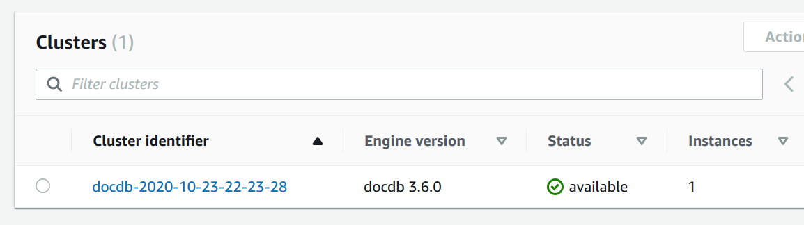

# Monitoring an Amazon DocumentDB cluster's status

The status of a cluster indicates the health of the cluster. You can view the status of
a cluster by using the Amazon DocumentDB console or the AWS CLI `describe-db-clusters`
command.

###### Topics

- [Cluster status values](#monitoring_docdb-status_values "#monitoring_docdb-status_values")
- [Monitoring a cluster's status](#monitor-cluster-status "#monitor-cluster-status")

## Cluster status values

The following table lists the valid values for a cluster's status.

| Cluster Status                        | Description                                                                                                                                                     |
| ------------------------------------- | --------------------------------------------------------------------------------------------------------------------------------------------------------------- |
| `active`                              | The cluster is active. This status applies to elastic clusters only.                                                                                            |
| `available`                           | The cluster is healthy and available. This status applies to instance-based clusters only.                                                                      |
| `backing-up`                          | The cluster is currently being backed up.                                                                                                                       |
| `creating`                            | The cluster is being created. It is inaccessible while it is being<br>created.                                                                                  |
| `deleting`                            | The cluster is being deleted. It is inaccessible while it is being<br>deleted.                                                                                  |
| `failing-over`                        | A failover from the primary instance to an Amazon DocumentDB replica is being<br>performed.                                                                     |
| `inaccessible-encryption-credentials` | The AWS KMS key used to encrypt or decrypt the cluster can't be<br>accessed.                                                                                    |
| `maintenance`                         | A maintenance update is being applied to the cluster. This status is<br>used for cluster-level maintenance that Amazon DocumentDB schedules well in<br>advance. |
| `migrating`                           | A cluster snapshot is being restored to a cluster.                                                                                                              |
| `migration-failed`                    | A migration failed.                                                                                                                                             |
| `modifying`                           | The cluster is being modified because of a customer request to modify<br>the cluster.                                                                           |
| `renaming`                            | The cluster is being renamed because of a customer request to rename<br>it.                                                                                     |
| `resetting-master-credentials`        | The master credentials for the cluster are being reset because of a<br>customer request to reset them.                                                          |
| `upgrading`                           | The cluster engine version is being upgraded.                                                                                                                   |

## Monitoring a cluster's status

Using the AWS Management Console
When using the AWS Management Console to determine the status of a cluster, use the following
procedure.

1. Sign in to the AWS Management Console, and open the Amazon DocumentDB console at [https://console.aws.amazon.com/docdb](https://console.aws.amazon.com/docdb "https://console.aws.amazon.com/docdb").
2. In the navigation pane, choose **Clusters**.
3. In the Clusters navigation box, you'll see the column **Cluster
   identifier**. Your instances are listed under clusters, similar to the
   screenshot below.

 4. In the **Cluster identifier** column, find the name of the
instance that you are interested in. Then, to find the status of the instance,
read across that row to the **Status** column, as shown
below.



Using the AWS CLI
When using the AWS CLI to determine the status of a cluster, use the
`describe-db-clusters` operation. The following code finds the status of
the cluster `sample-cluster`.

For Linux, macOS, or Unix:

```
aws docdb describe-db-clusters \
    --db-cluster-identifier sample-cluster  \
    --query 'DBClusters[*].[DBClusterIdentifier,Status]'
```

For Windows:

```
aws docdb describe-db-clusters ^
    --db-cluster-identifier sample-cluster  ^
    --query 'DBClusters[*].[DBClusterIdentifier,Status]'
```

Output from this operation looks something like the following.

```
[
    [
        "sample-cluster",
        "available"
    ]
]
```
