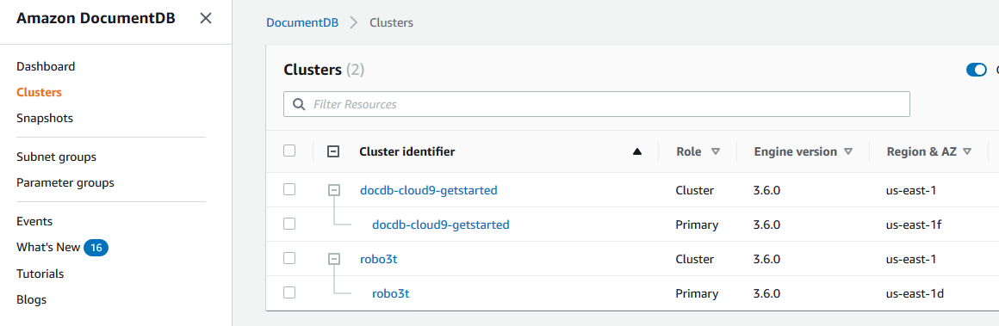
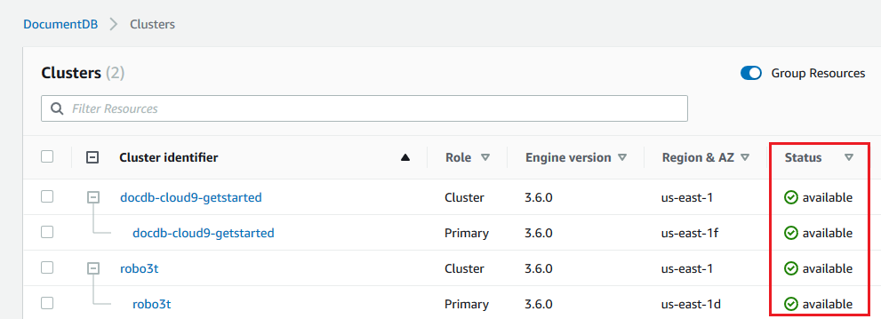
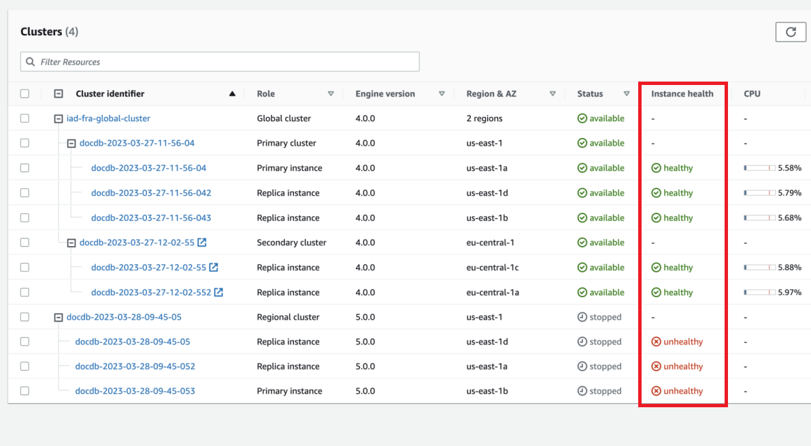

# Monitoring an Amazon DocumentDB instance's status

Amazon DocumentDB provides information about the current condition of each configured instance in the database.

There are three types of status that you can view for an Amazon DocumentDB instance:

- Instance status: This status is shown in the **Status** column of the cluster table in the AWS Management Console and shows the current life cycle condition of the instance.
  The values shown in the **Status** column are derived from the `Status` field of the `DescribeDBCluster` API response.
- Instance health status: This status is shown in the **Instance health** column of the cluster table in the AWS Management Console and shows whether the database engine, the component responsible for managing and retrieving data, is running.
  The values shown in the **Instance health** column are based on the Amazon CloudWatch `EngineUptime` system metric.
- Maintenance status: This status is shown in the **Maintenance** column of the cluster table in the AWS Management Console and indicates the status of any maintenance event that needs to be applied to an instance.
  Maintenance status is independent of the other instance status' and is derived from the `PendingMaintenanceAction` API.
  For more information about maintenance status, see [Maintaining Amazon DocumentDB](db-instance-maintain.md "db-instance-maintain.md").

###### Topics

- [Instance status values](#monitoring_docdb-instance_status-values "#monitoring_docdb-instance_status-values")
- [Monitoring instance status using the AWS Management Console or AWS CLI](#monitoring-instance-status "#monitoring-instance-status")
- [Instance health status values](#instance-health-status-values "#instance-health-status-values")
- [Monitoring instance health status using the AWS Management Console](#monitoring-instance-health-status "#monitoring-instance-health-status")

## Instance status values

The following table lists the possible status values for instances and how you are
billed for each status. It shows if you will be billed for the instance and storage,
only storage, or not billed. For all instance statuses, you are always billed for backup
usage.

| Instance status                       | Billed                                                        | Description                                                                                                                                                                                                                                                                                                                                            |
| ------------------------------------- | ------------------------------------------------------------- | ------------------------------------------------------------------------------------------------------------------------------------------------------------------------------------------------------------------------------------------------------------------------------------------------------------------------------------------------------ | ----------------------------------------------------------------------------------------------------------------------------------------------------------------------------------------------------------------------------------------------------------------------------------------------------------------------------------------------------------------------------------------------------------------------------------------------------------------------------------------------------------------------------------------------------------------------------------------------------------------------------------------------------------------------------------------------------------------------------------------------------------------------------------------------------------------------------------------------------------------------------------------------------------------------------------------------------------------------------------------------------------------------------------------------------------------------------------------------------------------------------------------------------------------------------------------------------------------------------------------------------------------------------------------------------------------------------------------------------------------------------------------------------------------------------------------------------------------------------------------------------------------------------------------------------------------------------------------------------------------------------------------------------------------------------------------------------------------------------------------------------------------------------------------------------------------------------------------------------------------------------------------------------------------------------------------------------------------------------------------------------------------------------------------------------------------------------------------------------------------------------------------------------------------------------------------------------------------------------------------------------------------------------------------------------------------------------------------------------------------- | ----------------------------------------------------------------------- | ------------------------------------------------------------------------------------------------------------------------------------------------------------------------------------------------------------------------------------------------------------------------------------------------------------------------------------------------------------------------------------------------------------------------------------------------------------------------------------------------------------------------------------------------------------------------------------------------------------------------------------------------------------------------------------------------------------------------------------------------------------------------------------------------------------------------------------------------------------------------------------------------------------------------------------------------------------------------------------------------------------------------------------------------------------------------------------------------------------------------------------------------------------------------------------------------------------------------------------------------------------------------------------------------------------------------------------------------------------------------- |
| `available`                           | Billed                                                        | The instance is healthy and available.                                                                                                                                                                                                                                                                                                                 |
| `backing-up`                          | Billed                                                        | The instance is currently being backed up.                                                                                                                                                                                                                                                                                                             |
| `configuring-log-exports`             | Billed                                                        | Publishing log files to Amazon CloudWatch Logs is being enabled or disabled for this instance.                                                                                                                                                                                                                                                         |
| `creating`                            | Not billed                                                    | The instance is being created. The instance is not accessible while it is being created.                                                                                                                                                                                                                                                               |
| `deleting`                            | Not billed                                                    | The instance is being deleted.                                                                                                                                                                                                                                                                                                                         |
| `failed`                              | Not billed                                                    | The instance has failed and Amazon DocumentDB was unable to recover it. To recover the data, perform a point-in-time restore to the latest restorable time of the instance.                                                                                                                                                                            |
| `inaccessible-encryption-credentials` | Not billed                                                    | The AWS KMS key that is used to encrypt or decrypt the instance could not be accessed.                                                                                                                                                                                                                                                                 |
| `incompatible-network`                | Not billed                                                    | Amazon DocumentDB is attempting to perform a recovery action on an instance but is unable to do so because the VPC is in a state that is preventing the action from being completed. This status can occur if, for example, all available IP addresses in a subnet were in use and Amazon DocumentDB was unable to get an IP address for the instance. |
| `maintenance`                         | Billed                                                        | Amazon DocumentDB is applying a maintenance update to the instance. This status is used for instance-level maintenance that Amazon DocumentDB schedules well in advance. We're evaluating ways to expose additional maintenance actions to customers through this status.                                                                              |
| `modifying`                           | Billed                                                        | The instance is being modified because of a request to modify the instance.                                                                                                                                                                                                                                                                            |
| `rebooting`                           | Billed                                                        | The instance is being rebooted because of a request or an Amazon DocumentDB process that requires the rebooting of the instance.                                                                                                                                                                                                                       |
| `renaming`                            | Billed                                                        | The instance is being renamed because of a request to rename it.                                                                                                                                                                                                                                                                                       |
| `resetting-master-credentials`        | Billed                                                        | The master credentials for the instance are being reset because of a request to reset them.                                                                                                                                                                                                                                                            |
| `restore-error`                       | Billed                                                        | The instance encountered an error attempting to restore to a point-in-time or from a snapshot.                                                                                                                                                                                                                                                         |
| `starting`                            | Billed for storage                                            | The instance is starting.                                                                                                                                                                                                                                                                                                                              |
| `stopped`                             | Billed for storage                                            | The instance is stopped.                                                                                                                                                                                                                                                                                                                               |
| `stopping`                            | Billed for storage                                            | The instance is being stopped.                                                                                                                                                                                                                                                                                                                         |
| `storage-full`                        | Billed                                                        | The instance has reached its storage capacity allocation. This is a critical status and should be remedied immediately; scale up your storage by modifying the instance. Set Amazon CloudWatch alarms to warn you when storage space is getting low so you don't run into this situation.                                                              | ## Monitoring instance status using the AWS Management Console or AWS CLI Use the AWS Management Console or AWS CLI to monitor the status of you instance. Using the AWS Management Console When using the AWS Management Console to determine the status of a cluster, use the following procedure. 1. Sign in to the AWS Management Console, and open the Amazon DocumentDB console at [https://console.aws.amazon.com/docdb](https://console.aws.amazon.com/docdb "https://console.aws.amazon.com/docdb"). 2. In the navigation pane, choose **Clusters**. ###### Note Note that in the Clusters navigation box, the column **Cluster identifier** shows both clusters and instances. Instances are listed underneath clusters, similar to the image below.  3. Find the name of the instance that you are interested in. Then, to find the status of the instance, read across that row to the **Status** column, as shown following.  Using the AWS CLI When using the AWS CLI to determine the status of a cluster, use the `describe-db-instances` operation. The following code finds the status of the instance `sample-cluster-instance-01`. For Linux, macOS, or Unix: `aws docdb describe-db-instances \ --db-instance-identifier sample-cluster-instance-01  \ --query 'DBInstances[*].[DBInstanceIdentifier,DBInstanceStatus]'` For Windows: `aws docdb describe-db-instances ^ --db-instance-identifier sample-cluster-instance-01  ^ --query 'DBInstances[*].[DBInstanceIdentifier,DBInstanceStatus]'` Output from this operation looks something like the following. `[ [ "sample-cluster-instance-01", "available" ] ]` ## Instance health status values The following table lists the possible health status values for instances. The **Instance health** column, located in the **Clusters** table in the AWS Management Console, shows whether the database engine, the component responsible for storing, managing, and retrieving data, is operating normally. This column also indicates if the `EngineUptime` system metric, available in CloudWatch, is showing the health status of each instance. |
| Instance health status                | Description                                                   |                                                                                                                                                                                                                                                                                                                                                        | ---                                                                                                                                                                                                                                                                                                                                                                                                                                                                                                                                                                                                                                                                                                                                                                                                                                                                                                                                                                                                                                                                                                                                                                                                                                                                                                                                                                                                                                                                                                                                                                                                                                                                                                                                                                                                                                                                                                                                                                                                                                                                                                                                                                                                                                                                                                                                                               | ---                                                                     |
| healthy                               | Database engine is running in the Amazon DocumentDB instance. |                                                                                                                                                                                                                                                                                                                                                        | unhealthy                                                                                                                                                                                                                                                                                                                                                                                                                                                                                                                                                                                                                                                                                                                                                                                                                                                                                                                                                                                                                                                                                                                                                                                                                                                                                                                                                                                                                                                                                                                                                                                                                                                                                                                                                                                                                                                                                                                                                                                                                                                                                                                                                                                                                                                                                                                                                         | Database engine is not running or has restarted less than a minute ago. | ## Monitoring instance health status using the AWS Management Console Use the AWS Management Console to monitor the health status of you instance. When using AWS Management Console, use the following steps to understand the instance's health status. 1. Sign in to the AWS Management Console, and open the Amazon DocumentDB console at [https://console.aws.amazon.com/docdb](https://console.aws.amazon.com/docdb "https://console.aws.amazon.com/docdb"). 2. In the navigation pane, choose **Clusters**. ###### Note In the **Clusters** navigation box, the column **Cluster identifier** shows both clusters and instances. Instances are listed underneath clusters, similar to the image below.  3. Find the name of the instance that you are interested in. Then, to find the status of the instance, read across that row to the **Instance health** column, as shown in the following image:  ###### Note Instance health status polling occurs every 60 seconds and is based on the CloudWatch `EngineUptime` system metric. The values in the **Instance health** column are automatically updated. |
