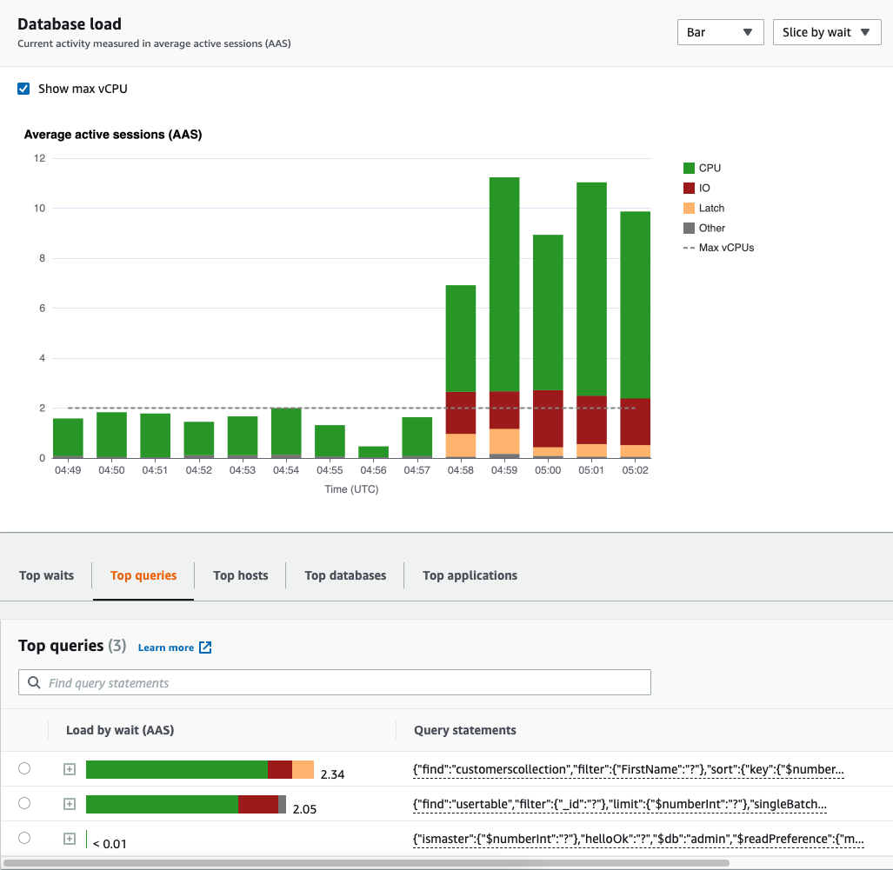
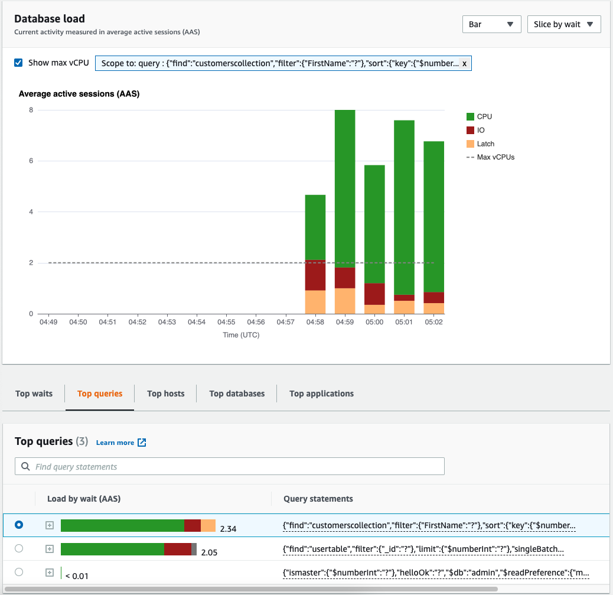

# Analyzing database load by wait states

If the **Database load (DB load)** chart shows a
bottleneck, you can find out where the load is coming from. To do so, look at the
top load items table below the **Database load** chart.
Choose a particular item, like a query or an application, to drill down into that
item and see details about it.

DB load grouped by waits and top queries typically provides the most insight into
performance issues. DB load grouped by waits shows if there are any resource or
concurrency bottlenecks in the database. In this case, the **Top
queries** tab of the top load items table shows which queries are
driving that load.

Your typical workflow for diagnosing performance issues is as follows:

1. Review the **Database load** chart and see if
   there are any incidents of database load exceeding the **Max CPU** line.
2. If there is, look at the **Database load**
   chart and identify which wait state or states are primarily
   responsible.
3. Identify the digest queries causing the load by seeing which of the
   queries the **Top queries** tab on the top load
   items table are contributing most to those wait states. You can identify
   these by the **Load by Wait (AAS)**
   column.
4. Choose one of these digest queries in the **Top
   queries** tab to expand it and see the child queries that it is
   composed of.
   You can also see which hosts or applications are contributing the most load by
   selecting **Top hosts** or **Top
   applications**, respectively. Application names are specified in the
   connection string to the Amazon DocumentDB instance. `Unknown` indicates that the
   application field was not specified.

For example, in the following dashboard, **CPU**
waits account for most of the DB load. Selecting the top query under **Top queries** will scope the Database load chart to focus
on the most load that is being contributed by the select query.

