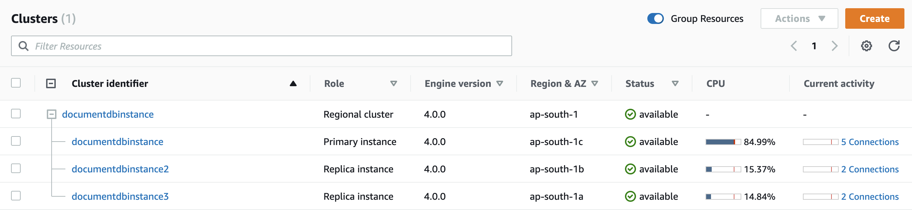
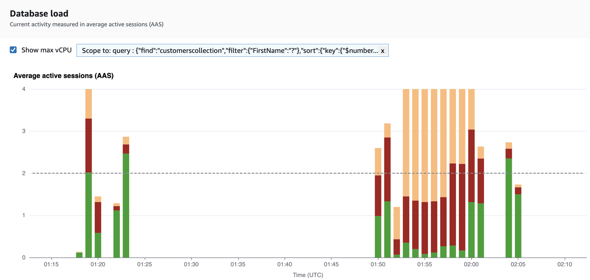

# Opening the Performance Insights dashboard

###### To view the Performance Insights dashboard in the AWS Management Console,

use the following steps:

1. Open the Performance Insights console at [https://console.aws.amazon.com/docdb/](https://console.aws.amazon.com/docdb/home#performance-insights "https://console.aws.amazon.com/docdb/home#performance-insights").
2. Choose a DB instance. The Performance Insights dashboard is shown for that
   Amazon DocumentDB instance.

For Amazon DocumentDB instances with Performance Insights enabled, you can
also reach the dashboard by choosing the **Sessions** item in the list of instances. Under **Current activity**, the **Sessions** item shows the database load in average active
sessions over the last five minutes. The bar graphically shows the load.
When the bar is empty, the instance is idle. As the load increases, the bar
fills with blue. When the load passes the number of virtual CPUs (vCPUs) on
the instance class, the bar turns red, indicating a potential
bottleneck.

 3. (Optional) Choose a different time interval by selecting a button in the
upper right. For example, to change the interval to 1 hour, select **1h**.

In the following screenshot, the DB load interval is 1 hour.

 4. To refresh your data automatically, enable **Auto
refresh**.

The Performance Insight dashboard automatically refreshes with new data.
The refresh rate depends on the amount of data displayed:

    * 5 minutes refreshes every 5 seconds.
    * 1 hour refreshes every minute.
    * 5 hours refreshes every minute.
    * 24 hours refreshes every 5 minutes.
    * 1 week refreshes every hour.
