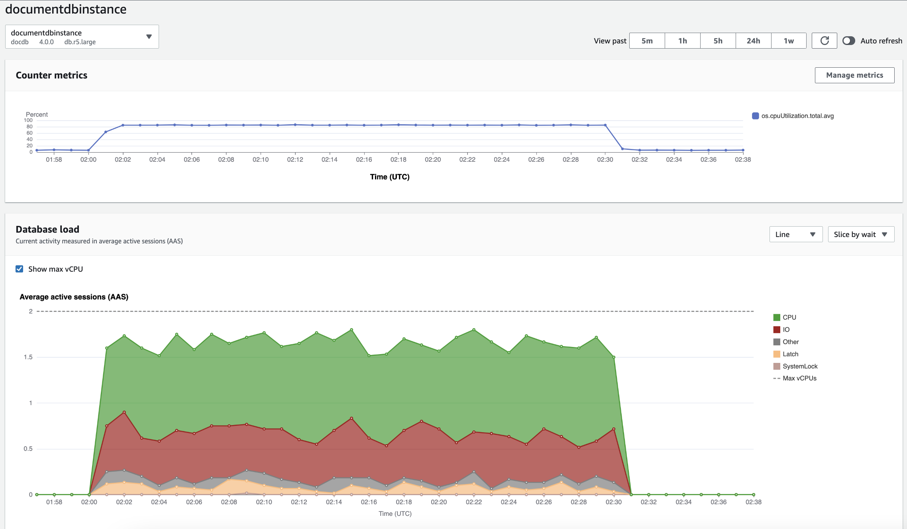
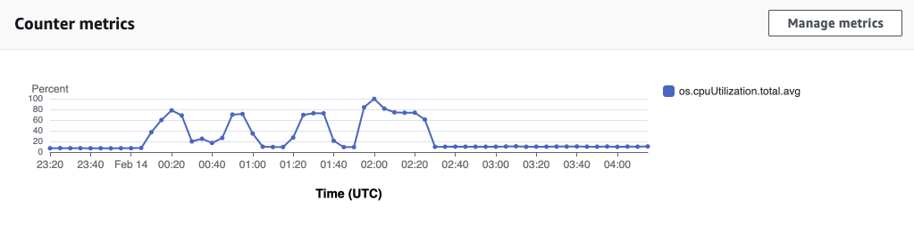
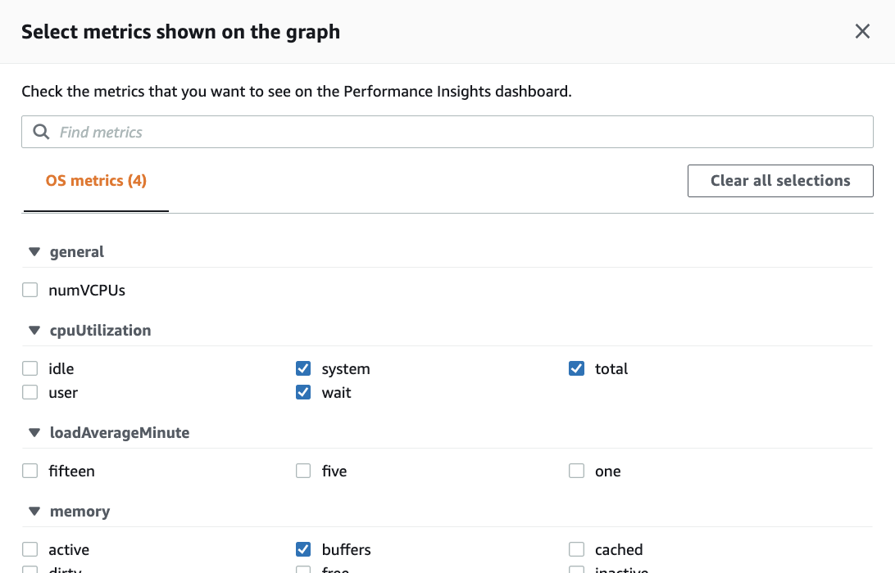
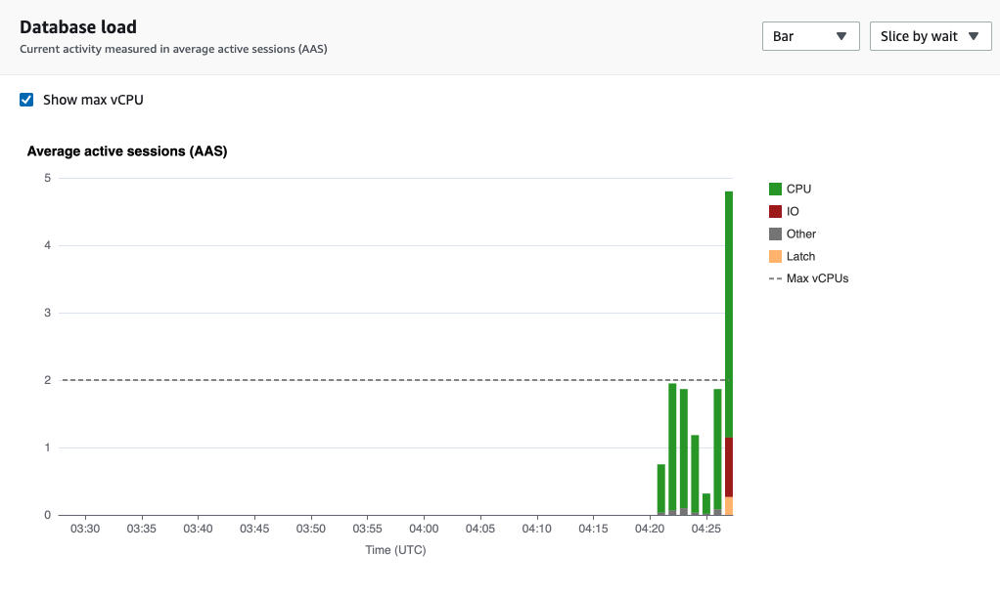
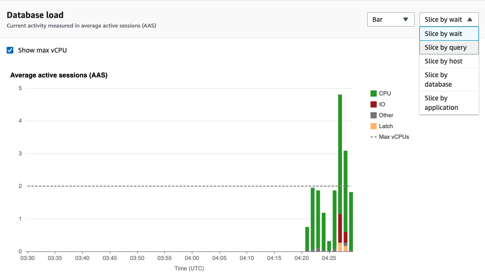
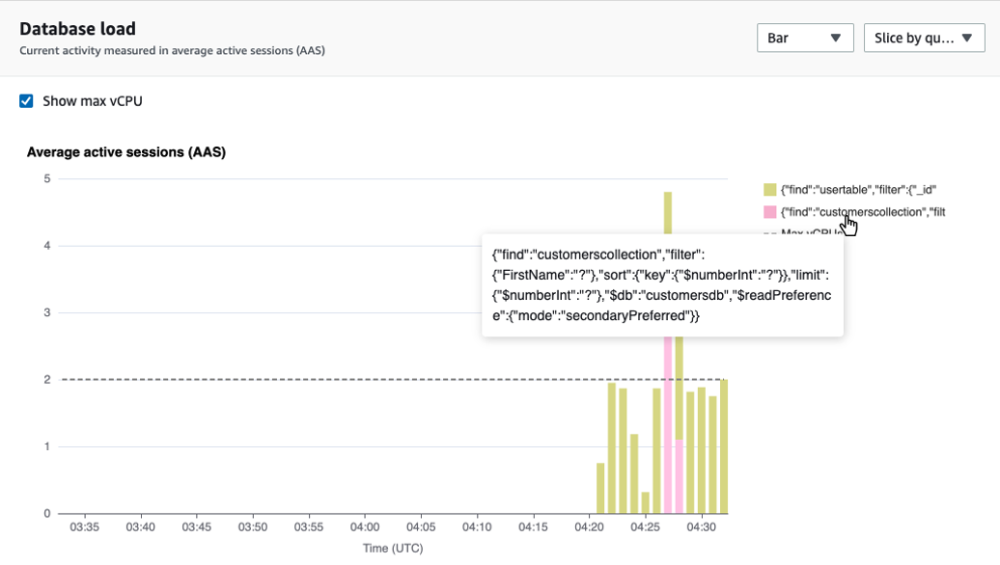
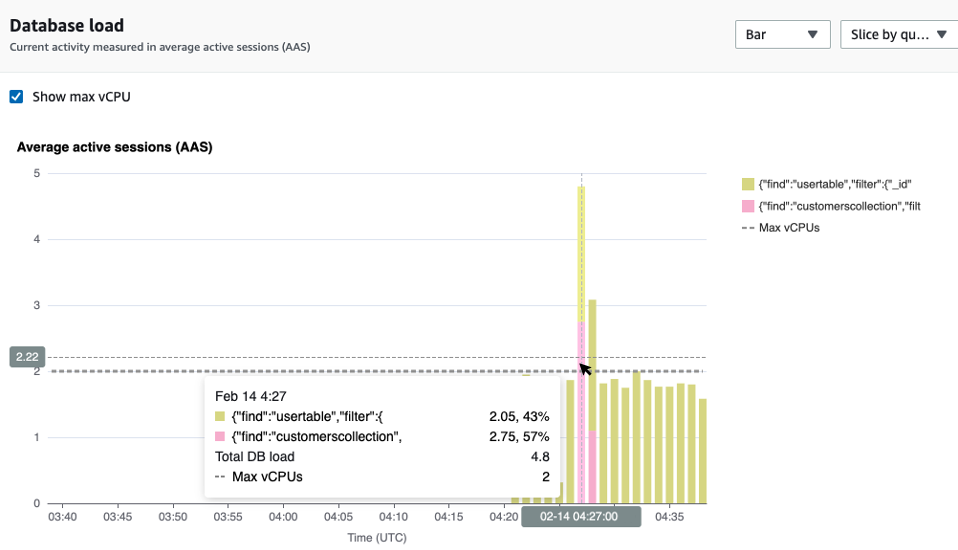
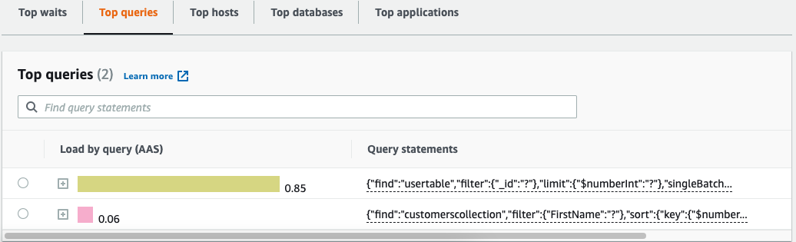

# Overview of the

Performance Insights dashboard

The dashboard is the easiest way to interact with Performance Insights. The
following example shows the dashboard for an Amazon DocumentDB instance. By default, the
Performance Insights dashboard shows data for the last hour.

The dashboard is divided into the following parts:

1. **Counter metrics** – Shows data for
   specific performance counter metrics.
2. **Database load** – Shows how the DB
   load compares to DB instance capacity as represented by the **Max vCPU** line.
3. **Top dimensions** – Shows the top
   dimensions contributing to DB load. These dimensions include
   `waits`, `queries`, `hosts`,
   `databases`, and `applications`.

###### Topics

- [Counter metrics chart](#performance-insights-overview-metrics "#performance-insights-overview-metrics")
- [Database load chart](#performance-insights-overview-db-load-chart "#performance-insights-overview-db-load-chart")
- [Top dimensions table](#performance-insights-overview-top-dimensions "#performance-insights-overview-top-dimensions")

## Counter metrics chart

With counter metrics, you can customize the Performance Insights dashboard to
include up to 10 additional graphs. These graphs show a selection of dozens of
operating system metrics. You can correlate this information with DB load to
help identify and analyze performance problems.

The **Counter metrics** chart displays data for
performance counters.

To change the performance counters, choose **Manage
metrics**. You can select multiple **OS
metrics** as shown in the following screenshot. To see details for
any metric, hover over the metric name.

## Database load chart

The **Database load** chart shows how the
database activity compares to instance capacity as represented by the **Max vCPU** line. By default, the stacked line chart
represents DB load as average active sessions per unit of time. The DB load is
sliced (grouped) by wait states.

###### DB load sliced by dimensions

You can choose to display load as active sessions grouped by any supported
dimensions. The following image shows the dimensions for the Amazon DocumentDB instance.

###### DB load details for a dimension item

To see details about a DB load item within a dimension, hover over the
item name. The following image shows details for a query statement.

To see details for any item for the selected time period in the legend, hover
over that item.

## Top dimensions table

The **Top dimensions table** slices DB load by
different dimensions. A dimension is a category or "slice by" for different
characteristics of DB load. If the dimension is query, **Top
queries** shows the query statements that contribute most to the DB
load.

Choose any of the following dimension tabs.

The following table provides a brief description of each tab.

| Tab              | Description                                                   |
| ---------------- | ------------------------------------------------------------- | ----------------------------------------------------------------------------------------------------------------------------------------------------------------------------------- |
| Top waits        | The event for which the database backend is waiting           |
| Top queries      | The query statements that are currently running               |
| Top hosts        | The host IP and port of the connected client                  |
| Top databases    | The name of the database to which the client is connected     |
| Top applications | The name of the application that is connected to the database | To learn how to analyze queries by using the **Top queries** tab, see [Overview of the Top queries tab](performance-insights-top-queries.md "performance-insights-top-queries.md"). |
