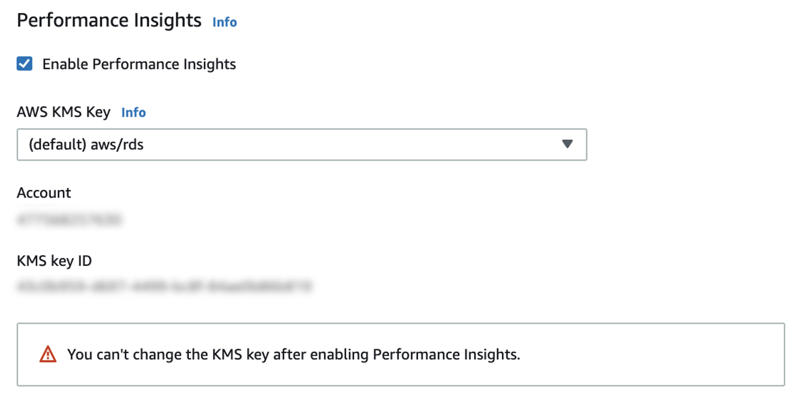

# Enabling and disabling Performance Insights

To use Performance Insights, enable it on your DB instance. You can disable it later
if necessary. Enabling and disabling Performance Insights doesn't cause downtime, a
reboot, or a failover.

The Performance Insights agent consumes limited CPU and memory on the DB host. When
the DB load is high, the agent limits the performance impact by collecting data less
frequently.

## Enabling Performance

Insights when creating a cluster

In the console, you can enable or disable Performance Insights when you create or
modify a new DB instance.

### Using the AWS Management Console

In the console, you can enable Performance Insights when you create an
Amazon DocumentDB cluster. When you create a new Amazon DocumentDB cluster, enable
Performance Insights by choosing **Enable Performance
Insights** in the **Performance
Insights** section.

###### Console instructions

1. To create a cluster, follow the instructions for [Creating an Amazon DocumentDB cluster.](db-cluster-create.md "db-cluster-create.md")
2. Select **Enable Performance
   Insights** in the Performance Insights section.



###### Note

The Performance Insights data retention period will be seven
days.

**AWS KMS key** — Specify your
AWS KMS key. Performance Insights encrypts all potentially
sensitive data using your AWS KMS key. Data is encrypted in flight and
at rest. For more information, see Configuring an AWS AWS KMS policy
for Performance Insights.

## Enabling and disabling when modifying an instance

You can modify a DB instance to enable or disable Performance Insights using the
console or AWS CLI.

Using the AWS Management Console

###### Console instructions

1. Sign in to the AWS Management Console, and open the Amazon DocumentDB console at [https://console.aws.amazon.com/docdb](https://console.aws.amazon.com/docdb "https://console.aws.amazon.com/docdb").
2. Choose **Clusters**.
3. Choose a DB instance, and choose **Modify**.
4. In the Performance Insights section, choose either **Enable Performance Insights** or **Disable Performance Insights**.

###### Note

If you choose **Enable Performance
Insights**, you can specify your AWS AWS KMS key.
Performance Insights encrypts all potentially sensitive data
using your AWS KMS key. Data is encrypted in flight and at rest.
For more information, see [Encrypting Amazon DocumentDB Data at Rest](encryption-at-rest.md "encryption-at-rest.md"). 5. Choose **Continue**. 6. For **Scheduling of Modifications**,
choose **Apply immediately**. If you
choose **Apply during the next scheduled
maintenance window**, your instance ignores this
setting and enables Performance Insights immediately. 7. Choose **Modify instance**.

Using the AWS CLI
When you use the `create-db-instance` or
`modify-db-instance` AWS AWS CLI commands, you can enable
Performance Insights by specifying
`--enable-performance-insights`, or disable it by specifying
`--no-enable-performance-insights`.

The following procedure describes how to enable or disable Performance
Insights for a DB instance using the AWS AWS CLI.

**AWS AWS CLI instructions**

Call the `modify-db-instance` AWS AWS CLI command and provide
the following values:

- `--db-instance-identifer` — The name of the DB
  instance
- `--enable-performance-insights` to enable or
  `--no-enable-performance-insights` to disable

###### Example

The following example enables Performance Insights for
`sample-db-instance`:

For Linux, macOS, or Unix:For Windows:For Linux, macOS, or Unix:

```
aws docdb modify-db-instance \
    --db-instance-identifier sample-db-instance \
    --enable-performance-insights
```

For Windows:

```
aws docdb modify-db-instance ^
    --db-instance-identifier sample-db-instance ^
    --enable-performance-insights
```
