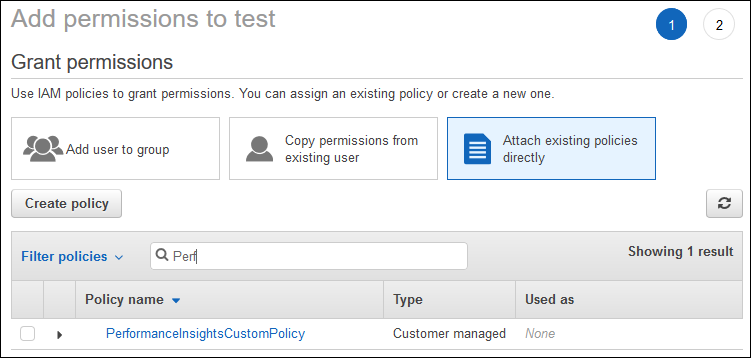

# Configuring access policies for Performance Insights

To access Performance Insights, you must have the appropriate permissions from
AWS Identity and Access Management (IAM). You have the following options for granting access:

- Attach the `AmazonRDSPerformanceInsightsReadOnly` managed policy to a permission set or role.
- Create a custom IAM policy and attach it to a permission set or role.
  Also, if you specified a customer managed key when you turned on Performance Insights, make sure
  that users in your account have the `kms:Decrypt` and
  `kms:GenerateDataKey` permissions on the KMS key.

###### Note

For encryption-at-rest with AWS KMS keys and security groups management, Amazon DocumentDB
leverages operational technology that is shared with [Amazon RDS](https://aws.amazon.com/rds "https://aws.amazon.com/rds").

## Attaching the AmazonRDSPerformanceInsightsReadOnly policy to an IAM principal

`AmazonRDSPerformanceInsightsReadOnly` is an AWS-managed policy that
grants access to all read-only operations of the Amazon DocumentDB Performance Insights API.
Currently, all operations in this API are read-only. If you attach
`AmazonRDSPerformanceInsightsReadOnly` to a permission set or role, the
recipient can use Performance Insights with other console features.

## Creating a custom IAM policy for Performance Insights

For users who don't have the `AmazonRDSPerformanceInsightsReadOnly`
policy, you can grant access to Performance Insights by creating or modifying a
user-managed IAM policy. When you attach the policy to a permission set or role, the
recipient can use Performance Insights.

###### To create a custom policy

1. Open the IAM console at
   [https://console.aws.amazon.com/iam/](https://console.aws.amazon.com/iam/ "https://console.aws.amazon.com/iam/").
2. In the navigation pane, choose **Policies**.
3. Choose **Create policy**.
4. On the **Create Policy** page, choose the JSON tab.
5. Copy and paste the following text, replacing
   `us-east-1` with the name of your AWS Region
   and `111122223333` with your customer account
   number.

JSON

```
`{
 "Version":"2012-10-17",
 "Statement": [
 {
 "Effect": "Allow",
 "Action": "rds:DescribeDBInstances",
 "Resource": "*"
 },
 {
 "Effect": "Allow",
 "Action": "rds:DescribeDBClusters",
 "Resource": "*"
 },
 {
 "Effect": "Allow",
 "Action": "pi:DescribeDimensionKeys",
 "Resource": "arn:aws:pi:us-east-1:111122223333:metrics/rds/*"
 },
 {
 "Effect": "Allow",
 "Action": "pi:GetDimensionKeyDetails",
 "Resource": "arn:aws:pi:us-east-1:111122223333:metrics/rds/*"
 },
 {
 "Effect": "Allow",
 "Action": "pi:GetResourceMetadata",
 "Resource": "arn:aws:pi:us-east-1:111122223333:metrics/rds/*"
 },
 {
 "Effect": "Allow",
 "Action": "pi:GetResourceMetrics",
 "Resource": "arn:aws:pi:us-east-1:111122223333:metrics/rds/*"
 },
 {
 "Effect": "Allow",
 "Action": "pi:ListAvailableResourceDimensions",
 "Resource": "arn:aws:pi:us-east-1:111122223333:metrics/rds/*"
 },
 {
 "Effect": "Allow",
 "Action": "pi:ListAvailableResourceMetrics",
 "Resource": "arn:aws:pi:us-east-1:111122223333:metrics/rds/*"
 }
 ]
}`

```

6. Choose **Review policy**.
7. Provide a name for the policy and optionally a description, and then
   choose **Create policy**.

You can now attach the policy to a permission set or role. The following procedure
assumes that you already have a user available for this purpose.

###### To attach the policy to a user

1. Open the IAM console at
   [https://console.aws.amazon.com/iam/](https://console.aws.amazon.com/iam/ "https://console.aws.amazon.com/iam/").
2. In the navigation pane, choose **Users**.
3. Choose an existing user from the list.

###### Important

To use Performance Insights, make sure that you have access to Amazon DocumentDB
in addition to the custom policy. For example, the **AmazonDocDBReadOnlyAccess** predefined policy provides
read-only access to Amazon DocDB.For more information, see [Managing access using policies](../../../AmazonRDS/latest/UserGuide/UsingWithRDS.md#security_iam_access-manage "../../../AmazonRDS/latest/UserGuide/UsingWithRDS.md#security_iam_access-manage"). 4. On the **Summary** page, choose **Add
permissions**. 5. Choose **Attach existing policies directly**. For
**Search**, type the first few characters of your
policy name, as shown following.

 6. Choose your policy, and then choose **Next:
Review**. 7. Choose **Add permissions**.

## Configuring an AWS KMS policy for Performance Insights

Performance Insights uses an AWS KMS key to encrypt sensitive data. When you
enable Performance Insights through the API or the console, you have the following
options:

- Choose the default AWS managed key.

Amazon DocumentDB uses the AWS managed key for your new DB instance. Amazon DocumentDB
creates an AWS managed key for your AWS account. Your AWS account has
a different AWS managed key for Amazon DocumentDB for each AWS Region.

- Choose a customer managed key.

If you specify a customer managed key, users in your account that call the
Performance Insights API need the `kms:Decrypt` and
`kms:GenerateDataKey` permissions on the KMS key. You can
configure these permissions through IAM policies. However, we recommend that
you manage these permissions through your KMS key policy. For more
information, see [Using key policies in
AWS KMS](../../../kms/latest/developerguide/key-policies.md "../../../kms/latest/developerguide/key-policies.md").

The following sample key policy shows how to add statements to your KMS key
policy. These statements allow access to Performance Insights. Depending on how
you use the AWS KMS, you might want to change some restrictions. Before adding
statements to your policy, remove all comments.
