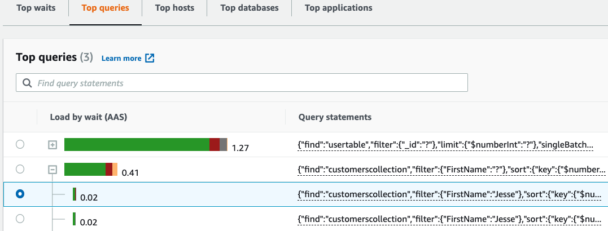
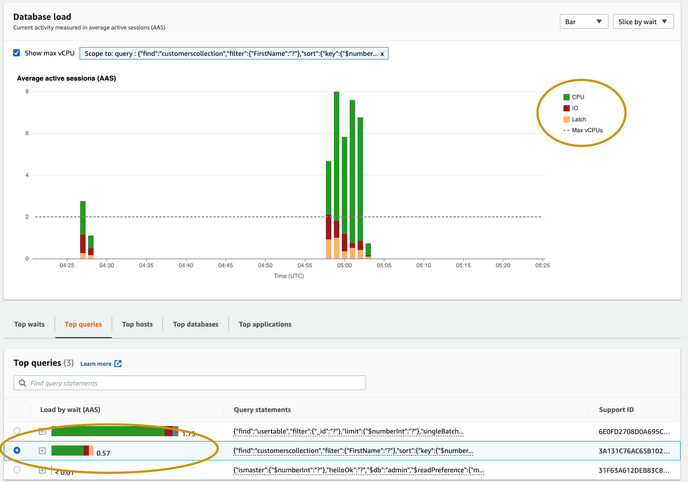
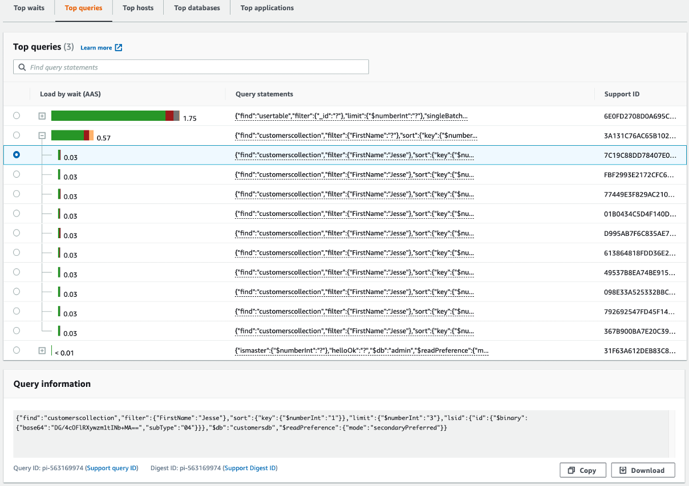
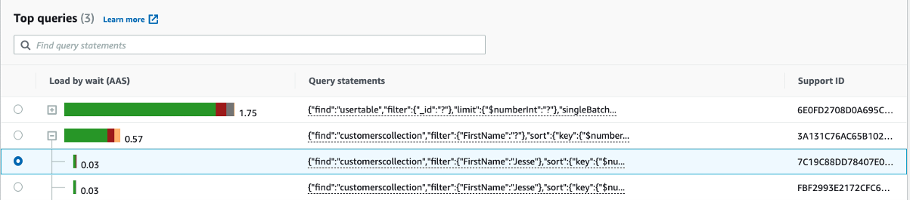
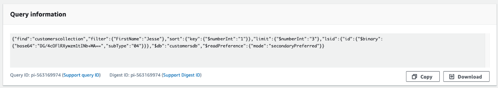

# Overview of the Top queries tab

By default, the **Top query** tab shows the queries
that are contributing the most to DB load. You can analyze the query text to help
tune your queries.

###### Topics

- [Query
  digests](#performance-insights-top-queries-digests "#performance-insights-top-queries-digests")
- [Load by waits (AAS)](#performance-insights-top-queries-aas "#performance-insights-top-queries-aas")
- [Viewing detailed query information](#performance-insights-top-queries-query-info "#performance-insights-top-queries-query-info")
- [Accessing statement query text](#performance-insights-top-queries-accessing-text "#performance-insights-top-queries-accessing-text")
- [Viewing and downloading statement query text](#performance-insights-top-queries-viewing-downloading "#performance-insights-top-queries-viewing-downloading")

## Query digests

A _query digest_ is a composite of multiple
actual queries that are structurally similar but might have different literal
values. The digest replaces hardcoded values with a question mark. For example,
a query digest might look like this:

```
{"find":"customerscollection","filter":{"FirstName":"?"},"sort":{"key":{"$numberInt":"?"}},"limit":{"$numberInt":"?"}}
```

This digest might include the following child queries:

```
{"find":"customerscollection","filter":{"FirstName":"Karrie"},"sort":{"key":{"$numberInt":"1"}},"limit":{"$numberInt":"3"}}
{"find":"customerscollection","filter":{"FirstName":"Met"},"sort":{"key":{"$numberInt":"1"}},"limit":{"$numberInt":"3"}}
{"find":"customerscollection","filter":{"FirstName":"Rashin"},"sort":{"key":{"$numberInt":"1"}},"limit":{"$numberInt":"3"}}

```

To see the literal query statements in a digest, select the query, and then
choose the plus symbol (`+`). In the following screenshot, the
selected query is a digest.



###### Note

A query digest groups similar query statements, but does not redact
sensitive information.

## Load by waits (AAS)

In **Top queries**, the **Load by waits (AAS)** column illustrates the percentage of the
database load associated with each top load item. This column reflects the load
for that item by whatever grouping is currently selected in the **DB load chart**. For example, you might group the
**DB load chart** by wait states. In this case,
the **DB Load by Waits** bar is sized, segmented,
and color-coded to show how much of a given wait state that query is
contributing to. It also shows which wait states are affecting the selected
query.



## Viewing detailed query information

In the **Top query** table, you can open a
_digest statement_ to view its information.
The information appears in the bottom pane.



The following types of identifiers (IDs) are associated with query
statements:

1. **Support query ID** – A hash value
   of the query ID. This value is only for referencing a query ID when you
   are working with AWS Support. AWS Support doesn't have access to
   your actual query IDs and query text.
2. **Support digest ID** – A hash
   value of the digest ID. This value is only for referencing a digest ID
   when you are working with AWS Support. AWS Support doesn't have
   access to your actual digest IDs and query text.

## Accessing statement query text

By default, each row in the **Top queries** table
shows 500 bytes of query text for each query statement. When a digest statement
exceeds 500 bytes, you can view more text by opening the statement in the
Performance Insights dashboard. In this case, the maximum length for the
displayed query is 1 KB. If you view a full query statement, you can also choose
**Download**.

## Viewing and downloading statement query text

In the Performance Insights dashboard, you can view or download query
text.

###### To view more query text in the Performance Insights dashboard

1. Open the Amazon DocumentDB console at: [https://console.aws.amazon.com/docdb/](https://console.aws.amazon.com/docdb/ "https://console.aws.amazon.com/docdb/")
2. In the navigation pane, choose **Performance
   Insights**.
3. Choose a DB instance. The Performance Insights dashboard is displayed
   for that DB instance.

Query statements with text larger than 500 bytes will look like the
following image:

 4. Examine the query information section to view more of the query
text.



The Performance Insights dashboard can display up to 1 KB for each full query
statement.

###### Note

To copy or download the query statement, disable any pop-up
blockers.
