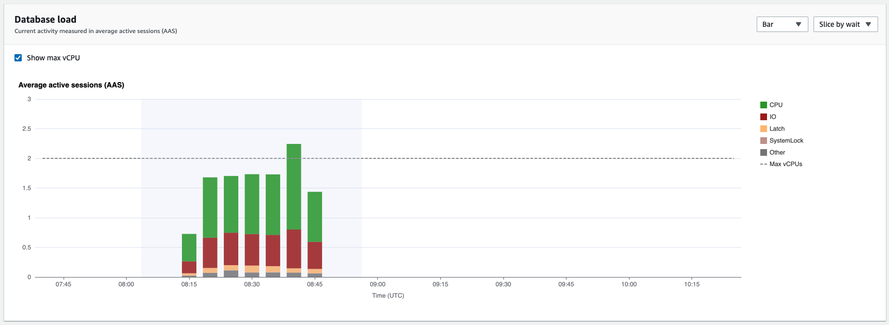
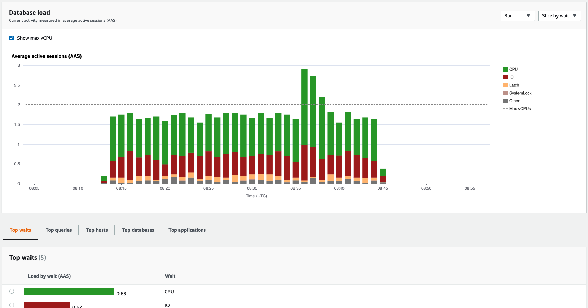

# Zooming in on the database load chart

You can use other features of the Performance Insights user interface to help
analyze performance data.

###### Click-and-Drag Zoom In

In the Performance Insights interface, you can choose a small portion of the
load chart and zoom in on the detail.

To zoom in on a portion of the load chart, choose the start time and drag to the
end of the time period you want. When you do this, the selected area is highlighted.
When you release the mouse, the load chart zooms in on the selected area, and the
**Top _items_** table is
recalculated.

