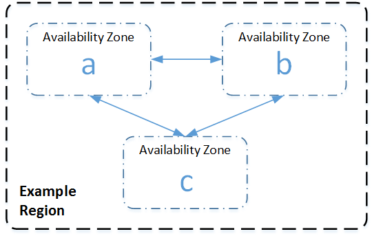

# Choosing regions and availability zones

Amazon cloud computing resources are hosted in multiple locations worldwide. These locations consist of AWS Regions and Availability Zones. Each
_AWS Region_ is a separate geographic area. Each Region has multiple, isolated locations known as _Availability
Zones_. Amazon DocumentDB provides you the ability to place resources, such as instances, and data in multiple locations. Resources aren't replicated
across AWS Regions unless you do so specifically.

Amazon operates advanced, highly available data centers. Although rare, failures can occur that affect the availability of instances that are in the
same location. If you host all your instances in a single location that is affected by such a failure, none of your instances would be available. The
following diagram shows an AWS Region with three Availability Zones.

It is important to remember that each Region is independent. Any Amazon DocumentDB activity that you initiate (for example, creating instances or listing
available instances) runs only in your current default AWS Region. You can change the default Region on the console by setting the `EC2_REGION`
environment variable. Or you can override it by using the `--region` parameter in the AWS CLI. For more information, see [Configuring the AWS Command Line Interface](../../../cli/latest/userguide/cli-chap-getting-started.md "../../../cli/latest/userguide/cli-chap-getting-started.md"), specifically, the sections
on environment variables and command line options.

When you create a cluster using the Amazon DocumentDB console, and you choose to create a replica in a different Availability Zone, Amazon DocumentDB creates two
instances. It creates the primary instance in one Availability Zone and the replica instance in a different Availability Zone. The cluster volume is
always replicated across three Availability Zones.

To create or work with an Amazon DocumentDB instance in a specific AWS Region, use the corresponding regional service endpoint.

## Region availability

Amazon DocumentDB is available in the following AWS Regions.

**Regions supported by Amazon DocumentDB**

| Region Name               | Region           | Availability Zones (compute) |
| ------------------------- | ---------------- | ---------------------------- | ------------------------------------------------------------------------------------------------------------------------------------------------------------------------------------------------------------------------------------------------------------------------------------ |
| US East (Ohio)            | `us-east-2`      | 3                            |
| US East (N. Virginia)     | `us-east-1`      | 6                            |
| US West (Oregon)          | `us-west-2`      | 4                            |
| Africa (Cape Town)        | `af-south-1`     | 3                            |
| South America (São Paulo) | `sa-east-1`      | 3                            |
| Asia Pacific (Hong Kong)  | `ap-east-1`      | 3                            |
| Asia Pacific (Hyderabad)  | `ap-south-2`     | 3                            |
| Asia Pacific (Malaysia)   | `ap-southeast-5` | 3                            |
| Asia Pacific (Mumbai)     | `ap-south-1`     | 3                            |
| Asia Pacific (Osaka)      | `ap-northeast-3` | 3                            |
| Asia Pacific (Seoul)      | `ap-northeast-2` | 4                            |
| Asia Pacific (Singapore)  | `ap-southeast-1` | 3                            |
| Asia Pacific (Sydney)     | `ap-southeast-2` | 3                            |
| Asia Pacific (Thailand)   | `ap-southeast-7` | 3                            |
| Asia Pacific (Tokyo)      | `ap-northeast-1` | 3                            |
| Canada (Central)          | `ca-central-1`   | 3                            |
| China (Beijing) Region    | `cn-north-1`     | 3                            |
| China (Ningxia)           | `cn-northwest-1` | 3                            |
| Europe (Frankfurt)        | `eu-central-1`   | 3                            |
| Europe (Ireland)          | `eu-west-1`      | 3                            |
| Europe (London)           | `eu-west-2`      | 3                            |
| Europe (Milan)            | `eu-south-1`     | 3                            |
| Europe (Paris)            | `eu-west-3`      | 3                            |
| Europe (Spain)            | `eu-south-2`     | 3                            |
| Europe (Stockholm)        | `eu-north-1`     | 3                            |
| Mexico (Central)          | `mx-central-1`   | 3                            |
| Middle East (UAE)         | `me-central-1`   | 3                            |
| Israel (Tel Aviv)         | `il-central-1`   | 3                            |
| AWS GovCloud (US-West)    | `us-gov-west-1`  | 3                            |
| AWS GovCloud (US-East)    | `us-gov-east-1`  | 3                            | By default, the time zone for an Amazon DocumentDB cluster is Universal Time Coordinated (UTC). For information on finding the connection endpoints for clusters and instances in a particular region, see [Understanding Amazon DocumentDB endpoints](endpoints.md "endpoints.md"). |
