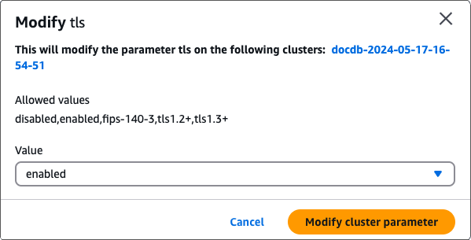

# Encrypting data in transit

You can use Transport Layer Security (TLS) to encrypt the connection between your
application and an Amazon DocumentDB cluster. By default, encryption in transit is enabled for newly
created Amazon DocumentDB clusters. It can optionally be disabled when the cluster is created, or at a
later time. When encryption in transit is enabled, secure connections using TLS are required
to connect to the cluster. For more information connecting to Amazon DocumentDB using TLS,
see [Connecting programmatically to Amazon DocumentDB](connect_programmatically.md "connect_programmatically.md").

## Managing Amazon DocumentDB cluster TLS settings

Encryption in transit for an Amazon DocumentDB cluster is managed via the TLS parameter in a
[cluster parameter group](cluster_parameter_groups.md "cluster_parameter_groups.md"). You can manage your Amazon DocumentDB cluster TLS settings
using the AWS Management Console or the AWS Command Line Interface (AWS CLI). See the following sections to learn how to
verify and modify your current TLS settings.

Using the AWS Management Console
Follow these steps to perform management tasks for TLS encryption using the console—such as identifying parameter groups, verifying the TLS value, and making needed modifications.

###### Note

Unless you specify differently when you create a cluster, your cluster is created with the default cluster parameter group. The parameters in the `default` cluster parameter group can't be modified (for example, `tls` enabled/disabled). So if your cluster is using a `default` cluster parameter group, you need to modify the cluster to use a non-default cluster parameter group. First, you might need to create a custom cluster parameter group. For more information, see [Creating Amazon DocumentDB cluster parameter groups](cluster_parameter_groups-create.md "cluster_parameter_groups-create.md").

1.  **Determine the cluster parameter group that your
    cluster is using.**
    1. Open the Amazon DocumentDB console at [https://console.aws.amazon.com/docdb](https://console.aws.amazon.com/docdb "https://console.aws.amazon.com/docdb").
    2. In the navigation pane, choose
       **Clusters**.

    ###### Tip

    If you don't see the navigation pane on the left side of your screen, choose the menu icon
    ()
    in the upper-left corner of the page. 3. Note that in the **Clusters** navigation box, the column **Cluster Identifier** shows both clusters and instances. Instances are listed underneath clusters. See the screenshot below for reference.

     4. Choose the cluster that
    you're interested in. 5. Choose the **Configuration** tab and scroll down to the bottom of **Cluster details** and locate the **Cluster parameter group**. Note the name of the cluster parameter group.

    If the name of the cluster's parameter group is `default` (for example, `default.docdb3.6`), you must create a custom cluster parameter group and make it the cluster's parameter group before you continue. For more information, see the following:

        1. [Creating Amazon DocumentDB cluster parameter groups](cluster_parameter_groups-create.md "cluster_parameter_groups-create.md")
         — If you don't have a custom cluster parameter
         group that you can use, create one.
        2. [Modifying an Amazon DocumentDB cluster](db-cluster-modify.md "db-cluster-modify.md") — Modify
         your cluster to use the custom cluster parameter
         group.

2.  **Determine the current value of the `tls`
    cluster parameter.**
    1. Open the Amazon DocumentDB console at [https://console.aws.amazon.com/docdb](https://console.aws.amazon.com/docdb "https://console.aws.amazon.com/docdb").
    2. In the navigation pane, choose **Parameter
       groups**.
    3. In the list of cluster parameter groups, choose the name of
       the cluster parameter group you are interested in.
    4. Locate the **Cluster parameters** section. In
       the list of cluster parameters, locate the `tls`
       cluster parameter row. At this point, the following four columns
       are important:
       - **Cluster parameter
         name** — The name of the cluster
         parameters. For managing TLS, you're interested in the
         `tls` cluster parameter.
       - **Values** — The
         current value of each cluster parameter.
       - **Allowed values**
         — A list of values that can be applied to a
         cluster parameter.
       - **Apply type** —
         Either **static** or
         **dynamic**. Changes to static
         cluster parameters can be applied only when the
         instances are rebooted. Changes to dynamic cluster
         parameters can be applied either immediately or when the
         instances are rebooted.

3.  **Modify the value of the `tls` cluster
    parameter.**

If the value of `tls` is not what is needs to be, modify its value for this cluster parameter group. To change the value of the `tls` cluster parameter, continue from the preceding section by following these steps.

    1. Choose the button to the left of the cluster parameter's name
     (`tls`).
    2. Choose **Edit**.
    3. To change the value of `tls`, in the
     **Modify `tls`** dialog box,
     choose the value that you want for the cluster parameter in the
     drop-down list.


    Valid values are:


    	* **disabled** — Disables TLS
    	* **enabled** — Enables TLS versions 1.0 through 1.3.
    	* **fips-140-3** — Enables TLS with FIPS.
    	 The cluster only accepts secure connections per the requirements of the Federal Information Processing Standards (FIPS) publication 140-3.
    	 This is only supported starting with Amazon DocumentDB 5.0 (engine version 3.0.3727) clusters in these regions: ca-central-1, us-west-2, us-east-1, us-east-2, us-gov-east-1, us-gov-west-1.
    	* **tls1.2+** — Enables TLS version 1.2 and above.
    	 This is only supported starting with Amazon DocumentDB 4.0 (engine version 2.0.10980) and Amazon DocumentDB (engine version 3.0.11051).
    	* **tls1.3+** — Enables TLS version 1.3 and above.
    	 This is only supported starting with Amazon DocumentDB 4.0 (engine version 2.0.10980) and Amazon DocumentDB (engine version 3.0.11051).

    
    4. Choose **Modify cluster parameter**. The
     change is applied to each cluster instance when it is
     rebooted.

4. **Reboot the Amazon DocumentDB instance.**

Reboot each instance of the cluster so that the change is applied to all
instances in the cluster.

    1. Open the Amazon DocumentDB console at [https://console.aws.amazon.com/docdb](https://console.aws.amazon.com/docdb "https://console.aws.amazon.com/docdb").
    2. In the navigation pane, choose
     **Instances**.
    3. To specify an instance to reboot, locate the instance in the
     list of instances, and choose the button to the left of its
     name.
    4. Choose **Actions**, and then
     **Reboot**. Confirm that you want to reboot
     by choosing **Reboot**.

Using the AWS CLI
Follow these steps to perform management tasks for TLS encryption using the
AWS CLI—such as identifying parameter groups, verifying the TLS value, and
making needed modifications.

###### Note

Unless you specify differently when you create a cluster, the cluster is created with the
default cluster parameter group. The parameters in the `default`
cluster parameter group can't be modified (for example, `tls`
enabled/disabled). So if your cluster is using a `default`
cluster parameter group, you need to modify the cluster to use a non-default
cluster parameter group. You might need to first create a custom cluster
parameter group. For more information, see [Creating Amazon DocumentDB cluster parameter groups](cluster_parameter_groups-create.md "cluster_parameter_groups-create.md").

1. **Determine the cluster parameter group that your cluster is
   using.**

Run the [`describe-db-clusters`](https://awscli.amazonaws.com/v2/documentation/api/latest/reference/docdb/describe-db-clusters.html "https://awscli.amazonaws.com/v2/documentation/api/latest/reference/docdb/describe-db-clusters.html") command with the following
options:

    * `--db-cluster-identifier`
    * `--query`

In the following example, replace each `user input placeholder` with your cluster's information.

```
aws docdb describe-db-clusters \
  --db-cluster-identifier `mydocdbcluster` \
  --query 'DBClusters[*].[DBClusterIdentifier,DBClusterParameterGroup]'
```

Output from this operation looks something like the following (JSON format):

```
[
    [
        "mydocdbcluster",
        "myparametergroup"
    ]
]
```

If the name of the cluster's parameter group is `default` (for
example, `default.docdb3.6`), you must have a custom cluster
parameter group and make it the cluster's parameter group before you
continue. For more information, see the following topics:

    1. [Creating Amazon DocumentDB cluster parameter groups](cluster_parameter_groups-create.md "cluster_parameter_groups-create.md") —
     If you don't have a custom cluster parameter group that you can
     use, create one.
    2. [Modifying an Amazon DocumentDB cluster](db-cluster-modify.md "db-cluster-modify.md") — Modify your
     cluster to use the custom cluster parameter group.

2. **Determine the current value of the `tls` cluster
   parameter.**

To get more information about this cluster parameter group, run the
[`describe-db-cluster-parameters`](https://awscli.amazonaws.com/v2/documentation/api/latest/reference/docdb/describe-db-cluster-parameters.html "https://awscli.amazonaws.com/v2/documentation/api/latest/reference/docdb/describe-db-cluster-parameters.html") command with the
following options:

    * `--db-cluster-parameter-group-name`
    * `--query`


    Limits the output to just the fields of interest: `ParameterName`, `ParameterValue`,`AllowedValues`, and
     `ApplyType`.

In the following example, replace each `user input placeholder` with your cluster's information.

```
aws docdb describe-db-cluster-parameters \
  --db-cluster-parameter-group-name `myparametergroup` \
  --query 'Parameters[*].[ParameterName,ParameterValue,AllowedValues,ApplyType]'
```

Output from this operation looks something like the following (JSON format):

```
[
    [
        "audit_logs",
        "disabled",
        "enabled,disabled",
        "dynamic"
    ],
    [
        **"tls",
 "disabled",
 "disabled,enabled,fips-140-3,tls1.2+,tls1.3+",
 "static"**
    ],
    [
        "ttl_monitor",
        "enabled",
        "disabled,enabled",
        "dynamic"
    ]
]
```

3. **Modify the value of the `tls` cluster
   parameter.**

If the value of `tls` is not what it needs to be, modify its value for this cluster parameter group.
To change the value of the `tls` cluster parameter, run the [`modify-db-cluster-parameter-group`](https://awscli.amazonaws.com/v2/documentation/api/latest/reference/docdb/modify-db-cluster-parameter-group.html "https://awscli.amazonaws.com/v2/documentation/api/latest/reference/docdb/modify-db-cluster-parameter-group.html") command with the following options:

    * `--db-cluster-parameter-group-name` — Required. The name of the
     cluster parameter group to modify. This cannot be a
     `default.*` cluster parameter group.
    * `--parameters` — Required. A list of the cluster parameter group's parameters to modify.


    	+ `ParameterName` — Required. The name of the cluster parameter to modify.
    	+ `ParameterValue` — Required. The new value for this cluster parameter. Must be one of the
    	 cluster parameter's `AllowedValues`.


    		- `enabled` — The cluster accepts secure connections using TLS version 1.0 through 1.3.
    		- `disabled` — The cluster does not accept secure connections using TLS.
    		- `fips-140-3` — The cluster only accepts secure connections per the requirements of the Federal Information Processing Standards (FIPS) publication 140-3.
    		 This is only supported starting with Amazon DocumentDB 5.0 (engine version 3.0.3727) clusters in these regions: ca-central-1, us-west-2, us-east-1, us-east-2, us-gov-east-1, us-gov-west-1.
    		- `tls1.2+` — The cluster accepts secure connections using TLS version 1.2 and above.
    		 This is only supported starting with Amazon DocumentDB 4.0 (engine version 2.0.10980) and Amazon DocumentDB 5.0 (engine version 3.0.11051).
    		- `tls1.3+` — The cluster accepts secure connections using TLS version 1.3 and above.
    		 This is only supported starting with Amazon DocumentDB 4.0 (engine version 2.0.10980) and Amazon DocumentDB 5.0 (engine version 3.0.11051).
    	+ `ApplyMethod` — When this
    	 modification is to be applied. For static cluster
    	 parameters like `tle`, this value must be
    	 `pending-reboot`.


    		- `pending-reboot` — Change is
    		 applied to an instance only after it is rebooted.
    		 You must reboot each cluster instance individually
    		 for this change to take place across all of the
    		 cluster's instances.

In the following examples, replace each `user input placeholder` with your cluster's information.

The following code _disables_ `tls`, applying the change to each instance when it is rebooted.

```
aws docdb modify-db-cluster-parameter-group \
  --db-cluster-parameter-group-name `myparametergroup` \
  --parameters "ParameterName=tls,ParameterValue=disabled,ApplyMethod=pending-reboot"
```

The following code _enables_
`tls` (version 1.0 through 1.3) applying the change to each instance when it is
rebooted.

```
aws docdb modify-db-cluster-parameter-group \
  --db-cluster-parameter-group-name `myparametergroup` \
  --parameters "ParameterName=tls,ParameterValue=enabled,ApplyMethod=pending-reboot"
```

The following code _enables_
TLS with `fips-140-3`, applying the change to each instance when it is
rebooted.

```
aws docdb modify-db-cluster-parameter-group \
  ‐‐db-cluster-parameter-group-name `myparametergroup2` \
  ‐‐parameters "ParameterName=tls,ParameterValue=fips-140-3,ApplyMethod=pending-reboot"
```

Output from this operation looks something like the following (JSON format):

```
{
    "DBClusterParameterGroupName": "myparametergroup"
}
```

4. **Reboot your Amazon DocumentDB instance.**

Reboot each instance of the cluster so that the change is applied to all
instances in the cluster. To reboot an Amazon DocumentDB instance, run the
[`reboot-db-instance`](https://awscli.amazonaws.com/v2/documentation/api/latest/reference/docdb/reboot-db-instance.html "https://awscli.amazonaws.com/v2/documentation/api/latest/reference/docdb/reboot-db-instance.html") command with the following
option:

    * `--db-instance-identifier`

The following code reboots the instance `mydocdbinstance`.

In the following examples, replace each `user input placeholder` with your cluster's information.

For Linux, macOS, or Unix:

```
aws docdb reboot-db-instance \
  --db-instance-identifier `mydocdbinstance`
```

For Windows:

```
aws docdb reboot-db-instance ^
  --db-instance-identifier `mydocdbinstance`
```

Output from this operation looks something like the following (JSON format):

```
{
    "DBInstance": {
        "AutoMinorVersionUpgrade": true,
        "PubliclyAccessible": false,
        "PreferredMaintenanceWindow": "fri:09:32-fri:10:02",
        "PendingModifiedValues": {},
        "DBInstanceStatus": "rebooting",
        "DBSubnetGroup": {
            "Subnets": [
                {
                    "SubnetStatus": "Active",
                    "SubnetAvailabilityZone": {
                        "Name": "us-east-1a"
                    },
                    "SubnetIdentifier": "subnet-4e26d263"
                },
                {
                    "SubnetStatus": "Active",
                    "SubnetAvailabilityZone": {
                        "Name": "us-east-1c"
                    },
                    "SubnetIdentifier": "subnet-afc329f4"
                },
                {
                    "SubnetStatus": "Active",
                    "SubnetAvailabilityZone": {
                        "Name": "us-east-1e"
                    },
                    "SubnetIdentifier": "subnet-b3806e8f"
                },
                {
                    "SubnetStatus": "Active",
                    "SubnetAvailabilityZone": {
                        "Name": "us-east-1d"
                    },
                    "SubnetIdentifier": "subnet-53ab3636"
                },
                {
                    "SubnetStatus": "Active",
                    "SubnetAvailabilityZone": {
                        "Name": "us-east-1b"
                    },
                    "SubnetIdentifier": "subnet-991cb8d0"
                },
                {
                    "SubnetStatus": "Active",
                    "SubnetAvailabilityZone": {
                        "Name": "us-east-1f"
                    },
                    "SubnetIdentifier": "subnet-29ab1025"
                }
            ],
            "SubnetGroupStatus": "Complete",
            "DBSubnetGroupDescription": "default",
            "VpcId": "vpc-91280df6",
            "DBSubnetGroupName": "default"
        },
        "PromotionTier": 2,
        "DBInstanceClass": "db.r5.4xlarge",
        "InstanceCreateTime": "2018-11-05T23:10:49.905Z",
        "PreferredBackupWindow": "00:00-00:30",
        "KmsKeyId": "arn:aws:kms:us-east-1:012345678901:key/0961325d-a50b-44d4-b6a0-a177d5ff730b",
        "StorageEncrypted": true,
        "VpcSecurityGroups": [
            {
                "Status": "active",
                "VpcSecurityGroupId": "sg-77186e0d"
            }
        ],
        "EngineVersion": "3.6.0",
        "DbiResourceId": "db-SAMPLERESOURCEID",
        "DBInstanceIdentifier": "mydocdbinstance",
        "Engine": "docdb",
        "AvailabilityZone": "us-east-1a",
        "DBInstanceArn": "arn:aws:rds:us-east-1:012345678901:db:sample-cluster-instance-00",
        "BackupRetentionPeriod": 1,
        "Endpoint": {
            "Address": "mydocdbinstance.corcjozrlsfc.us-east-1.docdb.amazonaws.com",
            "Port": 27017,
            "HostedZoneId": "Z2R2ITUGPM61AM"
        },
        "DBClusterIdentifier": "mydocdbcluster"
    }
}
```

It takes a few minutes for your instance to reboot. You
can use the instance only when its status is
_available_. You can monitor the instance's
status using the console or AWS CLI. For more information, see [Monitoring an Amazon DocumentDB instance's status](monitoring_docdb-instance_status.md "monitoring_docdb-instance_status.md").
