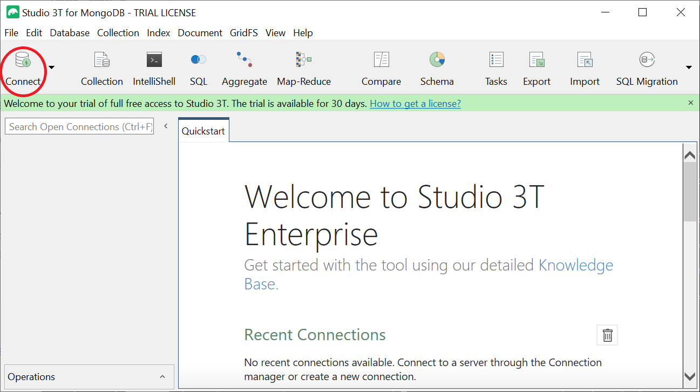
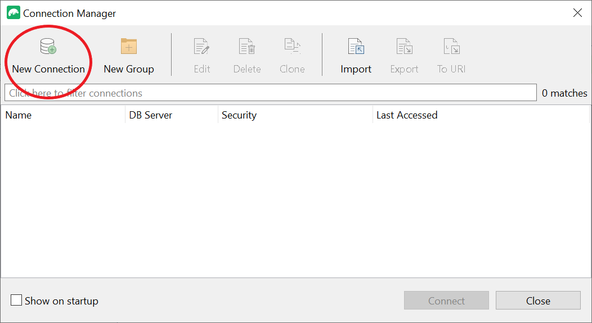
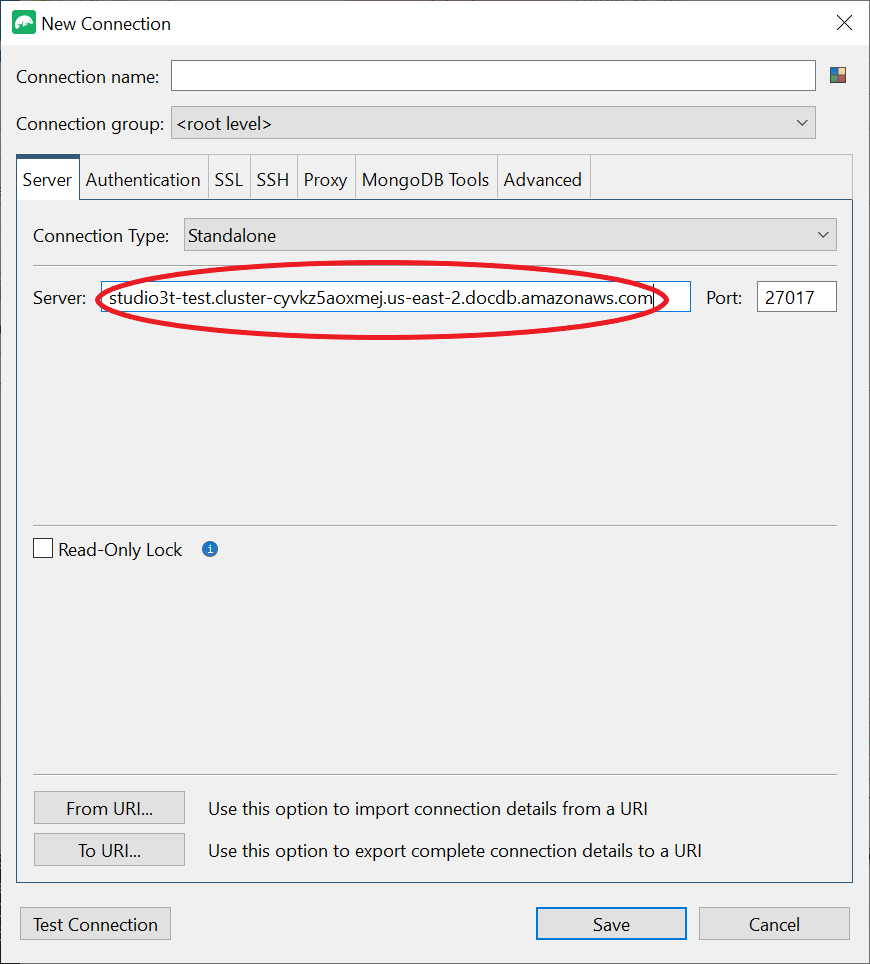
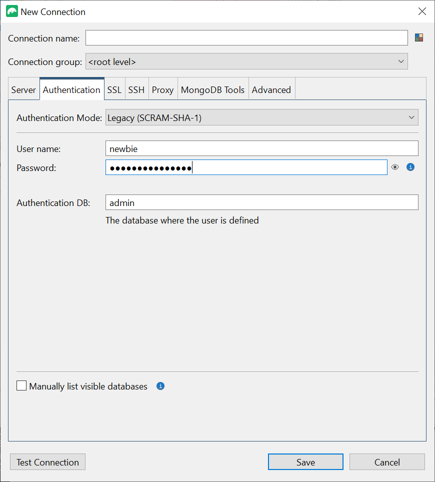
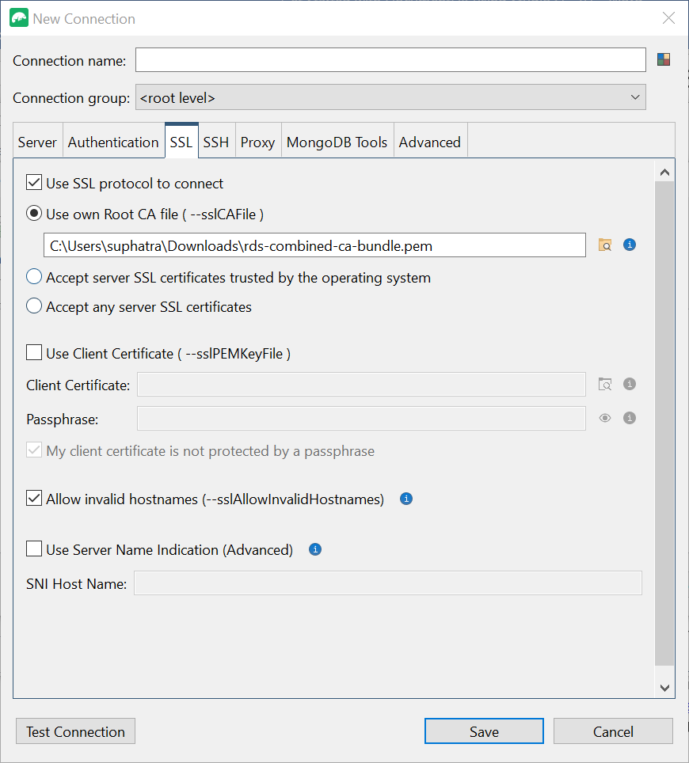
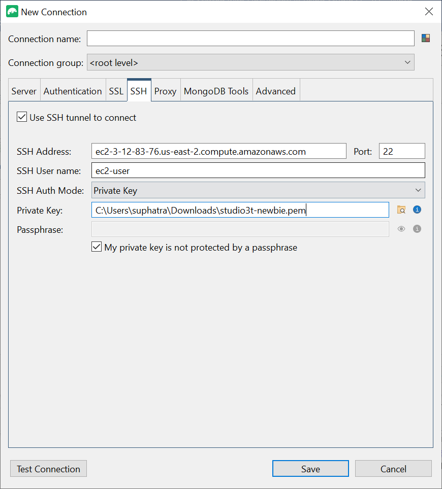
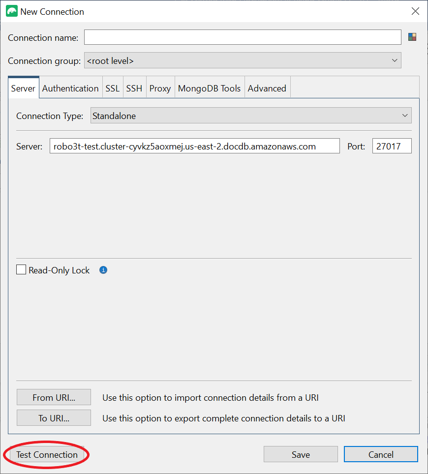
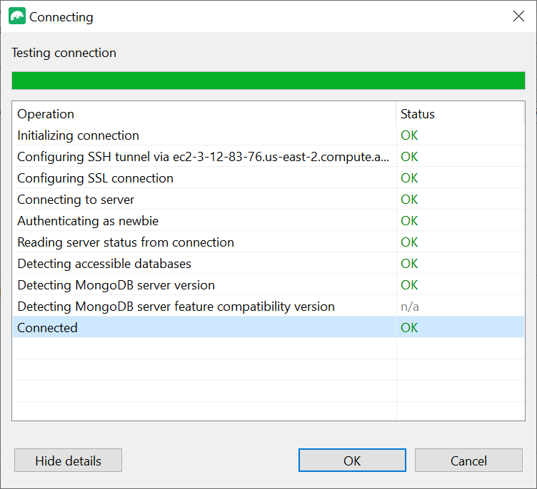
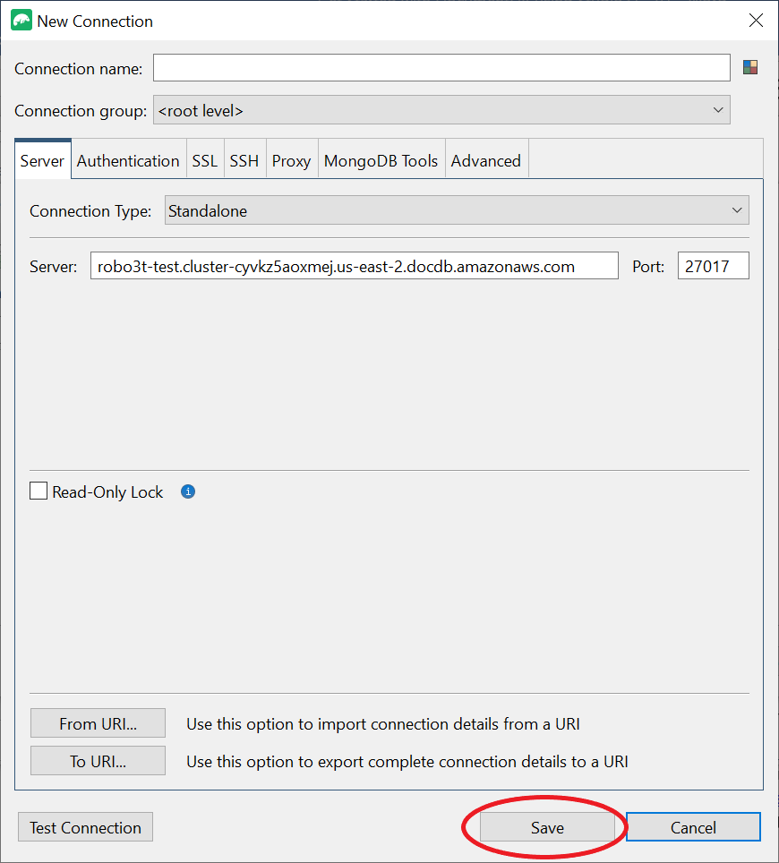
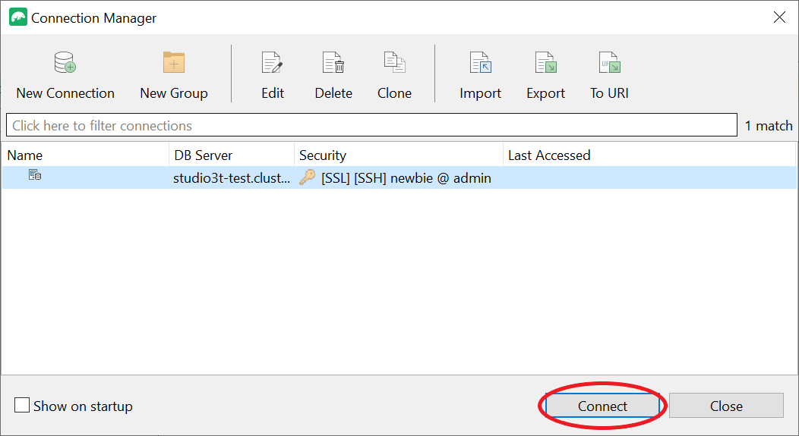

# Connecting to an Amazon DocumentDB

cluster from Studio 3T

[Studio 3T](https://studio3t.com/ "https://studio3t.com/") is a popular GUI and IDE for developers and data engineers who work with MongoDB. It offers several powerful capabilities Tree, Table and JSON views of your data, easy import/export in CSV, JSON, SQL and BSON/mongodump, flexible querying option, a visual drag-and-drop UI, a built-in mongo shell with auto-completion, an aggregation pipeline editor, and SQL query support.

## Prerequisites

- If you don't already have an Amazon DocumentDB cluster using Amazon EC2 as a bastion/jump host, follow the instructions on how to [Connect with Amazon EC2](connect-ec2.md "connect-ec2.md").
- If you don't have Studio 3T, [download and install it](https://studio3t.com/download "https://studio3t.com/download").

## Connect with Studio 3T

1. Choose **Connect** in the top left corner of the toolbar.

 2. Choose **New Connection** in the top left corner of the toolbar.

 3. On the **Server** tab, in the **Server** field, enter the cluster endpoint information.

###### Note

Can't find your cluster endpoint? Just follow the steps [here](db-instance-endpoint-find.md "db-instance-endpoint-find.md"). 4. Choose the **Authentication** tab and select **Legacy** in the drop down menu for **Authentication Mode**.

 5. Input your username and credentials in the **User name** and **Password** fields. 6. Choose the **SSL** tab and check the box **Use SSL protocol to connect**.

 7. Choose **Use own Root CA file**. Then add the Amazon DocumentDB certificate (you can skip this step if SSL is disabled on your DocumentDB cluster). Check the box to allow **invalid hostnames**.

###### Note

Don’t have the certificate? You can download it with the following command:

`wget https://truststore.pki.rds.amazonaws.com/global/global-bundle.pem` 8. If you are connecting from a client machine outside the Amazon VPC, you need to create a SSH tunnel. You will do this in the **SSH** tab.

    1. Check the box for **Use SSH tunnel** and input the SSH address in the **SSH Address** field. This is your instance Public DNS (IPV4). You can get this URL from your [Amazon EC2 Management Console](https://console.aws.amazon.com/ec2 "https://console.aws.amazon.com/ec2").
    2. Enter your username. This is the username of your Amazon EC2 instance
    3. For **SSH Auth Mode**, select **Private Key**. In the **Private Key** field, choose the file finder icon to locate and choose the Private key of your Amazon EC2 instance. This is the .pem file (key pair) that you saved while creating your instance in Amazon EC2 Console.
    4. If you are on Linux/macOS client machine, you might have to change the permissions of your private key using the following command:

    `chmod 400 /fullPathToYourPemFile/<yourKey>.pem`

###### Note

This Amazon EC2 instance should be in the same Amazon VPC and security group as your DocumentDB cluster. You can get the SSH address, username and private key from your [Amazon EC2 Management Console](https://console.aws.amazon.com/ec2 "https://console.aws.amazon.com/ec2"). 9. Now test your configuration by choosing the **Test connection** button.

 10. A diagnostic window should load a green bar to indicate the test was successful. Now choose **OK** to close out the diagnostic window.

 11. Choose **Save** to save your connection for future use.

 12. Now select your cluster and choose **Connect**.

Congratulations! You are now successfully connected to your Amazon DocumentDB cluster through Studio 3T.
