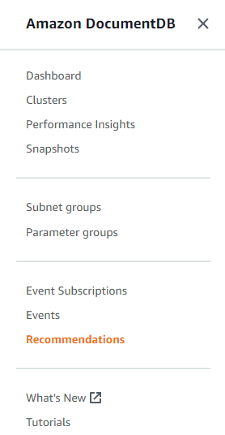
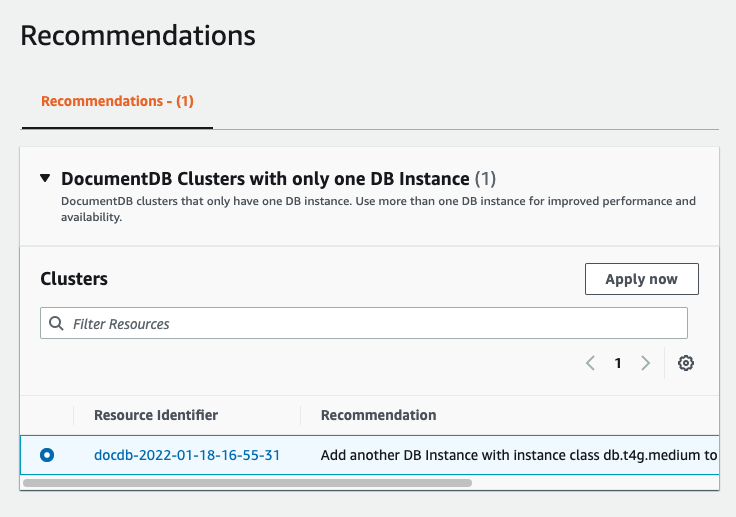
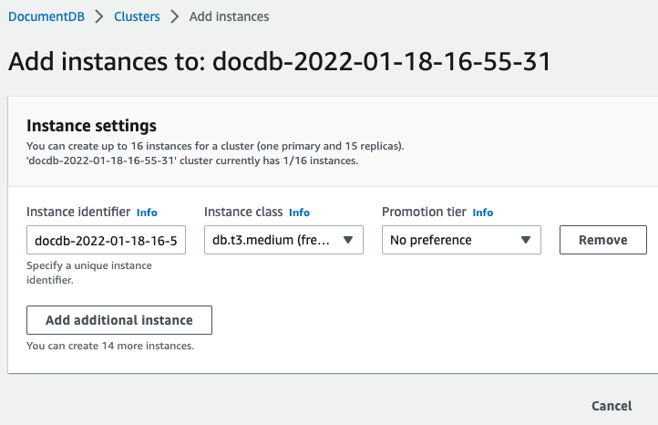

# Viewing Amazon DocumentDB recommendations

Amazon DocumentDB provides a list of automated recommendations for database resources, such as instances and clusters.
These recommendations provide best practice guidance by analyzing your cluster and instance configurations.

As an example of these recommendations, see the following:

| Type         | Description                        | Recommendation                                                                                                                    | Additional information                                                                 |
| ------------ | ---------------------------------- | --------------------------------------------------------------------------------------------------------------------------------- | -------------------------------------------------------------------------------------- | --------------------------------------------------------------------------------------------------------------------------------------------------------------------------------------------------------------------------------------------------------------------------------------------------------------------------------------------------------------------------------------------------------------------------------------------------------------------------------------------------------------------------------------------------------------------------------------------------------------------------------------------------------------------------------------------------------------------------------------------------------------------------------------------------------------------------------------------------------------------------------------------------------------------------------------------------------------------------------------------------------------------------------------------------------------------------------------------------------------------------------------------------------------------------------------------------------------------------------------------------------------------------------------------------------------------------------- |
| One instance | Cluster only contains one instance | Performance and availability: we recommend adding another instance with the same instance class in a different Availability Zone. | [Amazon DocumentDB High Availability and Replication](replication.md "replication.md") | Amazon DocumentDB generates recommendations for a resource when the resource is created or modified. Amazon DocumentDB also periodically scans your resources and generates recommendations. **To view and take action on Amazon DocumentDB recommendations** 1. Sign in to the AWS Management Console, and open the Amazon DocumentDB console at [https://console.aws.amazon.com/docdb](https://console.aws.amazon.com/docdb "https://console.aws.amazon.com/docdb"). 2. In the navigation pane, choose **Recommendations**:  3. In the **Recommendations** dialog, expand the section of interest and select the recommended task. In the example below, the recommended task applies to an Amazon DocumentDB cluster with only one instance. The recommendation is to add another instance to improve performance and availability.  4. Click **Apply now**. For this example, the **Add instances** dialog appears:  5. Modify your new instance's settings and click **Create**. |
