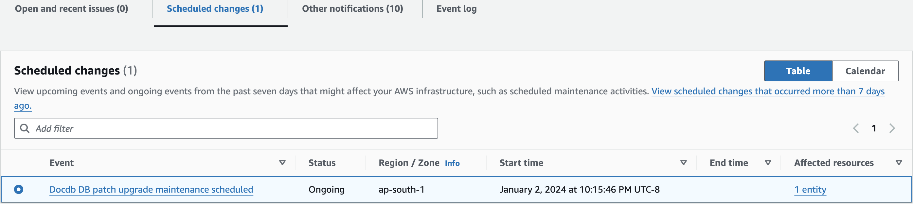
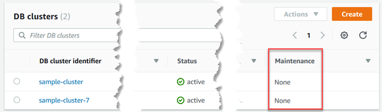
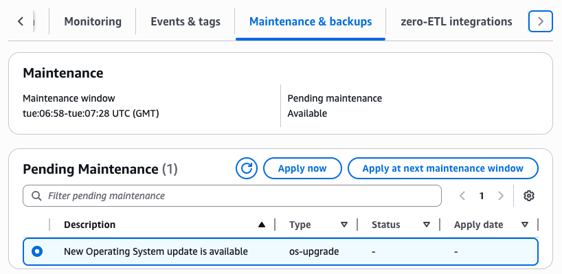

# Maintaining Amazon DocumentDB

Amazon DocumentDB periodically performs two kinds of maintenance:

- **Cluster maintenance** updates the database engine. Engine updates carry security fixes, bug fixes, new features, and other engine enhancements.
- **Instance maintenance** updates the operating system (OS) on the instance.
  Engine patches and OS updates use the same three lifecycle categories—_optional_, _required_, and _forced_—with the same notification and apply behavior for each category. Engine releases also have a fourth category: _minor versions_, which you upgrade to manually. The categories are:

- **Optional**—contains non-critical improvements. No auto-apply date and no AHD notification; apply when it suits you. (For OS updates, you can subscribe to `RDS-EVENT-0230` to be notified when one becomes available.)
- **Required**—contains security and other critical fixes. You receive a notification through the Health Dashboard (AHD) and e-mail. A required action auto-applies during your cluster or instance maintenance window after its `AutoAppliedAfterDate`. You can defer by changing the maintenance window before that date.
- **Forced**—a rare, highly critical fix. Auto-applies outside your maintenance window after its `ForcedApplyDate`. Amazon DocumentDB only designates an action forced when no other option is available.
- **Minor version** (engine releases only)—a numbered engine release on top of a major version (for example, `5.0.1`). User-driven: you upgrade by modifying the cluster's engine version. Never auto-applies; no AHD notification. Minor versions are not published for major versions earlier than 5.0.
  Engine patches are released into a single category (optional, required, or forced) and stay there. OS updates progress: most start as optional and, if not applied, transition to required and eventually forced. The exact timing depends on the patch and is published in the AHD notification and the date fields returned by `describe-pending-maintenance-actions` (see [Apply dates](#db-instance-updates-apply-date "#db-instance-updates-apply-date")). The Amazon DocumentDB [Release notes](release-notes.md "release-notes.md") use these category names when announcing engine changes.

Applying any engine patch takes the cluster offline briefly. The rest of this topic walks through how maintenance windows work, how to find pending work, how to apply engine patches and minor versions, how OS updates work, and special handling for global clusters.

###### Topics

- [Maintenance actions for Amazon DocumentDB](#maintenance-actions "#maintenance-actions")
- [Engine version numbering](#engine-version-numbering "#engine-version-numbering")
- [Managing your Amazon DocumentDB maintenance windows](#maintenance-window "#maintenance-window")
- [Notifications for Amazon DocumentDB engine patches](#patch-notifications "#patch-notifications")
- [Viewing pending Amazon DocumentDB maintenance actions](#view-pending-maintenance "#view-pending-maintenance")
- [Amazon DocumentDB engine updates](#db-instance-updates-apply "#db-instance-updates-apply")
- [Minor version upgrades](#minor-version-upgrades "#minor-version-upgrades")
- [Amazon DocumentDB operating system updates](#os-system-updates "#os-system-updates")
- [User-initiated updates](#user-initiated-updates "#user-initiated-updates")
- [Global clusters patching](#global-clusters-patching "#global-clusters-patching")

## Maintenance actions for Amazon DocumentDB

The following maintenance actions apply to Amazon DocumentDB clusters:

- `system-update` —
  Upgrade the engine patch for the Amazon DocumentDB cluster.
  For more information, see
  [Amazon DocumentDB engine updates](#db-instance-updates-apply "#db-instance-updates-apply").
- `os-upgrade` —
  Update the operating systems of all the DB instances in the Amazon DocumentDB cluster, using rolling upgrades.
  For more information, see
  [Amazon DocumentDB operating system updates](#os-system-updates "#os-system-updates").

The following maintenance actions apply to Amazon DocumentDB instances:

- `system-update` —
  Upgrade the operating system of the Amazon DocumentDB instance.
  We recommend that you use the cluster-level `os-upgrade` maintenance action instead.
  For more information, see
  [Amazon DocumentDB operating system updates](#os-system-updates "#os-system-updates").

## Engine version numbering

Amazon DocumentDB uses two separate version identifiers:

- **Engine version**—a three-part number in the form ``major`.`major`.`minor`` (for example, `5.0.0` or `5.0.1`). The first two parts (`5.0`) are the MongoDB compatibility version; the third part is the minor version, incremented when Amazon DocumentDB publishes a minor release containing bug fixes and non-breaking improvements. This is the version you specify when creating or upgrading a cluster.
- **Engine patch version**—a separate three-part number in the form ``major`.0.`patch`` (for example, `3.0.17983`) that identifies the patch level applied to your cluster. The middle digit is always `0`. Patch versions contain critical security and stability fixes.

You can determine the engine version from the engine patch version's prefix, as shown in the following table.

| Engine patch version prefix | Amazon DocumentDB engine version |
| --------------------------- | -------------------------------- |
| `1.0.`x``                   | 3.6                              |
| `2.0.`x``                   | 4.0                              |
| `3.0.`x``                   | 5.0                              |
| `4.0.`x``                   | 8.0                              |

To check the patch version your cluster is running, connect and run `db.runCommand({getEngineVersion: 1})`.

For the list of released engine patch versions and what each one contains, see [Release notes](release-notes.md "release-notes.md").

## Managing your Amazon DocumentDB maintenance windows

Every cluster and every instance has its own weekly 30-minute maintenance window—the period when scheduled modifications and software patching run. Most events complete within 30 minutes; larger ones can run longer.

If you don't choose a window when creating the resource, Amazon DocumentDB assigns one at random within an 8-hour daily block defined for the Region, on a randomly selected day. Choose windows that minimize impact to your application—evenings or weekends, for example.

For database engine upgrades, Amazon DocumentDB uses the cluster's window, not the windows of individual instances.

The following table shows the default time blocks per Region.

| Region Name               | Region         | UTC Time Block |
| ------------------------- | -------------- | -------------- |
| US East (Ohio)            | us-east-2      | 03:00-11:00    |
| US East (N. Virginia)     | us-east-1      | 03:00-11:00    |
| US West (Oregon)          | us-west-2      | 06:00-14:00    |
| Africa (Cape Town)        | af-south-1     | 03:00–11:00    |
| Asia Pacific (Hong Kong)  | ap-east-1      | 06:00-14:00    |
| Asia Pacific (Hyderabad)  | ap-south-2     | 06:30–14:30    |
| Asia Pacific (Malaysia)   | ap-southeast-5 | 13:00-21:00    |
| Asia Pacific (Mumbai)     | ap-south-1     | 06:00-14:00    |
| Asia Pacific (Osaka)      | ap-northeast-3 | 12:00-20:00    |
| Asia Pacific (Seoul)      | ap-northeast-2 | 13:00-21:00    |
| Asia Pacific (Singapore)  | ap-southeast-1 | 14:00-22:00    |
| Asia Pacific (Sydney)     | ap-southeast-2 | 12:00-20:00    |
| Asia Pacific (Jakarta)    | ap-southeast-3 | 08:00-16:00    |
| Asia Pacific (Melbourne)  | ap-southeast-4 | 11:00-19:00    |
| Asia Pacific (Thailand)   | ap-southeast-7 | 15:00-23:00    |
| Asia Pacific (Tokyo)      | ap-northeast-1 | 13:00-21:00    |
| Canada (Central)          | ca-central-1   | 03:00-11:00    |
| Canada West (Calgary)     | ca-west-1      | 18:00-02:00    |
| China (Beijing)           | cn-north-1     | 06:00-14:00    |
| China (Ningxia)           | cn-northwest-1 | 06:00-14:00    |
| Europe (Frankfurt)        | eu-central-1   | 21:00-05:00    |
| Europe (Zurich)           | eu-central-2   | 02:00-10:00    |
| Europe (Ireland)          | eu-west-1      | 22:00-06:00    |
| Europe (London)           | eu-west-2      | 22:00-06:00    |
| Europe (Milan)            | eu-south-1     | 02:00-10:00    |
| Europe (Paris)            | eu-west-3      | 23:59-07:29    |
| Europe (Spain)            | eu-south-2     | 02:00–10:00    |
| Europe (Stockholm)        | eu-north-1     | 04:00–12:00    |
| Mexico (Central)          | mx-central-1   | 03:00-11:00    |
| Middle East (UAE)         | me-central-1   | 05:00–13:00    |
| South America (São Paulo) | sa-east-1      | 00:00-08:00    |
| Israel (Tel Aviv)         | il-central-1   | 04:00-12:00    |
| AWS GovCloud (US-East)    | us-gov-east-1  | 17:00-01:00    |
| AWS GovCloud (US-West)    | us-gov-west-1  | 06:00-14:00    |

### Changing your Amazon DocumentDB maintenance windows

Choose the lowest-traffic window you can, and adjust over time as your traffic patterns shift. The cluster or instance is unavailable during the window only if a system change—a scale-storage operation or an instance class change, for example—requires an outage, and only for as long as that change actually needs.

###### To change the maintenance window

- For a cluster, see [Modifying an Amazon DocumentDB cluster](db-cluster-modify.md "db-cluster-modify.md").
- For an instance, see [Modifying an Amazon DocumentDB instance](db-instance-modify.md "db-instance-modify.md").

## Notifications for Amazon DocumentDB engine patches

When a _required_ engine patch becomes available in an AWS Region, every AWS account with an affected Amazon DocumentDB cluster in that Region receives a notification through the Health Dashboard (AHD) and through e-mail (sent to the AWS account's root user address). One notification is delivered per affected Amazon DocumentDB engine version. You can find them under **Scheduled changes** in the AHD. Each notification lists the patch availability timing, the auto-apply schedule, the affected clusters, and the release notes.



Notifications go out approximately two days before the auto-apply window opens. For example, a required patch released Monday at 00:00 UTC becomes eligible for auto-apply on Wednesday at 00:00 UTC. If your cluster's maintenance window is Wednesday at 12:00 UTC, the patch auto-applies that Wednesday—about 12 hours after the auto-apply window opens. If your maintenance window is Tuesday at 12:00 UTC, the patch waits a full week before auto-applying.

You have two options after receiving the notification: self-apply the patch before the auto-apply date, or wait for it to auto-apply during an upcoming maintenance window (the default). To self-apply, open the cluster's **Maintenance & backups** tab and look for the entry of type `system-update`.

###### Note

The notification's **Status** in the AHD stays **Ongoing** until Amazon DocumentDB releases another engine patch with a new patch version.

After the patch is applied, the cluster's engine patch version updates to match the version in the notification. Verify the new version by running `db.runCommand({getEngineVersion: 1})`.

Optional patches and new minor versions don't generate AHD or e-mail notifications. To track them, watch the Amazon DocumentDB [Release notes](release-notes.md "release-notes.md").

Forced patches (the rarest category, reserved for the most critical security fixes) are also announced through AHD and e-mail. Unlike required patches, they apply outside your maintenance window, so the auto-apply timing example above does not apply.

### Reacting to patch notifications programmatically

AWS Health integrates with Amazon EventBridge, which lets you build event-driven applications across more than 20 targets, including AWS Lambda and Amazon Simple Queue Service (SQS). To react to engine-patch availability programmatically, configure EventBridge against the `AWS_DOCDB_DB_PATCH_UPGRADE_MAINTENANCE_SCHEDULED` event. From there you can capture event data, raise additional events, send push notifications via the AWS Console Mobile Application, or take any other action you need.

If Amazon DocumentDB cancels a patch (rare), you receive an AHD notification and an e-mail about the cancellation. Use the `AWS_DOCDB_DB_PATCH_UPGRADE_MAINTENANCE_CANCELLED` event code with Amazon EventBridge to handle this case. For more about writing rules, see the [Amazon EventBridge User Guide](../../../eventbridge/latest/userguide/eb-rules.md "../../../eventbridge/latest/userguide/eb-rules.md").

## Viewing pending Amazon DocumentDB maintenance actions

Use the AWS Management Console or the AWS CLI to check what maintenance is pending for a cluster or instance.

Pending updates appear with the action type `system-update`, which covers both engine patches and OS updates.

When an update is pending, you can:

- Apply it immediately.
- Schedule it for the next maintenance window.
- Defer it (engine patches and OS updates only) by changing your maintenance window before `AutoAppliedAfterDate`. Once that date passes, the action will auto-apply during the next maintenance window. Once `ForcedApplyDate` passes, no further deferral is possible.

###### Note

If you take no action, required maintenance actions such as required engine patches auto-apply during an upcoming maintenance window. Optional patches and minor versions never auto-apply.

The maintenance window controls when pending operations _start_, not how long they take to complete.

Using the AWS Management Console

1. Sign in to the AWS Management Console, and open the Amazon DocumentDB console at [https://console.aws.amazon.com/docdb](https://console.aws.amazon.com/docdb "https://console.aws.amazon.com/docdb").
2. In the navigation pane, choose **Clusters**.
3. The cluster's **Maintenance** column shows **Available**, **Required**, or **Next Window** when an update is pending.

 4. Open the cluster, then choose **Maintenance & backups** to see the **Pending Maintenance** items and act on them.


Using the AWS CLI
Run `describe-pending-maintenance-actions` to see what's pending. The following example shows an account with no pending actions.

```
aws docdb describe-pending-maintenance-actions
```

Output from this operation looks something like the following (JSON format).

```
{
    "PendingMaintenanceActions": []
}
```

An account with a pending action returns output that looks like this:

```
{
    "PendingMaintenanceActions": [
        {
            "ResourceIdentifier": "arn:aws:rds:us-east-1:123456789012:cluster:sample-cluster",
            "PendingMaintenanceActionDetails": [
                {
                    "Action": "system-update",
                    "Description": "db-version-upgrade",
                    "CurrentApplyDate": "2026-05-15T03:01:00Z",
                    "AutoAppliedAfterDate": "2026-05-15T03:01:00Z"
                }
            ]
        }
    ]
}
```

You can scope the listing to specific clusters with `--filters`, in the form `Name=`filter-name`,Values=`resource-id`,...`. The accepted filter `Name` is `db-cluster-id`, which takes a list of cluster identifiers or ARNs.

###### Example

For Linux, macOS, or Unix:

```
aws docdb describe-pending-maintenance-actions \
   --filters Name=db-cluster-id,Values=`sample-cluster1`,`sample-cluster2`
```

For Windows:

```
aws docdb describe-pending-maintenance-actions ^
   --filters Name=db-cluster-id,Values=`sample-cluster1`,`sample-cluster2`
```

### Apply dates

Each pending maintenance action carries up to three apply dates. They appear in the AWS CLI output for `describe-pending-maintenance-actions` and indicate when the action will run. Fields are `null` for optional maintenance.

- `CurrentApplyDate`—when the action is scheduled to run, either now or at the next maintenance window. Populated for required and forced actions.
- `AutoAppliedAfterDate`—the date after which auto-apply begins during the cluster or instance maintenance window. Populated for required actions.
- `ForcedApplyDate`—the hard deadline. After this date the action runs automatically, regardless of your maintenance window. Populated for forced actions.

To defer a pending action, move your maintenance window to a later day before `AutoAppliedAfterDate`. Once `AutoAppliedAfterDate` passes, the action will auto-apply during the next maintenance window. Once `ForcedApplyDate` passes, no further deferral is possible. The exact deferral window varies per patch; the dates are published in the AHD notification and the AWS CLI output.

## Amazon DocumentDB engine updates

When you've identified a pending engine patch, use one of the following procedures to apply or schedule it. You can run these procedures from either the AWS Management Console or the AWS CLI.

Using the AWS Management Console

###### To manage an update for a cluster

1. Sign in to the AWS Management Console, and open the Amazon DocumentDB console at [https://console.aws.amazon.com/docdb](https://console.aws.amazon.com/docdb "https://console.aws.amazon.com/docdb").
2. In the navigation pane, choose **Clusters**.
3. Select the cluster you want to update.
4. From the **Actions** menu, choose either:

   - **Upgrade now**—run the pending maintenance immediately.
   - **Upgrade at next window**—run it during the cluster's next maintenance window.
     You can also use **Apply now** or **Apply at next maintenance window** from the **Pending Maintenance** section of the cluster's **Maintenance & backups** tab (see [Viewing pending Amazon DocumentDB maintenance actions](#view-pending-maintenance "#view-pending-maintenance")).

###### Note

If nothing is pending, all of these options are inactive.

Using the AWS CLI
Apply a pending update with `apply-pending-maintenance-action`.

###### Parameters

- `--resource-identifier`—the Amazon DocumentDB Amazon Resource Name (ARN) of the resource the pending action targets.
- `--apply-action`—the pending maintenance action to apply. Use `system-update` to apply an engine patch.
- `--opt-in-type`—the type of opt-in request, or whether to undo one. Valid values:

  - `immediate`—apply now. Cannot be undone once submitted.
  - `next-maintenance`—apply during the resource's next maintenance window.
  - `undo-opt-in`—cancel an existing `next-maintenance` opt-in.

###### Example

For Linux, macOS, or Unix:

```
aws docdb apply-pending-maintenance-action \
    --resource-identifier arn:aws:rds:us-east-1:`123456789012`:db:`sample-cluster-instance-1` \
    --apply-action system-update \
    --opt-in-type immediate
```

For Windows:

```
aws docdb apply-pending-maintenance-action ^
    --resource-identifier arn:aws:rds:us-east-1:`123456789012`:db:`sample-cluster-instance-1` ^
    --apply-action system-update ^
    --opt-in-type immediate
```

### Read availability during patching

Amazon DocumentDB engine 5.0 and 8.0 preserve read availability during patching when the cluster has multiple instances. Amazon DocumentDB patches reader instances in a rolling fashion, in three groups, so the remaining readers continue serving traffic. The writer is briefly unavailable while it patches. To achieve zero read downtime, set your read preference so reads can fall back to the writer: `secondaryPreferred` or `primaryPreferred` work; `primary` or `secondary` alone may incur read downtime.

| Read preference mode | During writer upgrade | During reader upgrade              | Minimum number of readers needed for zero read downtime |
| -------------------- | --------------------- | ---------------------------------- | ------------------------------------------------------- |
| `primary`            | Read/write downtime   | No impact                          | N/A                                                     |
| `primaryPreferred`   | Write downtime        | No impact                          | 1                                                       |
| `secondary`          | Write downtime        | Read downtime (if only one reader) | 2                                                       |
| `secondaryPreferred` | Write downtime        | No impact                          | 1                                                       |
| `nearest`            | Write downtime        | No impact                          | 1                                                       |

While readers are patching, overall cluster read throughput drops temporarily. To hold throughput steady, provision additional readers before the upgrade and remove them after it completes.

On engine 3.6 and 4.0, these read-availability features don't apply: an engine patch causes longer downtime that affects both reads and writes. To upgrade to a major version that does, see [Amazon DocumentDB in-place major version upgrade](docdb-mvu.md "docdb-mvu.md").

### Patch downtime length

Engine-patch downtime varies. The biggest factors are CPU utilization and memory pressure on the instance at the time of the patch, so right-sizing your instances matters. To minimize downtime, run the latest Amazon DocumentDB major engine version and spread instances across multiple Availability Zones.

### Patch updates and replacements

Amazon DocumentDB monitors patches after release. In the rare case that an issue is identified, Amazon DocumentDB pauses the rollout while it prepares an updated version. When this happens, clusters that haven't yet received the patch no longer see it as an available maintenance action, and the corresponding scheduled-change notification in the Health Dashboard is withdrawn. Clusters already running the affected version continue to operate normally and require no action from you.

An updated patch follows shortly. When it becomes available in your Region, you receive a fresh notification through the Health Dashboard and e-mail, just as described in [Notifications for Amazon DocumentDB engine patches](#patch-notifications "#patch-notifications").

## Minor version upgrades

Amazon DocumentDB publishes minor versions on top of major version 5.0 and later (for example, `5.0.1`). Minor versions are not published for major versions earlier than 5.0. Minor versions behave differently from required and optional engine patches:

- They don't appear as a pending maintenance action and never auto-apply.
- They don't generate AHD or e-mail notifications. New minor versions are announced in the Amazon DocumentDB [Release notes](release-notes.md "release-notes.md").
- To upgrade, you modify the cluster's engine version (immediately or during the next maintenance window). Minor version upgrades require brief downtime and are one-way—you can't downgrade to an earlier minor version. For global clusters, upgrade secondary clusters before the primary.

Read more: [Amazon DocumentDB minor version upgrade](docdb-minor-version-upgrade.md "docdb-minor-version-upgrade.md").

## Amazon DocumentDB operating system updates

Instances occasionally need OS updates. Amazon DocumentDB updates the OS to improve performance and tighten security. OS updates leave the cluster engine version and instance class unchanged. Like engine patches, OS updates use the optional / required / forced lifecycle described at the top of this topic; unlike engine patches, an OS update can transition through these categories over time if you defer it. Apply OS updates as soon as they are available, and set your cluster and instance maintenance windows to times that fit your business needs.

Use the cluster-level `os-upgrade` maintenance action to apply OS updates across all instances in a cluster. Amazon DocumentDB updates instances in a rolling manner, a few at a time, and updates the primary instance last to minimize failovers. The update runs during the cluster maintenance window—not the individual instance maintenance window—that you configure.

After an instance receives an OS update, its buffer cache starts empty. Until the working set is repopulated from the storage volume, queries on that instance can experience higher latency and a lower `BufferCacheHitRatio`.

When Amazon DocumentDB updates the primary instance, a failover promotes a replica to be the new primary. Use the cluster endpoint so your application handles this transparently. To maintain read availability while instances are being updated, set your read preference to `secondaryPreferred` or `primaryPreferred` so reads can fall back to an available instance. Keep potential failover targets (replicas with the highest-priority tier) at the same instance class as the primary. This avoids write-performance degradation after promotion. For details, see [Amazon DocumentDB failover](failover.md "failover.md").

Both the cluster-level `os-upgrade` and instance-level `system-update` actions might appear simultaneously in `describe-pending-maintenance-actions` as available actions. However, you cannot schedule both at the same time. If instance-level `system-update` actions are actively scheduled on any instance, you must cancel or complete them before scheduling the cluster-level `os-upgrade` action, and vice versa.

###### Important

Your Amazon DocumentDB instance goes offline for the OS update. Multi-instance clusters minimize the impact. If you run a single-instance cluster, you can temporarily add a secondary for the update and remove it afterwards. The secondary incurs the usual charges while it exists.

###### Note

The instance-level `system-update` action is still available for backward compatibility. If you must use it, update replicas first and the primary last—avoid patching them simultaneously, as a failover during the patch can extend downtime.

To get an event when a new optional OS update arrives, subscribe to `RDS-EVENT-0230` in the security patching event category. For more information, see [Subscribing to Amazon DocumentDB events](event-subscriptions.subscribe.md "event-subscriptions.subscribe.md").

###### Note

Staying current on optional and required updates might be required for compliance. Apply `os-upgrade` actions routinely during your maintenance windows.

OS updates are tied to specific instance classes, so different instances become eligible at different times. If your cluster isn't on the latest engine patch, the OS update might not appear—apply the latest engine patch first (see [Amazon DocumentDB engine updates](#db-instance-updates-apply "#db-instance-updates-apply")).

Use the AWS Management Console or AWS CLI to check whether an update is available.

Using the AWS Management Console
To check for an OS update from the console:

1. Sign in to the AWS Management Console, and open the Amazon DocumentDB console at [https://console.aws.amazon.com/docdb](https://console.aws.amazon.com/docdb "https://console.aws.amazon.com/docdb").
2. In the navigation pane, choose **Clusters**, then select the cluster name.
3. Choose the **Maintenance & backups** tab.
4. Under **Pending Maintenance**, the `os-upgrade` action appears if an OS update is available.

 5. Select the `os-upgrade` action and choose **Apply now** or **Apply at next maintenance window**. If the value is **next window**, you can defer with **Defer upgrade** as long as the action has not started.

Using the AWS CLI
Check for a pending OS update:

```
aws docdb describe-pending-maintenance-actions
```

```
{
    "PendingMaintenanceActions": [
        {
            "ResourceIdentifier": "arn:aws:rds:aa-example-1:111122223333:cluster:sample-cluster",
            "PendingMaintenanceActionDetails": [
                {
                    "Action": "os-upgrade",
                    "Description": "New Operating System update is available"
                }
            ]
        },
        {
            "ResourceIdentifier": "arn:aws:rds:aa-example-1:111122223333:db:sample-cluster-instance-1",
            "PendingMaintenanceActionDetails": [
                {
                    "Action": "system-update",
                    "Description": "New Operating System update is available"
                }
            ]
        },
        {
            "ResourceIdentifier": "arn:aws:rds:aa-example-1:111122223333:db:sample-cluster-instance-2",
            "PendingMaintenanceActionDetails": [
                {
                    "Action": "system-update",
                    "Description": "New Operating System update is available"
                }
            ]
        }
    ]
}
```

OS updates appear at the cluster level as `os-upgrade` and at the instance level as `system-update`. Use the cluster-level `os-upgrade` action.

###### Example

The following example applies the OS update immediately.

For Linux, macOS, or Unix:

```
aws docdb apply-pending-maintenance-action \
    --resource-identifier arn:aws:rds:`aa-example-1`:`111122223333`:cluster:`sample-cluster` \
    --apply-action os-upgrade \
    --opt-in-type immediate
```

For Windows:

```
aws docdb apply-pending-maintenance-action ^
    --resource-identifier arn:aws:rds:`aa-example-1`:`111122223333`:cluster:`sample-cluster` ^
    --apply-action os-upgrade ^
    --opt-in-type immediate
```

## User-initiated updates

Some changes you start yourself—for example, swapping an instance class for one with more or less memory, or changing the cluster's parameter group. Amazon DocumentDB treats these differently from updates it initiates. For details, see:

- [Modifying an Amazon DocumentDB cluster](db-cluster-modify.md "db-cluster-modify.md")
- [Modifying an Amazon DocumentDB instance](db-instance-modify.md "db-instance-modify.md")

To list user-initiated changes that are still pending:

###### Example

**To list pending user-initiated changes for your instances**

For Linux, macOS, or Unix:

```
aws docdb describe-db-instances \
    --query 'DBInstances[*].[DBClusterIdentifier,DBInstanceIdentifier,PendingModifiedValues]'
```

For Windows:

```
aws docdb describe-db-instances ^
    --query 'DBInstances[*].[DBClusterIdentifier,DBInstanceIdentifier,PendingModifiedValues]'
```

Output from this operation looks something like the following (JSON format).

In this example, `sample-cluster-instance` has a pending change to `db.r5.xlarge`; `sample-cluster-instance-2` has none.

```
[
    [
        "sample-cluster",
        "sample-cluster-instance",
        {
            "DBInstanceClass": "db.r5.xlarge"
        }
    ],
    [
        "sample-cluster",
        "sample-cluster-instance-2",
        {}
    ]
]
```

## Global clusters patching

In a global cluster, each member cluster—primary and secondary—upgrades during its own maintenance window. When a required engine patch is available in every Region, you receive an AHD and e-mail notification. Optional patches and new minor versions don't generate notifications; check the Amazon DocumentDB [Release notes](release-notes.md "release-notes.md") for those.

If you self-apply, always patch secondaries first and the primary last. This order keeps failover and switchover available throughout the rollout.

###### Important

If you patch the primary first by mistake, bring all secondaries up to the same version as soon as possible. Failover and switchover remain disabled until every cluster is on the same version.

If you take no action, the patch auto-applies during each cluster's next maintenance window: secondaries first, then the primary at its window once the secondaries are done.

Keep the primary and secondary DB clusters on the same version. Managed cross-Region failover only works on a global database when every cluster shares the same engine version and patch level. The same applies if you add a new secondary that uses a newer engine version than the primary—create new secondaries on the primary's version before joining them to the global database.

After a patch notification, upgrade primary and secondary to the latest version at your earliest opportunity to keep failover and switchover working. If a failover or switchover request is rejected, compare the engine patch versions across clusters; if they don't match, apply the available patch on the lagging clusters.
