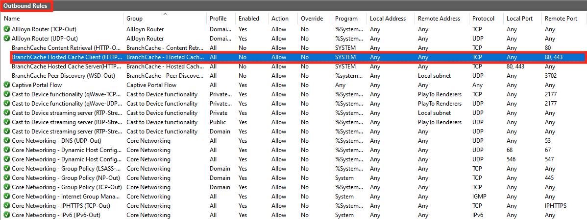
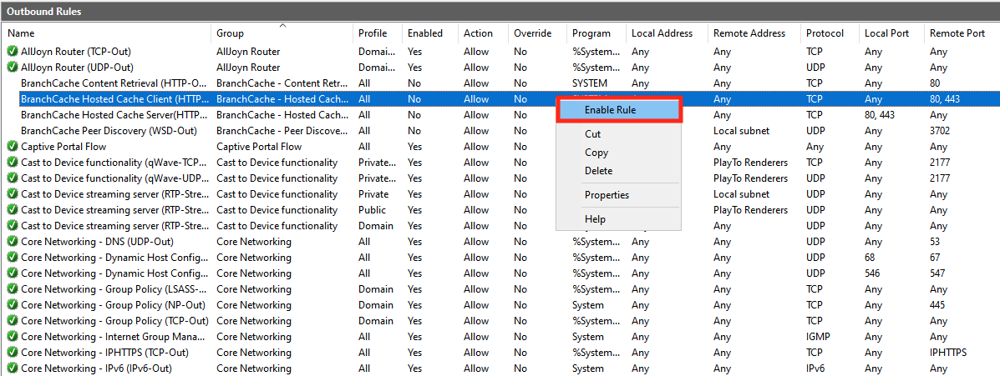

# Elastic Disaster Recovery network requirements

To prepare your network for running Elastic Disaster Recovery, set these
connectivity settings:

###### Note

All communication is encrypted with TLS.

**Communication over TCP Port 443:**

###### Topics

- [Communication over TCP port 443](#TCP-443 "#TCP-443")
- [Communication between the source servers and Elastic
  Disaster Recovery over TCP port 443](#Source-Manager-TCP-443 "#Source-Manager-TCP-443")
- [Communication between the staging area subnet and
  AWS Elastic Disaster Recovery over TCP port 443](#Communication-TCP-443-Staging "#Communication-TCP-443-Staging")
- [Communication between the source servers and the
  Staging Area Subnet over TCP port 1500](#Communication-TCP-1500 "#Communication-TCP-1500")

**Communication over TCP Port 1500:**

- Between the Source Machines and the staging area Subnet

## Communication over TCP port 443

Add these IP addresses and URLs to your firewall:

The Elastic Disaster Recovery AWS Region-specific Console address:

- (drs.<region>.amazonaws.com _example:
  drs.eu-west-1.amazonaws.com_)

Amazon S3 service URLs (required for downloading AWS Elastic Disaster Recovery software)

- The AWS Replication Agent installer should have access to the S3 bucket
  URL of the AWS Region you are using with Elastic Disaster Recovery.
- The staging area subnet should have access to S3.
- Allow these S3 buckets:

```

https://aws-drs-clients-<REGION>.s3.<REGION>.amazonaws.com/
https://aws-drs-clients-hashes-<REGION>.s3.<REGION>.amazonaws.com/
https://aws-drs-internal-<REGION>.s3.<REGION>.amazonaws.com/
https://aws-drs-internal-hashes-<REGION>.s3.<REGION>.amazonaws.com/
https://aws-elastic-disaster-recovery-<REGION>.s3.<REGION>.amazonaws.com/
https://aws-elastic-disaster-recovery-hashes-<REGION>.s3.<REGION>.amazonaws.com/
https://al2023-repos-<REGION>-de612dc2.s3.<REGION>.amazonaws.com/

```

###### Note

- Agent installation and replication server components require Amazon S3
  bucket for service functionality.
- Ensure the relevant VPC endpoint policy includes access to all the
  required Amazon S3 buckets.

When using an S3 VPC Endpoint, you must provide sufficient permissions for service
functionality. See example policy for replicating to us-east-1:

JSON

```
`{
 "Version":"2012-10-17",
 "Statement": [
 {
 "Effect": "Allow",
 "Principal": {
 "AWS": "*"
 },
 "Action": "s3:GetObject",
 "Resource": [
 "arn:aws:s3:::aws-drs-clients-us-east-1/*",
 "arn:aws:s3:::aws-drs-clients-hashes-us-east-1/*",
 "arn:aws:s3:::aws-drs-internal-us-east-1/*",
 "arn:aws:s3:::aws-drs-internal-hashes-us-east-1/*",
 "arn:aws:s3:::aws-elastic-disaster-recovery-us-east-1/*",
 "arn:aws:s3:::aws-elastic-disaster-recovery-hashes-us-east-1/*"
 ]
 }
 ]
}`

```

**AWS specific**

The staging area subnet requires outbound access to the [Amazon EC2 endpoint of
its AWS Region.](../../../general/latest/gr/rande.md "../../../general/latest/gr/rande.md")

TCP port 443 is used for two communication routes:

1. Between the source servers and Elastic Disaster Recovery.

2. Between the staging area subnet and AWS Elastic Disaster Recovery.

## Communication between the source servers and Elastic

Disaster Recovery over TCP port 443

Each source server that is added to AWS Elastic Disaster Recovery (AWS DRS) must continuously communicate
with AWS DRS (DRS.<region>.amazonaws.com) over TCP port 443.

These are the main operations performed through TCP port 443:

- Downloading the AWS Replication Agent on the source servers.
- Upgrading installed Agents.
- Connecting the source servers to the AWS DRS Console and displaying
  their replication status.
- Monitoring the source servers for internal troubleshooting and the use of resource
  consumption metrics (such as CPU, RAM).
- Reporting source server-related events (for example, a removal of resizing of a disk).
- Transmit source server-related information to the AWS DRS Console
  (including hardware information, running services, installed applications and packages,
  and more).
- Preparing the source servers for drill or recovery.

###### Important

Make sure that your corporate firewall allows connections over TCP port 443.

### Solving communication problems over TCP port 443

between the source servers and AWS Elastic Disaster Recovery

If there is no connection between your source servers and AWS Elastic Disaster Recovery, make sure that your
corporate firewall facilitates connectivity from the source servers to AWS Elastic Disaster Recovery over TCP Port 443. If the
connectivity is blocked, activate it.

#### Enabling Windows Firewall for TCP port 443

connectivity

###### Important

The information provided in this section is for general security and firewall guidance
only.
The information is provided on "AS IS" basis, with no guarantee of completeness, accuracy or
timeliness, and without warranty or representations of any kind, expressed or implied. In no
event will AWS and/or its subsidiaries and/or their employees or
service providers be liable to you or anyone else for any decision made or action taken in
reliance on the information provided here or for any direct, indirect, consequential,
special
or similar damages (including any kind of loss), even if advised of the possibility of such
damages. AWS is not responsible for the update, validation or support
of security and firewall information.

###### Note

Enabling Windows Firewall for TCP port 443 connectivity allows your servers to
achieve outbound connectivity. You may still need to adjust other external components, such
as firewall blocking or incorrect routes, in order to achieve full connectivity.

###### Note

These instructions are intended for the default OS firewall. Consult
the documentation of any third-party local firewall you use to learn how to enable TCP port
443 connectivity.

1. On the source server, open the **Windows
   Firewall** console.
2. On the console, select the **Outbound Rules** option from
   the tree.

 3. On the **Outbound Rules**table,
select the rule that relates to the connectivity to Remote Port - 443. Check if the **Enabled** status is
**Yes**.

 4. If the Enabled status of the rule is **No**, right-click it and select **Enable Rule** from the pop-up menu.



#### Enabling Linux Firewall for TCP port 443

connectivity

1. Enter this command to add the required Firewall rule:

_sudo iptables -A OUTPUT -p tcp --dport 443 -j
ACCEPT_ 2. To verify the creation of the Firewall rule, enter these commands:

sudo iptables -L

_Chain INPUT (policy ACCEPT)_

_target prot opt source destination_

_Chain FORWARD (policy ACCEPT)_

_target prot opt source destination_

_Chain OUTPUT (policy ACCEPT)_

_target prot opt source destination_

_ACCEPT tcp -- anywhere anywhere tcp dpt:443_

## Communication between the staging area subnet and

AWS Elastic Disaster Recovery over TCP port 443

The replication servers in the staging area subnet must continuously communicate
with Elastic Disaster Recovery over TCP port 443. The main operations that are
performed through this route are:

- Downloading the replication software by the replication servers.

- Connecting the replication servers to AWS Elastic Disaster Recovery, and
  displaying their replication status.
- Monitoring the replication servers for internal troubleshooting use and
  resource consumption metrics (such as CPU, RAM).
- Reporting replication-related events.

###### Note

The staging area subnet requires S3 access.

### Configuring

communication over TCP port 443 between the staging area subnet and AWS Elastic Disaster Recovery

You can establish communication between the staging area subnet and AWS Elastic Disaster Recovery over TCP port 443 directly.

There are two ways to establish direct connectivity to the Internet for the
VPC of the staging area, as described in the [VPC FAQ](https://aws.amazon.com/vpc/faqs/ "https://aws.amazon.com/vpc/faqs/").

1. [Public IP address + Internet gateway](../../../AmazonVPC/latest/UserGuide/VPC_Internet_Gateway.md "../../../AmazonVPC/latest/UserGuide/VPC_Internet_Gateway.md")

2. [Private IP address + NAT instance](../../../AmazonVPC/latest/UserGuide/vpc-nat-gateway.md "../../../AmazonVPC/latest/UserGuide/vpc-nat-gateway.md")

## Communication between the source servers and the

Staging Area Subnet over TCP port 1500

Each source server with an installed AWS Replication Agent continuously
communicates with the AWS Elastic Disaster Recovery replication servers in the staging
area subnet over TCP port 1500. TCP port 1500 is needed for the transfer of
replicated data from the source servers to the staging area subnet.

The replicated data is encrypted and compressed when transferred over TCP port 1500. Prior
to being moved into the Staging Area Subnet, the data is encrypted on the source infrastructure.
The data is decrypted after it arrives at the staging area subnet and before it is written to
the volumes.

TCP port 1500 is primarily used for the replication server data replication
stream.

Elastic Disaster Recovery uses TLS 1.2 end to end from the agent installed on the
source server to the replication server. Each replication server gets assigned a
specific TLS server certificate, which is distributed to the corresponding agent and
validated against on the agent side.

### Establishing communication

over TCP port 1500

###### Important

To allow traffic over TCP port 1500, make sure that your corporate firewall enables this
connectivity.

###

Required bandwidth between the source servers and the staging area subnet

Replicated data is transferred from the source servers to the staging area
over the network. For replication to succeed, your average network bandwidth
must be higher than the write rate on the source servers. If you attempt to
conduct a replication of a write intensive source server under low bandwidth
conditions, it will likely lag.
