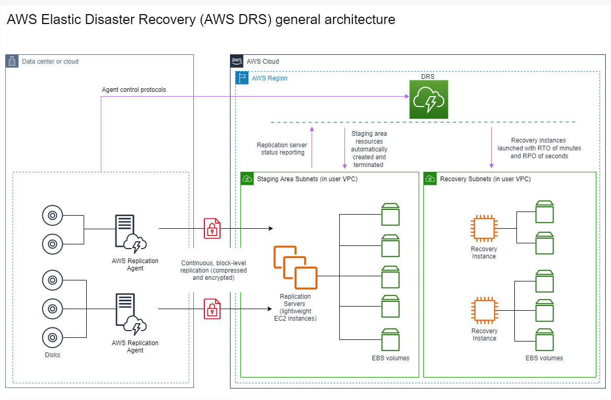
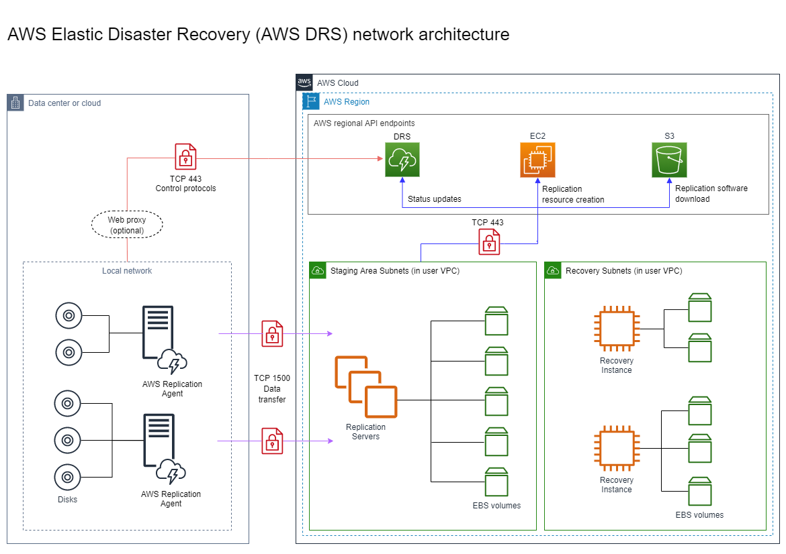
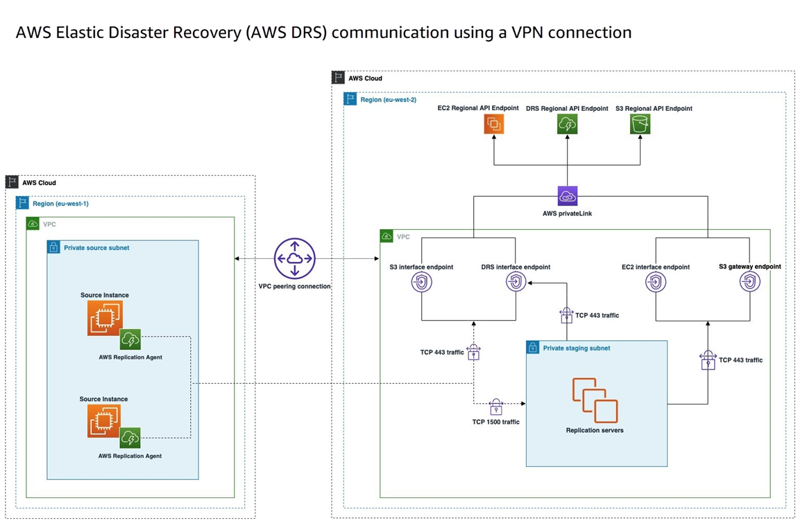
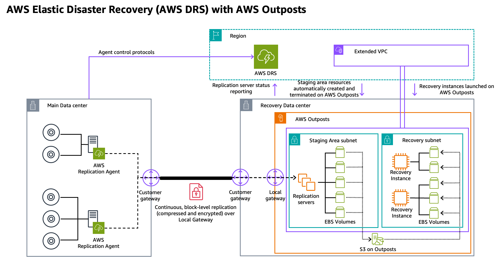
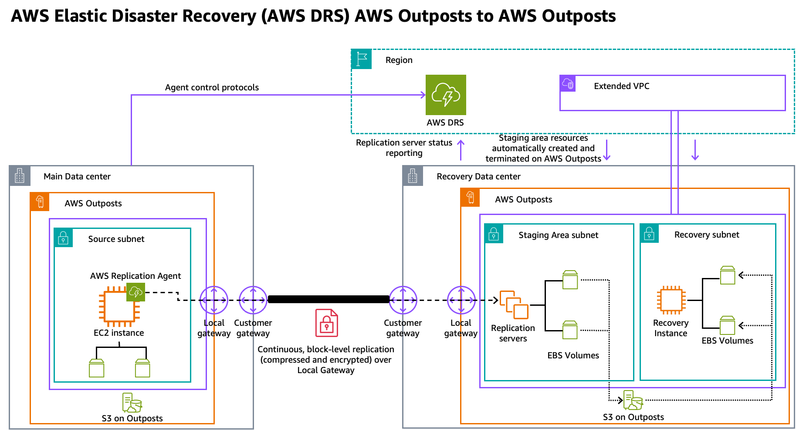
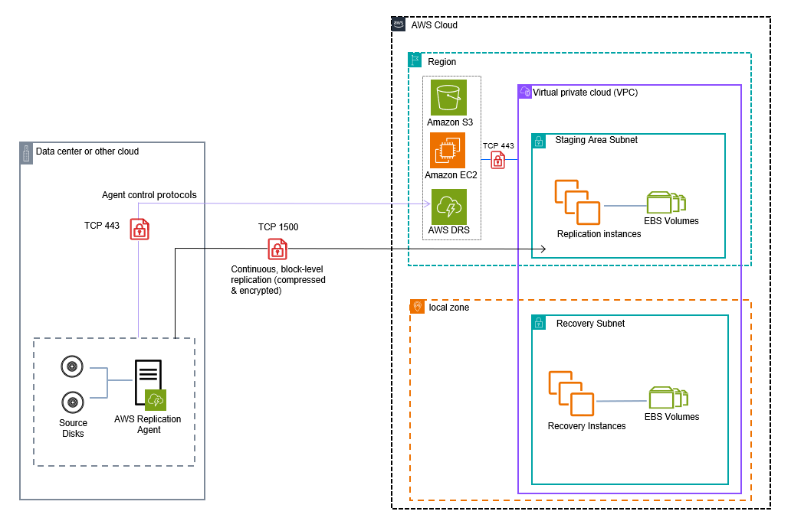
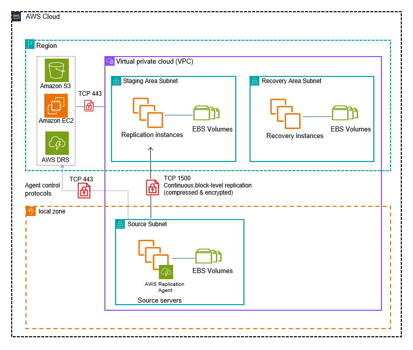
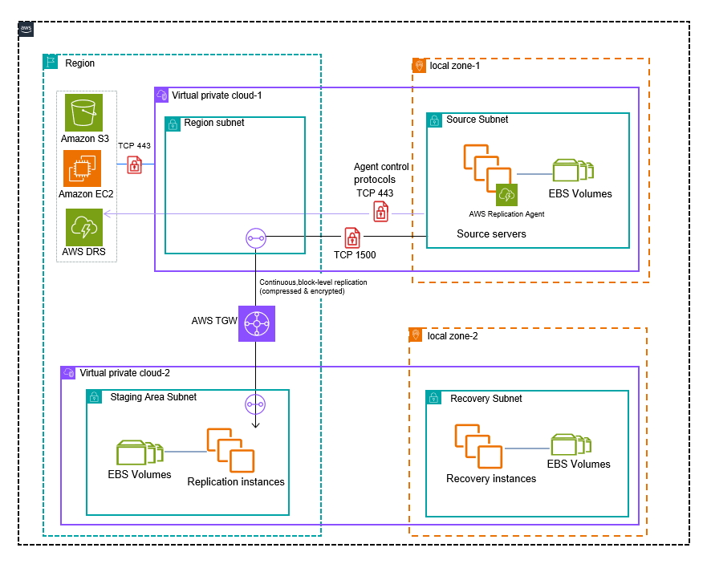
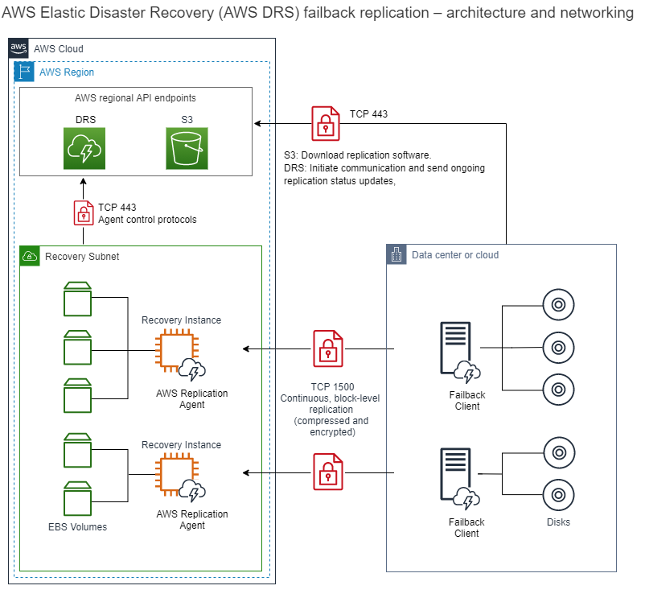

# Elastic Disaster Recovery network diagrams

The following are the network diagrams for AWS Elastic Disaster Recovery :

## General Architecture - On-Premises

to AWS

This diagram shows the general architecture of DRS protecting source servers
located in an on-premises environment.

## On-Prem to AWS

This diagram shows the network architecture of DRS protecting source servers
located in an on-premises environment.

## AWS Cloud to AWS Cloud via VPN

This diagram shows the network architecture of DRS protecting source servers
located in an on-premises environment. Communication between the on-premise
environment and DRS is performed through a VPN connection.

## On-Prem to Outposts

This diagram shows the network architecture of DRS protecting source servers
located in an on-premises environment. The staging and recovery are both located on
AWS Outposts. [Find out more about protecting source servers using Outposts.](outposts.md "outposts.md")

## AWS to Outposts

This diagram shows the network architecture of DRS protecting source servers
located in AWS. The staging and recovery are both located on AWS Outposts. [Find out more
about protecting source servers using Outposts.](outposts.md "outposts.md")

## On-Premises to AWS Local

Zone

This diagram shows the network architecture of DRS protecting source servers located in an on-premises environment.
The staging area is located in an AWS Region and the and recovery is in an AWS Local Zone.

## AWS Local Zone to Region

This diagram shows the network architecture of DRS protecting source servers located in an AWS Local Zone.
The staging and recovery environment are both located in an AWS Region.

## AWS Local Zone to AWS Local Zone

This diagram shows the network architecture of DRS protecting source servers
located in an AWS Local Zone. The staging environment is located in an AWS
Region and the recovery environment is in another AWS Local Zone.

## AWS Failback to On-Prem

This diagram shows the network architecture of DRS performing Failback to an
on-premise environment after performing a recovery into AWS.

