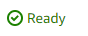
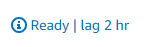
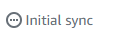
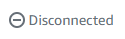

# Using the AWS Elastic Disaster Recovery Console

AWS Elastic Disaster Recovery is AWS Region-specific. Make sure that you select the correct Region from the
**Select a Region** menu when using AWS Elastic Disaster Recovery, just
like you would with other AWS Region-specific services such as Amazon EC2.

AWS Elastic Disaster Recovery is divided into several primary pages. Each page contains additional tabs and
actions. The default view for the AWS Elastic Disaster Recovery Console is the **Source
servers** page. This page automatically opens every time you open
AWS Elastic Disaster Recovery. You can navigate to other AWS Elastic Disaster Recovery pages through the left pane **AWS Elastic Disaster Recovery** navigation menu.

Each Elastic Disaster Recovery page opens in the right pane.

## Source servers page

The Source Servers page lists all of the source servers you added to AWS Elastic Disaster Recovery and allows
you to interact with your servers and perform a actions. [Learn more about the Source servers page.](source-servers.md "source-servers.md")

Control your source servers in the AWS Elastic Disaster Recovery console through the **Actions**, **Replication**, and **Initiate recovery job**
menus.

Review the progress of commands through the **Recovery job
history** tab. [Learn more about recovery
job history.](recovery-job.md "recovery-job.md")

The commands in the **Actions** and **Initiate recovery job** menus influence the specific source servers
you selected. You can select a single source server or multiple source servers for
any command.

Use the **Filter source servers by property or value** field
to filter servers.

AWS Elastic Disaster Recovery color codes the state of each source server. Use the **Alerts** column to easily determine the state of your
server.

- A server that is ready to launch Drill or Recovery instances displays the green checkmark
  and states **Ready**.

A server that is ready to launch Drill or Recovery instances, but is experiencing a
non-critical issue such as lag displays the blue info sign and states
**Ready** and displays the lag duration to
the right. You may need to take action to fix the lag.

A server that is still undergoing initial sync displays a gray circle with three dots and
states **Initial sync**.

A server that is disconnected displays the gray warning sign and states **Disconnected**.

A server that is not ready due to a significant error, such as a stall, displays a red
**X** and states **Not
ready**. The Not Ready state is only shown for servers that are
not replicating and do not have any previously created Points in Time.
Action must be taken in order to fix the issue.

When some commands are initiated AWS Elastic Disaster Recovery displays information messages at the top of the
**Source servers** page. AWS Elastic Disaster Recovery color codes
these messages for clarity. A green message means that a command was completed
successfully. A red message means that a command was not completed successfully.
Each message provids details and links to supplemental information.

AWS Elastic Disaster Recovery allows you to interact with and manage each server. Choose the server hostname to
be redirected to the server details view.

The **Server details** view tab shows specific details for an individual server. From here, you
can see an overview of the server's recovery state, as well as various technical details, manage
tags, manage disks, edit the server's replication settings, and edit the server's launch
settings through the various tabs. [Learn more about the Server
Details view](server-details.md "server-details.md").

Certain Elastic Disaster Recovery commands, such as **Edit replication settings**,
allow you to interact with multiple source servers at once. When multiple source
servers are selected and the **Replication > Edit replication
settings** option is chosen, AWS Elastic Disaster Recovery indicates which servers are
being edited.

In order for setting changes you have made in the AWS Elastic Disaster Recovery Console to take effect, be sure
to choose **Save** at the bottom of each Settings page.
