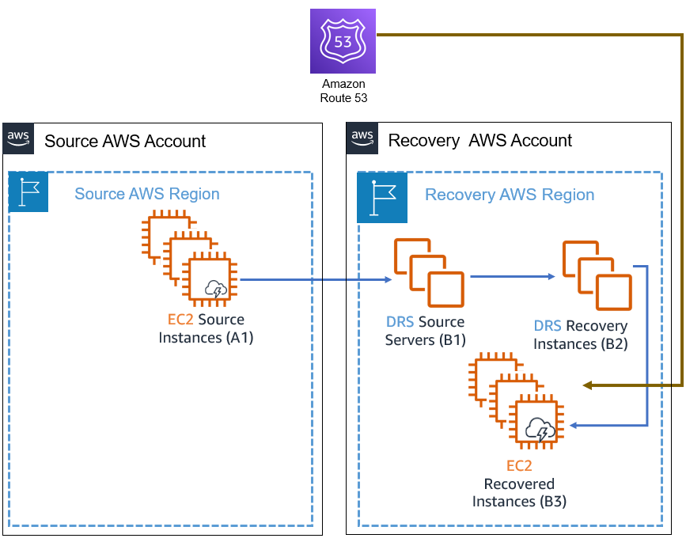
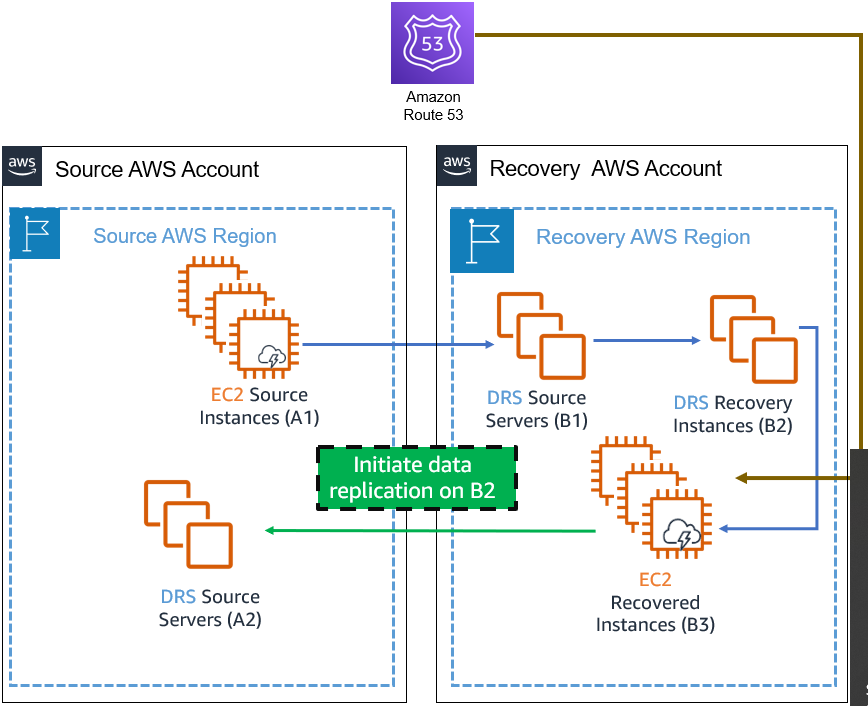
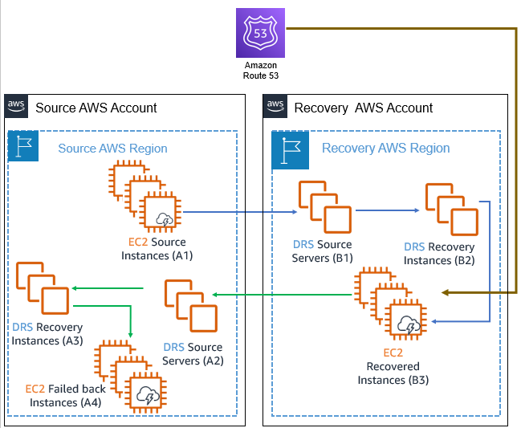
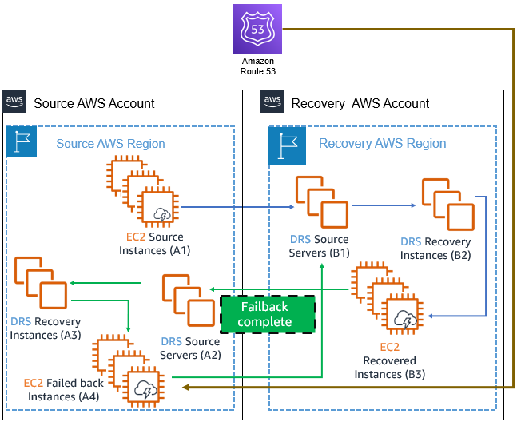
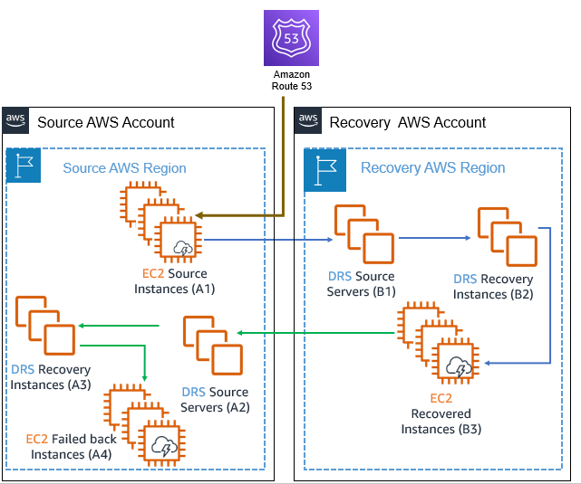

# Performing a cross-account

failback

AWS Elastic Disaster Recovery (AWS DRS) allows you to perform failover and failback your EC2-based
applications from one AWS account to another AWS account. The failover process is the same as failing
over into an AWS account from a source outside of AWS, but the failback process is different.
The instructions below describe the complete cross-account failover and failback process.

## Overview and prerequisites

The failback process starts after the failover process ends. During failover,
AWS DRS allows you to replace the EC2 source instance (A1) with the EC2
recovered instance (B3). The current AWS resource state is illustrated in this
diagram:

After performing a recovery,
your applications are running on EC2 instances in the recovery account and region.
However, these recovered instances (marked B3 in the diagram above) are not protected against
other potential outages.
In order to avoid data loss, you should start a reversed replication immediately.
Starting reversed replication is only possible if the service is initialized in the recovery account and region. See [initialize the AWS DRS](getting-started-initializing.md "getting-started-initializing.md").

Starting reversed replication involves copying the data from the EC2 recovered instances (B3) to
the original account and region,
an operation that takes time and possibly incurs cross-Region data transfer costs if the source region differs from the recovery region.

Once replication has reached a healthy state,
failing back to the source account (after starting reversed replication) is possible using the DRS console on the source account and region,
assuming DRS has been initialized in the source account and region.

###### Important

- To ensure operational continuity, [initialize the AWS
  DRS](getting-started-initializing.md "getting-started-initializing.md") in advance in both the source and target AWS accounts and regions,
  and conduct regular failover and failback drills.
- If the source region is different from the recovery region, and at least one of the involved regions is an opt-in region, it is mandatory that the opt-in region be enabled in both accounts. If both regions are opt-in regions, then both regions must be enabled in both the source account and the recovery account.
- Create the roles, identified as **Failback and in-AWS right-sizing roles** via [Trusted Account page](trusted-accounts.md#trusted-accounts-page "trusted-accounts.md#trusted-accounts-page") in advance, for both directions: from source account to recovery account and from recovery account to source account.
- Before starting a failback, make sure the EC2 recovered instances
  (B3) have a network interface while meeting the specified [network
  requirements](Network-Requirements.md "Network-Requirements.md").
- Access to EC2 instance metadata is required. If you have a custom
  network setup that modifies the operating system route, ensure that
  access to metadata is intact. Learn how to verify metadata access for
  [Linux](../../../AWSEC2/latest/UserGuide/instancedata-data-retrieval.md "../../../AWSEC2/latest/UserGuide/instancedata-data-retrieval.md")
  and for [Windows](../../../AWSEC2/latest/WindowsGuide/instancedata-data-retrieval.md "../../../AWSEC2/latest/WindowsGuide/instancedata-data-retrieval.md").

## Performing cross-account failback

1. **Start reversed replication.**
   1. Log in to the recovery account and select the recovery region (the account and region where the recovery instances were launched in).
   2. Open the **AWS Elastic Disaster Recovery** service console.
   3. Navigate to the **Recovery
      instances** page.
   4. Select the servers that you want to protect and click
      **Start reversed replication**.
   5. A Source server (A2) will be created in the source account and
      region, as shown in this diagram.

   

   ###### Note

   All server data is transferred over the wire during this
   step. This process could take some time and possibly result in
   [cross-Region data transfer costs](https://aws.amazon.com/disaster-recovery/pricing/ "https://aws.amazon.com/disaster-recovery/pricing/") if the source region differs from the recovery region. Moreover,
   starting reversed replication creates additional replication
   resources (A2). To avoid double billing, you can stop
   replicating the source instances (A1) by navigating to the
   AWS DRS source server in the recovery account and region (B1) and
   clicking **Stop replication**
   in the replication drop-down menu. Make sure that you only
   stop the replication after validating the recovery instances
   because once replication is stopped, all previous points in
   time are deleted.

   ###### Important

   Once replication is stopped, all previous points in time are deleted.
   This is done to minimize costs.

2. **Launch, validate, and redirect traffic.**

After the **Reversed direction launch
state** is marked as **Ready**, take these steps to complete the failback:

    1. Find the relevant source servers (A2) in the source account and region by
     information in the **Replicating to source
     server** and **Replicating to account**
     columns of the recovery instance (B2)

    ###### Note

     You can also find it directly on the **Source servers** page in AWS DRS
     console at the source account and region.

    ###### Note

     The **Replicating to
     account** column is not visible by default and
     can be made visible in the preferences of the Recovery
     instances page.
    2. If the state is **Ready** (or **Ready with lag**),
     click **Launch for failback** under **Initiate recovery job**.

    ###### Important

     Make sure that your applications (A4) are working as
     expected. If you run into any issues, you can relaunch the
     instances and try again. Until you opt to failback, your
     recovery instances (B3) will continue to run in your
     recovery account and region to ensure business continuity.

    
    3. Redirect traffic to failed back instances (A4), which will now become your new
     primary instances.
     Traffic redirection is not conducted using DRS -> You need to perform traffic redirection either using your systems, or by utilizing a custom post-launch action.
     Choose a service according to your preferences (consider using Amazon Route 53).

3. **Protect your new failed back instances.**

###### Important

Do not perform this step when performing a drill. This step
replaces the instances that AWS DRS replicates (from the Source
instances, A1, to the failed back instances, A4). In a drill, the
source instances (A1) are still your production environment.

The newly launched failed-back instances (A4) are not protected. In
order to protect them, follow these steps:

    1. Navigate to the recovery instance (A3) in the source account and region.
    2. Click **Start reversed
     replication**. This step will replace the Instances
     that the Source Server (B1) protects (A4 instead of A1).

 4. **Clean your environment.**

After the failover to failback cycle is complete, you may be left
with multiple AWS resources that you no longer need and that are costly
to maintain. These include the source and failover EC2 instances
(A1,B3), the recovery instances (B2, A3), and the Source servers (A2).
Consider removing them.

**Cleanup steps:**

    1. **Stop replication on the source servers
     (A2) of the source account and region.**

     Navigate to the source server in the source account and region (A2), and
     click on **Stop replication** under
     the **Replication menu**. This step
     is required before terminating the recovery instance
     (B2).
    2. **Terminate the recovery instances
     (B2).**

     These instances, launched in your recovery account and region, are no
     longer needed now that you have launched new primary instances
     in your original source account and region. To terminate these
     instances, navigate to the AWS DRS Console in your recovery account and region (B2).
     After termination, those instances will no longer
     appear in the **Recovery
     Instances** page of the DRS Console. This process
     also terminates the recovered EC2 instances (B3).
    3. **Terminate the EC2 instances (A1) on the source account and region.**

     These have now been replaced by the new instances launched in step 2 above (EC2
     failed back instances, A3).
     You might have stopped these instances after the failover,
     and you can now terminate them using the AWS EC2 Console.
    4. **Remove the recovery instance (A3) in the
     source account and region.**

     Navigate to the **Recovery
     instances** in the AWS DRS console. Select the
     relevant recovery instance and click **Delete server** under the **Action** drop-down menu.

    ###### Note

    If you have started reversed replication for the recovery instance (A3),
     you will not be able to disconnect it. To remove the recovery instances (A3) in
     the source account and region, simply delete the server. This will
     ensure that the newly launched failed-back instances (A4) remains
     protected.
    5. **Remove the source servers (A2) in the
     source account and region**

    Navigate to the **Source
     servers** in the AWS DRS console. Select the
     relevant source server and select **Disconnect from AWS** under the **Actions** drop-down menu. Then, select
     **Delete server** under the
     same **Actions** menu.

### Performing a drill

To conduct a drill, follow the steps 1 and 2 as described above,
and then perform a different cleanup process as described below.

###### Note

1. Do not to stop the source server (B1) in the recovery account and region as recommended
   in the note of step 1-e.
2. Do not perform step 3, Protecting the failed back instances would affect your
   production data.

#### Cleaning up after a drill

After a successful drill your AWS environment should look like this:

The only two AWS resources that need to remain are your actual production environment
(A1) and its replication backup (B1).
Since DRS protects replication servers, you must stop the replication first.

1. Stop the replication of the Source servers (A2) in the source account and region.

###### Important

Make sure you don’t stop replicating the Source servers (B1) in the recovery account and region. 2. Terminate the recovery instances (A3) in the source account and region
and the recovery instances (B2) in the recovery account and region. As a
result of this action, both the recovered instances (B3) and the
failback instances (A4) are terminated as well.

###### Note

Performing cross-account replication, failover and failback accrues
additional costs, not detailed in the [AWS DRS pricing
examples](https://aws.amazon.com/disaster-recovery/pricing/ "https://aws.amazon.com/disaster-recovery/pricing/"). These additional costs consist of [cross-Region data transfer costs](https://aws.amazon.com/blogs/architecture/overview-of-data-transfer-costs-for-common-architectures/ "https://aws.amazon.com/blogs/architecture/overview-of-data-transfer-costs-for-common-architectures/") during initial data
replication, ongoing data replication, and failback replication if the source region differs from the recovery region; as well as
the cost of replication resources (such as Amazon EBS volumes, snapshots, and
more), used for failback replication; and also the DRS hourly billing for
failback source servers.
