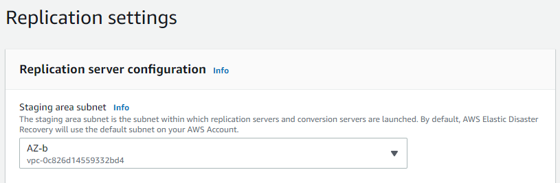
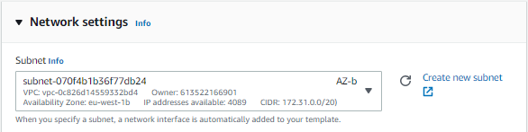
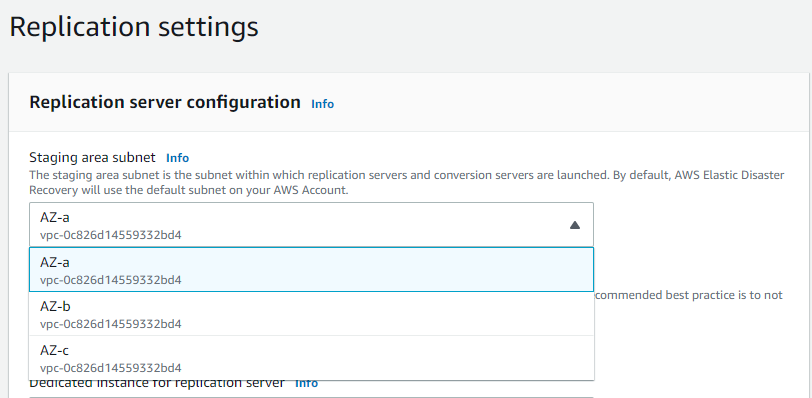
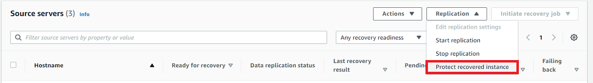
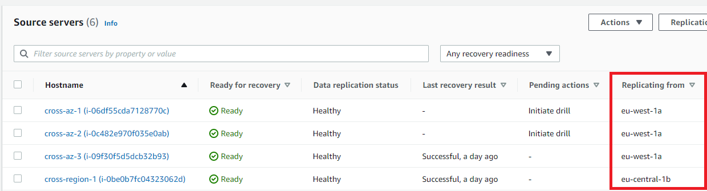

# Cross Availability Zone recovery

You can use DRS to replicate and recover EC2 instances across Availability Zones.

## Cross Availability Zone (AZ) setup

### Initial settings

In order to replicate an EC2 instance across availability zones,
the replication settings and launch settings should be set to replicate into an availability
zone different from the one hosting your protected EC2 instance.
To find out which availability zone hosts an instance, visit the AWS EC2 console.

Configure the replication settings and launch template to use a subnet hosted on an availability
zone different from the one hosting the EC2 instance being protected.

######

Example

If the protected EC2 is hosted on availability zone eu-west-1a, the
replication settings subnet (and launch template subnet) are hosted on
another availability zone in the same region, for example, eu-west-1b.

Select a subnet for replication from the replication settings page for the
source server. Information about each subnet, including which availability zone
hosts it, can be found on the Amazon VPC console.

**Replication settings**

**Launch settings**

Learn how to modify the
[launch template](launching-target-servers.md "launching-target-servers.md").

### Launching a Recovery Instance

To recover the protected EC2 instance, follow these [instructions](failback-preparing-failover.md "failback-preparing-failover.md").

### Protecting your Recovered Instance

Once a recovery instance has been successfully launched inside a target availability zone
and failed over, this recovery instance should be protected by DRS.

**To protect this recovery instance:**

- Replication settings and launch template subnets should be changed to a subnet
  hosted on an availability zone
  different from the one hosting the EC2 instance that is associated with the recovery
  instance.
- You must start the replication from the new Recovery EC2 Instance instead of the
  original EC2 instance.

If a recovery instance was created and the underlying EC2 instance is hosted
on availability zone "eu-west-1**b**",
the replication settings and launch template can be modified to use a subnet hosted
on availability zone "eu-west-1**a**".

**Modify the replication settings to replicate to the original
availability zone.**

**Modify the launch settings to the original availability zone.**

In order to modify the launch template follow these [instructions](launching-target-servers.md "launching-target-servers.md").

**Protect your recovered instance.**

Protecting your recovered instance also stops the replication of the original EC2 instance.
For example, if the original EC2 instance is hosted in availability zone "eu-west-1a" and is
recovered to
a subnet hosted in availability zone eu-west-1b, starting the replication on the recovered
instance back to
eu-west-1a also stops the replication of the original instance hosted in eu-west-1a.

Starting the replication for a recovered instance only initiates a rescan
(to apply the new instance's changes on the last snapshot) instead of a full
synchronization.
The reason is that all the replication resources associated with the original instance,
such as point in time snapshots, configuration, and job logs are retained.
After the replication has started, there is no need to keep the original instance for
replication purposes.

The availability zone hosting the EC2 instance that is being protected can be viewed on the
**Source servers**
list (**Replicating from** column).

###### Note

One of the major benefits of cross AZ replication is that the replication agent only needs to
rescan the differences between the latest point in time snapshot and the current source server
data.
This saves both time and resources.
All points-in-time snapshots, configuration, and job logs will be retained.
You can now terminate the original EC2 instance in eu-west-**1a**. Your recovered instances are now protected.

You can view the source environment availability zone from the **Source servers** list.

