# Performing a failback with the DRS

Mass Failback Automation Client

DRS allows you to perform a scalable failback for vCenter with the DRS Mass
Failback Automation Client (DRSFA Client). This allows you to perform a
one-click or custom failback for multiple vCenter machines at once.

###### Note

 The DRSFA client only works with vCenters source servers.

###### Note

 The DRSFA client was only tested on vCenter versions 6.7 and 7.0.

## DRSFA prerequisites

These are the prerequisites for performing failback automation with the
DRSFA client:

1. Ensure that you meet all of the [network
   requirements](preparing-environments.md "preparing-environments.md").
2. Ensure that you have [initialized
   DRS](getting-started-initializing.md "getting-started-initializing.md").
3. Each server that is being failed back must have at least 3 GB of
   RAM.
4. Each server that is being failed back must have the hardware clock
   set to UTC rather than Local Time.
5. The recovery instance used as a source for failback must have
   permissions to access AWS Elastic Disaster Recovery via API calls. This is done using instance
   profile for the underlying EC2 instance. The instance profile must
   include the AWSElasticDisasterRecoveryRecoveryInstancePolicy in
   addition to any other policy you require the EC2 instance to have.
   By default, the launch settings that DRS creates for source servers
   already have an instance profile defined that includes that policy
   and that instance profile will be used when launching a Recovery
   Instance.
6. Inbound port TCP 1500 must be open on the Recovery instance in AWS.
7. The server on which the DRSFA client is run needs to be able to
   communicate with your vCenter environment.
8. The server on which the DRSFA client is run must have at least 4
   GB of RAM.
9. The server on which the DRSFA client is run must run Python 3.9.4
   with pip installed (other versions of Python will not work).

###### Note

The installation procedure shown below uses Ubuntu 20.04
running Python 3.9.4. 10. The server on which the DRSFA client is run requires these tools
for DRSFA Client installation. The installer will attempt to install
them if they are not already present::

build-essential curl genisoimage git libbz2-dev libffi-dev liblzma-dev libncurses5-dev
libncursesw5-dev libreadline-dev libsqlite3-dev libssl-dev llvm make tk-dev unzip wget
xz-utils zlib1g-dev

    1. To see the list of python libraries required for the DRSFA Client to run, see
     the
     requirements.txt file
     (https://drsfa-us-west-2.s3.us-west-2.amazonaws.com/requirements.txt). These
     libraries will be installed automatically by DRSFA
     Client.

11. The vCenter source servers must have two CD ROM devices with IDE controllers attached
    to
    run the DRSFA client - one for the DRS Failback Client and one for the
    drs_failback_automation_seed.iso

###### Note

If no attached CD ROM devices are found, the DRSFA client will attempt to add the
CD ROM devices. 12. The DRS Failback Client must be uploaded to your vCenter Datastore. 13. We recommend using the latest version of the DRS Failback Client. Download the [latest version of the DRS Failback
Client](failback-performing.md#failback-performing-performing "failback-performing.md#failback-performing-performing")and
upload it to your vCenter datastore. 14. We recommend running SHA512 checksum verification on the DRS
Failback Client prior to using it with the DRSFA client. You can
verify the checksum at this address: `https://aws-elastic-disaster-recovery-hashes-{REGION}.s3.amazonaws.com/latest/failback_livecd/aws-failback-livecd-64bit.iso.sha512` 15. We recommend running SHA512 checksum verification on the
drs_failback_automation_seed.iso
file prior to using it with the DRSFA client. 16. The DRSFA client does not require root privileges. We recommend low privileges for
running the client. 17. You need to have these vCenter API credentials and permissions:
‘Virtual machine’ : [ ‘Change Settings’, ‘Guest operation queries’,
‘Guest operation program execution’, ‘Connect devices’, ‘Power off’,
‘Power on’. ‘Add or remove device’, ‘Configure CD media]
‘Datastore’: [‘Browse datastore’] 18. vCenter credentials should only be constrained to the VMs you plan to failback. 19. You should be able to fail back all of the Recovery instances in a single AWS Region
simultaneously with the aid of the DRSFA Client as long as your vCenter hardware
supports the
failback load.

### Security best practices

These are security best practices for using the DRSFA Client:

1. Follow the least privilege principle and set the appropriate permissions on the
   folder
   where the JSON generated by the client will be stored.
2. Ensure that you are always using the latest version of the
   DRSFA Client. The client will automatically check and verify
   that you are using the latest version upon startup.
3. You should not provide any additional permissions to the DRSFA
   Client other than the ones listed in the prerequisites.
4. Ensure that you follow the[AWS recommended password policy](../../../IAM/latest/UserGuide/id_credentials_passwords_account-policy.md "../../../IAM/latest/UserGuide/id_credentials_passwords_account-policy.md") when setting the password for the VM that hosts
   the DRS Failback Client when generating the drs_failback_automation_seed.iso file.
5. Ensure that you manually verify the DRSFA client hashes when automatic hash
   verification
   is not performed. The hash verification hint is shown when the DRSFA client is
   installed.
6. Ensure that only trusted administrators have access to the
   vCenter environment. The DRSFA Client will consider the customer
   executing scripts and every person with access to the datastore
   as a single trust entity
7. We suggest performing a hash verification on the DRS Failback Client and the
   drs_failback_automation_seed.iso file before proceeding. The hash is exported to the
   `drs_failback_automation_seed.iso.sha512`
   file once the seed iso is
   created.
8. We suggest using low level privilege when running the DRSFA client.
9. We suggest following the least privilege principle and setting
   the appropriate permissions on the folder where the Failback
   Client and seed.iso files will be stored.
10. The vCenter credentials used should only have permissions to the VMs involved in
    the
    failback attempt.

## Installing the DRSFA

Client

Prior to running the DRSFA Client, you must first install it. Installing
the client is a one-time operation.

The DRSFA client was fully tested on Ubuntu 20.04 and an installation
script for this version is provided. Use this vanilla AMI or public ISO to
run the client locally in your vCenter environment.

Follow the [Create your EC2 resources and launch your EC2 instance](../../../efs/latest/ug/gs-step-one-create-ec2-resources.md "../../../efs/latest/ug/gs-step-one-create-ec2-resources.md")
guidelines as per the EC2 documentation. When asked to select an AMI, select
the option below instead of the Amazon Linux 2 AMI and then proceed
according to the documentation. Use this AMI from EC2: Ubuntu Server 20.04
LTS (HVM), SSD Volume Type:

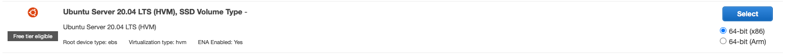

Download the Ubuntu Server 20.04 LTS server install image ISO from the
[Ubuntu download site](https://releases.ubuntu.com/20.04.3/ubuntu-20.04.3-live-server-amd64.iso?_ga=2.226405082.1942739102.1640275732-1020059774.1638346768 "https://releases.ubuntu.com/20.04.3/ubuntu-20.04.3-live-server-amd64.iso?_ga=2.226405082.1942739102.1640275732-1020059774.1638346768").

Once your VM instance is set up and ready, connect to the Ubuntu instance
and run command prompt and download the DRSFA client using this command:

`wget
 https://drsfa-us-west-2.s3.us-west-2.amazonaws.com/drs_failback_automation_installer.sh`

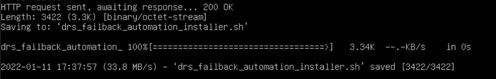

###### Note

You should verify the hash of the installer after running the
installation command:
`https://drsfa-hashes-us-west-2.s3.us-west-2.amazonaws.com/drs_failback_automation_installer.sh.sha512`

Use this command to execute the installation script:

`bash drs_failback_automation_installer.sh`

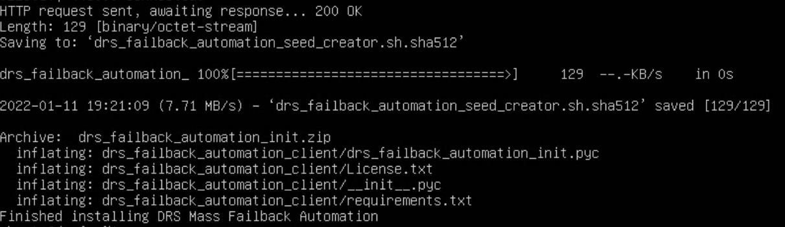

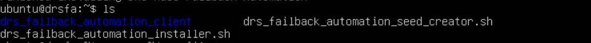

###### Note

This command may ask for a sudo password if you use the Ubuntu ISO.
Enter the password but **do not** run this
command as sudo.

`source ~/.profile`


The DRSFA client has a one-time installation. The DRSFA client will be
installed in the `drs_failback_automation_client` directory. Once
you've successfully ran the command above and installed the client, you can
delete the DRSFA client installer from your server by running this
command:

`rm drs_failback_automation_installer.sh`

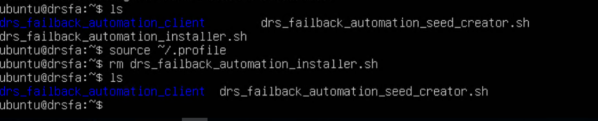

Once installation is complete, you will need to set up a password for the
VM on which the DRSFA client is run. This is done by generating a seed.iso
file that you must upload to your Datastore. Run these commands to generate
the seed.iso file:

`bash drs_failback_automation_seed_creator.sh`

You will be prompted to enter a password. Ensure that you enter a unique
password that following the [AWS recommended password policy](../../../IAM/latest/UserGuide/id_credentials_passwords_account-policy.md "../../../IAM/latest/UserGuide/id_credentials_passwords_account-policy.md").

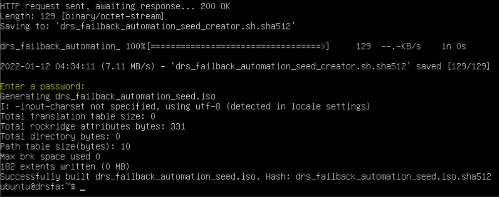

Two files will be generated, the
`drs_failback_automation_seed.iso` file and the
`drs_failback_automation_seed.iso.sha512` hash. Upload the
seed.iso file to the same Datastore where the DRS Failback Client ISO file
is stored.

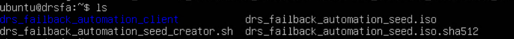

Once the `drs_failback_automation_seed.iso` file is generated,
you can run this command to delete the seed creator:

`rm drs_failback_automation_seed_creator.sh`

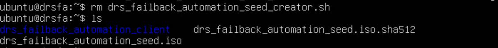

Once you have completed the initial installation, you can generate the
required credentials and run the DRSFA client.

## Generating IAM credentials and configuring

Cloudwatch logging

In order to run the DRSFA Client, you must first generate the required AWS
credentials.

###### Important

Temporary credentials have many advantages. You don't need to rotate them or revoke them
when they're no longer needed, and they cannot be reused after they expire. You can specify
for how long the credentials are valid, up to a maximum limit. Because they provide enhanced
security, using temporary credentials is considered best practice and the recommended
option.

### Temporary credentials

To create temporary credentials:

1. [Create a new
   IAM Role](../../../IAM/latest/UserGuide/id_roles_create.md "../../../IAM/latest/UserGuide/id_roles_create.md") with the [AWSElasticDisasterRecoveryFailbackInstallationPolicy](../../../aws-managed-policy/latest/reference/AWSElasticDisasterRecoveryFailbackInstallationPolicy.md "../../../aws-managed-policy/latest/reference/AWSElasticDisasterRecoveryFailbackInstallationPolicy.md")
   policy.
2. Request temporary security credentials [via AWS STS](../../../IAM/latest/UserGuide/id_credentials_temp_request.md "../../../IAM/latest/UserGuide/id_credentials_temp_request.md") using the [AssumeRole
   API](../../../STS/latest/APIReference/API_AssumeRole.md "../../../STS/latest/APIReference/API_AssumeRole.md").

Once your credentials are generated, you should create a logGroup for CloudWatch logging
named **DRS_Mass_Failback_Automation**. If this log group is not
created or if it's created with the wrong name, the DRSFA client will still work, but logs will
not be sent to CloudWatch. Learn more about working with log groups in the[Amazon CloudWatch Logs documentation](../../../AmazonCloudWatch/latest/logs/Working-with-log-groups-and-streams.md "../../../AmazonCloudWatch/latest/logs/Working-with-log-groups-and-streams.md").

## Running the DRSFA client

Once you have installed the DRSFA client, you can run it by following these instructions:

`cd` into the `drs_failback_automation_client`
directory and enter these parameters in a single line or settings the
environment variables one by one, replace the defaults with your specific
parameters and paths followed by the `python
 drs_failback_automation_init.pyc` command and press enter.

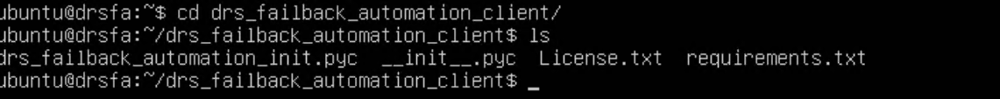

- AWS_REGION=XXXXX – The AWS Region in which your Recovery instances
  are located.
- AWS_ACCESS_KEY=XXXXX – The AWS Access Key you generated for the
  DRSFA client.
- AWS_SECRET_ACCESS_KEY=XXXXXX – The AWS Secret Access Key you
  generated for the DRSFA client.
- AWS_SESSION_TOKEN=XXXXXX – (Optional) The AWS Session Token you
  generated for the DRSFA client.
- DRS_FAILBACK_CLIENT_PASSWORD = XXXXXX – The custom password you
  set for the Failback Client in the drs_failback_automation_seed.iso
  file.
- VCENTER_HOST=XX.XX.XXX.XXX – The IP address of the vCenter
  Host.
- VCENTER_PORT=XXX – The vCenter Port (usually 443)
- VCENTER_USER=sample@vsphere.local – The vCenter username
- VCENTER_PASSWORD=samplepassword – The vCenter password
- VCENTER_DATASTORE=DatastoreX – The Datastore within vCenter where
  the Failback Client ISO file (aws-failback-livecd-64bit.iso) and
  seed.iso file (drs_failback_automation_seed.iso) are stored.
- VCENTER_FAILBACK_CLIENT_PATH='samplepath/aws-failback-livecd-64bit.iso'
  – Failback Client ISO path in the Datastore.
- VCENTER_SEED_ISO_PATH='samplepath/drs_failback_automation_seed.iso'
  – The seed.iso file path in the Datastore.

Enter all of the parameters in a single line or enter the environmental
variables individually one by one. Once you have entered your parameters,
enter the `python drs_failback_automation_init.pyc` command and
press enter. The full parameters and command should look like this example:

`AWS_REGION=XXXX AWS_ACCESS_KEY=XXXX AWS_SECRET_ACCESS_KEY=XXXX
 DRS_FAILBACK_CLIENT_PASSWORD=XXXX VCENTER_HOST=XXXX VCENTER_PORT=XXXX VCENTER_USER=XXXX
 VCENTER_PASSWORD=XXXX VCENTER_DATASTORE=XXXX VCENTER_FAILBACK_CLIENT_PATH=XXXX
 VCENTER_SEED_ISO_PATH=XXXX python drs_failback_automation_init.pyc`

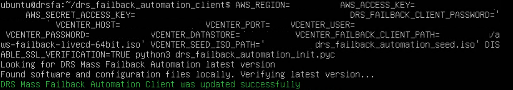

###### Note

- SSL verification is active by default. If you want to deactivate SSL verification, then add
  this parameter: DISABLE_SSL_VERIFICATION=true
- By default, the DRSFA client initiates a failback for 10 servers at once (if failing back more
  than 10 servers). To change the default value, use the
  THREAD_POOL_SIZE parameter.

## One-click

failback

Once the client has connected successfully and finished verification,
select the **One-Click Failback** option under
**What would you like to do?**

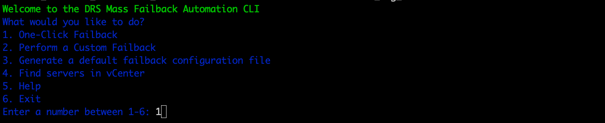

Enter a custom prefix for the results output for this failback operation.
This file is saved in the
`/drs_failback_automation_client/results/Failback` directory.


If failback replication has already been started for some of the Recovery
instances, the console prompts you to decide if you want to skip the
instances that are already in failback or restart replication for those
instances.

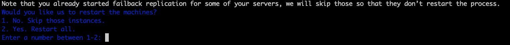

The DRSFA client will list the Recovery instances that are currently present in your AWS
Account. The client will then prompt you **Would you like to continue?** . Enter **Y** to continue.

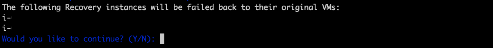

The client will initiate failback. You can see the failback progress on
the **Recovery instances** page in the DRS
Console.

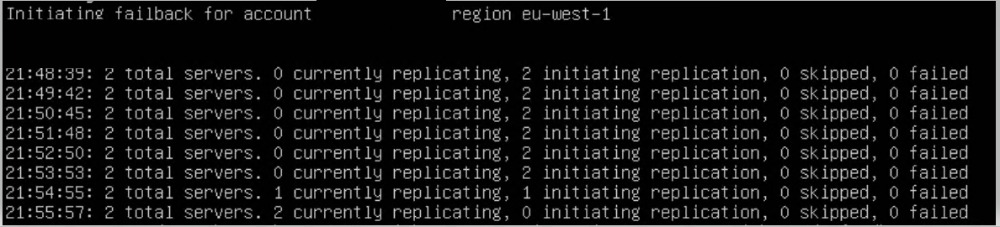

Once the failback has been complete, the DRSFA client displays the results
of the failback, including the number of servers for which replication has
successfully been initiated and the number of servers for which the failback
operation failed.

The full results of the failback will be exported as a JSON file to the failback client
folder path under the `/drs_failback_automation_client/results/Failback` folder with
the custom prefix you set, the AWS account ID, the AWS Region, and a timestamp.

The JSON file displays:

- The AWS ID of the Recovery instance
- The status of the failback (succeeded, skipped, or failed)
- A message (which provides the cause for failure in the case of failure)
- The vCenter VM UUID

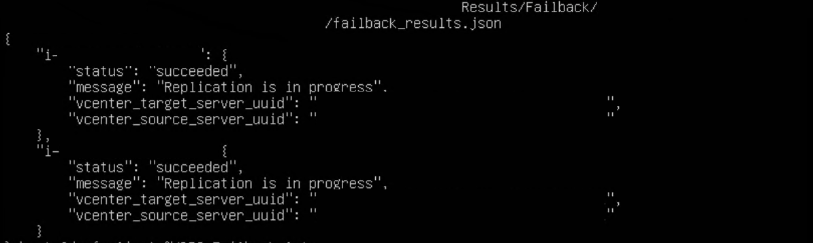

If failback failed for any of your machines, you can troubleshoot the failure by looking at
the machine configuration `failback_hosts_settings.json` file in the same folder.

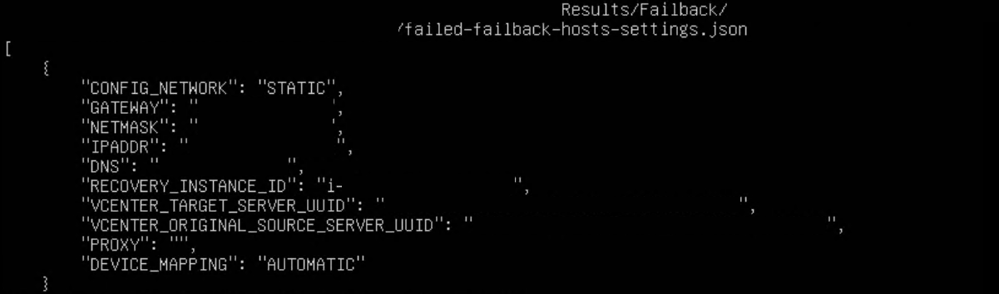

Here, you can see the exact configurations of the failed machines. You can then fix any
problems and use the custom failback flow explained below to fail back these specific
machines.

## Custom failback

The custom failback option gives you more control and flexibility over the failback
process. When utilizing the custom failback option, you will first create a failback
configuration file, in which you can edit specific settings for each individual machine, and you
will then use this file to perform a failback in a flow that is similar to that of the one-step
failback.

### Generating the configuration

file

To use the custom failback option, you can either create a custom configuration JSON file
or generate a default failback configuration file through the client.

To generate a default failback configuration file, once the client has
connected successfully and finished verification, select the **Generate a default failback configuration
file** option under **What would you
like to do?**


Enter a custom prefix for the configuration file name. The
configuration file will be created as a JSON file in the
`/drs_failback_automation_client/`
`Configurations` /folder with the name:
"{prefix}\_{account_id}\_{region}.json"

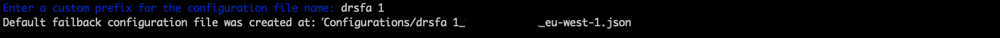

You can edit any of the fields in the file in order to correctly
configure it. The file displays these fields for each machine. You can
edit every field to have absolute control over your failback
configuration for each machine. Ensure to save your changes.

- NETMASK
- VCENTER_MACHINE_UUID
- PROXY
- DNS
- CONFIG_NETWORK
- IPADDR
- GATEWAY
- SOURCE_SERVER_ID
- DEVICE_MAPPING

###### Note

- The `CONFIG_NETWORK` value should be set to
  "DHCP" if you are using DHCP. The value should be set to
  "STATIC" if you want to manually configure the network
  settings. If CONFIG_NETWORK is set to "DHCP", then the
  `DNS, IPADDR, GATEWAY, NETMASK`, and
  `PROXY` parameters are ignored but should not
  be deleted.
- If you are using a proxy server, leave the
  `PROXY` field as an empty string, do not
  remove it.
- If a source server does not have an attached recovery
  instance, the file will still be generated, but the
  **SOURCE SERVER ID** field
  will be empty.

You can edit any of the fields in the file in order to correctly
configure it. The file displays these fields for each machine. You can
edit every field to have absolute control over your failback
configuration for each machine. Ensure to save your changes.

### Custom device mapping parameter

Custom "DEVICE_MAPPING" field is passed to the LiveCD failback process as --device-mapping argument.
[Learn more about using --device-mapping program argument](failback-performing.md#failback-failover-program-arg-device-mapping "failback-performing.md#failback-failover-program-arg-device-mapping")

There are three formats supported:

1. Classic CE format of key-value CSV string as one line.

You may use either ":" or "=" as CSV fields separator which is more sutable for Windows drive letters. Examples are:

```
"DEVICE_MAPPING": "recovery_device1=local_device1,recovery_device2=local_device2,recovery_device3=EXCLUDE"
```

```
"DEVICE_MAPPING": "recovery_device1:local_device1,recovery_device2:local_device2"
```

2. JSON format:

```
"DEVICE_MAPPING": {
    "/dev/xvdb":"/dev/sdb",
    "/dev/xvdc":"/dev/sdc",
    "recovery_device3":"local_device3"
}
```

3. JSON list DRS API format:

```
[
    {
    "recoveryInstanceDeviceName": "recovery_device1",
    "failbackClientDeviceName": "local_device1"
    },
    {
    "recoveryInstanceDeviceName": "recovery_device2",
    "failbackClientDeviceName": "local_device2"
    }
]

```

No matter which format you choose, you need to provide either valid Failback Client device name
or EXCLUDE for each Recovery Instance device.

### Performing the custom failback

Once you are done editing your configuration file, rerun the DRSFA
client and select the **Perform a Custom
Failback** option.

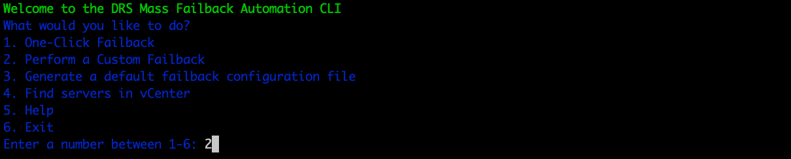

Select your configuration file. You can either define a custom path or select the default
path that's automatically displayed by the client.

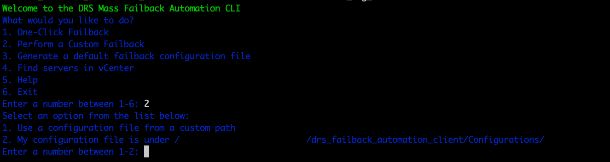

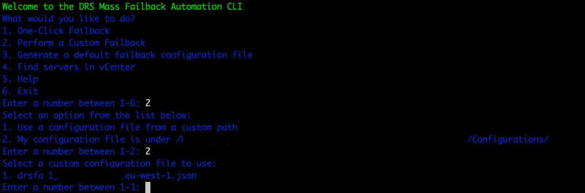

Enter a custom prefix for the results output for this failback
operation. This file is saved in the
`/drs_failback_automation_client/Results/Failback`
directory.


If failback replication has already been started for some of the
recovery instances, the console prompts you to decide if you want to
skip the instances that are already in failback or restart replication
for those instances.


The Client will identify the recovery instances that will be failed
back to their original VMs and list them. The client will then prompt
you whether you would like to continue. Choose **Y** to continue.


The Client will initiate failback. You can see the failback progress
on the **Recovery instances** page in the
AWS DRS Console.


Once the failback has been complete, the DRSFA client displays the
results of the failback, including the number of servers for which
replication has successfully been initiated and the number of servers
for which the failback operation failed.

The full results of the failback will be exported as a JSON file to the failback client
folder path under the `/drs_failback_automation_client/Results/Failback` folder
with
the custom prefix you set, the AWS account ID, the AWS Region, and a timestamp.

The JSON file displays:

- The AWS ID of the Recovery instance
- The status of the failback (succeeded, skipped, or failed)
- A message (which provides the cause for failure in the case of failure)
- The vCenter VM UUID
- The vCenter UUID of the original source server


If failback failed for any of your machines, you can troubleshoot the failure by looking
at
the machine configuration `failback_hosts_settings.json` file in the same folder.


Here, you can see the exact configurations of the failed machines. You can then fix any
problems and use the custom failback flow explained below to fail back these specific
machines.

## Find servers in vCenter

Select the **Find servers in vCenter** option to find machines
in vCenter. This makes it easier to discover the disks/volumes of your machines for custom
failback.

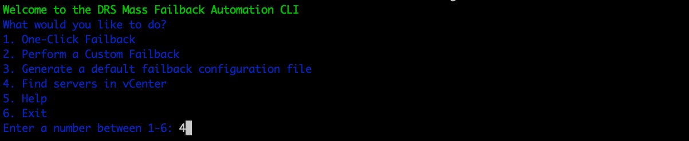

Enter a name to filter or press Enter to see all results. Choose **Yes** to print your results.

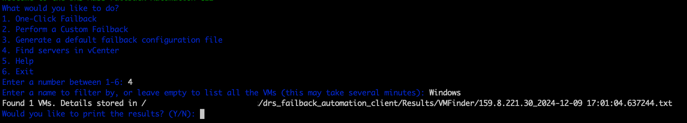

The results will be exported to the `Results/VMFinder` folder in the DRSFA client
folder. The
results will be named after the vCenter IP and the time stamp.
`{vcenter_host}_{ts}.txt`

These are displayed for each server:

- Name
- UUID
- Disk and volume info

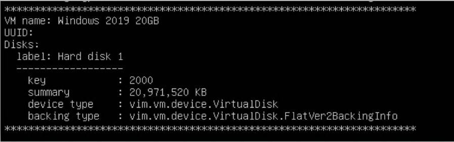

## Upgrading the DRSFA Client

Most of DRSFA components are upgraded automatically upon execution. However, in certain scenarios,
you will see a message informing you that you need to upgrade the DRSFA Client manually.

To complete the upgrade, take these steps:

1. Change directory (cd) into the directory where the installation
   originally took place.
2. Download the DRSFA installer:

`wget
 https://drsfa-us-west-2.s3.us-west-2.amazonaws.com/drs_failback_automation_installer.sh`

###### Note

You should verify the hash of the installer after running the installation command:

`https://drsfa-hashes-us-west-2.s3.us-west-2.amazonaws.com/drs_failback_automation_installer.sh.sha512` 3. Run the installer.

`bash drs_failback_automation_installer.sh` 4. Remove the installer.

`rm drs_failback_automation_installer.sh`

## Troubleshooting

- To troubleshoot the DRSFA Client, review the
  `drs_failback_automation.log` file that is generated
  in the `/drs_failback_automation_client/` folder on the
  server from which the client is run.
- To find the log for a specific server, open the VM, and find the
  `drs_failback_automation.log`
  and `failback.log` file, which can be
  used for troubleshooting.
