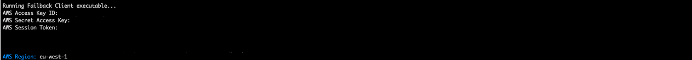
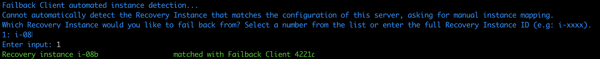

# Failback to on-premises environment

## Using the Failback Client

Failback replication is performed by booting the Failback Client on the source
server into which you want to replicate your data from AWS. In order to use the
Failback Client you must meet the failback prerequisites and generate failback
AWS credentials as described below. The AWS DRS Console allows you to track the
progress of your failback replication on the **Recovery
instances** page. [Learn
more about the Recovery instances page](recovery-instances.md#managing-recovery-instances "recovery-instances.md#managing-recovery-instances").

### Failback prerequisites

Prior to performing a failback, ensure that you meet all [replication network requirements](preparing-environments.md "preparing-environments.md")
and these failback-specific requirements:

- Ensure that the volumes on the server you are failing back to are the same size, or
  larger, than the Recovery instance.
- The Failback Client must be able to communicate with the Recovery
  instance on TCP 1500, this can be done either by via a private route
  (VPN/DX) or a public route (public IP assigned to the recovery
  instance)
- TCP Port 1500 inbound and TCP Port 443 outbound must be open on
  the recovery instance for the pairing to succeed.
- You must allow traffic to S3 from the server you are failing back to.
- The server on which the Failback Client is run must have at least
  4 GB of dedicated RAM.
- The recovery instance used as a source for failback must have permissions to access
  the
  DRS service via API calls. This is done using instance profile for the underlying EC2
  instance.
  The instance profile must include the AWSElasticDisasterRecoveryRecoveryInstancePolicy
  in
  addition to any other policy you require the EC2 instance to have. By default, the
  launch
  settings that DRS creates for source servers already have an instance profile defined
  that
  includes that policy and that instance profile will be used when launching a Recovery
  Instance.
- Be sure to deactivate secure boot on the server on which the
  Failback Client is run.
- Ensure the hardware clock the on the server on which the Failback Client
  is run is set to UTC rather than Local Time.

### Failback AWS

credentials

In order to perform a failback with the Elastic Disaster Recovery Failback
Client, you must first generate the required AWS credentials. You can
create temporary credentials with AWS Security Token Service. These credentials are only used
during Failback Client installation.

You will need to enter your credentials into the Failback Client when
prompted.

#### Generating temporary failback

credentials

In order to generate the temporary credentials required to install the
AWS Elastic Disaster Recovery Failback Client, take these steps:

1. [Create a new
   IAM Role](../../../IAM/latest/UserGuide/id_roles_create.md "../../../IAM/latest/UserGuide/id_roles_create.md") with the **AWSElasticDisasterRecoveryFailbackInstallationPolicy**
   policy.
2. Request temporary security credentials [via AWS STS](../../../IAM/latest/UserGuide/id_credentials_temp_request.md "../../../IAM/latest/UserGuide/id_credentials_temp_request.md") using the [AssumeRole
   API](../../../STS/latest/APIReference/API_AssumeRole.md "../../../STS/latest/APIReference/API_AssumeRole.md").

Learn more about creating a role to delegate permissions to an AWS
service [in the IAM documentation](../../../IAM/latest/UserGuide/id_roles_create_for-service.md "../../../IAM/latest/UserGuide/id_roles_create_for-service.md"). Attach this policy to the role:
**AWSElasticDisasterRecoveryFailbackInstallationPolicy**.

### Failback Client detailed

walkthrough

Once you are ready to perform a failback to your original source servers
or to different servers, take these steps:

###### Note

Replication from the source instance to the source server (in the target AWS Region) will continue when you perform failback on a test machine.

1. Complete the recovery [as described above](failback-preparing-failover.md "failback-preparing-failover.md").
2. Configure your failback replication settings on the recovery
   instances you want to fail back. [Learn more about failback replication settings.](recovery-instances-details.md#recovery-instances-details-failback-replication-settings "recovery-instances-details.md#recovery-instances-details-failback-replication-settings")
3. Download the AWS Elastic Disaster Recovery Failback Client ISO
   (aws-failback-livecd-64bit.iso) from the S3 bucket that corresponds to the AWS Region in
   which your recovery instances are located.
   1. Direct download link: Failback Client ISO:
      `https://aws-elastic-disaster-recovery-{REGION}.s3.{REGION}.amazonaws.com/latest/failback_livecd/aws-failback-livecd-64bit.iso`
   2. Failback Client ISO hash link:
      `https://aws-elastic-disaster-recovery-hashes-{REGION}.s3.{REGION}.amazonaws.com/latest/failback_livecd/aws-failback-livecd-64bit.iso.sha512`

4. Boot the Failback Client ISO on the server you want fail back to.
   This can be the original source server that is paired with the
   recovery instance, or a different server.

###### Important

Ensure that the server you are failing back to has the same
number of volumes or more than the Recovery Instance and that
the volume sizes are equal to or larger than the ones on the
recovery instance.

###### Note

    * When performing a recovery **for a
     Linux server**, you must boot the Failback
     Client with BIOS boot mode.
    * When performing a recovery **for a
     Windows server**, you must boot the
     Failback Client with the same boot mode (BIOS or UEFI)
     as the Windows source server.

5. If you plan on using a static IP for the Failback Client, run following once the
   Failback Client ISO boots:

`IPADDR="enter IPv4 address" NETMASK="subnet mask" GATEWAY="default gateway"
 DNS="DNS server IP address" CONFIG_NETWORK=1 /usr/bin/start.sh`

For example,

`IPADDR="192.168.10.20" NETMASK="255.255.255.0" GATEWAY="192.168.10.1"
 DNS="192.168.10.10" CONFIG_NETWORK=1 /usr/bin/start.sh` 6. Enter your AWS credentials, including your **AWS Access Key ID** and **AWS
Secret Access Key** that you created for Failback
Client installation, the **AWS Session
Token** (if you are using temporary credentials – users
who are not using temporary credentials can leave this field blank),
and the **AWS Region** in which your
Recovery instance resides. You can attach the Elastic Disaster
Recovery Failback Client credentials policy to a user or create a
role and attach the policy to that role to obtain temporary
credentials. [Learn
more about Elastic Disaster Recovery credentials.](#failback-performing-credentials "#failback-performing-credentials")

 7. Enter the custom endpoint or press Enter to use the default endpoint. You should enter
a
custom endpoint if you want to use a VPC Endpoint (PrivateLink).

 8. If you are failing back to the original source machine, the
Failback Client will automatically choose the correct corresponding
recovery instance.

 9. If the Failback Client is unable to automatically map the
instance, then you will be prompted to select the recovery instance
to fail back from. The Failback Client displays a list with all
recovery instances. Select the correct recovery instance by either
entering the numerical choice from the list that corresponds to the
correct recovery instance or by typing in the full recovery instance
ID.



###### Note

The Failback Client will only display recovery instances whose
volume sizes are equal to or smaller than the volume sizes of
the server you’re failing back to. If the recovery instance has
volume sizes that are larger than that of the server you are
failing back to, then these Recovery instances will not be
displayed. 10. If you are failing back to the original source server, then the Failback Client will
attempt to automatically map the volumes of the instance.

 11. If the Failback Client is unable to automatically map the volumes,
you will need to manually enter a local block device (example
/dev/sdg) to replicate to from the remote block device. Enter the
`EXCLUDE` command to specifically exclude Recovery
Instance volumes from replication.

Optionally, you can also enter the complete volume mapping in the same
CSV or JSON format used by --device-mapping Failback Client argument.
For example: `ALL="/dev/nvme2n1=/dev/sda,/dev/nvme0n1=EXCLUDE, . . ."`.

The full volume mapping should be provided as single CSV or JSON line in the format of --device-mapping Failback Client argument.

[Learn more about using --device-mapping program argument](#failback-failover-program-arg-device-mapping "#failback-failover-program-arg-device-mapping")


###### Important

The local volumes must be the same in size or larger than the
recovery instance volumes.

The valid special case is when original local volume has fractional GiB size (e.g. 9.75 GiB). Then the recovery instance volume
size will be larger because of rounding to nearest GiB (e.g. 10 GiB). 12. The Failback Client will verify connectivity between the recovery instance and AWS Elastic Disaster Recovery.

 13. The Failback Client will download the replication software from a public S3 bucket
onto
the source server.


###### Important

You must allow traffic to S3 from the source server for this step to succeed. 14. The Failback Client will configure the replication software.

 15. The Failback Client will pair with the AWS Replication Agent
running on the recovery instance and will establish a connection.


###### Important

TCP Port 1500 inbound must be open on the recovery instance
for the pairing to succeed. 16. Data replication will begin.


You can monitor data replication progress on the **Recovery instances** page in the AWS Elastic Disaster Recovery Console. 17. Once data replication has been completed, the Recovery instance on
the **Recovery instances** page will
show the **Ready** status under the
**Failback state** column and the
**Healthy** status under the
**Data replication status** column. 18. Once all of the recovery instances you are planning to fail back
show the statuses above, select each Instance and choose **Failback**. This will stop data replication
and will start the conversion process. This will finalize the
failback process and create a replica of each recovery instance on
the corresponding source server.

Select one or more recovery instances that are in the **Ready** state and click **Failback** to continue the failback process
after performing a failback with the Elastic Disaster Recovery
Failback Client. This action will stop data replication and will
start the conversion process. This will finalize the failback
process and will create a replica of each recovery instance on the
corresponding source server.

When the **Continue with failback for X
instances** dialog appears, click **Failback**.

This action will create a Job, which you can follow on the
**Recovery job history** page.
[Learn more about the recovery job
history page.](recovery-job.md "recovery-job.md") 19. Once the failback is complete, the Failback Client will show that the failback has
been
completed successfully. You can reboot the server and check that it has the needed data, before proceeding.

###### Note

The server client iso should not be in the boot order when you want to recover into the original OS. 20. You can opt to either terminate, delete, or disconnect the Recovery instance.
[Learn more about each action.](monitoring-recovery-instances.md#recovery-instances-actions "monitoring-recovery-instances.md#recovery-instances-actions")

### Failback Client

program arguments

The arguments supported by Failback Client LiveCD process are:

- --aws-access-key-id AWS_ACCESS_KEY_ID
- --aws-secret-access-key AWS_SECRET_ACCESS_KEY
- --aws-session-token AWS_SESSION_TOKEN
- --region REGION
- --endpoint ENDPOINT
- --default-endpoint
- --recovery-instance-id RECOVERY_INSTANCE_ID
- --dm-value-format {dev-name,by-path,by-id,by-uuid,all-strict}
- --device-mapping DEVICE_MAPPING] [--no-prompt
- --log-console
- --log-file LOG_FILE

All arguments are optional.

#### [--device-mapping DEVICE\_MAPPING]

`--device-mapping` argument will skip mapping auto-detection and manual mapping and use the mapping provided in this parameter.

There are three formats supported:

1. Classic CE format of key-value CSV string as one line.

You may use either ":" or "=" as CSV fields separator which is more sutable for Windows drive letters. Examples are:

```
recovery_device1=local_device1,recovery_device2=local_device2,recovery_device3=EXCLUDE, . . .
```

```
recovery_device1:local_device1,recovery_device2:local_device2, . . .
```

2. JSON format:

```
'{"/dev/xvdb":"/dev/sdb","/dev/xvdc":"/dev/sdc","recovery_device3":"local_device3"}'
```

3. JSON list DRS API format:

```
'[{"recoveryInstanceDeviceName": "recovery_device1","failbackClientDeviceName": "local_device1"},{"recoveryInstanceDeviceName" . . .: }]'
```

No matter which format you choose, you need to provide either valid Failback Client device name
or EXCLUDE for each Recovery Instance device.

#### [dm-value-format DM\_VALUE\_FORMAT]

`--dm-value-format` allows to use Failback Client persistent block devices identifiers in --device-mapping argument.

Such persistent identifiers will always refer to the same block devices after Failback Client reboot.

Possible --dm-value-format choices are:

1. "dev-name" - default format for using /dev/sda, /dev/xvda, /dev/nvme3n1 etc
2. "by-path" - from ls -l /dev/disk/by-id/ e.g. pci-0000:00:10.0-scsi-0:0:3:0, pci-0000:00:1e.0-nvme-1, pci-0000:02:01.0-ata-1, xen-vbd-768 etc
3. "by-id" - from ls -l /dev/disk/by-id/ e.g. device serial numbers
4. "by-uuid" - UUIDs from ls -l /dev/disk/by-uuid/
5. "all-strict" - all of the above mixed

We will use the example of SCSI identifiers from the command output below:

```

# root@ubuntu:~# ls -l /dev/disk/by-path/
total 0
lrwxrwxrwx 1 root root  9 Jun 27 12:25 pci-0000:00:10.0-scsi-0:0:0:0 -> ./../sda
lrwxrwxrwx 1 root root 10 Jun 27 12:25 pci-0000:00:10.0-scsi-0:0:0:0-part1 -> ../../sda1
lrwxrwxrwx 1 root root  9 Jun 27 12:25 pci-0000:00:10.0-scsi-0:0:1:0 -> ../../sdb
lrwxrwxrwx 1 root root  9 Jun 27 12:25 pci-0000:00:10.0-scsi-0:0:2:0 -> ../../sdc
lrwxrwxrwx 1 root root  9 Jun 27 12:25 pci-0000:00:10.0-scsi-0:0:3:0 -> ../../sdd

```

To use block device SCSI identifies like 'pci-0000:00:10.0-scsi-0:0:0:0'
you need to add to command line:`--dm-value-format by-path`

The examples of valid --device-mapping for `--dm-value-format by-path` are:

```
/dev/nvme2n1=pci-0000:00:10.0-scsi-0:0:0:0,/dev/nvme0n1=pci-0000:00:10.0-scsi-0:0:1:0,/dev/nvme3n1=pci-0000:00:10.0-scsi-0:0:2:0...
```

```
'{"/dev/nvme2n1":"pci-0000:00:10.0-scsi-0:0:0:0","/dev/nvme0n1":"pci-0000:00:10.0-scsi-0:0:1:0","/dev/nvme3n1":"pci-0000:00:10.0-scsi-0:0:2:0", . . .}'
```

No matter which format you choose, you need to provide either valid Failback Client device name
or EXCLUDE for each Recovery Instance device.

## Using the failback client to

perform a failback to the original source server

When using the failback client, you can fail back to the original source
server or a different source server using AWS Elastic Disaster Recovery.

Te ensure that the original source server has not been deleted and still
exists, check its status in the AWS DRS console. Source servers that have been
deleted or no longer exist will show as having **Lag** and being **Stalled**.

###### Note

After failing back to the original source server, you don't need to
reinstall the DRS agent to start replication back to AWS.

If the original source server is healthy and you decide to fail back to it, it
will undergo a rescan until it reaches the **Ready** status.

You can tell whether you are failing back to the original or a new source
servers in the recovery instance details view under **Failback status**.
