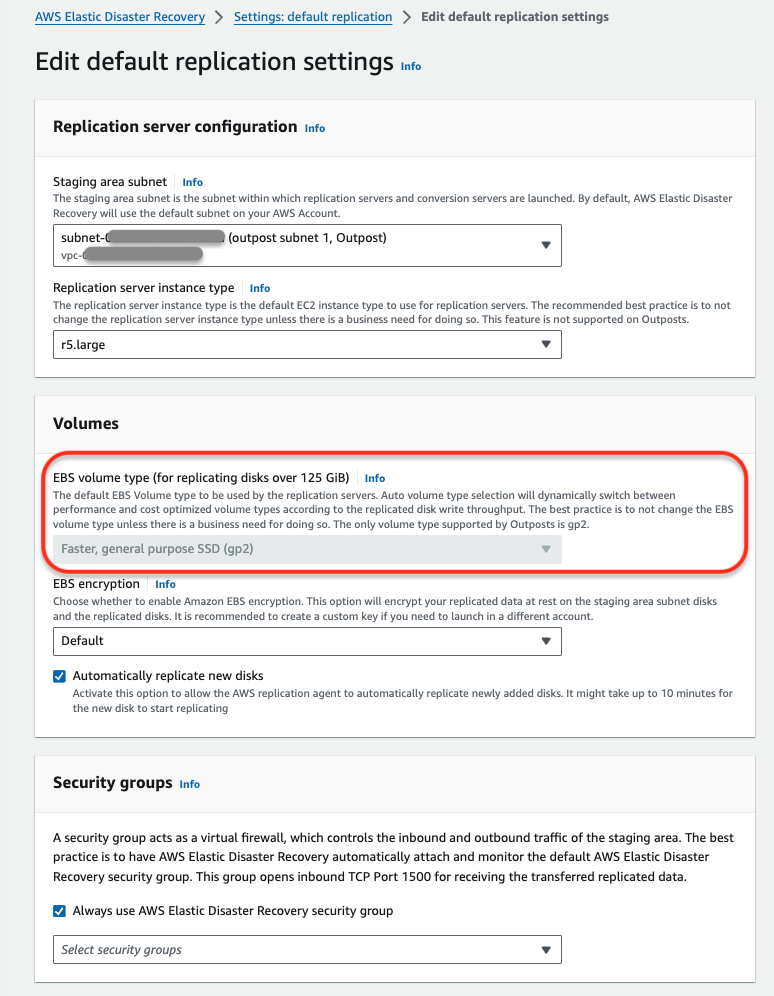
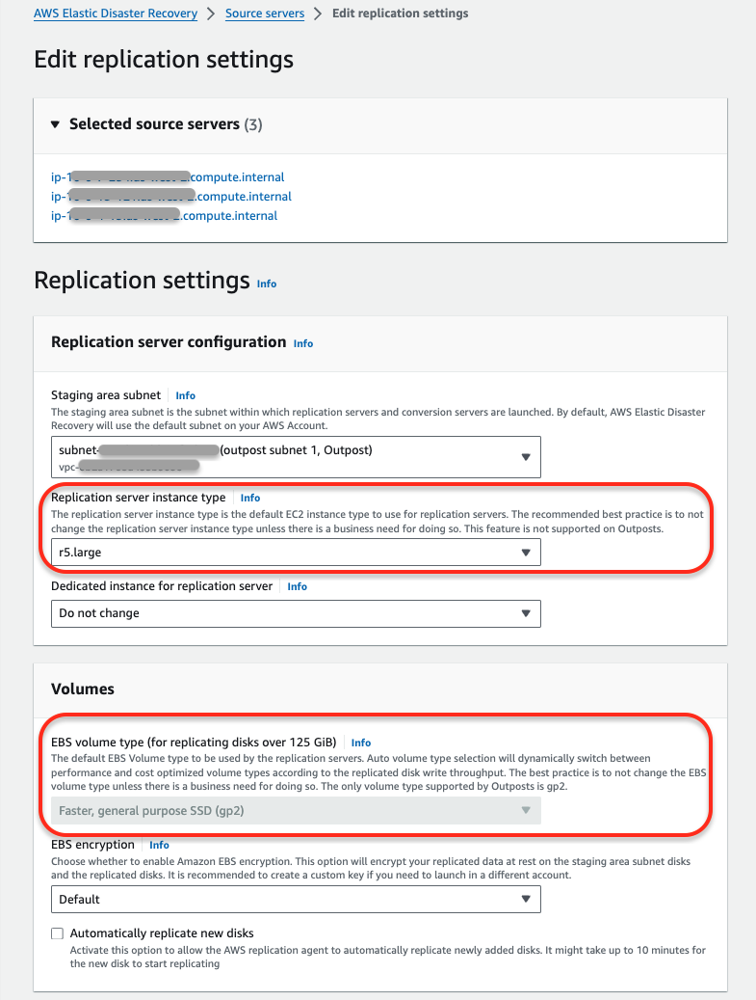
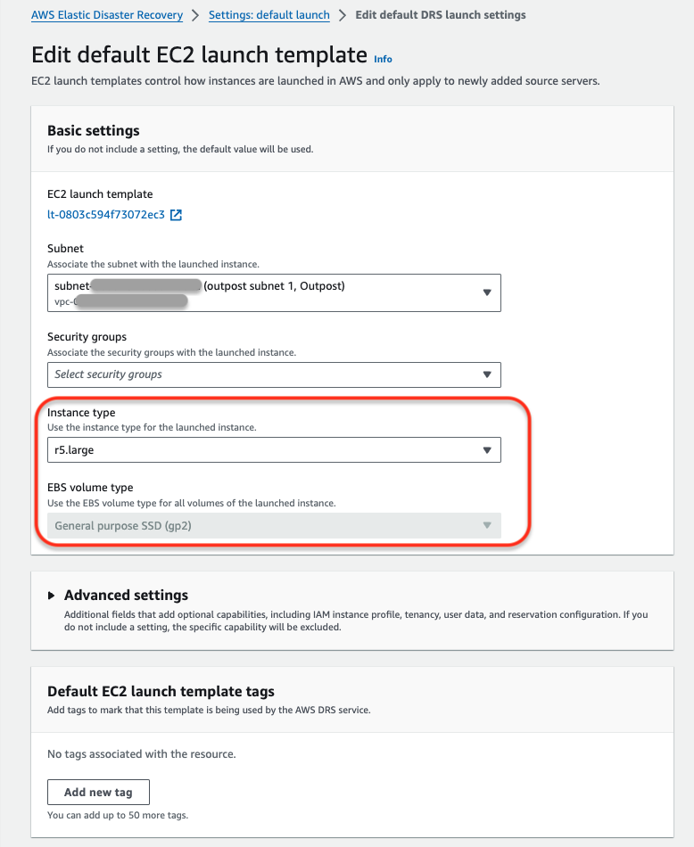
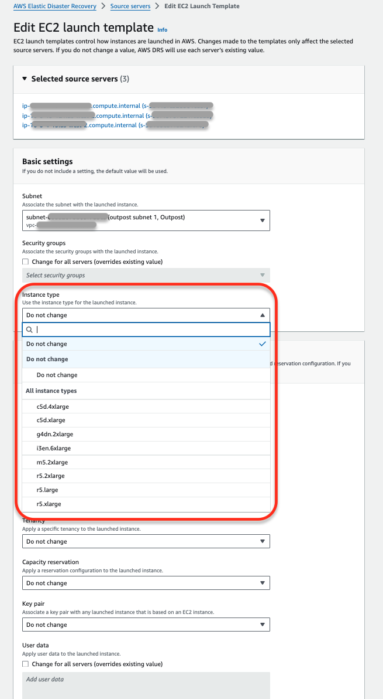
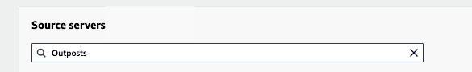
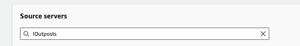
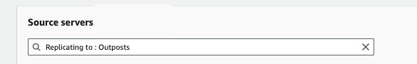

# Working with AWS DRS and AWS Outposts

AWS Elastic Disaster Recovery supports AWS Outpost racks. AWS Outposts require specific
configurations in the default replication settings, individual source server replication settings, default
launch templates and source server launch templates to work. The following sections explain how to use AWS
Outpost racks with DRS, how to troubleshoot key AWS Outpost issues, and how to monitor AWS Outposts with DRS.
[Learn more about AWS Outposts.](../../../outposts/latest/userguide/what-is-outposts.md "../../../outposts/latest/userguide/what-is-outposts.md")

###### Note

AWS Elastic Disaster Recovery does not support AWS Outpost servers.

Considerations when using AWS Outposts:

- To use an AWS Outpost, you need to have a subnet within the Outpost selected to be used for replication or
  recovery. If you select an Outpost subnet for replication, a subnet in the same Outpost must be selected for recovery.
- Your Outpost must be in direct VPC routing mode. For more information see [Direct VPC
  routing](../../../outposts/latest/userguide/routing.md#direct-vpc-routing "../../../outposts/latest/userguide/routing.md#direct-vpc-routing") in the _AWS Outposts user guide_.
- Once a subnet within an AWS Outpost is selected for replication, all replication resources (including
  replication servers, conversion servers, EBS volumes, and snapshots) will be created and saved within
  the Outpost.
- If a subnet within an AWS Outpost is selected for launch, then the recovery instances, EBS volumes and snapshots
  used for recovery are created and saved within the Outpost.
- Your S3 storage must be locally deployed on the Outpost rack. Remote S3 storage is not supported.

## Default Replication Settings

Selecting an Outpost subnet on the _Settings: default replication_ page means that
newly added source servers will automatically start replicating to the Outpost.

Subnets that are within Outposts will have the word "Outpost" appended after the subnet name in the subnet
selector drop down.

Once the Subnet is chosen, you will have to select the replication server instance type. Only instance
types that are supported by the chosen Outpost will be shown.

Outposts only support GP2 disks. As such, you will not be able to change the default disk type in the
replication settings.

All Outpost volumes must be encrypted, and so you must select an encryption key when a subnet within an
Outpost is selected. You will not be able to select not to encrypt. Ensure that you choose the correct
volume encryption key you want to use. You can use the default KMS key for your account, or select a
customer managed key (CMK).

Other replication settings can be set normally.

[Learn more about default replication settings.](replication-settings-template.md "replication-settings-template.md")

###### Note

When selecting an Outpost subnet in your replication settings, ensure that your launch template
specifies a subnet on the same Outpost. Not doing so may result in an error during recovery.

## Source Server Replication Settings

Use these settings to have a specific source server or multiple source servers replicate into an AWS
Outpost by selecting a subnet within an AWS Outpost.

Subnets that are within Outposts will have the word "Outpost" appended after the subnet name in the subnet
selector drop down.

Once the Subnet is chosen, you will have to select the replication server instance type. Only instance
types that are supported by the chosen Outpost will be shown.

Outposts only support GP2 disks. As such, you will not be able to change the default disk type in the
replication settings.

All Outpost volumes must be encrypted and you must select an encryption key when a subnet within an
Outpost is selected. You will not be able to select _not to encrypt_. Ensure that you
choose the correct volume encryption key you want to use. You can use the default KMS key for your account
or select a customer managed key (CMK).

Other replication settings can be set normally.
[Learn more about replication settings.](replication-settings.md "replication-settings.md")

###### Note

You cannot edit the replication settings of multiple source servers if some of the source servers are
replicating to Outpost subnets and others are replicating to non-Outpost subnets.

###### Note

When selecting an Outpost subnet in your replication settings, ensure that your launch template
specifies a subnet on the same Outpost. Not doing so may result in an error during recovery.

## Default Launch Template

Selecting an Outpost subnet in the default launch template means that newly added source servers will launch
into the Outpost. You must select the instance type from the list of available instance types on your
Outpost.

###### Note

When working with Outposts, if you selected a subnet within an AWS Outpost in the default replication
settings, you must also choose a subnet within the same Outpost in the default launch template.
Otherwise, newly added source servers will replicate into an Outpost but launch outside of an Outpost
which may result in an error.

###### Note

Network replication and recovery does not create a subnet within the Outpost.

Outposts only support GP2 disks. As such, you will not be able to change the default disk type per volume
in the default launch template.

## Source Server Launch Templates

When working with Outposts, if you selected a subnet within an AWS Outpost in the replication settings for
any source server, you must also choose a subnet within the same Outpost in the launch template of that
source server. You must select the instance type to launch into from the list of available instance types
on your Outpost. Not doing so may result in an error during recovery.

###### Note

Network replication and recovery does not create a subnet within the Outpost.

Outposts only support GP2 disks. As such, you will not be able to change the default disk type per volume in
the default launch template.

###### Note

You cannot edit the launch templates of multiple source servers if some of the source servers are
configured to launch to Outpost subnets and the others are configured to launch to non-Outpost subnets.

## Source Server Page

You can find which of your servers are replicating into an AWS Outpost rack, as these are marked with the
value (Outpost) in the **Replicating to** field. The following are search
options for source servers replicating to an Outpost:

- You can enter the text "_Outpost_" in the search field to only
  display source servers that are replicating to an AWS Outpost rack.

- You can enter the text "_!Outpost_" to only display source servers
  that are not replicating to an AWS Outpost rack.

- You can enter "_Replicating to: Outpost_" in the search field to
  only display source servers that are replicating to an AWS Outpost rack.

- You can enter "_Replicating to !: Outpost_" in the search field to
  only display source servers that are not replicating to an AWS Outpost rack.

## Important Outpost Notes

### Outpost Storage

AWS Outposts have a certain storage capacity. You should actively monitor available storage
capacity in your Outpost. **If you run out of storage capacity, you may not be
able to use DRS with that Outpost environment.**
For example, if S3 runs out of capacity on the Outpost then DRS won’t be able to create
any new snapshots, so no new points in time will be created.

Be aware of EBS storage capacity on the Outpost. **DRS requires storage capacity
roughly on a 2:1 ratio (excluding any launched instances on the Outpost).** For example, if
you have source volumes amounting to a total of 1 TiB of storage, then DRS will require at least
1 TiB for replication resources, and another 1 TiB for conversion or recovery instance creation.

### Replication and Launch Subnets

When using DRS with Outposts it is imperative that the subnet in replication setting and launch settings
are on the same Outpost. If the subnets are not on the same Outpost, it may result in a failure during
recovery.

### Instance Types and Operating Systems (OSs)

###### Note

AWS Outposts only support
[Nitro instance types.](../../../AWSEC2/latest/UserGuide/instance-types.md#ec2-nitro-instances "../../../AWSEC2/latest/UserGuide/instance-types.md#ec2-nitro-instances")

- **Linux** - RHEL 7.0+ and CentOS 7.0+
- **Windows** - Windows Server 2008 R2, Windows Server 2012 R2,
  Windows Server 2016, and higher.

### Monitoring

You can monitor Outpost metrics for S3, EC2, and EBS capacity through CloudWatch. You can create a
dashboard with these metrics:

- EBS Metrics: EBSVolumeTypeCapacityAvailability, EBSVolumeTypeCapacityUtilization
- EC2 Metrics: InstanceTypeCapacityUtilization, AvailableInstanceType_Count
- S3 Metrics: OutpostTotalBytes, OutpostFreeBytes

[Learn more about CloudWatch S3 monitoring.](../../../AmazonS3/latest/dev/cloudwatch-monitoring.md "../../../AmazonS3/latest/dev/cloudwatch-monitoring.md")

[Learn more about CloudWatch Metrics for AWS Outposts.](../../../outposts/latest/userguide/outposts-cloudwatch-metrics.md "../../../outposts/latest/userguide/outposts-cloudwatch-metrics.md")
