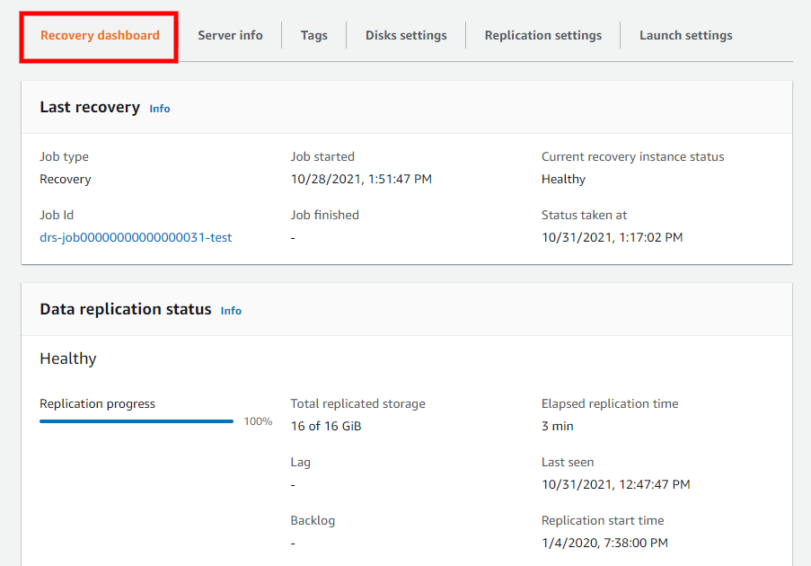
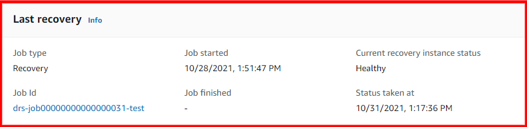

# AWS DRS recovery dashboard

The **Recovery dashboard** tab allows you to monitor the
server, its data replication status, and view events and metrics in CloudTrail.

###### Topics

- [Last recovery](#lifecycle "#lifecycle")
- [Data replication status](#data-replication-stat "#data-replication-stat")
- [Events and metrics](#events "#events")
- [Server actions and replication control](#actions "#actions")

## Last recovery

The **Last recovery** box provides an overview of the
recovery process for the server.

Here, you can see the following:

- **Job type** – The type of recovery job performed (drill or
  recovery)
- **Job ID** – The ID of the last recovery job. Choose the
  **Job Id** to be redirected to the **Job** page for that specific recovery launch within the
  **Recovery job history**.
- **Job started** – The date and time the last recovery job
  was started.
- **Job finished** – The date and time the last recovery job
  was finished. This field is blank if the job is still ongoing.
- **Current recovery instance status** – The current status
  of the latest Recovery instance (if one has been launched).
- **Status taken at** – The last date and time the **current recovery instance status** was queried.

## Data replication status

The **Data replication status** section provides an overview
of the overall source server status, including:

- **Replication progress** – The percentage of the server's
  storage that was successfully replicated.
- **Rescan progress** – In the event of of a rescan, the
  percentage of the server's storage that was rescanned.
- **Total replicated storage** – The total amount of storage
  replicated (in GiB).
- **Lag** – Whether the server is experiencing any lag. If it
  is - the lag time is indicated.
- **Backlog** – Whether there is any backlog on the server
  (in MiB)
- **Elapsed replication time** – Time elapsed since
  replication first began on the server.
- **Last seen** – The last time the server successfully
  connected to AWS Elastic Disaster Recovery.
- **Replication start time** – The date and time replication
  first began on the server.

Data replication can be in one of several states, as indicated in the panel title:

- **Initial sync**: initial copying of data from external
  servers is not done. Progress bar and **Total replicated
  storage** fields indicate how far along the process is.
- **Healthy**: all data has been copied and any changes at
  source are continuously being replicated (data is flowing).
- **Rescan**: an event happened that forced the agent on the
  external server to rescan all blocks on all replicated disks. This is the same as an
  initial sync but is faster because only changed blocks need to be copied; a rescan
  progress bar appears.
- **Stalled**: data is not flowing and user intervention is
  required (either initial sync never completes, or the state at the source becomes
  increasingly different from the state at AWS). When the state is stalled, then the
  replication initiation checklist is also shown, indicating where the error occurred
  that caused the stalled state.

This panel also shows:

- **Total replicated storage:** size of all disks being
  replicated for this source server, and how much has been copied to AWS (once initial sync is
  complete)

**Lag**: if you launch a recovery instance now, how far
behind it is from the state at the source. Normally this should be none.

**Backlog**: how much data has been written at source but has
not yet been copied to AWS. Normally this should be none.

**Last seen**: when is the last time the AWS Replication
Agent communicated with the AWS DRS service or the replication server.

If everything is working as it should and replication has finished initializing, the Data
replication progress section displays a **Healthy**
status.

If there are initialization, replication, or connectivity errors, the **Data replication status** section displays the cause of the issue,
for example, a stall. If the error occurred during the initialization process, then the
exact step during which the error occurred is marked with a red "x" under **Replication
initiation steps**.

## Events and metrics

You can review AWS Elastic Disaster Recovery events and metrics in AWS CloudTrail. Choose **View CloudTrail event history** to open AWS CloudTrail in a new
tab. Learn more about AWS CloudTrail events in the [AWS CloudTrail user guide](../../../awscloudtrail/latest/userguide/cloudtrail-concepts.md "../../../awscloudtrail/latest/userguide/cloudtrail-concepts.md").

## Server actions and replication control

You can perform a variety of actions, control data replication, and manage your recovery
and drill instances for an individual server from the server details view.

###### Topics

- [Actions menu](#server-actions "#server-actions")
- [Initiate recovery job menu](#server-initiate-recovery-menu-2 "#server-initiate-recovery-menu-2")
- [Alerts and errors](#server-test-alert2 "#server-test-alert2")

### Actions menu

The **Actions** menu allows you to perform the following
actions:

- **Add servers** – Choosing this option redirects you to
  the AWS Replication Agent installation instructions.
- **Edit replication settings** – Choose this option to edit
  the replication settings for the selected server or group of servers through on the
  **Edit replication settings** tab.
- **Edit launch settings** – Choose this option to enter the
  source server's **Server details view > Launch
  settings** tab.
- **View server details** – Choose this option to enter the
  source server's **Server details view**.
- **Disconnect from AWS** – Choose this option to disconnect
  the selected server from AWS Elastic Disaster Recovery and AWS.

On the **Disconnect X server/s from service** dialog,
choose **Disconnect**.

###### Important

This uninstalls the AWS Replication Agent from the source server, and data replication
stops for the source server. This action does not affect any drill or recovery
instances that have been launched for this source server, but you are no longer
able to identify which source servers your Amazon EC2 instances correspond to.

- **Delete server** – Choose this option to permanently
  delete a source server from AWS Elastic Disaster Recovery. This removes all information related to the
  server from the AWS Elastic Disaster Recovery service. You can only delete servers that have been
  disconnected from AWS. You need to reinstall the AWS Replication Agent on a deleted
  source server to add it back to AWS Elastic Disaster Recovery.

When the **Delete X servers** dialog appears, click
**Permanently delete**.

### Initiate recovery job menu

The Initiate recovery job menu allows you to start drills and recoveries by launching
drill and recovery instances as part of the overall failback process. You can learn more
about the entire failback and failover process with AWS Elastic Disaster Recovery in the
[Performing a failback and failover with AWS Elastic Disaster Recovery documentation](failback.md "failback.md").

- **Initiate drill** – Choose the **Initiate drill** option to launch a drill instance for this server or
  group of servers for the purpose of testing your recovery solution. You should
  perform periodic drills in order to ensure that you are ready for recovery. [Learn more about launching drill instances in
  AWS Elastic Disaster Recovery.](preparing-failover.md#recovery-drill-overview "preparing-failover.md#recovery-drill-overview")
- **Initiate recovery** – Choose the **Initiate recovery** option to launch a recovery instances for this
  server or group of servers for the purpose of recovering the server in the event of
  a disaster. [Learn more about launching
  recovery instances in AWS Elastic Disaster Recovery.](failback-preparing-failover.md#failback-launching-instances "failback-preparing-failover.md#failback-launching-instances")

### Alerts and errors

You can distinguish between healthy servers and servers that are experiencing issues on
the **Recovery dashboard** in several ways. The AWS Elastic Disaster Recovery
console is color-coded for ease of use.

- Healthy servers with no errors are characterized by the color blue. The **Data replication status** boxes displays steps and information in blue
  if the server is healthy.
- Servers that are experiencing temporary issues are characterized by the color yellow.
  This can include issues such as lag or a rescan. These issues do not break replication,
  but may delay replication or indicate a bigger problem.
- Servers that are experiencing serious issues are characterized by the color red. These
  issues can include a loss of connection, a stall, or other issues. You have to fix
  these issues in order for data replication to resume.

The **Data replication status** box includes details of the
issue.

If the stall occurred during initiation, scroll down to **Replication
initiation steps**. The step where the issue arose is marked with a red
"x".
