# Recovery job history

The Recovery launch history page provides an in-depth overview for operations (Jobs)
performed in Elastic Disaster Recovery.

###### Topics

- [Recovery job history](#recovery-job-history "#recovery-job-history")

## Recovery job history

The **Recovery job history** page allows you to track and
manage all operations performed in Elastic Disaster Recovery.

You can access the Recovery job history page by choose **Recovery
job history** on the left-hand navigation menu.

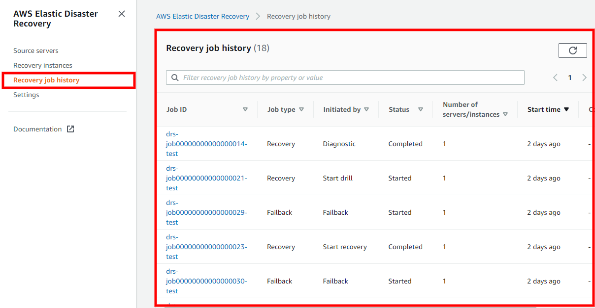

###### Topics

- [Overview](#tracking-launch "#tracking-launch")
- [Job Details](#job-history "#job-history")

### Overview

The Recovery job history tab shows all of the operations (referred to as "Jobs") performed
on your account. Each Job corresponds to a single operation (ex. Launch Recovery instance,
Launch Drill instance, etc.) Each Job is composed of one or more servers. The main Recovery job
history view allows you to easily identify all key Job parameters, including:

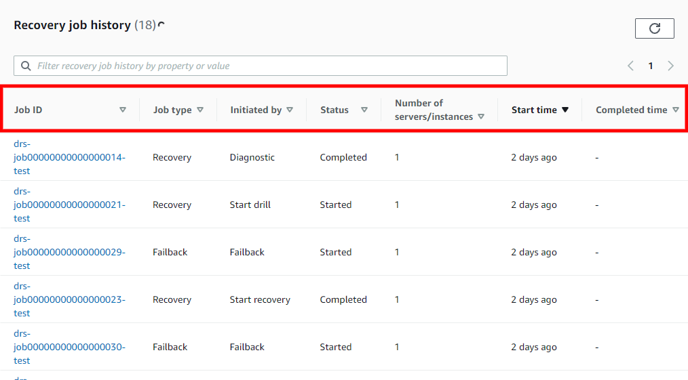

- **Job ID**

* The unique ID of the Job.

- **Job Type**

* The type of Job (Recovery, Failback, or
  Terminate)

- **Initiated By**

* The command or action that initiated the
  Job (ex. Drill, Recovery, Failback)

- **Status**

* The status of the Job (Pending, Completed, or
  Started)

- **Servers**

* The number of servers that are included in the
  Job.

- **Start Time**

* The time the job was started.

- **Completed Time**

* The time the Job was completed (blank
  if the job was not completed)

To sort the Recovery job history by any column (for example, **Job ID**), click the column header.

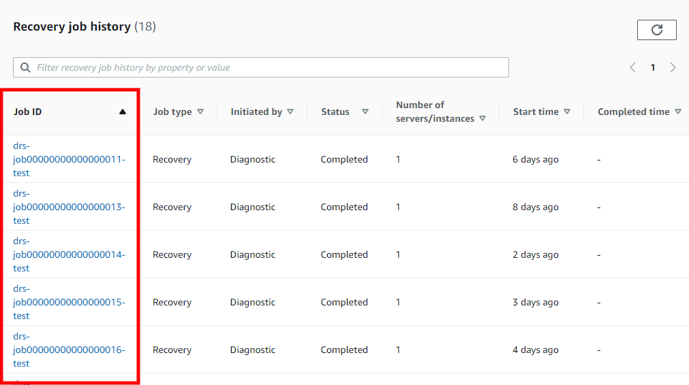

You can search for specific Jobs by any of the available fields within the **Find launch history by property or value** search bar.

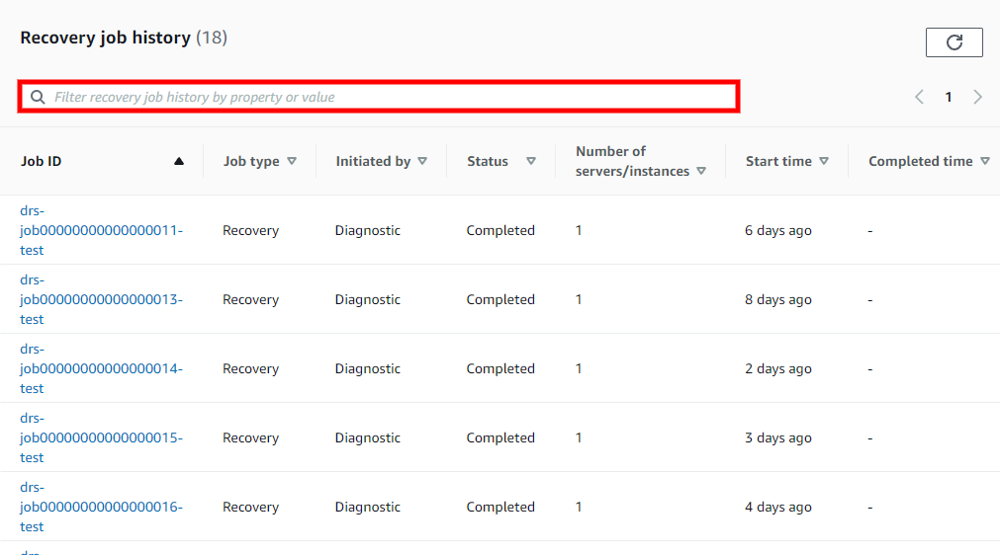

Example: Filtered search for the values
**Job type: Recovery**
and **Status: Completed**, only showing completed Recovery Jobs.

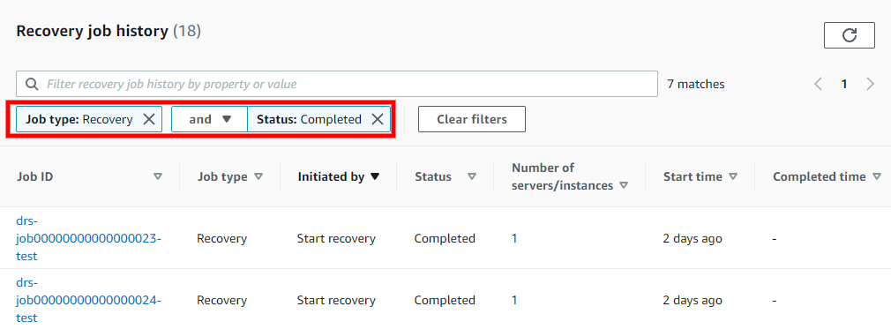

Choose **Clear filters** to clear the search results and
return to the default Job History view.

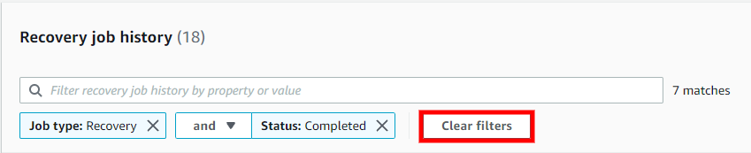

### Job Details

You can view a detailed breakdown of each individual job by choosing the Job ID. Choose the
**Job ID**
of any Job to open the Job details view.

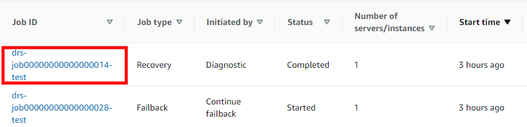

The Job details view is composed of three sections:

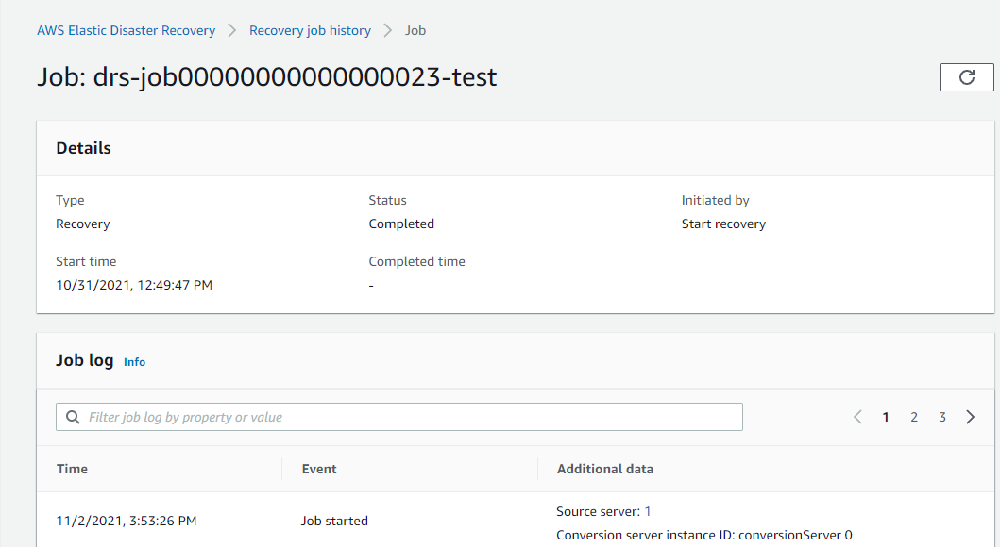

###### Topics

- [Details](#job-detials "#job-detials")
- [Job log](#job-joblog "#job-joblog")
- [Jobs - Source servers](#job-sourceservers "#job-sourceservers")

#### Details

The **Details** section shows the same
information as the main Job log page, including the **Type,
Status, Initiated By, Start time,** and **Completed time**.

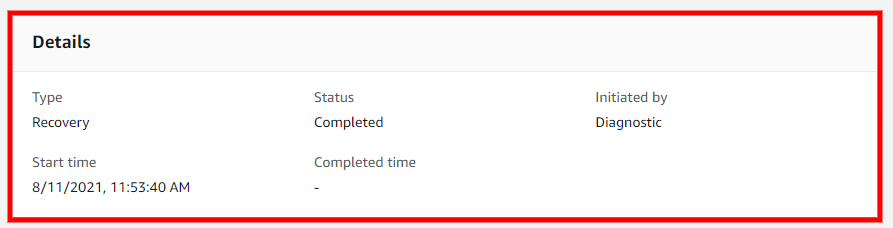

#### Job log

The Job log section shows a detailed log of all of the operations performed during the
Job.

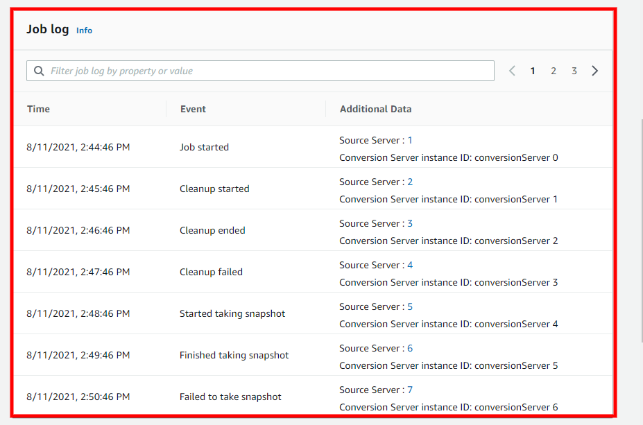

You can use this section to troubleshoot any potential issues and determine in which step
of the launch process they occurred.

You can use the **Filter job log by property or value** search bar to filter the Job log.

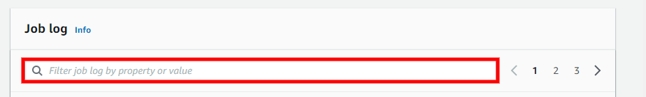

You can filter by a variety of properties, including **Time, Event, Source Server Id, Source server hostname, Conversion Server
instance Id, Drill/Recovery instance ID,** and **Error.**

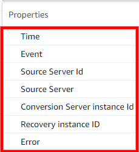

You can filter by multiple values at once (for example, Job log filtered by
**Event: Failed to take snaphot** and a
specific **Source Server Id: 7**).

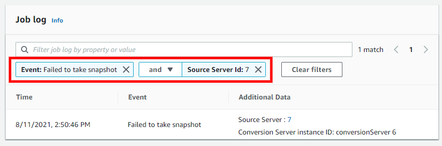

#### Jobs - Source servers

The Source servers section shows a list of all source servers involved in the Job and
their status.

You can use the **Filter source servers by property or
value** search bar to filter by **Hostname** or
**Status**.

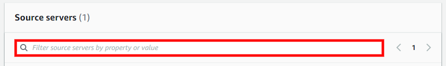

Choose the Hostname of any of Source server from the list to open the Server Details view
for that server.
[Learn more about the Source Server details
view.](server-details.md "server-details.md")

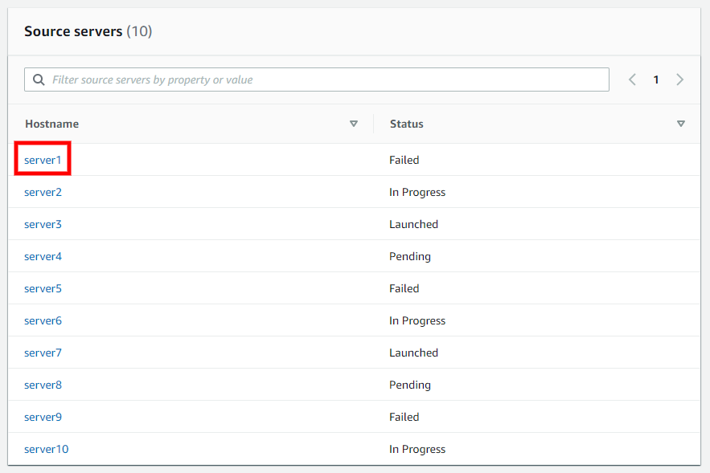
