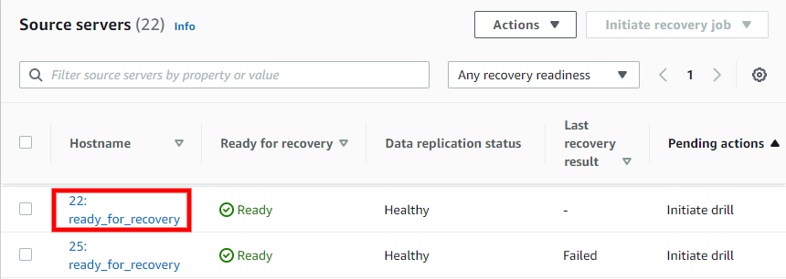
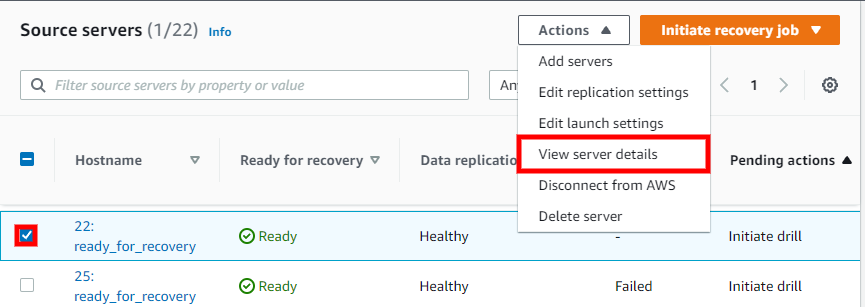
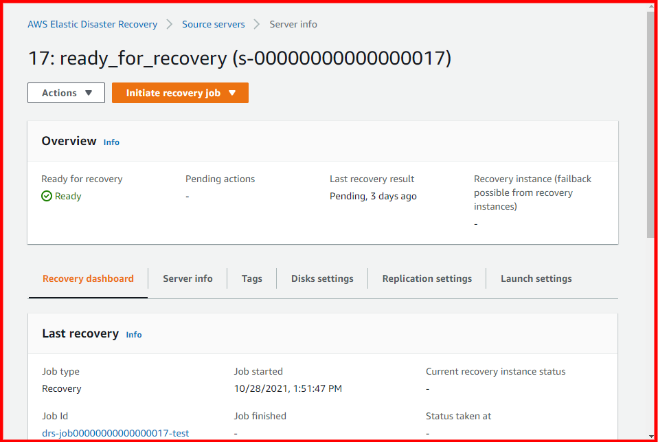
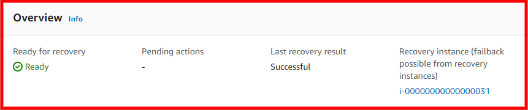

# View server details with AWS DRS

To access the server details view, click the **Hostname** of
any server on the **Source servers** page.

You can also access the server details view by checking the box to the left of any single
source server on the **Source servers** page and choosing
**Actions > View server details**.

The server details view shows information and options for an individual server. Here, you
can fully control and monitor the individual server.

You can also perform a variety of actions, control replication, and launch Recovery
instances for the individual server from the server details view.

The **Overview** box provides a basic overview of the server's
status, including the whether the server is ready for recovery, any pending actions, the last
recovery result (if any), and a link to the Recovery instance (if one was launched for the
server).

