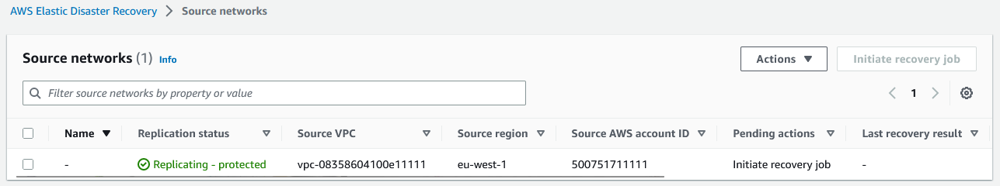

# Source networks

The network replication feature allows you to keep track of network changes and perform
quick updates. The feature helps prevent configuration mismatch during recovery, saves time and
resources and provides enhanced security. For example, when a security group is updated, this
change will be automatically replicated, ensuring compliance and preventing potential security
risks. In addition, recovery instances will be launched within the recovered source networks
automatically, preventing the need to configure each server manually.

###### Important

Only in-AWS networks can be replicated.

## AWS DRS source network page

The **Source networks** page automatically presents all of
the available source networks. This page allows you to manage your source networks, view their
specifications, and perform updates.

Each row represents a specific network. It includes various network parameters
including:

- Name – the selected source network name
- Replication status – options include **Replicating -
  protected**, **Stopped**, **In
  progress**, and **Error**
- Source region – the AWS Region of the source network
- Source AWS account ID – the AWS account ID of the source network
- Pending actions – the next step in the source network replication workflow
- Last recovery result – **Not started**, **Pending**, **Successful**, **Failed**, and **Partial success**
  (meaning the network was deployed, but the source servers were not configured as part of
  the recovered network)
- Launched VPC –the recovered network
- CFN stack name – the name of the CloudFormation stack which was used to deploy the
  launched VPC
- Source network ID – the ID of the source network

Use the top navigation to select an S3 bucket, which is required to enable recovery or to
initiate a recovery job.

Use the **Actions** menu to perform various actions
including:

- Start replication – Use this option if you want to start replicating your network
  configuration.
- Stop replication – Use this option if you want to stop replicating your network
  configuration.
- Export CloudFormation (CFN) template – This option allows you to export the
  CloudFormation template to your selected S3 bucket. This allows you to verify that the
  configurations match your preferences and conduct security checks.

###### Note

If you choose to make changes to the CloudFormation template, it cannot be reuploaded to AWS Elastic Disaster Recovery.

- Manage tags – This option will open the **Manage tags**
  page which allows you to add or remove tags from your selected network resource.
- Select S3 bucket – This option allows you to save network CFN stacks in your account’s
  Amazon S3 bucket. You must specify the S3 bucket before you initiate network replication. It is
  recommended that you employ [security best practices for Amazon S3](../../../AmazonS3/latest/userguide/security-best-practices.md "../../../AmazonS3/latest/userguide/security-best-practices.md").
