# Troubleshooting Elastic Disaster Recovery

## Troubleshooting Failback Errors

###### Topics

- [Error – Could not
  associate failback client to recovery instances](#Troubleshooting-Failback-Errors-credentials "#Troubleshooting-Failback-Errors-credentials")
- [Error – Could
  not verify recovery instance connectivity to DRS](#Troubleshooting-Failback-Errors-connectivity-instance "#Troubleshooting-Failback-Errors-connectivity-instance")
- [Error message: AWS Replication agent is not connected to DRS.
  Verify the agent is installed and running, and that it has connectivity to the service](#w2aac39b3b9 "#w2aac39b3b9")
- [Error message: botocore.exceptions.CredentialRetrievalError: Error when retrieving credentials from cert](#w2aac39b3c11 "#w2aac39b3c11")
- [Error message: Some Recovery instances could not be processed: recovery-instance-id](#w2aac39b3c13 "#w2aac39b3c13")

### Error – Could not

associate failback client to recovery instances

If you see the "Could not associate failback client to recovery instances" error
when using the Failback Client, that may mean that you associated the incorrect
credentials with your User. Ensure that you attach the **AWSElasticDisasterRecoveryFailbackInstallationPolicy** policy to the
user or role and restart the failback process. [Learn more about Failback Client
credentials.](failback-performing.md#failback-performing-credentials "failback-performing.md#failback-performing-credentials")

### Error – Could

not verify recovery instance connectivity to DRS

If you see the "Could not verify recovery instance connectivity to Elastic
Disaster Recovery" error when using the Failback Client, you should troubleshoot
potential connectivity issues:

1. Make sure that the agent on the recovery instance is activated and
   running.
2. A public IP must be set on the recovery instance in Amazon EC2.
3. TCP Port 443 outbound must be open on the recovery instance for the
   pairing to succeed.
4. Make sure that you don't have this error in your agent logs: [Error – driver was compiled for a
   different kernel not loading](#error-driver-compiled "#error-driver-compiled").

###

Error message: AWS Replication agent is not connected to DRS.
Verify the agent is installed and running, and that it has connectivity to the service

In certain cases, following an attempt to perform a reverse replication action,
you will receive an error message indicating that the AWS Replication agent is not
connected to AWS Elastic Disaster Recovery. In this case, verify that:

1. The agent is installed and running
2. The server is connected to the internet or the NAT gateway

If after performing the steps above you did not identify any agent or connectivity issues,
reinstall the agent as recovery instance and try again.

###

Error message: botocore.exceptions.CredentialRetrievalError: Error when retrieving credentials from cert

The Failback Client uses Amazon Linux 2 (AL2) and leverages certificate-based authentication to AWS Elastic Disaster Recovery endpoints for
certain actions. AL2 assumes that the hardware clock time provided from the underlying hardware or hypervisor is UTC, which can
result in time skew if it is not. Ensure that the time configured within the BIOS or EFI Shell of the
failback target is set to UTC, and not LocalTime.

###

Error message: Some Recovery instances could not be processed: `recovery-instance-id`

You may receive this error when attempting to start reverse replication in Elastic Disaster Recovery. The error occurs when:

- The **Launch into source instance** setting is enabled in the source Region's default launch settings.
- Source Amazon EC2 instance/A1 is missing the required tag `AWSDRS:AllowLaunchingIntoThisInstance`.

Resolve this issue by:

- Disabling the **Launch into source instance** in the source Region's default launch settings.
- Adding the `AWSDRS:AllowLaunchingIntoThisInstance` tag to the source Amazon EC2 instance/A1.

## Troubleshooting Communication

Errors

###### Topics

- [Solving Communication Problems over
  TCP Port 443 between the staging area and the Elastic Disaster Recovery Service
  Manager](#Solving-Communication-Problems "#Solving-Communication-Problems")
- [Calculating the required bandwidth for TCP Port
  1500](#Calculating-Bandwidth "#Calculating-Bandwidth")
- [Verifying Communication over Port 1500](#Verifying-Communication-1500 "#Verifying-Communication-1500")
- [Solving Communication Problems over Port 1500](#Solving-Problems-1500 "#Solving-Problems-1500")

### Solving Communication Problems over

TCP Port 443 between the staging area and the Elastic Disaster Recovery Service
Manager

- **DHCP** – [Check the DHCP options set of the VPC of the staging area.](../../../directoryservice/latest/admin-guide/dhcp_options_set.md "../../../directoryservice/latest/admin-guide/dhcp_options_set.md")

Ensure that the IPv4 CIDR, the DHCP options set, the Route table, and the Network ACL are
correct.

- **DNS**
  – Ensure that you are allowing outbound DNS
  resolution and connectivity over TCP Port 443.

- **Route Rules** – the Route Rules on the
  Staging Area subnet may be inaccurately set. The Route Rules should allow
  outbound traffic to the Internet.

To check and set the Route Rules on the staging area subnet:

    1. Sign in to [AWS console](https://console.aws.amazon.com/ "https://console.aws.amazon.com/"), click on
     **Services**
     and select
     **VPC**
     under **Networking & Content Delivery**.


    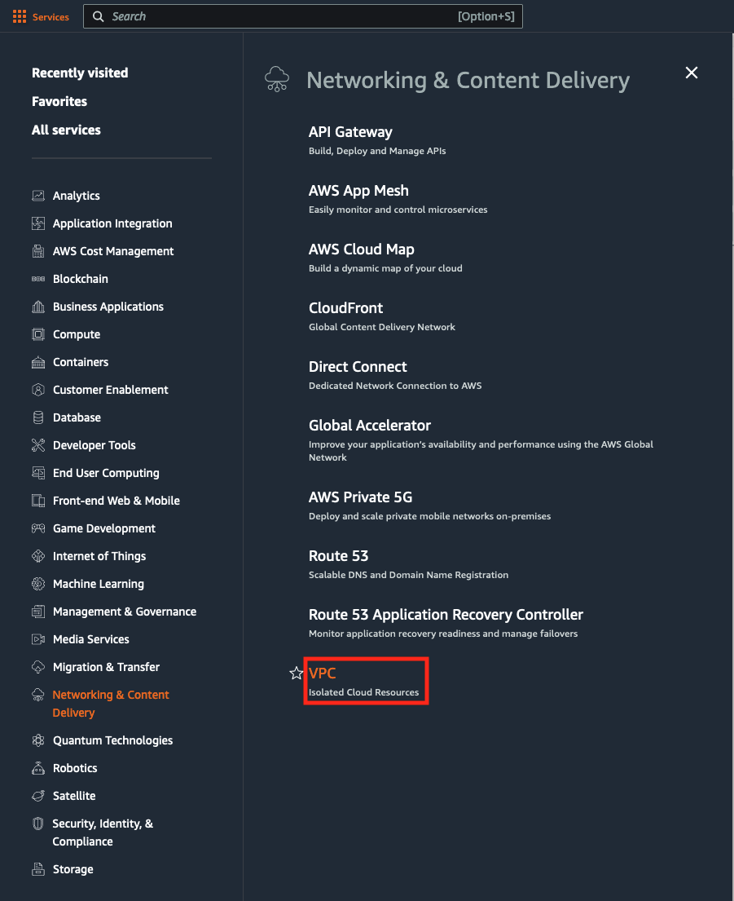
    2. On the **VPC Dashboard** toolbar,
     select the **Route Tables** option.


    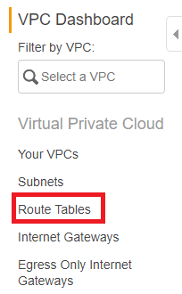
    3. On **Route Tables** page, check the
     box of the Route Table of your staging area.


    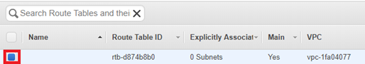
    4. This will open the details for your Route Table. Navigate to the
     **Routes** tab.


    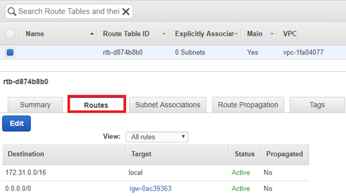
    5. Within the **Target** column of the
     **Routes** tab, find the route you
     are using for the outbound communication to the Internet (either
     **igw** – Internet Gateway, vgw –
     **VPN** or **i** – EC2 instance). Verify that the address space in
     the Destination column is covering the AWS Elastic Disaster Recovery IPs and URLs.


    **Note**: AWS Elastic Disaster Recovery AWS-specific IPs
     and URLs include: 52.72.172.158, 52.53.92.136, s3.amazonaws.com,
     s3.us-west-1.amazonaws.com,
     s3.eu-west-1.amazonaws.com and outbound access to the
     [Amazon EC2 endpoint of
     the AWS Region.](../../../general/latest/gr/rande.md "../../../general/latest/gr/rande.md")


    
    6. If the address is not **0.0.0.0/0**, you will need change
     it to
     **0.0.0.0/0.**


    Click the **Edit** button.


    
    7. Input **0.0.0.0/0** into the Destination field for the
     correct **Target**. Click **Save**.


    **Note**: If you are using VPN, enter a specific IP
     address range in the **Destination** column.

- **Network ACL** – The network ACL on the
  staging area subnet may block the traffic. Verify that the ephemeral ports
  are open.

### Calculating the required bandwidth for TCP Port

1500

The required bandwidth for transferring the replicated data over TCP Port 1500 should be
based on the write speed of the participating Source machines. The recommended bandwidth should
be at least the sum of the average write speed of all replicated source machines.

_Minimal bandwidth = the sum of the write speed of all Source
machines_

For example, suppose you are replicating two Source machines. One has a write speed of 5
MBps (meaning it 5 megabytes of data every second), while the other has 7 MBps. In this case,
the recommended bandwidth should be at least 12 MBps.

#### Finding the Write Speed of Your source servers

To calculate the required bandwidth for transferring replicated data over TCP Port 1500,
you need to know the write speed of your source machines. Use the following tools to find the
write speed of your source servers:

##### Linux

Use the iostat command-line utility, located in the systat package. The iostat utility
monitors system input/output device loading and generates statistical reports.

The iostat utility is installed with yum (RHEL/CentOS), via [apt-get](https://www.howtoforge.com/tutorial/how-to-install-and-use-iostat-on-ubuntu-1604/ "https://www.howtoforge.com/tutorial/how-to-install-and-use-iostat-on-ubuntu-1604/") (Ubuntu), and via [zypper](https://unix.stackexchange.com/questions/281094/install-iotop-iostat-via-zypper-or-anything-else-on-a-suse-sles-12-virual-ma?utm_medium=organic&utm_source=google_rich_qa&utm_campaign=google_rich_qa "https://unix.stackexchange.com/questions/281094/install-iotop-iostat-via-zypper-or-anything-else-on-a-suse-sles-12-virual-ma?utm_medium=organic&utm_source=google_rich_qa&utm_campaign=google_rich_qa") (SUSE).

To use iostat for checking the write speed of a Source machine, enter the
following: iostat -x <interval>

- -x - displays extended statistics.
- <interval> – the number of seconds iostat waits between each
  report. Each subsequent report covers the time since the previous
  report.

For example, to check the write speed of a machine every 3 seconds, enter the following
command:

iostat -x 3

We recommend that you run the iostat utility for at least 24 hours, since the write speed
to the disk changes during the day, and it will take 24 hours of runtime to identify the
average running speed.

##### Windows

Install and use the DiskMon application. DiskMon logs and displays all hard disk activity
on a Windows system.

[Installing
DiskMon](https://docs.microsoft.com/en-us/sysinternals/downloads/diskmon "https://docs.microsoft.com/en-us/sysinternals/downloads/diskmon")

DiskMon presents read and write offsets are presented in terms of sectors (512 bytes).
Events can be either timed for their duration (in microseconds), or stamped with the absolute
time that they were initiated.

### Verifying Communication over Port 1500

If there is a connection problem from the Source server to the Replication Servers or the
Staging Area, use the following methods to check the connection.

To verify the integrity of the connection from a Source server to the Staging Area over TCP
Port 1500:

1. Launch a new Linux machine in the Staging Area subnet.
2. On the new Linux machine, run the following command to open a listener in the Staging
   Area subnet:

nc -l 1500 3. On the Source machine, run the following command to check connectivity:

telnet <new machine ip> 1500

### Solving Communication Problems over Port 1500

To solve connectivity problems between Source server and the staging area, check
the following:

- The Network ACL on the Staging Area subnet may deny the traffic.
- Route Rules on the staging area subnet may be inaccurately set.
- The firewall, both internal and external, in the Source machine/infrastructure may block
  communication.
- The **Use VPN...**checkbox in the Elastic Disaster Recovery
  Console may not be set correctly.

#### Enabling the Network ACL

The Network ACL on the staging area subnet may block connectivity. By default,
the Network ACL allows connectivity. However, if the ACL setting was changed to
deny traffic, you need to change it back.

To check and activate the network ACL on the staging area subnet:

1. Sign in to the AWS console, click on **Services** and
   select **VPC** under
   **Networking &
   Content Delivery.**

 2. On the **Resources** list, select the
**Network ACL** option:

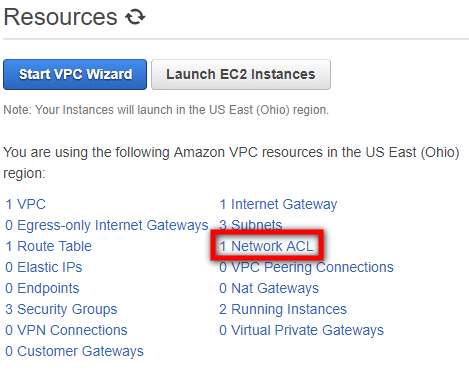 3. On **Network ACL** page, select the check
box next to the Network ACL of your staging area.

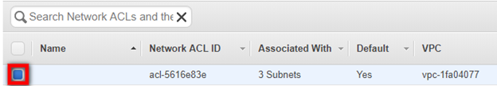 4. On the details table of the selected **Network ACL**,
select the **Inbound Rules** tab.

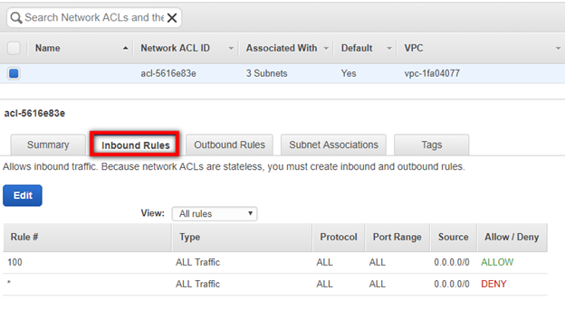 5. On the **Inbound Rules** tab, verify that
the Rule that determines the traffic to replication server subnet set to
**Allow**.

**Note**: The Target should allow traffic on TCP Port 1500
from the address space of the Source environment. The Network ACL does not necessarily need
to be open to all Port Ranges, as in the screenshot below.

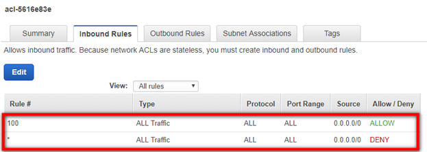 6. If the rule is set to **Deny**, click
**Edit**.

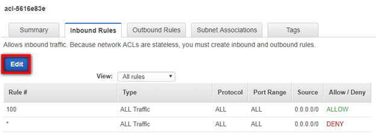 7. Click the dropdown under **Allow/Deny** and select
**Allow**. Click **Save**.

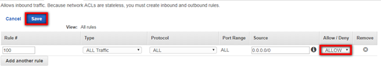 8. You will also need to check the **Ephemeral
Ports** on the **Outbound
Rules** tab. Within the same **Network
ACL**, navigate to the **Outbound
Rules** tab.

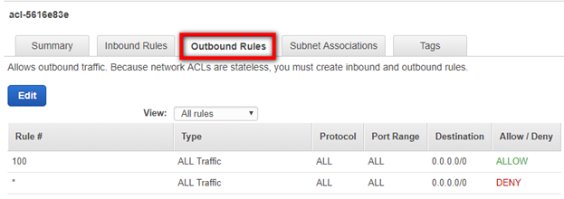 9. You will need to ensure that you are allowing the correct **Ephemeral Port range** for your particular
client. [Ephemeral Port range varies based on each client's operating
system.](../../../vpc/latest/userguide/custom-network-acl.md#nacl-ephemeral-ports "../../../vpc/latest/userguide/custom-network-acl.md#nacl-ephemeral-ports") Click the Edit button to edit your **Ephemeral Port's Port Range** category.

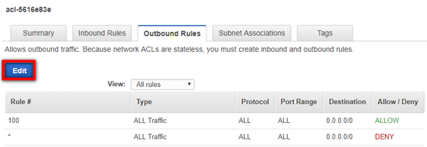 10. Edit the **Port Range** and click
**Save**. You may have to create a new
Rule by clicking the **Add another rule**
button.

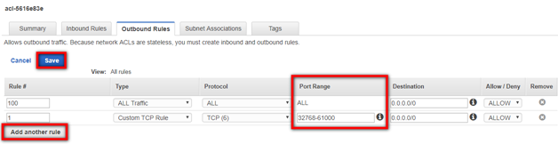

#### Setting Route Rules on the Staging Area Subnet

To check and set the Route Rules on the staging area subnet in AWS:

1. Sign in to AWS console, click on **Services** and select
   **VPC**
   under **Networking & Content
   Delivery**.

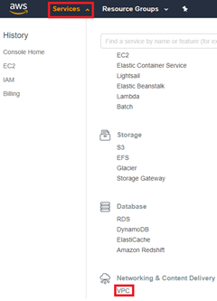 2. On the **VPC Dashboard** toolbar, select
the **Route Tables** option.

 3. On the **Route Tables** page, check the
box of the Route Table of your staging network.

 4. This will open the details for your Route Table. Navigate to the
**Routes** tab.

 5. Within the **Target** column of the
**Routes** tab, find the route you are
using for the inbound traffic from the **Source** on TCP Port 1500 (either **igw** – Internet Gateway, **vgw** – VPN, or **i** – EC2
instance). Verify that the **Destination
address** is **0.0.0.0/0.**

**Note**: The Rule may be specific to the
address space of the source machines.

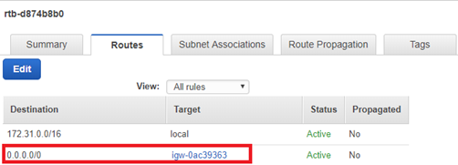 6. If the address is not 0.0.0.0/0, you will need change it to 0.0.0.0/0.

**Note**: The Rule may be specific to the
address space of the source machines.

    1. Click the Edit button.


    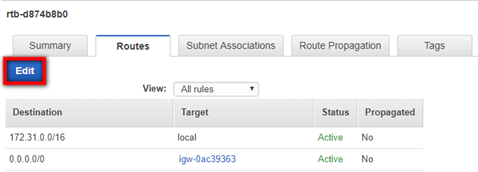
    2. Input **0.0.0.0/0**into the
     **Destination** field for the
     correct Target. Click **Save**.


    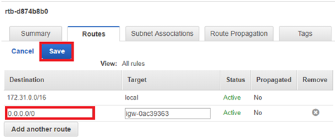

    **Note**: If you are using VPN, enter a specific IP
     address range in the **Destination** column.

#### Firewall (both internal and external) in the Source server /

infrastructure.

Firewall issues may have several causes. Check the following if you experience any
firewall issues, such as Windows Firewall connection issues:

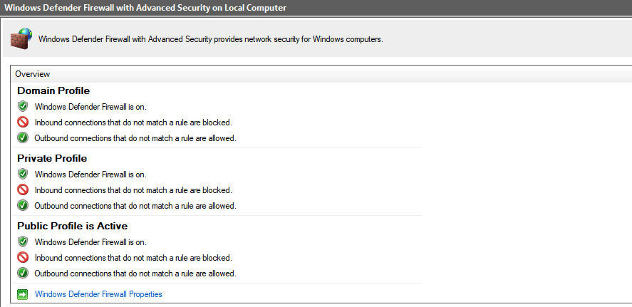

- Ensure that the subnet you assigned for the Replication Servers still exists.

In Linux, run `sudo systemctl stop firewalld` on the Recovery Instance to troubleshoot
firewall issues.

## Troubleshooting Agent Issues

###### Topics

- [Error: Installation Failed](#Error-Installtion-Failed "#Error-Installtion-Failed")

### Error: Installation Failed

When the installation of the AWS Replication Agent on a source server fails during the
running of the Installer file, you will receive an error message.

This type of error means that the Agent was not installed on the source server,
and therefore the server will not appear on the AWS Elastic Disaster Recovery Console. After you fix the
issue that caused the installation to fail, you need to rerun the Agent Installer
file to install the Agent.

#### This app cant run on your PC error –

Windows

If you encounter the following error "This app can't run on your PC", when trying to
install the AWS Replication Agent on your Windows 10 source machine, try the following.

This error is indicative that your particular version of Windows 10 is likely the 32-bit
version. To verify this, you can

1. Use the Windows key + I keyboard shortcut to open the Settings app.

2. Click System.

3. Click About.

4. Under System type, you will see two pieces of information: if it says 32-bit operating
   system, x64-based processor, then it means that your PC is running a 32-bit version of Windows
   10 on a 64-bit processor.

If it says 32-bit operating system, x86-based processor, then your computer doesn't
support Windows 10 (64-bit).

At the moment, only 64 bit operating systems are supported for Elastic Disaster Recovery
Service.

If your OS is indeed 64-bit, then there may be other elements blocking the
installation of your agent. The block is actually coming from the Windows
Operating System itself. You would need to identify what the cause is, (for
example, broken registry key),

#### Is having a mounted '/tmp' directory a requirement for the

Agent?

The simple requirement is just to have enough free space. There is no need for this to be
a separate mount. The need for the '/tmp' requirement is actually only if '/tmp' is a separate
mount. If '/tmp' is not a separate mount, then it would fall under '/', for which we have the 2
GiB free requirement. This allows for the '/tmp' to fall into this requirement.

#### Installation Failed – Old

Agent

Installation may fail due to an old AWS Replication Agent. Ensure that you are attempting
to install the latest version of the AWS Replication Agent. You can learn how to download the
Agent [here](adding-servers.md "adding-servers.md").

#### Installation Failed on Linux Server

If the installation failed on a Linux source server, check the
following:

1. **Free Disk Space**

Free disk space on the root directory – verify that you have at least 3 GB of free disk
on the root directory (/) of your Source machine. To check the available disk space on the
root directory, run the following command: df -h /

Free disk space on the /tmp directory – for the duration of the installation process
only, verify that you have at least 500 MB of free disk on the /tmp directory. To check the
available disk space on the /tmp directory run the following command: df -h /tmp

After you have entered the above commands for checking the available disk space, the
results will be displayed as follows:

 2. **The format of the list of disks to replicate**

During the installation, when you are asked to enter the disks you
want to replicate, do NOT use apostrophes, brackets, or disk paths that
do not exist. Type only existing disk paths, and separate them with a
comma, as follows:

/dev/xvdal,/dev/xvda2. 3. **Version of the Kernel headers package**

Verify that you have kernel-devel/linux-headers installed that are exactly of the same
version as the kernel you are running.

The version number of the kernel headers should be completely identical to the version
number of the kernel. To handle this issue, follow these steps:

    1. **Identify the version of your running kernel.**


    To identify the version of your running kernel, run the following command:


    uname -r


    

    The 'uname -r' output version should match the version of one of the installed
     kernel
     headers packages (kernel-devel-<version number> / linux-headers-<version
     number>).
    2. **Identify the version of your
     kernel-devel/linux-headers.**


    To identify the version of your running kernel, run the following command:


    On RHEL/CENTOS/Oracle/SUSE:


    rpm -qa | grep kernel


    

    **Note**: This command looks for kernel-devel.


    On Debian/Ubuntu: apt-cache search linux-headers


    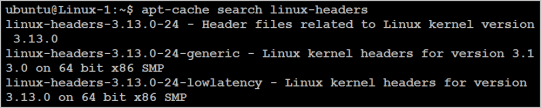
    3. **Verifying that the folder that contains
     the kernel-devel/linux-headers is not a symbolic
     link.**


    Sometimes, the content of the kernel-devel/linux-headers, which match the version
     of
     the kernel, is actually a symbolic link. In this case, you will need to remove the
     link
     before installing the required package.


    To verify that the folder that contains the kernel-devel/linux-headers is not a
     symbolic link, run the following command:


    On RHEL/CENTOS/Oracle/SUSE:


    ls -l /usr/src/kernels


    On Debian/Ubuntu:


    ls -l /usr/src


    

    In the above example, the results show that the linux-headers are not a symbolic
     link.
    4. **[If a symbolic link exists] Delete the
     symbolic link.**


    If you found that the content of the kernel-devel/linux-headers, which match the
     version of the kernel, is actually a symbolic link, you need to delete the link. Run
     the
     following command:


    rm /usr/src/<LINK NAME>


    For example: rm /usr/src/linux-headers-4.4.1
    5. **Install the correct
     kernel-devel/linux-headers from the repositories.**


    If none of the already installed kernel-devel/linux-headers packages match your
     running kernel version, you need to install the matching package.


    **Note**: You can have several kernel headers
     versions
     simultaneously on your OS, and you can therefore safely install new kernel headers
     packages
     in addition to your existing ones (without uninstalling the other versions of the
     package.)
     A new kernel headers package does not impact the kernel, and does not overwrite
     older
     versions of the kernel headers.


    **Note**: For everything to work, you need to install
     a
     kernel headers package with the exact same version number of the running kernel.


    To install the correct kernel-devel/linux-headers, run the following command:


    On RHEL/CENTOS/Oracle/SUSE:


    sudo yum install kernel-devel-`uname -r`


    On Debian/Ubuntu:


    sudo apt-get install linux-headers-`uname -r`
    6. **[If no matching package was found]
     Download the matching kernel-devel/linux-headers
     package.**


    If no matching package was found on the repositories configured on your machine,
     you
     can download it manually from the Internet and then install it.


    To download the matching kernel-devel/linux-headers package, navigate to the
     following
     sites:


    	* [RHEL, CENTOS, Oracle,
    	 and SUSE package directory](http://rpm.pbone.net/ "http://rpm.pbone.net/")
    	* [Debian package directory](https://packages.debian.org/ "https://packages.debian.org/")
    	* [Ubuntu package directory](https://packages.ubuntu.com/ "https://packages.ubuntu.com/")

4. **The make, openssl, wget, curl, gcc and
   build-essential packages**

**Note**: Usually, the existence of these packages is not
required for Agent installation. However, in some cases where the installation fails,
installing these packages will solve the problem.

If the installation failed, the make, openssl, wget, curl, gcc, and build-essential
packages should be installed and stored in your current path.

To verify the existence and location of the required packages, run the following
command:

which <package>

For example, to locate the make package:

which make

 5. **Error: urlopen error [Errno 110] Connection times
out**

This error occurs when outbound traffic is not allowed over TCP Port 443. Port 443 needs
to be open outbound to the AWS Elastic Disaster Recovery Manager.

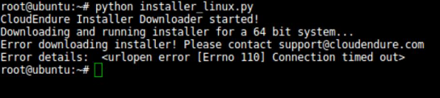 6. **Powerpath support**

powermt check

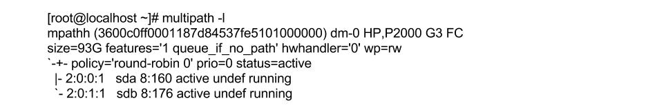

If so, contact AWS Support for instructions on how to install the AWS Replication Agent on
such machines. 7. **Error: You need to have root privileges to run
this script**

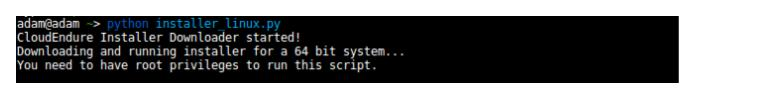

Make sure you run the installer either as root or by adding sudo at the
beginning:

sudo python installer_linux.py 8. Error: _version `GLIBC_2.7' not found (required by ./aws-replication-installer-64bit)_

You receive this error when you try to install the agent on an unsupported Linux operating system. See [Supported Linux operating systems](Supported-Operating-Systems-Linux.md "Supported-Operating-Systems-Linux.md") .

#### Installation Failed on Windows Machine

If the installation failed on a Windows Source server, check the following:

1. **.NET Framework**

Verify that .NET Framework version 3.5 or above is installed on your Windows Source
servers. 2. **Free disk space**

Verify that there is at least 1 GB of free disk space on the root directory (C:\) of
your Source servers for the installation. 3. **net.exe and sc.exe location**

Verify that the net.exe and/or sc.exe files, located by default in the
C:\Windows\System32 folder, are included in the **PATH Environment
Variable**.

    1. Navigate to **Control Panel >System and
     Security >System >Advanced system settings**.
    2. On the **System Properties**
     dialog box **Advanced** tab, click
     the **Environment Variables**
     button.


    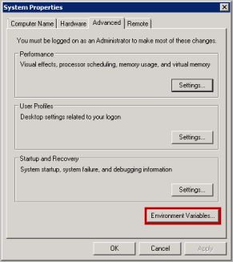
    3. On the **System Variables**
     section of the **Environment
     Variables** pane, select the **Path** variable. Then, click the **Edit** button to view its contents.


    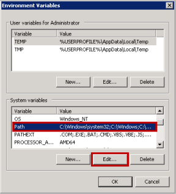
    4. On the **Edit System Variable**
     pane, review the defined paths in the **Variable value** field. If the path of the net.exe
     and/or sc.exe files does not appear there, manually add it to
     the **Variable value** field, and
     click **OK**.


    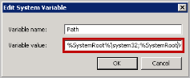

#### Windows – Installation Failed -

Request Signature

If the AWS Replication Agent installation fails on Windows with the following error:

```
botocore.exceptions.ClientError: An error occurred (InvalidSignatureException) when
                    calling the GetAgentInstallationAssetsElastic Disaster RecoveryInternal operation: {"message":"The
                    request signature we calculated does not match the signature you provided. Check your AWS Secret
                    Access Key and signing method. Consult the service documentation for details.

```

Attempt to rerun the installer with power shell instead of CMD. At times, when the
installer is ran in CMD, the AWS Secret Key does not get pasted properly into the installer and
causes installation to fail.

#### Error – driver was compiled for a

different kernel not loading

This error may manifest if a significant amount of time has passed between when you
performed a failover and when you are performing a failback.

This error may occur on the source server or on the recovery instance. You can
identify this error by looking at the agent log in
/var/lib/aws-replication-agent/agent.log.0

To fix this issue on a recovery instance, reboot the recovery instance and
reinstall the AWS Replication Agent as recovery instance.

To fix this issue on a source server, reboot the source server and then
reinstall the AWS Replication Agent.

#### Error – certificate verify failed

This error (CERTIFICATE_VERIFY_FAILED) may indicate that the OS does not trust
the certification authority used by our endpoints. To resolve this issue, try
the following steps:

1. Open Microsoft Edge or Internet Explorer to update the operating
   system trusted root certificates. This will work if the operating system
   does not have restrictions to download the certificates.
2. If the first step does not resolve the issue, [download and install
   the Amazon Root Certificates manually](https://www.amazontrust.com/repository/ "https://www.amazontrust.com/repository/").

## Common replication errors

This section describes common replication errors and possible explanations and potential mitigations.

###### Replication errors

- [Agent not seen](#common-agent-not-seen "#common-agent-not-seen")
- [Not converging](#common-not-converging "#common-not-converging")
- [Failback client not seen](#common-failback-not-seen "#common-failback-not-seen")
- [Snapshot failure](#common-snapshot-failure "#common-snapshot-failure")
- [Unstable network](#common-unstable-network "#common-unstable-network")
- [Failed to download
  replication software to failback client](#common-download-replication-software "#common-download-replication-software")
- [Failed to configure replication software](#common-configure-replication-software "#common-configure-replication-software")
- [Failed to establish communication with recovery instance](#common-communication-recovery-instance "#common-communication-recovery-instance")
- [Failed to connect AWS replication Agent to replication software](#common-connection-agent-replication-software "#common-connection-agent-replication-software")
- [Failed to establish communication with replication software](#common-establish-communication-replication-software "#common-establish-communication-replication-software")
- [Failed to create firewall rules](#common-failed-create-firewall "#common-failed-create-firewall")
- [Failed to authenticate with service](#common-failed-authenticate-service "#common-failed-authenticate-service")
- [Failed to create staging disks](#common-failed-create-staging-disks "#common-failed-create-staging-disks")
- [Failed to pair the replication agent with replication server](#common-pair-replication-agent-server "#common-pair-replication-agent-server")
- [Unknown data replication
  error](#common-unknown-data-replication-error "#common-unknown-data-replication-error")

### Agent not seen

- If this message appears on the source server dashboard, ensure that:

      + The source machine has access to the AWS Elastic Disaster Recovery service.
      + The replication agent is in running state. For Windows, use Windows services management console (services.msc) or command line (for example, get-services PowerShell). For Linux, use the systemctl status command.

  If the agent is indeed in running state, verify that the connectivity to the Regional AWS DRS endpoint on TCP Port 443.
  [Learn more about verifying connectivity to AWS DRS regional endpoints.](../../../general/latest/gr/drs.md#drs-region "../../../general/latest/gr/drs.md#drs-region")

- If this message appears on your recovery dashboard, ensure that:
  - You have connectivity, as previously discussed.
  - The [security-iam-awsmanpol-AWSElasticDisasterRecoveryRecoveryInstancePolicy](security-iam-awsmanpol-AWSElasticDisasterRecoveryRecoveryInstancePolicy.md "security-iam-awsmanpol-AWSElasticDisasterRecoveryRecoveryInstancePolicy.md") required EC2
    profile is associated with the recovery instance.

### Not converging

This error message (NOT_CONVERGING) could indicate an inadequate replication
speed.

- Follow the instructions on [calculating the required bandwidth](#Calculating-Bandwidth "#Calculating-Bandwidth").
- [Verify network bandwidth](Replication-Related-FAQ.md#perform-connectivity-bandwidth-test "Replication-Related-FAQ.md#perform-connectivity-bandwidth-test").
- Verify replicator EBS volumes (associated with the source server)
  performance. If required, modify EBS volume type from the AWS DRS console:
  Go to the specific source server page and select the **Disk settings** tab.

### Failback client not seen

This error message (FAILBACK_CLIENT_NOT_SEEN) could indicate that there’s a
network connectivity issue and that the Failback Client is unable to communicate
with the AWS DRS endpoint. Check network connectivity.

### Snapshot failure

This error message (SNAPSHOTS_FAILURE) indicates that the service is unable to take a consistent snapshot.

This can be caused by:

- Inadequate IAM permissions – Ensure that you have the required IAM
  permissions (attached to the required IAM roles).
- API throttling – [Check if you have activated throttling](data-routing.md#route-control "data-routing.md#route-control"). If throttling is not
  activated, check your CloudTrail logs for throttling errors.

### Unstable network

This error message (UNSTABLE_NETWORK) may indicate that there are network issues.
Check your connectivity, then [run the network bandwidth test](Replication-Related-FAQ.md#perform-connectivity-bandwidth-test "Replication-Related-FAQ.md#perform-connectivity-bandwidth-test").

### Failed to download

replication software to failback client

This error message (FAILED_TO_DOWNLOAD_REPLICATION_SOFTWARE_TO_FAILBACK_CLIENT)
may indicate that there are connectivity issues. [Check your connectivity to the S3
endpoint](Network-Requirements.md#TCP-443 "Network-Requirements.md#TCP-443") and try again.

If the issue persists, you might have a proxy or a network security appliance filtering your traffic and blocking the software download.

### Failed to configure replication software

This error message (FAILED_TO_CONFIGURE_REPLICATION_SOFTWARE) may appear for
multiple reasons. Try again and if the issue persists, contact AWS support.

### Failed to establish communication with recovery instance

This message (FAILED_TO_ESTABLISH_RECOVERY_INSTANCE_COMMUNICATION) could indicate communication issues. Ensure that the Failback Client is
able to communicate with the recovery instance.

If you are utilizing public network, (no VPN, no direct connect, and more), ensure that your recovery instance has a public IP. By default, AWS DRS launch template deactivates public IP,
and recovery instances are only launched with private IPs.

### Failed to connect AWS replication Agent to replication software

This error message (FAILED_TO_PAIR_AGENT_WITH_REPLICATION_SOFTWARE) may indicate a pairing issue. AWS DRS needs to provide the replication
server and agent with information to allow them to communicate. Make sure there is network connectivity between the agent, replication server, and the AWS DRS endpoint.

If the issue persists, contact support.

### Failed to establish communication with replication software

This error message (FAILED_TO_ESTABLISH_AGENT_REPLICATOR_SOFTWARE_COMMUNICATION) may suggest that there are network connectivity issues. Make sure you have network connectivity between the agent, replication server and the AWS DRS endpoint.

If this message appears during failback, ensure that TCP port 1500 is opened inbound on the recovery instance.

### Failed to create firewall rules

This error message (Firewall rules creation failed) can be caused by several reasons.

1. Ensure that the IAM permission prerequisites are met.
2. Review the replication settings of the associated source server.

### Failed to authenticate with service

This error message (Failed to authenticate the replication server with the
service) may indicate a communication issue between the replication server and the
DRS endpoint on TCP Port 443. Check the subnet you selected and ensure that TCP Port
443 is open from your replication server.

To verify the connection:

- Launch a test Ubuntu machine in the same subnet that was selected in the
  replication settings.
- On the machine, run the following command:

```
wget <enter_DRS_regional_endpoint>
```

- If the command fails, there is a connectivity problem.

### Failed to create staging disks

This error message (Failed to create staging disks) may indicate that your AWS
account is configured to encrypted EBS disks but the IAM user does not have the
required permissions to encrypt using the selected KMS key. Ensure that the IAM
prerequisites are met.

### Failed to pair the replication agent with replication server

This error message (Failed to pair replication agent with replication server) may
be caused by multiple reasons. Make sure that you have connectivity between the
replication agent, the replication server, and the DRS endpoint. If the issue
persists, contact Support.

### Unknown data replication

error

Unknown errors (unknown_error) can occur for any number of reasons. There are
several steps you can take to attempt to mitigate the issue:

- Check connectivity.
- Check throttling.
- Check performance issue on the replication server.
- Check the network bandwidth between the agent and the replication
  server.
- [Check the replication agent
  logs.](Agent-Related-FAQ.md#agent-logs-location "Agent-Related-FAQ.md#agent-logs-location")

## Other troubleshooting topics

###### Topics

- [Windows License activation –
  AWS](#Windows-License-Activation "#Windows-License-Activation")
- [Replicating Instance Store Volumes](#Replicating-Instance-Stores "#Replicating-Instance-Stores")
- [Replication lag issues](#Replication-Lag-Issues "#Replication-Lag-Issues")
- [Windows Drive changes](#Windows-Drive-Changes "#Windows-Drive-Changes")
- [Error: Failed to connect using HTTP channel](#Error-Failed-to-connect-using-HTTP-channel "#Error-Failed-to-connect-using-HTTP-channel")
- [Windows Dynamic Disk troubleshooting](#Windows-Dynamic-Disk "#Windows-Dynamic-Disk")

### Windows License activation –

AWS

AWS Elastic Disaster Recovery converts the Windows OS licenses to AWS Windows licenses and
activates them against the AWS KMS.

If license activation failed, follow [this AWS guide](https://aws.amazon.com/premiumsupport/knowledge-center/windows-activation-fails/ "https://aws.amazon.com/premiumsupport/knowledge-center/windows-activation-fails/") to resolve the issue.

###### Important

When performing a failback, AWS DRS does not have access to the Customer licenses
and therefore cannot activate the licenses. After failback is complete, you can
activate the licenses manually or using post-launch scripts.

### Replicating Instance Store Volumes

When installing the DRS agent on an EC2 Instance with Instance Store volumes attached, device name conflicts can arise in the Recovery Instance's EC2 Launch Template
if the template also specifies Instance Store volumes.

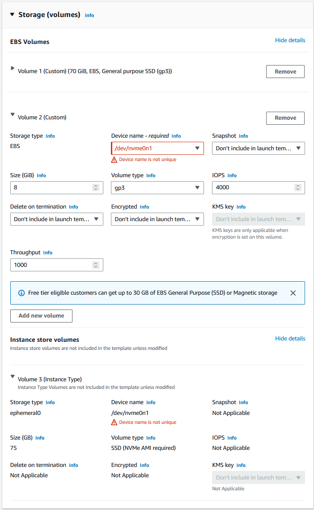

You can resolve this error in one of two ways:

- If you require protection of the data on the Source Server's Instance Store Volume, ensure the Recovery Instance's EC2 Launch Template is reconfigured
  to provide a unique Device Name that will not collide with the default Instance Store mappings.
  For example, the "Device Name" for the EBS volume can be changed to /dev/xvdc1.
- If you do not require protection of the data on the Source Server's Instance Store volume,
  ensure instance store volumes are excluded from replication via the --devices
  [installation parameter](installer-parameters.md "installer-parameters.md").
  The DRS agent will not populate any volumes excluded from replication in the EC2 Launch Template.

### Replication lag issues

Potential solutions:

- Make sure that the source server is up and running.
- Make sure that AWS Elastic Disaster Recovery services are up and running.
- Make sure that TCP Port 1500 is not blocked outbound from the Source
  server to the replication server.
- If the MAC address of the Source had changed, that would require a reinstallation of the
  AWS Replication Agent.
- If the source machine was rebooted recently or the AWS Elastic Disaster Recovery services were
  restarted, the disks are reread after this and until it’s finished, the lag
  will grow.
- If the source machine had a spike of write operations, the lag will grow
  until AWS Elastic Disaster Recovery service manages to flush all the written data to the drill
  or recovery instance replication server.

### Windows Drive changes

Users may see changes in Windows drive letter assignments (for example, Drive D changed to E) on
Target machines launched by AWS Elastic Disaster Recovery.

This happens because Windows sometimes reconfigures the drive letters when a
machine comes up on a new infrastructure, for example, if the source server had a
drive letter mapped to a disk that was not replicated (such as a network drive). You
can solve this issue by remapping the drive letters on the drill or recovery
instance correctly after it has been launched.

### Error: Failed to connect using HTTP channel

This error mostly occurs when the Conversion server is unable to communicate with the necessary AWS Endpoints for [staging area communication.](Network-Requirements.md#TCP-443 "Network-Requirements.md#TCP-443")

- Check if any network changes were made in the staging area that could affect the Conversion server reaching the AWS Endpoints (Firewall settings, DNS settings, Security Group settings, Route table settings, and Access Control List settings).
- Test TCP Port 443 connectivity with a test instance from the staging area subnet, to the [required endpoints.](Network-Requirements.md#TCP-443 "Network-Requirements.md#TCP-443")
- If the issue persists after confirming network connectivity please [create a case](../../../awssupport/latest/user/case-management.md "../../../awssupport/latest/user/case-management.md") with AWS Premium Support for further investigation.

### Windows Dynamic Disk troubleshooting

Moving a Windows Dynamic Disk from a local computer to another computer may change the disk
status to "Foreign", resulting in a disruption in replication. The solution is to import the
foreign disk, as discussed in [this Microsoft troubleshooting article](https://docs.microsoft.com/en-us/windows-server/storage/disk-management/troubleshooting-disk-management#a-dynamic-disks-status-is-foreign "https://docs.microsoft.com/en-us/windows-server/storage/disk-management/troubleshooting-disk-management#a-dynamic-disks-status-is-foreign").
