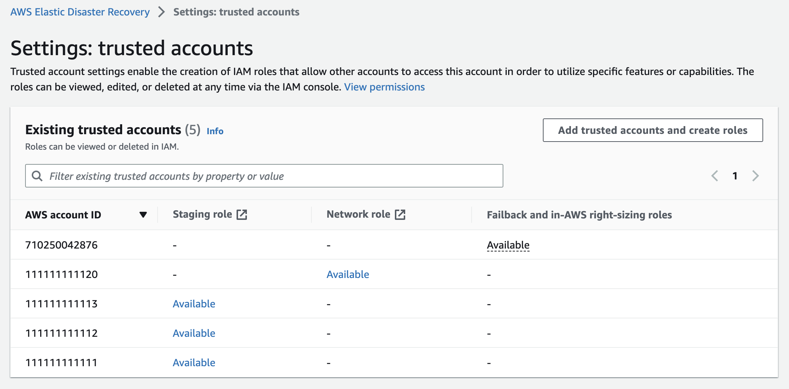

# Trusted accounts

Trusted accounts provide enhanced account management capabilities and visibility, including
the ability to easily create multiple IAM roles for different users. Use this feature to quickly
add the roles you need to use various AWS Elastic Disaster Recovery features and see the permissions of different
accounts from a single screen.

Roles created via CloudFormation (Failback and in-AWS right-sizing roles), should be deleted from the
CloudFormation console.

## AWS DRS trusted account page

The **Trusted accounts** page allows you to automatically
create IAM roles that are required in order to utilize specific features and
capabilities.

This page provides visibility into the existing roles assigned to each trusted
account.

To edit or delete these roles, go to the IAM console. Deleting the IAM role will automatically remove the trusted account from the AWS Elastic Disaster Recovery console.

###### Note

Commercial AWS accounts can only be trusted to other Commercial AWS accounts and GovCloud AWS accounts can only be trusted to other GovCloud AWS accounts.
