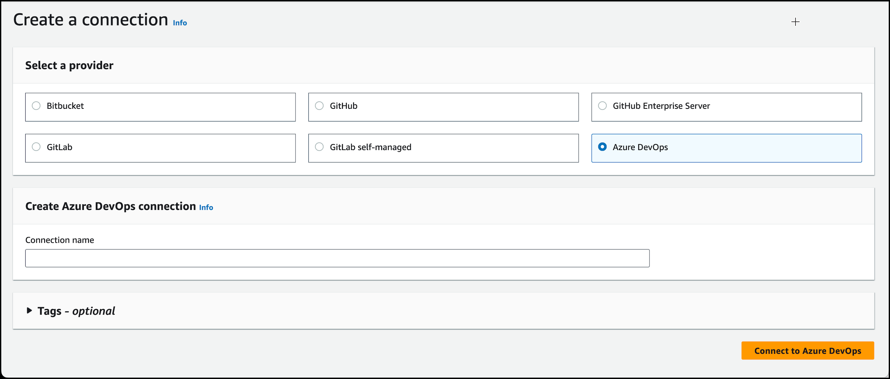
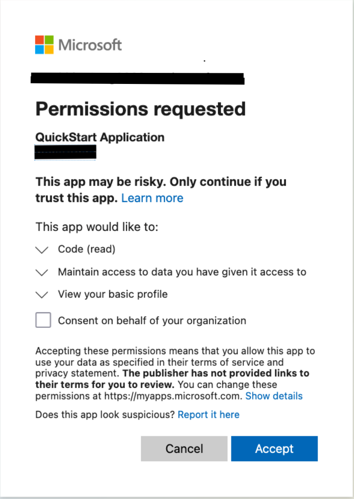

# Create a connection to Azure DevOps

You can use the AWS Management Console or the AWS Command Line Interface (AWS CLI) to create a connection to a repository
hosted on Azure DevOps.

Before you begin:

- You must have already created an account with Azure DevOps.
- You must have already created a project and Azure repository on the Azure DevOps
  portal. Your account must have administrator access to the repository.

###### Note

You can create connections to an Azure DevOps repository. Installed (on a
host) Azure provider types, such as Azure Cloud Hosting, are not supported. See
[AWS CodeConnections supported providers and
versions](supported-versions-connections.md "supported-versions-connections.md").

###### Note

Connections only provide access to repositories owned by the account that was used to
create the connection.

###### Topics

- [Create a connection to Azure
  DevOps (console)](#connections-create-azure-console "#connections-create-azure-console")
- [Create a connection to Azure DevOps
  (CLI)](#connections-create-azure-cli "#connections-create-azure-cli")

## Create a connection to Azure

DevOps (console)

You can use the console to create a connection to Azure DevOps.

###### Note

Beginning July 1, 2024, the console creates connections with `codeconnections` in the resource ARN. Resources with both service prefixes will continue to display in the console.

###### Step 1: Create your connection

1. Sign in to the AWS Management Console, and open the AWS Developer Tools console at [https://console.aws.amazon.com/codesuite/settings/connections](https://console.aws.amazon.com/codesuite/settings/connections "https://console.aws.amazon.com/codesuite/settings/connections").
2. Choose **Settings > Connections**, and then choose **Create connection**.
3. To create a connection to an Azure DevOps repository, under **Select a
   provider**, choose **Azure DevOps**. In
   **Connection name**, enter the name for the connection that
   you want to create. Choose **Connect to Azure DevOps**, and
   proceed to Step 2.



###### Step 2: Connect to Azure DevOps

1. On the **Connect to Azure DevOps** settings page, your
   connection name displays.
2. If the login page for Microsoft displays, log in with your credentials and
   then choose to continue.

You may need to grant permissions if this is your first time creating a
connection to Azure DevOps from AWS Management Console.

 3. Choose **Accept**. 4. On the connection page, the connection ID for your new installation is
displayed. 5. Choose **Connect** to establish the connection. The created
connection displays in the connections
list
and is now in available status and ready to use.

## Create a connection to Azure DevOps

(CLI)

You can use the AWS Command Line Interface (AWS CLI) to create a connection.

To do this, use the **create-connection** command.

###### Important

A connection created through the AWS CLI or AWS CloudFormation is in `PENDING`
status by default. After you create a connection with the CLI or CloudFormation, use the
console to edit the connection to make its status `AVAILABLE`.

###### To create a connection to Azure DevOps

1. Open a terminal (Linux, macOS, or Unix) or command prompt (Windows). Use the AWS CLI to run
   the **create-connection** command, specifying the
   `--provider-type` and `--connection-name` for your
   connection. In this example, the third-party provider name is
   `AzureDevOps` and the specified connection name is
   `MyConnection`.

```
aws codeconnections create-connection --provider-type AzureDevOps --connection-name MyConnection
```

If successful, this command returns the connection ARN information similar to
the following.

```
{
    "ConnectionArn": "arn:aws:codeconnections:us-west-2:`account_id`:connection/aEXAMPLE-8aad-4d5d-8878-dfcab0bc441f"
}
```

2. Use the console to complete the connection. For more information, see [Update a pending connection](connections-update.md "connections-update.md").
