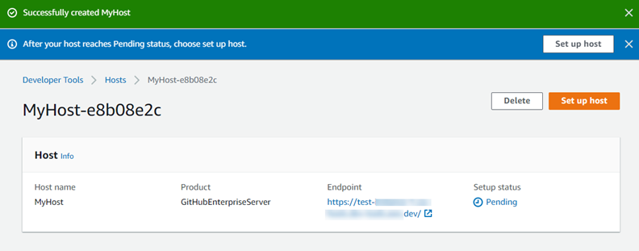
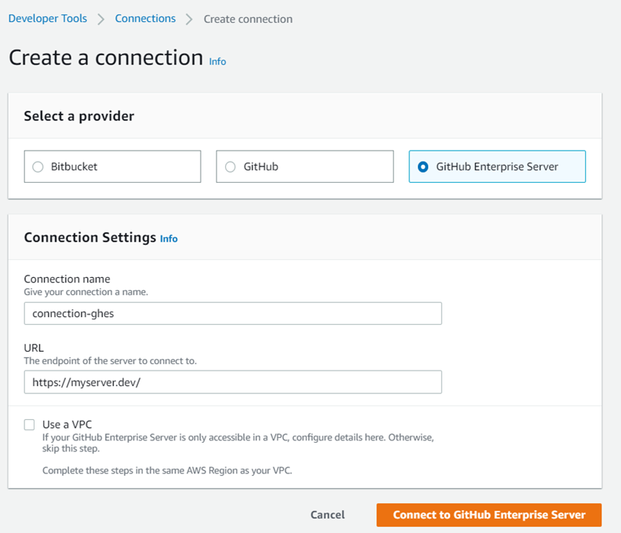
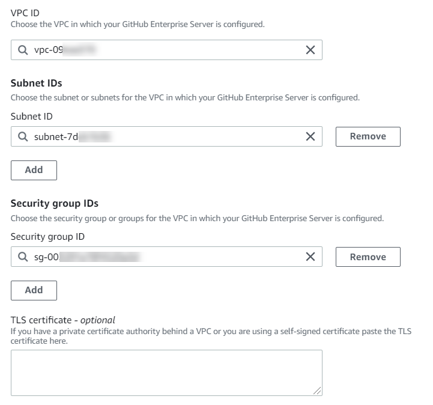
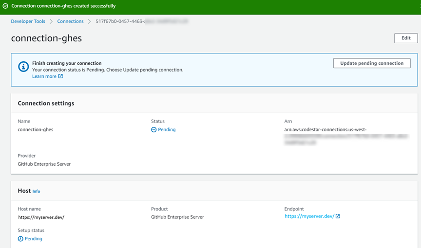
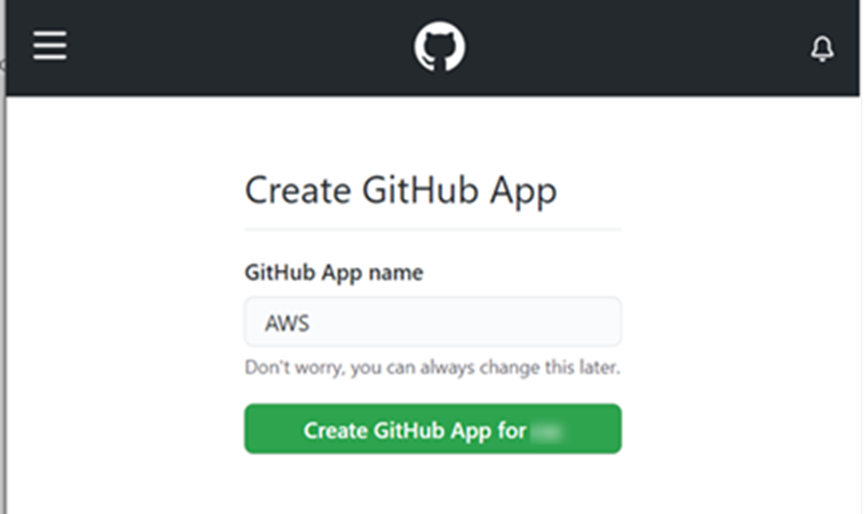
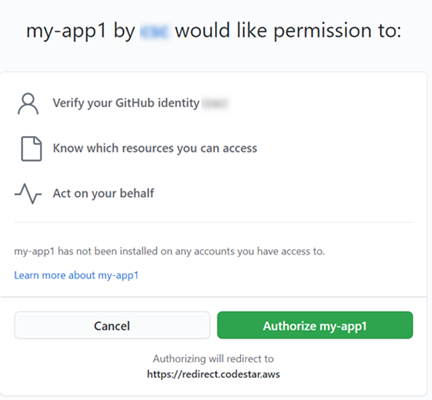
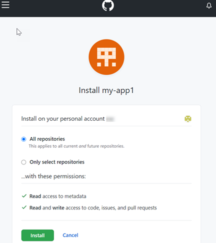

# Create a connection to GitHub

Enterprise Server (console)

To create a GitHub Enterprise Server connection, you provide information for where
your GitHub Enterprise Server is installed and authorize the connection creation with
your GitHub Enterprise credentials.

###### Note

Beginning July 1, 2024, the console creates connections with `codeconnections` in the resource ARN. Resources with both service prefixes will continue to display in the console.

###### Topics

- [Create your GitHub
  Enterprise Server connection (console)](#connections-create-gheserver-connection "#connections-create-gheserver-connection")

## Create your GitHub

Enterprise Server connection (console)

To create a connection to GitHub Enterprise Server, have your server URL and
GitHub Enterprise credentials ready.

###### To create a host

1. Sign in to the
   AWS Management Console,
   and open the AWS Developer Tools console at [https://console.aws.amazon.com/codesuite/settings/connections](https://console.aws.amazon.com/codesuite/settings/connections "https://console.aws.amazon.com/codesuite/settings/connections").
2. On the **Hosts** tab, choose **Create host**.
3. In **Host name**, enter the name you want to use for your
   host.
4. In **Select a provider**,
   choose one of the
   following:
   - **GitHub Enterprise Server**
   - **GitLab self-managed**

5. In **URL**, enter the endpoint for the infrastructure where your
   provider is installed.
6. If your server is configured within an Amazon VPC and you want to connect with your
   VPC, choose **Use a VPC**. Otherwise, choose **No
   VPC**.
7. If you have launched your instance into an Amazon VPC and you want to connect with
   your VPC, choose **Use a VPC** and complete the following.
   1. In **VPC ID**, choose your VPC ID. Make sure to choose the
      VPC for the infrastructure where your
      instance
      is installed or a VPC with access to your
      instance
      through VPN or Direct Connect.
   2. If you have a private VPC configured, and you have configured your
      instance
      to perform TLS validation using a non-public certificate authority, in
      **TLS certificate**, enter your certificate ID. The TLS
      Certificate value
      is
      the public key of the certificate.

8. Choose **Create host**.
9. After the host details page displays, the host status changes as the host is
   created.

###### Note

If your host setup includes a VPC configuration, allow several minutes for
provisioning of host network components.

Wait for your host to reach a **Pending** status, and then
complete the setup. For more information, see [Set up a pending host](connections-host-setup.md "connections-host-setup.md").

###### Step 2: Create your connection to GitHub Enterprise Server (console)

1. Sign in to the AWS Management Console and open the Developer Tools console at [https://console.aws.amazon.com/codesuite/settings/connections](https://console.aws.amazon.com/codesuite/settings/connections "https://console.aws.amazon.com/codesuite/settings/connections").
2. Choose **Settings > Connections**, and then choose
   **Create connection**.
3. To create a connection to an installed GitHub Enterprise Server
   repository, choose **GitHub Enterprise Server**.

###### Connect to GitHub Enterprise Server

1. In **Connection name**, enter the name for your
   connection.

 2. In **URL**, enter the endpoint for your server.

###### Note

If the provided URL has already been used to set up a GitHub
Enterprise Server for a connection, you will be prompted to choose the
host resource ARN that was created previously for that endpoint. 3. (Optional) If you have launched your server into an Amazon VPC and you
want to connect with your VPC, choose **Use a VPC** and
complete the following.

###### Note

For organizations in GitHub Enterprise Server or GitLab self-managed,
you don’t pass an available host. You create a new host for each
connection in your organization, and you must be sure to enter the same
information in the network fields (VPC ID, Subnet IDs, and Security
Group IDs) for the host. For more information, see [Connection and host setup for installed providers supporting organizations](troubleshooting-connections.md#troubleshooting-organization-host "troubleshooting-connections.md#troubleshooting-organization-host").

    1. In **VPC ID**, choose your VPC ID. Make sure to
     choose the VPC for the infrastructure where your GitHub Enterprise
     Server instance is installed or a VPC with access to your GitHub
     Enterprise Server instance through VPN or Direct Connect.
    2. Under **Subnet ID**, choose
     **Add**. In the field, choose the subnet ID you
     want to use for your host. You can choose up to 10 subnets.

    Make sure to choose the subnet for the infrastructure where your
     GitHub Enterprise Server instance is installed or a subnet with
     access to your installed GitHub Enterprise Server instance through
     VPN or Direct Connect.
    3. Under **Security group IDs**, choose
     **Add**. In the field, choose the security
     group you want to use for your host. You can choose up to 10
     security groups.

    Make sure to choose the security group for the infrastructure
     where your GitHub Enterprise Server instance is installed or a
     security group with access to your installed GitHub Enterprise
     Server instance through VPN or Direct Connect.
    4. If you have a private VPC configured, and you have configured your
     GitHub Enterprise Server instance to perform TLS validation using a
     non-public certificate authority, in **TLS
     certificate**, enter your certificate ID. The TLS
     Certificate value should be the public key of the
     certificate.

    

4. Choose **Connect to GitHub Enterprise Server**. The
   created connection is shown with a **Pending** status. A
   host resource is created for the connection with the server information you
   provided. For the host name, the URL is used.
5. Choose **Update pending connection.**

 6. If prompted, on the GitHub Enterprise login page, sign in with your GitHub
Enterprise credentials. 7. On the **Create GitHub App** page, choose a name for your
app.

 8. On the GitHub authorization page, choose **Authorize
<app-name>**.

 9. On the app installation page, a message shows that the connector app is
ready to be installed. If you have multiple organizations, you might be
prompted to choose the organization where you want to install the app.

Choose the repository settings where you want to install the app. Choose
**Install**.

 10. The connection page shows the created connection in an
**Available** status.
